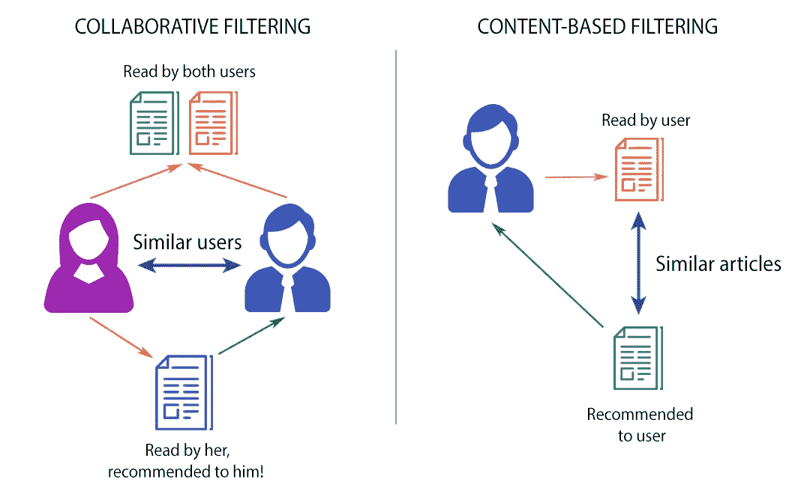

# 推荐系统背后的魔力

> 原文：<https://towardsdatascience.com/the-magic-behind-recommendation-systems-c3fc44927b3c?source=collection_archive---------27----------------------->


来源:Shutterstock

我们经常会对亚马逊上的购物推荐、网飞上的观看推荐或 Spotify 上的收听推荐的准确性感到惊讶。我们觉得这些公司知道我们的大脑是如何工作的，并从这个神奇的猜谜游戏中获利。他们在行为科学上有很深的基础，我们的工作是以一种既容易理解又涵盖最重要概念的方式使所有这些概念成为现实。

> 记住:人是非常容易预测的。行为表明性格。个性塑造我们的行为，而我们的行为决定我们的决定。


来源:Shutterstock。产品推荐

更正式地说，推荐系统是信息过滤系统的一个子类。简而言之，信息过滤系统从数据流中删除冗余或不需要的数据。它们在语义层面上减少噪音。围绕这个主题有大量的文献，从天文学到金融风险分析。

有两种主要类型的推荐系统:

*   协同过滤(CF)
*   基于内容的过滤

我们将探索这两种类型，并给出例子和利弊。没有完美的系统，但是有更适合特定需求以及不同复杂程度的解决方案。

# ***【协同过滤】***

这种过滤类型的基础是用户/项目反馈循环。

这种反馈可以是用户评级、竖起大拇指和竖起大拇指，甚至是用户对特定内容的参与程度。协作过滤有两种含义，狭义的和更广义的。

在狭义上，协同过滤是一种通过聚集偏好或从几个用户(协作)收集数据来构建关于用户兴趣的自动预测(过滤)的方法。

协同过滤方法的基本假设是，如果人 A 在一个问题上与人 B 有相同的观点，则 A 更有可能在一个不同的问题上与随机选择的人有不同的观点。网飞可以使用协同过滤来预测一个用户会喜欢哪个电视节目，给定一个用户喜好(喜欢或不喜欢)的部分列表。注意，这些预测是特定于用户的，但是使用从许多用户那里收集的信息。


来源:Shutterstock。评级/评论

协作过滤公式将客户表示为 N 维向量 N，其中 N 是各种不同的目录数据。向量的元素对于被访问或正面评价的内容是正的，对于负面评价的信息是负的。

从计算角度来说，协同过滤在最坏的情况下是 O(MN ),其中 M 是客户的数量，N 是产品目录数据的数量。实际上，由于平均客户端向量非常小，因此性能更接近于 O(M+N)。


来源:InCubeGroup。顾客和品味(MxN 矩阵)

在更一般的意义上，协作过滤是使用涉及多个代理、观点、数据源等之间协作的技术来过滤信息或模式的过程。它通常涉及非常大的数据集。一些公开的可以在这里找到[。](https://github.com/caserec/Datasets-for-Recommender-Systems)

我们有不同类型的协同过滤:

*   用户-用户
*   项目-项目
*   用户项目

***用户-用户:*** 最常用的推荐算法遵循“喜欢你的人喜欢那个”的逻辑。它会推荐相似用户以前喜欢的物品。两个用户之间的**相似性是根据他们在数据集中共有的项目数量计算的。当用户数量小于项目数量时，该算法是有效的。一个很好的例子是一个中等规模的电商网站，有几百万的产品。主要的缺点是添加新用户是昂贵的，因为它需要更新用户之间的所有相似性。**

***Item-Item:*** 它使用相同的方法，但是颠倒了用户和项目之间的视图。它遵循“如果你喜欢这个，你可能也会喜欢那个”的逻辑。换句话说，它会推荐与您之前喜欢的项目相似的项目。和以前一样，两个项目之间的相似性是使用它们在数据集中共有的用户数量来计算的。当项目数量远小于用户数量时，该算法更好。一个例子可能是一个大型的网上商店，当你的物品不经常改变时。主要缺点是项目-项目相似性表必须预先计算。添加新项目时更新该表的成本很高。

***用户-项目:*** 它结合了两种方法来生成建议。最简单的是基于矩阵分解技术。目标是**为所有用户和所有项目创建低维向量**(“嵌入”)，这样将它们相乘就可以发现用户是否喜欢某个项目。

用户-项目矩阵是传统协同过滤技术的基础，但存在数据稀疏问题。

矩阵分解可以使用 [SVD](https://medium.com/@m_n_malaeb/singular-value-decomposition-svd-in-recommender-systems-for-non-math-statistics-programming-4a622de653e9) 来完成，但是它的计算量很大，并且扩展性不好。对于中等规模的数据集， [ALS](/prototyping-a-recommender-system-step-by-step-part-2-alternating-least-square-als-matrix-4a76c58714a1) 可能是一个不错的选择。对于大型数据集，只有 [SGD](/overview-of-matrix-factorisation-techniques-using-python-8e3d118a9b39) 算法能够扩展，但总是需要相当大的计算能力。

一旦预先计算了用户的嵌入和项目的嵌入，就可以实时提供推荐。这种方法的另一个好处是，您可以使用它们的嵌入来了解更多关于用户和项目的信息。

用户项目算法都有一个缺点，即在添加新项目或新用户后，没有有效的方法来更新嵌入。

正如在个性化推荐场景中，新用户或新项目的引入可能导致**冷启动问题**，因为这些新条目上的数据不足以使协同过滤准确工作。为了给新用户做出适当的推荐，系统必须首先通过分析过去的投票或评级活动来学习用户的偏好。协同过滤系统要求大量用户在推荐新项目之前对该项目进行评级。

在下一篇文章中，我们将深入探讨两种主要类型的协同过滤系统:

*   [基于模型的](http://e_Filtering):使用不同的技术，如数据挖掘、机器学习算法来预测用户对未评级项目的评级。通常使用基于聚类的算法(k 近邻或 KNN)、矩阵分解技术(SVD)、概率分解或深度学习(神经网络)。
*   [基于内存的](https://medium.com/@kyasar.mail/recommender-systems-memory-based-collaborative-filtering-methods-b5d58ca8383):使用用户评分数据计算相似度。它通常使用余弦或皮尔逊相关性来寻找相似性，并对评级进行加权平均。这种方法更容易解释，但是扩展性不好。

# 基于内容

所有以前的模型都存在所谓的冷启动问题。

基于内容的过滤方法基于项目的描述和用户偏好的配置文件。这些方法最适合于已知项目数据(名称、位置、描述等)的情况。)，但不在用户身上。基于内容的推荐器将推荐视为特定于用户的分类问题，并根据产品特征学习用户喜欢和不喜欢的分类器。

在该系统中，使用关键字来描述项目，并且建立简档来指示该用户喜欢的项目类型。该算法试图推荐与用户过去喜欢的或者现在正在检查的项目相似的项目。这种方法源于信息检索和信息过滤研究。

机器学习中模式识别的最新进展使得使用从图像或文本描述中提取的信息的基于内容的模型有了很大的改进。

该方法与之前的用户-用户或项目-项目算法相同，除了相似性是使用**仅基于内容的特征**计算的。



CF 与基于内容的过滤

# 个案研究

对于以下案例研究，我们将使用 Python 和公共数据集。

具体来说，我们将使用 GroupLens Research 收集的 [MovieLens](https://grouplens.org/datasets/movielens/) 数据集。包含 [MovieLens 100k 数据集](https://grouplens.org/datasets/movielens/100k/)的文件是一个稳定的基准数据集，具有 943 个用户对 1682 部电影给出的 100，000 个评级，每个用户至少对 20 部电影进行了评级。

这个数据集由许多文件组成，这些文件包含关于电影、用户以及用户对他们所观看的电影的评级的信息。感兴趣的有以下几个:

*   `**u.item**` **:** 电影列表
*   `**u.data**` **:** 用户给出的评分列表

文件的前五行如下所示:


来源:Kaggle。MovieLens 100k 数据集

该文件包含用户对特定电影的评价。该文件包含 100，000 个评级，将用于预测用户未观看的电影的评级。

## 基于记忆的协同过滤

在这种变化中，统计技术应用于整个数据集来计算预测。

为了找到用户 **U** 将给予项目 **I** 的评级 **R** ，该方法包括:

*   正在查找与 **U** 相似的用户，他们已经对项目 **I** 进行了评级
*   根据上一步中找到的用户评分计算评分 **R**

考虑到每个用户都是一个向量，scikit 有一个函数可以计算每个向量的余弦距离。

```
>>> from scipy import spatial
>>> a = [1, 2]
>>> b = [2, 4]
>>> c = [2.5, 4]
>>> d = [4.5, 5]

>>> spatial.distance.cosine(c,a)
0.004504527406047898

>>> spatial.distance.cosine(c,b)
0.004504527406047898

>>> spatial.distance.cosine(c,d)
0.015137225946083022

>>> spatial.distance.cosine(a,b)
0.0
```

矢量 **C** 和 **A** 之间的较低角度给出了较低的余弦距离值。

注意，用户 **A** 和 **B** 在余弦相似性度量中被认为是绝对相似的，尽管具有不同的评级。这在现实世界中其实是常有的事，像用户 **A** 这样的用户就是你所谓的**强硬评分者**。一个例子是一个电影评论家，他给出的评分总是低于平均水平，但他们列表中的项目的排名与平均评分者相似，如 **B** 。

为了考虑这种个人用户偏好，我们可以标准化评级以消除他们的偏见。我们可以通过从该用户评价的每个项目中减去该用户对所有项目给出的平均评价来做到这一点。

下面是这个**正常化**的样子:

*   对于用户 **A** ，评分向量`[1, 2]`具有平均值`1.5`。从每个评分中减去`1.5`会得到向量`[-0.5, 0.5]`。
*   对于用户 **B** ，评价向量`[2, 4]`具有平均值`3`。从每个评分中减去`3`会得到向量`[-1, 1]`。

对用户 **C** 和 **D** 进行同样的操作，我们可以看到，评级现在被调整为所有用户的平均值为 0，这使他们处于相同的水平，并消除了他们的偏见。

调整后的向量之间的夹角余弦称为**中心余弦**。这种方法通常用在向量中有很多缺失值的时候，你需要放置一个公共值来填充缺失值。

填充缺失值的一个很好的选择可以是每个用户的平均评级，但是用户 **A** 和 **B** 的原始平均值分别是`1.5`和`3`，用`1.5`填充 **A** 的所有空值以及用`3`填充 **B** 的所有空值将使他们成为不同的用户。这个问题通过我们的归一化解决了，因为两个用户的以**为中心的**平均值是`0`，这带来了所有缺失值都是`0.`的想法

在我们确定了一个类似于用户 **U** 的用户列表后，我们就可以计算出 **U** 会给某个项目 **I** 的 **R** 。我们可以通过多种方式做到这一点。

我们可以预测，用户对项目 **I** 的评级 **R** 将接近与 **U** 最相似的前 5 名或前 10 名用户给予 **I** 的评级的平均值。由 *n* 用户给出的平均评分的数学公式如下:


N 个相似用户的平均评分

这个公式表明，n 个相似用户给出的平均评分等于他们给出的评分之和除以相似用户的数量，这是 n。

会有这样的情况，你找到的 *n* 个相似用户与目标用户 **U** 不完全相似。他们中的前 3 名可能非常相似，其余的可能不像前 3 名那样与 **U** 相似。在这种情况下，您可以考虑一种方法，其中最相似用户的评级比第二相似用户更重要，依此类推。加权平均可以帮助我们实现这一目标。

在加权平均方法中，您将每个评级乘以一个相似性因子(它表明用户有多相似)。通过乘以相似性因子，您可以为评级增加权重。权重越大，评级就越重要。

充当权重的相似性因子应该是上面讨论的距离的倒数，因为距离越小意味着相似性越高。例如，您可以从 1 中减去余弦距离来获得余弦相似度。

利用与目标用户 **U** 相似的每个用户的相似性因子 **S** ，我们可以使用以下公式计算加权平均值:


在上面的公式中，每个评级都乘以给出该评级的用户的相似性因子。用户 **U** 的最终预测评级将等于加权评级的总和除以权重的总和。

通过加权平均，我们按照相似性的顺序更多地考虑相似用户的评级。

这种技术是用户-用户 CF 的一个例子。如果我们使用评分矩阵根据用户给他们的评分来寻找相似的项目，那么这种方法就是项目-项目 CF。

但是，对于包含浏览或娱乐相关项目(如电影镜头)的数据集，项目-项目方法的性能很差。这种数据集使用矩阵分解技术会得到更好的结果，我们将在基于模型的 CF 部分看到这一点。

## 基于模型的 CF

在用户-项目矩阵中，有两个维度:

1.  用户数量
2.  项目的数量

如果矩阵大部分是空的(稀疏的)，降低维数可以在空间和时间两方面提高算法的性能。最常用的方法之一叫做矩阵分解。

**矩阵因式分解**可以看作是将一个大矩阵分解成多个小矩阵的乘积。这类似于整数的因式分解，其中`12`可以写成`6 x 2`或`4 x 3`。在矩阵的情况下，一个维数为`m x n`的矩阵 **A** 可以简化为两个维数分别为`m x p`和`p x n`的矩阵 **X** 和 **Y** 的乘积。

根据用于维数缩减的算法，缩减矩阵的数量也可以多于两个。

简化的矩阵实际上分别代表用户和项目。第一个矩阵中的 **m** 行代表 **m** 用户，而 **p** 列告诉您用户的特征或特性。具有 **n** 个项目和 **p** 个特性的项目矩阵也是如此。下面是矩阵分解的一个例子:


来源:维基百科(GNU)

在上图中，矩阵被简化为两个矩阵。左边的是有 *m* 个用户的用户矩阵，上面的是有 *n* 个条目的条目矩阵。额定值`4`被降低或分解为:

1.  用户向量`(2, -1)`
2.  一个项目向量`(2.5, 1)`

用户矩阵中的两列和项目矩阵中的两行被称为潜在因素，并且是关于用户或项目的隐藏特征的指示。因子分解的一种可能解释如下:

*   假设在一个用户向量`(u, v)`中，`u`代表用户有多喜欢恐怖片，而`v`代表他们有多喜欢言情片。
*   因此，用户向量`(2, -1)`表示喜欢恐怖电影并对其进行正面评价，不喜欢浪漫电影并对其进行负面评价的用户。
*   假设在一个项目向量`(i, j)`中，`i`表示一部电影有多少属于恐怖片，而`j`表示那部电影有多少属于言情片。
*   电影`(2.5, 1)`恐怖评分`2.5`，浪漫评分`1`。使用矩阵乘法规则乘以用户向量得到`(2 * 2.5) + (-1 * 1) = 4`。
*   所以，这部电影属于恐怖片类型，用户本来可以给它评分`5`，但是稍微加入了言情片就导致最终评分降到了`4`。

因素矩阵可以提供关于用户和项目的洞察，但实际上，它们通常要复杂得多。这些因素的数量可以是从一个到数百个甚至数千个。这个数字是模型训练过程中需要优化的东西之一。

在这个例子中，你有两个电影类型的潜在因素，但是在真实的场景中，这些潜在因素不需要太多的分析。这些是数据中的模式，无论你是否理解它们的潜在含义，它们都会自动发挥作用。

潜在因素的数量以这样的方式影响推荐，其中因素的数量越多，推荐变得越个性化。但是太多的因素会导致模型中的过度拟合。

```
# load_data.py

import pandas as pd
from surprise import Dataset
from surprise import Reader

# This is the same data that was plotted for similarity earlier
# with one new user "E" who has rated only movie 1
ratings_dict = {
    "item": [1, 2, 1, 2, 1, 2, 1, 2, 1],
    "user": ['A', 'A', 'B', 'B', 'C', 'C', 'D', 'D', 'E'],
    "rating": [1, 2, 2, 4, 2.5, 4, 4.5, 5, 3],
}

df = pd.DataFrame(ratings_dict)
reader = Reader(rating_scale=(1, 5))

# Loads Pandas dataframe
data = Dataset.load_from_df(df[["user", "item", "rating"]], reader)
# Loads the builtin Movielens-100k data
movielens = Dataset.load_builtin('ml-100k')
```

## k 近邻和矩阵分解。

惊喜库有很多算法我们可以很轻松的使用，k-NN。

```
# recommender.py

from surprise import KNNWithMeans

# To use item-based cosine similarity
sim_options = {
    "name": "cosine",
    "user_based": False,  # Compute  similarities between items
}
algo = KNNWithMeans(sim_options=sim_options)
```

我们可以用 k-NN 来训练和预测。

```
>>> from load_data import data
>>> from recommender import algo

>>> trainingSet = data.build_full_trainset()

>>> algo.fit(trainingSet)
Computing the cosine similarity matrix...
Done computing similarity matrix.
<surprise.prediction_algorithms.knns.KNNWithMeans object at 0x7f04fec56898>

>>> prediction = algo.predict('E', 2)
>>> prediction.est
4.15
```

最后，我们可以微调超参数和均方根误差。

```
from surprise import KNNWithMeans
from surprise import Dataset
from surprise.model_selection import GridSearchCV

data = Dataset.load_builtin("ml-100k")
sim_options = {
    "name": ["msd", "cosine"],
    "min_support": [3, 4, 5],
    "user_based": [False, True],
}

param_grid = {"sim_options": sim_options}

gs = GridSearchCV(KNNWithMeans, param_grid, measures=["rmse", "mae"], cv=3)
gs.fit(data)

print(gs.best_score["rmse"])
print(gs.best_params["rmse"])
```

## 奇异值分解推荐器

作为一种变化，我们可以使用 SVD 而不是 k-NN 来运行推荐算法。

```
from surprise import SVD
from surprise import Dataset
from surprise.model_selection import GridSearchCV

data = Dataset.load_builtin("ml-100k")

param_grid = {
    "n_epochs": [5, 10],
    "lr_all": [0.002, 0.005],
    "reg_all": [0.4, 0.6]
}
gs = GridSearchCV(SVD, param_grid, measures=["rmse", "mae"], cv=3)

gs.fit(data)

print(gs.best_score["rmse"])
print(gs.best_params["rmse"])
```

上述程序的输出如下:

```
0.9642278631521038
{'n_epochs': 10, 'lr_all': 0.005, 'reg_all': 0.4}
```

# 参考

Suresh Chandra Satapathy，Vikrant Bhateja，Amit Joshi。数据工程和通信技术国际会议论文集。2016.

[](https://realpython.com/build-recommendation-engine-collaborative-filtering/) [## 用协同过滤构建推荐引擎——Real Python

### 在本教程中，您将了解到协同过滤，这是最常见的构建…

realpython.com](https://realpython.com/build-recommendation-engine-collaborative-filtering/) 

[特维恩，洛伦](https://en.wikipedia.org/wiki/Loren_Terveen)；希尔，威尔(2001)。[《超越推荐系统:帮助人们互相帮助》](http://www.grouplens.org/papers/pdf/rec-sys-overview.pdf)。艾迪森-韦斯利。第 6 页。

Badrul Sarwar、George Karypis、Joseph Konstan 和 John Riedl (2001 年)。[【基于项目的协同过滤推荐算法】](http://files.grouplens.org/papers/www10_sarwar.pdf)。GroupLens 研究小组/陆军 HPC 研究中心。第一篇发表在基于项目的推荐器上的论文。

大卫 a .戈德堡，大卫 a .尼科尔斯，道格拉斯 b .特里。[“用协同过滤编织信息织锦”](https://scinapse.io/papers/1966553486)。ACM 的通信。1991.术语协同过滤的首次使用。

库[light FM](https://github.com/lyst/lightfm)**:**Python 中的一种混合推荐算法。

库 [Python-recsys](https://github.com/ocelma/python-recsys) :用于实现推荐系统的 Python 库。

库[惊喜](https://github.com/NicolasHug/Surprise):Python scikit 构建和分析推荐系统，处理显式评级数据。

Aggarwal，Charu C. (2016 年)。*推荐系统:教科书*。斯普林格。

彼得·布鲁斯洛夫斯基(2007 年)。"*自适应网络*"第 325 页。

Aditya，p .和 Budi，Indra 和 Munajat，Qorib。(2016).“基于记忆和基于模型的协同过滤在印度尼西亚电子商务推荐系统实施中的比较分析:案例研究第十卷”。第 303-308 页

InCubeGroup。[私人银行推荐系统](https://www.incubegroup.com/blog/recommender-system-for-private-banking/)。参考 2020 年 3 月 18 日。