# “神奇公式文章分析器”背后的所有 Python 代码

> 原文：<https://towardsdatascience.com/the-magic-formula-article-analyzer-all-the-python-code-behind-it-e821d889fdb?source=collection_archive---------42----------------------->

## 没有熊猫或 Matplotlibs 的分析。我知道，很疯狂…


[Kelly Sikkema](https://unsplash.com/@kellysikkema?utm_source=medium&utm_medium=referral) 在 [Unsplash](https://unsplash.com?utm_source=medium&utm_medium=referral) 上拍摄的照片

你可能有一些最喜欢的作家。如果有一种方法可以分析他们成功的文章并向他们学习呢？嗯，有一种方法可以做到这一点，这就是我用 python 分析器工具所做的事情。

在这篇文章中，我将浏览并分享这个工具背后的所有代码，这样你就可以分析你自己喜欢的作者了。

# 它是如何工作的

如果你还没有读过，那就去看看我的原始文章，在那里我会把它分解并做实际的分析。

[](https://medium.com/better-marketing/7-ways-you-can-find-the-magic-formula-of-great-successful-writers-d32001d6ac4e) [## 7 个数据点编译成功媒体作家的神奇公式

### 用数据分析为什么三位顶级作家如此成功

medium.com](https://medium.com/better-marketing/7-ways-you-can-find-the-magic-formula-of-great-successful-writers-d32001d6ac4e) 

该工具只需要一个包含特定数据的 CSV 文件，并将立即输出统计数据:

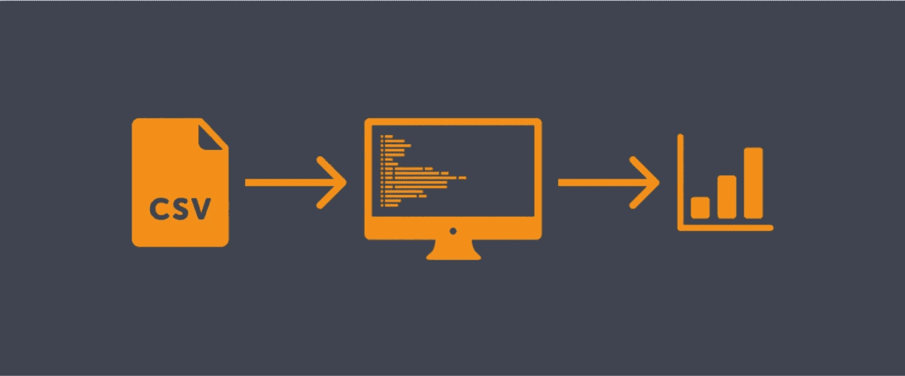

工具管道。CSV 通过程序发送并输出统计数据

**这是一个 CSV 示例**

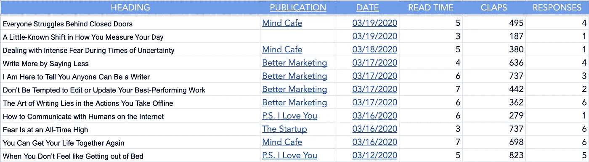

Google 工作表示例

**下面是一个输出示例:**

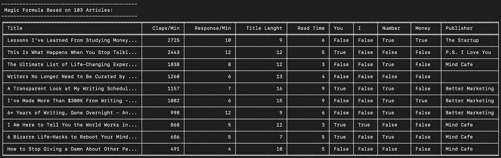

蒂姆·丹宁的神奇公式表。

在这篇文章中，我将一步一步地检查我的代码，这样你可以更好地理解我一直在想的东西，也许你可以优化、重构并重写它，使它变得更好。

> 为什么他还没有谈到熊猫？

对于这个工具，我使用了`statistics`、`datetime`和`tabulate`。`pandas`和`matplotlib`搭配`jupyter`可能是一个完美的组合。说实话，刚开始的时候我还不够了解。如果我再做一次，我可能会使用这样的设置。

让我们来看看这个工具是如何设置的！

# 阶级结构

根据程序的大小，你可以有几个类。`Articles`、`Writers`、`Publications`都有效。

`main.py`使用`Article`类和一个 CSV 文件来解析数据。`main.py`也输出所有数据。

我最后得到的设置是:

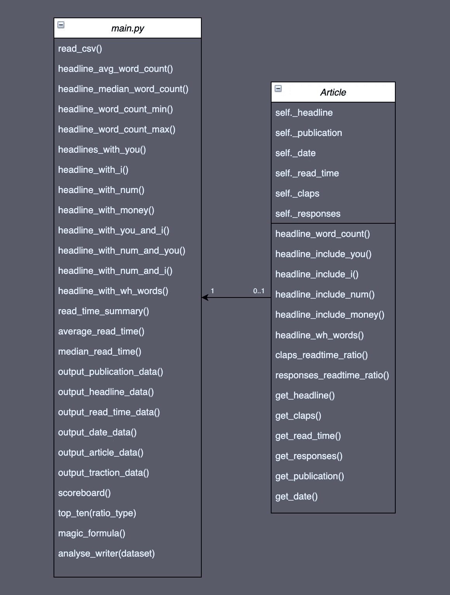

如果您愿意，可以跟随这个 testdata.csv 文件:

测试数据 CSV 文件。

# 文章类

先说`Article`类。

这个类包含文章本身的数据。我们发送标题，它属于哪个出版物，数据，阅读时间，掌声和回应。

当你请求数据时，一组方法返回数据。

以下是 article 类的完整代码。

文章类别的要点代码

## def __init__ (self…)

```
self._headline = headline 
self._publication = publication 
self._date = date 
self._read_time = int(read_time) 
self._claps = int(claps)
self._responses = int(responses)
```

这个类的构造函数保存了我们将从 CSV 文件中获得的有价值的数据。这里没什么特别的…

## def __str__(self):

__str__ 方法的代码

我喜欢包含`__str__`方法，这样如果我需要知道它包含什么数据，我就可以打印对象本身。用这个方法，我们可以创建一个对象并打印它，看看构造函数保存了什么数据(或者您决定的`__str__`应该打印的任何数据)

```
article1 = Article('Super Headline' , 'Super Publication' , '03/19/20' , '6' , '55' , '2')print(article1)
```

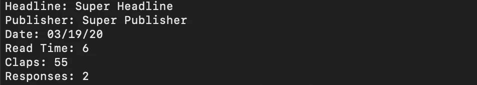

打印文章 1 的输出

## headline_word_count(自己)

这是一个非常简单的方法函数，可以写成一行:

```
return len(self._headline.split())
```

连字符经常出现在标题中，我们不希望它们出现在我们的字数中。我们必须移除它。

```
split_headline = self._headline.split()#remove hyphen as it is not a word
        if '-' in split_headline:
            split_headline.remove('-')count = len(split_headline)
        return count
```

另一种选择(实际上我更喜欢)是使用列表理解:

```
word_list = [word for word in self._headline.split() if word != '-']
return len(word_list)
```

对于初学者来说有点难读，所以我想把两个选项都包括进来。

## def headline_include_you(自己)

这个方法的功能是检查标题中是否有单词“you”。

带有“你”的文章通常向用户提供一些提示和技巧，有趣的是，看看有多少顶级文章以某种方式使用了“你”。

```
if 'you' in self._headline.lower():
    return True
return False
```

我们可以在后台循环每个单词，因为标题是一个字符串，我们正在检查字母组合“you”是否在标题中的任何位置。

这段代码也能捕捉像“你自己”这样的词，但是它有一个**的重大缺陷**。它还可以捕捉像“青年”、“youtube”或其他包含“你”️anywhere 的单词🤷🏼‍♂️

接下来的方法将以不同的方式处理这个问题。这是一个更安全的设置，我们也应该使用你的方法。

## def headline_include_i(自己):

这个方法函数与前一个方法函数的逻辑相同，但是它有一个我们想要检查的单词的预定义列表。

它将检查*【我】**【我已经】**【我是】*。它不会像上面的例子那样捕捉仅仅以*‘I’*开头的单词，因为我们预先定义了我们想要使用的单词列表。

```
i_list = [‘I’,’I\’m’,’I\’ve’] 
for word in i_list: 
    if word in self._headline.split():
        return True
return False
```

## def headline_wh_words(self):

该方法功能与上面的方法功能相同。

## def headline_include_num(self):

这个方法函数与前两个几乎相同，但是它有一个额外的步骤(检查单词的字母，而不仅仅是单词),以确保它捕获像“6+”这样的单词

```
for word in self._headline.split():
    for letter in word:
        #catch words with number concatinated with anything:
        if letter.isdigit():
            return True
    return False
```

## def headline_include_money(自己)

另一种方法是使用一个 if 语句来运行我们循环遍历的列表。我不能决定哪个更漂亮，但它们都是有效的选择。

这更短，但如果语句太长，可能更难阅读。

标题的要点代码包括金钱

注意，我对照`self._headline.lower()`检查`money`，这样我就不用担心像‘Money’这样的大写字母了。

我还检查美元符号,$，以及单词“美元”(因此也是美元)

## 比率方法

代码有一些比率方法，检查每分钟鼓掌和响应的比率。

## 获取方法

get 方法用于返回我们以后可能需要的任何东西，比如所有的构造函数变量。

# 分析(main.py)


图片来自 [Pixabay](https://pixabay.com/?utm_source=link-attribution&utm_medium=referral&utm_campaign=image&utm_content=3614766) 由 [janjf93](https://pixabay.com/users/janjf93-3084263/?utm_source=link-attribution&utm_medium=referral&utm_campaign=image&utm_content=3614766) 拍摄

是时候写一个主工具，解决我们可能有的所有分析问题了。

主文件的结构是这样设置的:

*   将数据作为`Article`对象添加到文章列表的 CSV 阅读器
*   柜台。这些方法检查所有文章并返回计数数据。(例如，最长的标题、平均字数、包含“您”的文章数量等。)
*   `read_time`具体方法。其中一些也是计数器。
*   产出。这些方法只是输出我们想要看到的数据。

在我们浏览代码之前，这里是:

main.py 的要点代码

## def read_csv(文件):

这里并没有发生太多的事情。我们向过程传递一个文件名，过程使用`csv.reader`读取它。

我们使用`next(datareader)`来跳过标题，然后循环遍历这些行，并将它们添加到`article_list`中。这将是我们剩余程序的数据。

csv 阅读器的要点代码。

## 计数器:

所有计数器的设置都非常相似。我们定义一个计数器，遍历文章对象，并使用文章方法递增计数器。

来自`headlines_wiht_i()`的示例

```
i_count = 0
    for article in article_list:
        if article.headline_include_i():
            i_count +=1return i_count
```

## def headline_median_word_count():

这是设置稍有不同的计数器之一。在使用`statistics.median`方法寻找中位数之前，我们使用列表理解来填充标题字数列表。

```
word_count_list = [words.headline_word_count() for words in article_list]word_count_median = statistics.median(word_count_list)
return word_count_median
```

## def 读取时间摘要():

read_time_summary 的要点代码

我想为 read_time 数据创建一个字典。这样我们就可以知道一篇 X 分钟的文章写了多少次。

如果我们有一个这样的列表:
read _ time:5
read _ time:9
read _ time:2
read _ time:5
read _ time:4
read _ time:3
read _ time:3

该字典将如下所示:

read_time_dict ={2:1，3:2，4:1，5:2，9:1}

这意味着 2 分钟的文章被发现 1 次，3 分钟的文章被发现 2 次，以此类推。

我们快速检查 read_time 键是否已经在字典中。如果不是，我们就创建它。如果它确实存在，我们就增加它。

有了这样一个函数，我们可以在任何时候请求 read_time 数据的概览。

## def 平均读取时间():

使用 read_time_summary()字典，我们可以很容易地得到平均读取时间值。

```
read_sum = 0
    read_time_extract = read_time_summary()
    for key,value in read_time_extract.items():
        minutes = key*value
        read_sum += minutes
    return read_sum/len(article_list)
```

## def 中值读取时间():

为了找到中值 read_time，我们再次使用`statistics.median`函数。该函数需要一个列表，所以我们将使用`read_time_summary`函数来创建这个列表并返回中值。

```
read_time_list = []
    read_time_dict = read_time_summary()
    for key,value in read_time_dict.items():
        for iteration in range(0,value):
            read_time_list.append(key)read_time_median = statistics.median(read_time_list)
    return read_time_median
```

## 定义 publication_summary():

`publication_summary`与`read_time_summary`的逻辑相同

# 输出:


照片由 [AG Z](https://www.pexels.com/@ag-z-1866835?utm_content=attributionCopyText&utm_medium=referral&utm_source=pexels) 从 [Pexels](https://www.pexels.com/photo/grayscale-photo-of-person-standing-while-holding-a-newspaper-3483786/?utm_content=attributionCopyText&utm_medium=referral&utm_source=pexels) 拍摄

是时候输出了。产出是我们本质上所追求的。这是我们数据的表示。

我已经把不同的输出写成了程序，所以我们可以随心所欲地打开和关闭它们。

有两种输出结构。

*   **列表输出:**

列表输出的公式如下:

```
header
information : {data}
```

*   **表格输出:**

表格用`tabulate`方法输出打印数据

```
header1 - header2 - header3
-data1-----data2-----data3--
```

以下是输出程序及其终端打印表示

## def 输出读取时间数据():

输出 _ 读取 _ 时间 _ 数据代码

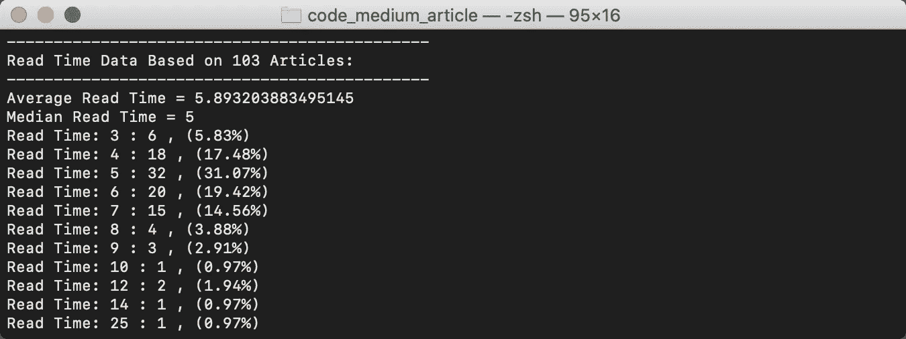

输出 _ 读取 _ 时间 _ 数据终端打印

## def 输出发布数据():

这是我们第一次使用`tabulate`方法。当我们遍历 publication_dict 时，我们可以使用键和值来创建我们发送给制表方法的列表。

```
publication_dict = publication_summary()
    #create list to print.
    table_representation_list = []
    for key,value in publication_dict.items():
        publication_table = [key,value]
        table_representation_list.append(publication_table)
```

我们还想在展示之前对其进行排序。

```
sort_table = sorted(table_representation_list , key=lambda x: x[1],reverse= True)
```

`tabulate`让我们定义标题和表格样式。有很多好看的桌子款式。这个工具我用的是 fancy_grid。

```
print (tabulate(sort_table, headers= ['Publication' , 'Articles'],tablefmt="fancy_grid"))
```

我建议你在这里看看所有的选择:

[制表样式格式选择](https://pypi.org/project/tabulate/)

输出 _ 发布 _ 数据代码

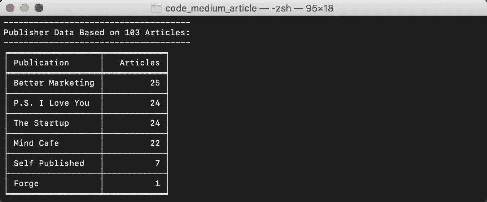

输出 _ 出版 _ 数据终端打印

## def 输出标题数据():

输出 _ 标题 _ 数据代码

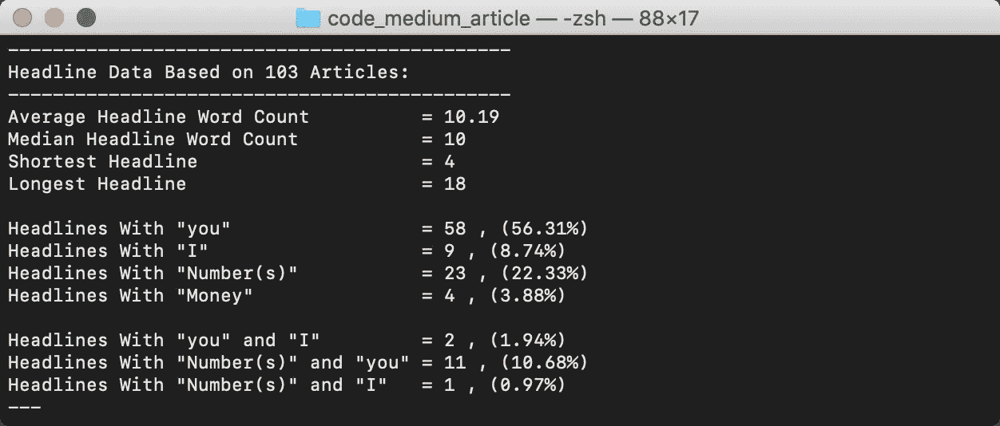

输出 _ 标题 _ 数据终端打印

## def 输出日期数据():

这个过程处理日期。我们想看看作者每月写多少文章。我们创建一个 dict，以月份作为键，以该月写的文章数量作为值。这样我们也可以找到平均值。超级俏皮👍🏼

为了让这个程序更容易使用，我决定每月设定 4 周。如果你设置一个日/月字典{'Jan':31，' Feb':28…}，你可以得到一个完美的计算。

输出日期数据代码

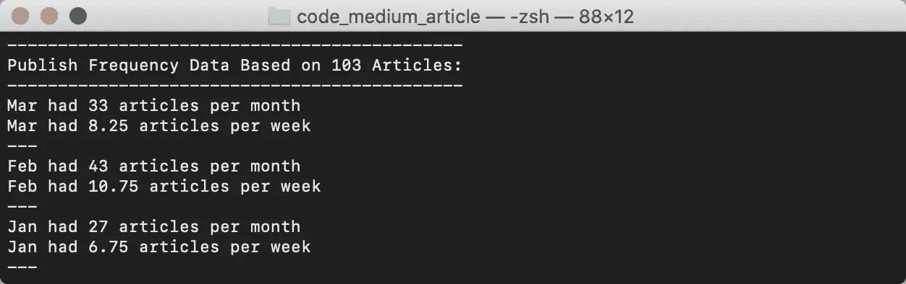

输出日期数据终端打印

## def 输出 _ 文章 _ 数据():

我并不经常使用这个过程，但这是一个很好的方法，可以收集每篇文章的信息并打印出来，这样你就可以更仔细地检查它们。

输出 _ 商品 _ 数据代码

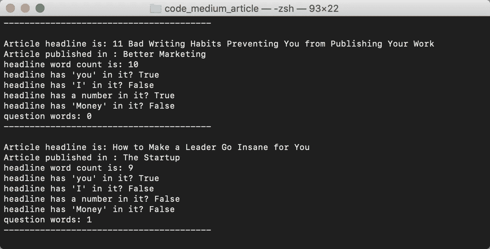

输出 _ 文章 _ 数据终端打印

## def 输出 _ 牵引力 _ 数据():

与前面的程序一样，牵引力数据用于检查物品。

它根据每分钟的鼓掌次数和每分钟的响应次数为文章分配一个*分数*。

输出 _ 牵引力 _ 数据代码

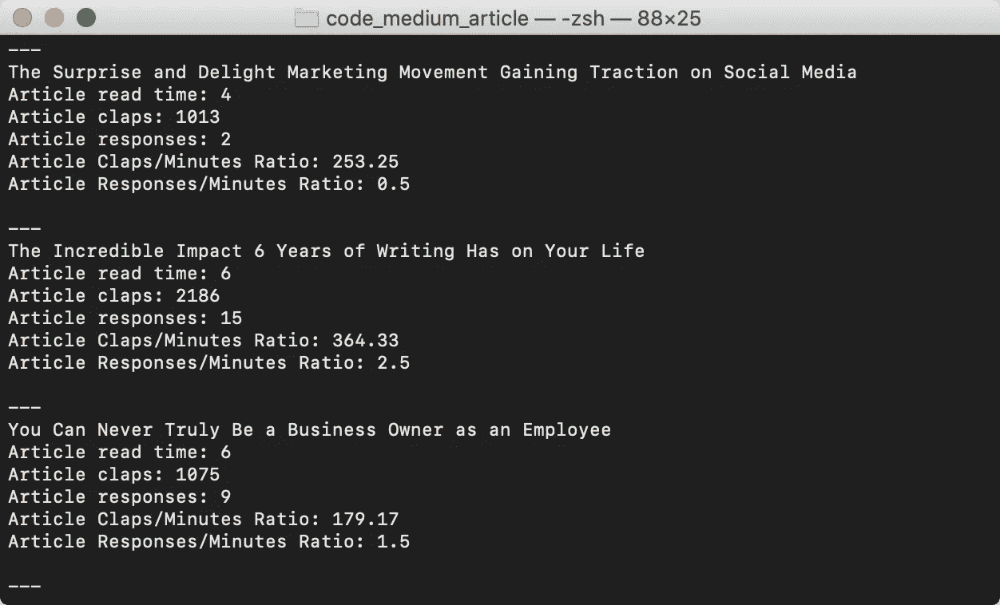

输出 _ 牵引 _ 数据终端打印

## def top_ten(比率类型):

这个程序大概有几种写法。如果你知道更好的方法，请在评论中告诉我。我相信这是可以优化的。

这个过程根据鼓掌率(每分钟阅读时间你得到多少次鼓掌)或响应率(每分钟阅读时间你得到多少次响应)输出一个包含**前 10 篇**文章的表格。

首先，我们用文章填充一个列表，其中我们添加了一个包含标题(作为标识符)和比率值的元组。

对电路板进行排序是通过我们之前使用的一行漂亮的小代码来完成的:

```
sorted_board = sorted(ratio_board , key=lambda x: x[1], reverse=True)
```

有了排序板，我们只需要前 10 篇文章:

```
sorted_board = sorted_board[0:10]
```

然后使用制表来输出表格。

十大代码

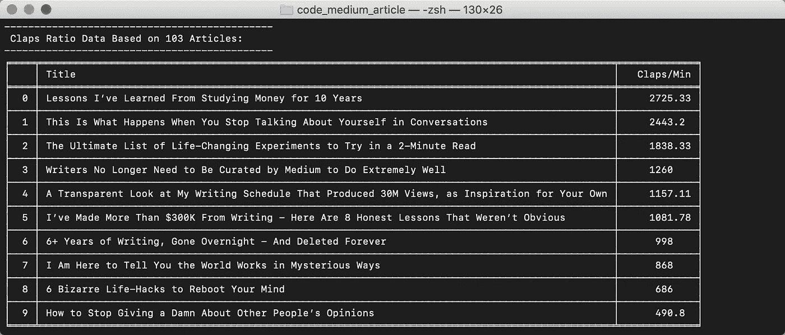

十大终端打印—拍手

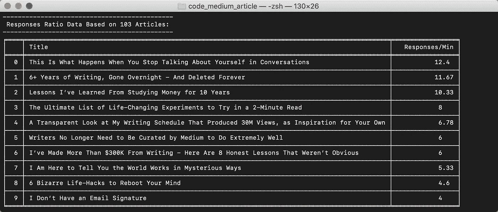

前十名终端打印-响应

## def 魔法公式():

最后的程序！真正的神奇公式。这使用了前 10 个逻辑中的大部分，看起来非常相似。

魔术公式代码

一篇好文章的所有有价值的分析数据都在这个表中。是利用好这些数据，还是只是为了好玩而阅读，这取决于我们。

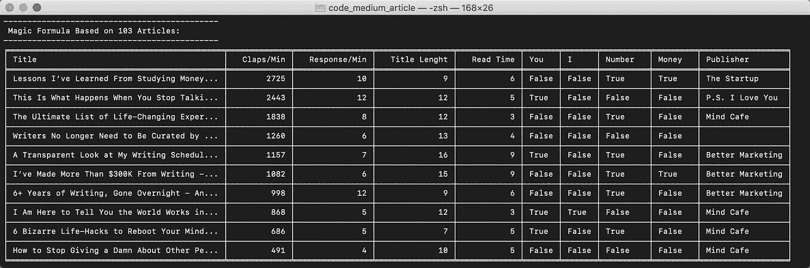

魔术公式终端打印

## def analyse_writer(数据集):

这个过程执行我们想要的所有输出。这种设置方式使得故障排除非常容易。只需注释掉你已经完成的部分，并专注于你正在做的部分。

```
def analyse_writer(dataset):
    '''
    Procedure that reads the CSV file and
    outputs all data.
    '''
    read_csv(dataset)
    output_article_data()
    output_read_time_data()
    output_date_data()
    output_headline_data()
    output_traction_data()
    output_publication_data()
    top_ten('Claps')
    top_ten('Responses')
    magic_formula()
```

…最后:

```
#execute the tool:
if __name__ == "__main__":
    analyse_writer('analysis_tim_denning.csv')
```

# 最后


照片由 [Pexels](https://www.pexels.com/photo/woman-in-red-long-sleeve-writing-on-chalk-board-3769714/?utm_content=attributionCopyText&utm_medium=referral&utm_source=pexels) 的 [Andrea Piacquadio](https://www.pexels.com/@olly?utm_content=attributionCopyText&utm_medium=referral&utm_source=pexels) 拍摄

这个项目基于每个人都可以获得的文章数据输出一些有价值的信息。这里的所有数据都在你向下滚动作者页面时看到的文章卡片中。


如果你是一名数据科学家，你现在可能会因为看到我们可以使用熊猫完成的所有手动工作而流泪，但这是一个很好的实验项目，专注于编写一些好的程序和函数以及处理真实数据。

如果我再做一次类似的事情，我肯定会把`pandas`和`matplotlib`与类似`jupyter`的东西一起使用。

我希望你喜欢这个旅程:)拿起代码，和你最喜欢的作者一起亲自尝试一下，然后告诉我效果如何。