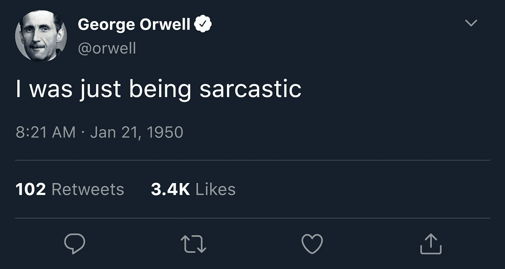

# 被动监督的魔力

> 原文：<https://towardsdatascience.com/the-magic-of-reactive-supervision-3fc83cdb1ca4?source=collection_archive---------44----------------------->

图片由来自 [Pixabay](https://pixabay.com/?utm_source=link-attribution&utm_medium=referral&utm_campaign=image&utm_content=256213) 的 [Michal Jarmoluk](https://pixabay.com/users/jarmoluk-143740/?utm_source=link-attribution&utm_medium=referral&utm_campaign=image&utm_content=256213) 拍摄

## 使用社交媒体交互的高质量 NLP 数据标记

> 这个故事是基于 Shmueli 等人的论文“[反应式监督:收集讽刺数据的新方法](https://arxiv.org/abs/2009.13080)”，EMNLP 2020。

机器学习模型和它们的训练数据质量一样好。嘈杂、不准确的标签会导致灾难性的预测。但是，获得足够多的高质量标签数据通常是机器学习管道中最具挑战性的部分。特别是对于 NLP 任务来说，获取带标签或带注释的文本可能是一件麻烦而昂贵的事情。

例如，假设你需要标记数据来训练一个用于*讽刺检测*的分类器。讽刺是一种不真诚的言论，有点类似于说谎。但是谎言和讽刺性话语之间是有区别的:当你撒谎时，你试图*而不是*被抓住。当你在讽刺的时候，你实际上是希望你的听众“明白”。例如，你可能会告诉你的朋友“哦，是的，统计学非常有趣……”，但你说话的语气很尖刻，因为你想让你的朋友知道你其实讨厌统计学。

这就引出了为什么文本的自动讽刺检测如此重要。如果 NLP 系统没有检测到句子中的讽刺，文本的意思就完全颠倒了。假设您构建了一个情感分类器。如果你的分类器漏掉了，比如说，餐馆评论中的讽刺(“汤是冷的，沙漠是不新鲜的。有史以来最好吃的一顿饭！”)，它可能会将帖子的情绪误归类为“积极”。或者想想人工智能聊天机器人——误解用户的讽刺可能是灾难性的。

照片由[达林·麦克卢尔](https://www.flickr.com/photos/darinrmcclure/)在[知识共享](https://creativecommons.org/licenses/by/2.0/)下拍摄

好吧，讽刺检测很重要。现在我们需要建立我们的 NLP 深度学习分类器。为了训练我们的模型，我们需要大量带标签的讽刺文本。我们如何着手收集数据？目前有两种方法:**手动**和**自动**。

让我们从**手动**方法开始，在这种方法中，人们被要求——或者更常见的是，被付费——注释或收集讽刺文本。可以想象，这可能会很昂贵，因此数据集通常很小。此外，讽刺是高度上下文和文化敏感的，但注释者往往缺乏必要的上下文——想想亚马逊机械土耳其工人。因此，注释者经常需要猜测一个句子是否是讽刺性的。

另一方面，**自动**方法使用*远程监控*。它依靠社交媒体用户将自己的帖子自我标记为讽刺。例如，在 Twitter 上，一些用户可能会在他们的一些推文中添加**#讽刺**标签。在 Reddit 上，人们偶尔会出于同样的目的使用后缀 **/s** 。(有趣的事实:这里没什么新鲜的！四百多年前，有人建议用一个反问号(⸮)来表示讽刺；它从未真正流行起来。)远程监督的工作原理是搜索这些标签，并假设相应的文本是讽刺性的。这是一个很酷的想法，但它有一些严重的缺点。首先，只有某些用户会标记他们的帖子，而且可能只针对某些类型的推文。这引入了偏差。此外，人们可能会在非讽刺性的推文中使用#讽刺标签，给这道菜增加一些噪音。

# 进入被动监督

为了克服所有这些问题，我们提出了一种具有许多优点的全新方法:**反应式监督**。我们的方法基于社交媒体对话的自然动态。基本的想法非常简单，我们将用下面有趣的测验来演示。准备好！

测验 1:这是三个用户 A、B 和 c 之间的四条推特对话。除了最后一条，所有的推特都被编辑了。我们只展示最后一条推文，也就是用户 A 的“我当时在讽刺 lol”。仔细看图:你能想出讽刺的推文在哪里吗？

(图片由作者提供)

这个不难吧？用户 A 写道“**我**正在讽刺”，所以讽刺性的推文肯定也是 A 发布的。由于 A 正好发布了另一条推文，我们可以很容易地找到讽刺性的推文。完整的线程显示如下。讽刺性的推文然后是用户 A 的“所以汤姆·汉克斯可以行动了！谁知道呢？？?"。

解决方案 1，和一个温和的提醒(重新)观看阿甘正传

准备好接受另一个测验了吗？这个更有挑战性。开始了。

问题 2:你能在这里找到讽刺的推文吗？

测验 2(作者图片)

这里只有两种选择:要么讽刺性的推文是由 B 发布的，要么是由 c 发布的。我们注意到 A 用"**她**只是在讽刺！"。“她”是谁？是第三人称，所以不可能是 b，我们断定 C 的推文就是讽刺的那条。太棒了。下面再一次展示完整的线索。

解决方案 2(图片由作者提供)

这些例子展示了*反应式*监督背后的简单想法——通过利用用户的*反应来捕捉和标记讽刺性的推文。*为了系统地使用我们的方法，我们首先寻找*提示推文*，这些推文表示之前推文中的讽刺。线索推文的例子是“我在讽刺 lol”，“我认为你在讽刺”，或者“她只是在讽刺！”。很容易找到线索推文:我们只需在 Twitter 上搜索短语“讽刺”，因为这是社交媒体用户在以前的帖子中想要强调讽刺时常用的。接下来，我们在线索推文中寻找人称代词:我、你或她/他。这告诉我们如何找到讽刺的推文:

*   第一人称“我”是指线索推文和讽刺推文由同一作者发布。
*   第二人称“你”意味着提示推文是对讽刺推文的直接回复。
*   第三人称“他”或“她”表示提示推文是*而不是*对讽刺推文的直接回复，而是对第三方的回复。

一旦我们找到提示推文及其人物类别(第一、第二或第三)，我们就使用常识规则来找到讽刺推文，如使用两个测验所演示的。

反应式监督可以完全自动化，因此我们可以用它来廉价地收集大量数据。与基于 hashtag 的远程监管方法相比，它还有很多优点。反应式监督最重要的特征之一是它能够捕捉并标记出*有意讽刺*和*感知讽刺*。这是下一节的主题。

# 有意的讽刺，感知的讽刺

假设我们发现了两条使用反应式监督的讽刺性推文。我们发现一条推文使用了第一人称提示“**我**只是在讽刺”，我们发现另一条推文使用了第三人称“**她**正在讽刺 lol”。现在我们有两条讽刺的推特。

在第一种情况下，提示推文的作者也是讽刺推文的作者。通过发布线索推文，作者声明他*打算*这条推文是讽刺性的。这条推文因此被贴上了*有意讽刺*的标签。

在第二种情况下，发布线索推文的用户是*而不是*讽刺推文的作者。这条线索推文是由一个阅读了推文并认为它是讽刺的人发布的。人们不会读心术——他们并不真正知道这条推文的原作者是否有意让这条推文具有讽刺意味。我们只能确定一件事:发布提示推文的用户认为这条推文是讽刺性的。因此，我们将这条推文命名为*感知讽刺*。

有意讽刺(作者图片)

这两种类型的讽刺标签都很重要，并且都有自己的使用案例。我们只举一个例子。想象一个人工智能聊天机器人。当它读取用户的输入时，它需要检测出*意图讽刺*，这样聊天机器人就可以解释人类的真实意图。另一方面，当聊天机器人生成文本作为对用户的回复时，我们想知道人类是否会认为生成的文本是讽刺性的。这就是*感知讽刺*分类器变得超级方便的地方。因此，检测有意的和感知的讽刺是两个不同的(尽管高度相关)任务。这就是为什么我们需要这两种类型的数据。

由于反应式监督的工作方式，它捕捉并标记有意的讽刺和感知的讽刺。事实上，*反应式监督是在同一数据环境中自动捕捉有意讽刺和感知讽刺的唯一方法*。这是非常漂亮的。

# 高质量标签

使用反应式监督会产生高质量的标签，因为我们利用了用户发布的线索。在某种程度上，用户充当了我们的注释者。美妙之处在于，他们非常熟悉对话的背景——毕竟，他们是讨论的积极参与者——所以标签非常准确。因此，我们的方法克服了与使用外部注释器相关的质量问题。

反应式监督还有许多其他的好特性，在论文中有详细介绍。

# SPIRS 数据集

我们使用反应式监督来收集和发布 [**SPIRS**](https://github.com/bshmueli/SPIRS) ，这是一个讽刺性推特的大型数据集。

数据集[在 GitHub](https://github.com/bshmueli/SPIRS) 上公开。

# 公共服务公告

我们寻找包含“讽刺”的线索推文，因为我们想收集讽刺的文本。根据您的应用和您想要收集的数据集，您可以通过更改您搜索的提示 tweets 来调整反应式监督。这里仅举一个例子:假设您想要获取一个数据集，其中包含表示抑郁或焦虑的文本；在这种情况下，搜索像“听起来很悲伤”或“听起来很焦虑”这样的推文可能会帮助你找到合适的文本。换句话说，反应式监督可以推广到其他领域。

# 从这里去哪里

如果您想了解更多关于反应式监管的信息，请参阅我们的 [EMNLP 2020 论文](https://arxiv.org/abs/2009.13080)。它有很多关于方法、算法、数据集和我们做的一些实验的细节。你也可以查看我们创建并公开的 [SPIRS 讽刺数据集](https://github.com/bshmueli/SPIRS)。

我们希望你喜欢这个故事！如果你有任何关于反应式监督的问题、想法或建议，或者计划在你自己的研究或项目中使用这种方法，请随时给我发[电子邮件](mailto:shmueli@iis.sinica.edu.tw)或发[@ shmu Eli](https://twitter.com/shmueli)DM 我。我很乐意收到你的来信——我不是在讽刺你！

*注:* [*本文*](https://arxiv.org/abs/2009.13080) *是与和* [*苏米亚雷*](https://medium.com/u/4533ef30d75f?source=post_page-----3fc83cdb1ca4--------------------------------) *的联合工作。*