# 模块的制作

> 原文：<https://towardsdatascience.com/the-makings-of-a-module-5990100216d4?source=collection_archive---------37----------------------->

## 实践 OOP 开发以产生快速线性模型并应用脊和套索正则化

## 提示和问题

最近在我的数据科学训练营完成了一个关于使用面向对象编程的讲座后，我选择实践这些原则，并将它们应用到一个工具中，我可以在作为数据科学家的工作中继续使用它们。我观察到这个项目旨在解决的三个问题是:

*   新手身份导致方向不明
*   常见步骤的重复代码(导入、拆分等)
*   由于常见的印刷或语法错误而导致失败的倾向

这个模块将允许我“聪明地工作，而不是努力地工作”，并尽可能地简化数据清理和 EDA 阶段。

## 假设

我的 qdtools，或“快速和肮脏”模块最初将包含线性回归方法以及脊和套索正则化技术。它将在使用过程中为用户提供反馈和指导。正如所料，该模块将严重依赖于现有的模块和来自熊猫，sklearn 和 statsmodels 的软件包，并将主要用于为我自己的需求定制的“香草”建模。最后，该模块将需要不断开发和增强，并将是合作的开源。

## 初速电流状态

处理线性回归数据集时，数据科学家必须遵循一些定义好的步骤(简而言之):

*   上传并快速查看数据集
*   为培训和测试定义目标和分割数据集
*   探索原始数据
*   清理数据集
*   运行模型并分析

或者，像在 CRISP-DM 模型中一样，进行数据准备、建模和评估(根据需要重复)。

特别是在线性模型中，我发现这个过程的一些步骤可以包装在一个函数中，以减少时间编码和限制错误，从导入模块和平面文件开始

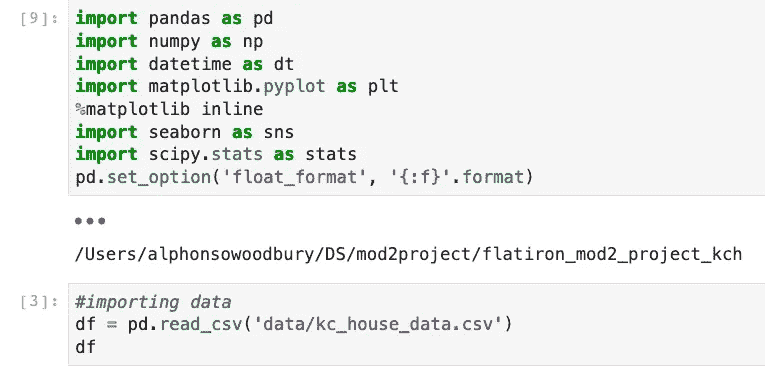

分配目标和特征，

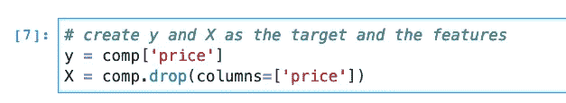

分割数据集

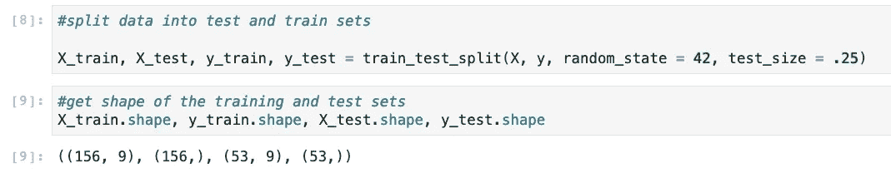

接下来是虚拟或一次性编码、缩放和标准化以及建模。我们将看看 qdtools 如何帮助我们加速这一过程。

# 使用 qdtools

*免责声明:本演示进展很快，因为我们已经熟悉了 kc_house_data 数据集*

首先，qdtools.py 文件位于 site-packages 文件夹中，所以我不需要在 jupyter 笔记本的工作目录中有一个副本。此时，唯一要实例化的类是 LinearVanilla

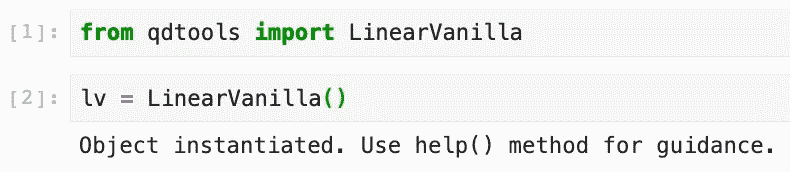

非常好。用户甚至会收到一个确认消息，确认对象已经创建，并指示用户尝试 help()方法。我们去看看。

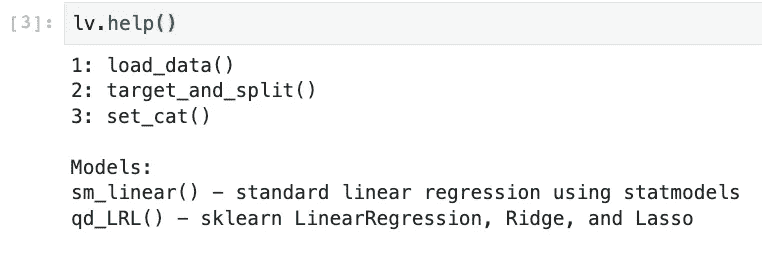

这很有帮助！好了，让我们直接跳过 kc_house_data.csv。

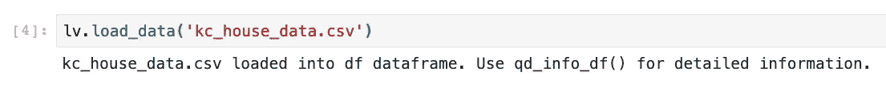

又来了，多么健谈。我们通常会查看数据帧，并使用。info()和。描述()，但是让我们看看 qd_info_df()方法能向我们展示什么

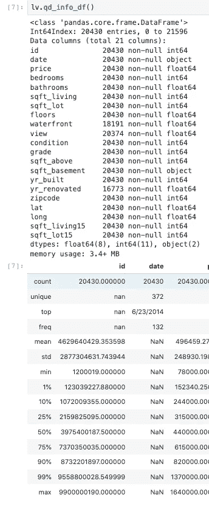

哎呀，这是一个很大的信息扔在那里。但是，注意到什么不同了吗？这不仅是一个函数调用的 info()和 describe()输出，而且它们被稍微修改以包含一些潜在有用的信息。在这种情况下，我们可以在 1 和 99%看到一些额外的分位数数据；这可能会派上用场...

就现在。仔细观察这个数据集，我发现有一栋房子有 33 个卫生间，但 99%的房子只有不到 6 个。让我们使用 cut99()方法删除一些异常值(在其他列中也是如此)

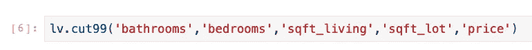

注意:你可能不想(阅读，你可能被告知你不应该)以这种方式或根本不想剔除异常值，但对我来说，这是一个学习的经历，包括*能力*来快速轻松地做到这一点。

现在，让我们分割数据，并设置一个分类特征，邮政编码。

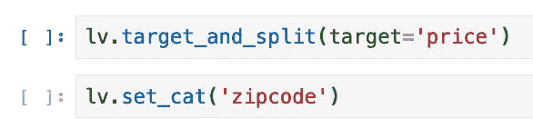

使用方法的两行简短代码。我看到自己在未来会经常使用这种方法！在这里看不到，但是可以像使用 test_train_split()一样操作 test_size 和 random_state，target_and_split()就是从 test _ train _ split()派生出来的。在我们运行我们的模型之前(已经？！)，让我们删除一些我们现在不想包含在普通模型中的列，同时，让我们处理一些空值

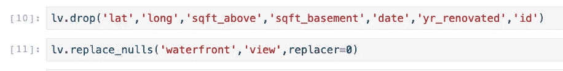

信不信由你，我们已经准备好运行一些模型。对于线性香草，我们运行两种方法来获得统计模型 OLS 和 sklearn 线性回归，岭和套索分数。

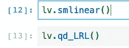

我们可以看看我们的训练成绩，

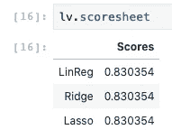

我们可以访问我们的 OLS 摘要作为我们对象的属性

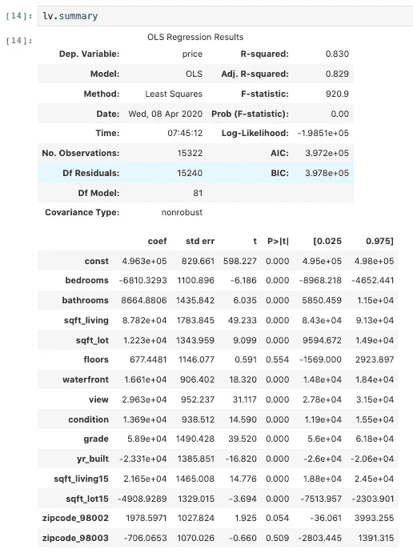

我们刚刚在一个原始数据集上运行了三个“模型”(对此我们很熟悉),得分为 0.83…非常好！我们甚至使用了一个分类特性，但是不必处理 get_dummies()的编码。此外，我的 R 为 0.87 的原始项目包括了我们在这里没有探讨的工程特性。不幸的是，截至这篇博客发表之日，我还没有对这些错误的分析。

## 我学到了什么

这个模块的开发比预期的更具挑战性(也更耗时)。吸取的第一个教训是预先确定模块的范围；我发现自己正在庆祝我之前设计的新代码块的成功执行，却发现它破坏了模块的一个关键功能。

一些更具技术性的发现包括在模块内放置导入(在声明类之前)，高效的控制流，

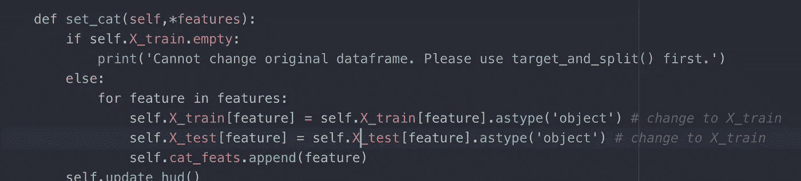

以及在哪里存储？py 文件，这样该模块可以在系统范围内使用(参见[这篇有用的文章](https://www.digitalocean.com/community/tutorials/how-to-write-modules-in-python-3))。我还获得了使用文本编辑器和调试的美妙体验。总而言之，看到我的代码变得栩栩如生，并为自己创建了一个我可能会经常使用的工具，这是令人兴奋的。

## 局限性和未来工作

我不能夸大的是，我意识到这个模块对于许多数据科学家来说可能并不实用，它主要是 OOP 中的一个实践。qdtools 1.0 是一个激动人心的有用的模块，它有一些很棒的回归工具，但是它也不是没有缺点。

*   我希望该模块适用于任何数据集，因此需要更健壮的数据清理方法(或控制流)。
*   特征只能被删除或虚拟编码，因此工程特征不在模块范围内。
*   可视化；我的目标是包括一些快速和肮脏的 EDA 方法(sns pairplots，相关矩阵)
*   我期望在模块中实现 OneHotEncoder
*   “抬头显示”的潜在高价值功能，在建模前突出显示您的功能数据的关键点，如有多少唯一值的计数为 1，以及(可能)基于算法的推荐器，用于确定某一列是否应该分类，甚至是否应该删除；这将使用 OLS 汇总中的 p 值。

在添加更多功能之前，我将花时间创建完整的文档和一个有组织的[库](https://github.com/a-woodbury/qdtools)，这样任何人都可以使用并为这个项目做出贡献。