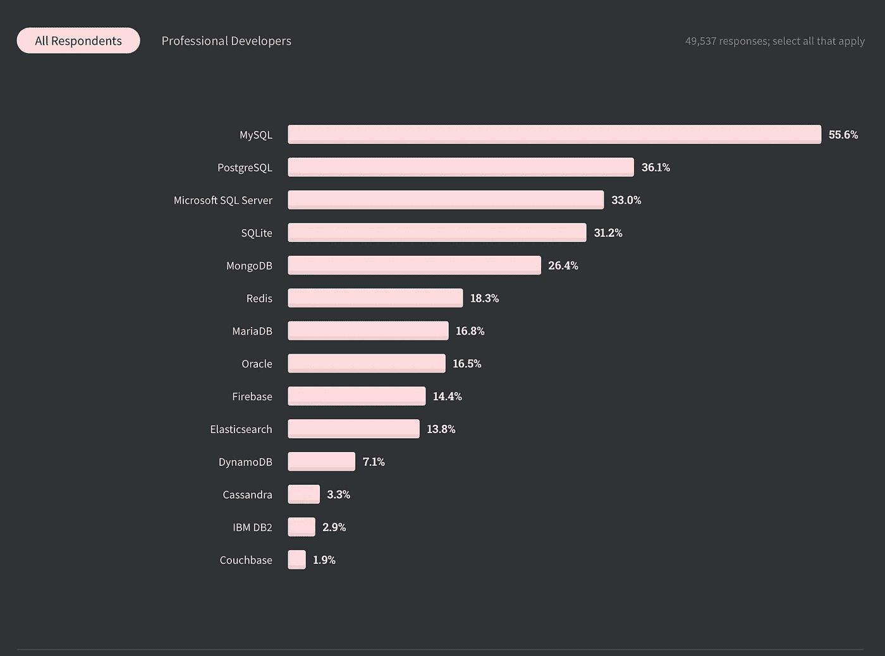

# SQL 的多种风格

> 原文：<https://towardsdatascience.com/the-many-flavours-of-sql-7b7da5d56c1e?source=collection_archive---------15----------------------->


照片由[福蒂斯·福托普洛斯](https://unsplash.com/@ffstop?utm_source=unsplash&utm_medium=referral&utm_content=creditCopyText)在 [Unsplash](https://unsplash.com/s/photos/developer?utm_source=unsplash&utm_medium=referral&utm_content=creditCopyText) 拍摄

## 数据工程

## 2022 年的 [SQL 前景](https://linktr.ee/kovid)会是怎样的，它的未来会是怎样的？

本文最后一次更新于 2022 年 12 月 9 日。

随着 SQL 成为传统数据库的事实上的查询语言，它可能已经在当前用于部署生产级应用程序的几乎所有技术栈中占有一席之地。即使当传统数据库(读关系数据库)不在使用时，SQL 也不可避免地在系统中显示自己。卡珊德拉有类似 SQL 的 CQL，Spark 有 SparkSQL，甚至 JIRA 有类似于基本 SQL 子句的 JQL，比如`WHERE`、`IN`、`BETWEEN`等。这些子句不仅仅属于 SQL，它们也是几乎所有编程语言的一部分，用于循环和条件结构中。为了不离题太远，我想证明 SQL 不仅会在不远的将来出现，还会在遥远的将来出现。

我正在读保罗·格拉厄姆写的一篇关于未来语言的文章。他谈到了语言是如何在人类时间线上进化的，计算机语言是如何进化的，以及它们之间是如何相似的。这是一个很有趣的问题，不是吗？

> 他们会用什么样的编程语言来编写控制那些飞行汽车的软件？
> 
> —保罗·格拉厄姆

[](http://www.paulgraham.com/hundred.html) [## 百年语言

### 2003 年 4 月(本文摘自 PyCon 2003 的主题演讲。很难预测未来的生活会是什么样子

www.paulgraham.com](http://www.paulgraham.com/hundred.html) 

我们从不使用“SQL 是编程语言之一”这样的句子，就像我们使用“Python 是编程语言之一”这样的句子一样*。* SQL 是查询语言。然后是 SQL 风格。这是标准。但认为它在未来不会改变将是一个疏忽。

在这个领域工作了一段时间后，我知道许多传统和非传统的数据库都使用 SQL。我想探索当前实践中不同风格的 SQL。下面是 SQL 最常用、最流行的风格的汇编。

[](/well-always-have-sequel-55325432174) [## 我们总会有续集

### 为什么 SQL 是数据工程、数据科学和软件开发的不二之选

towardsdatascience.com](/well-always-have-sequel-55325432174) 

# 关系数据库

大多数关系数据库支持写在`ANSI-92` SQL 文档中的基本 SQL 功能。最重要的是，每个数据库都有自己的一组附加特性，这些特性需要额外的 SQL 语句来利用这些特性。让我们来看看其中的一些。

## **MySQL**

很长一段时间，MySQL 不支持分析和窗口功能。它只支持基本的聚合和`GROUP BY`。然而，MySQL 的替代者，如 Percona Server 和 MariaDB，甚至在 MySQL 之前就已经发布了这些特性。

您可以从 SQL 客户端或 SQL 终端执行的所有操作都应被视为 SQL。例如，在 MySQL 中，您可以运行一个`SHOW SLAVE STATUS`命令来检查从属服务器的当前状态，以及复制是否正在工作，它已经进行了多远，等等。这不是标准 SQL 的一部分，在其他数据库中也不受类似的支持。要了解 SQL-92 标准，可以通过[这篇 500 页的文档](http://www.contrib.andrew.cmu.edu/~shadow/sql/sql1992.txt)。

MySQL 的一些独特特性是

*   支持本机复杂复制拓扑
*   模拟分析函数和 PL/SQL 功能的会话和全局变量
*   [存储引擎](https://mariadb.com/kb/en/choosing-the-right-storage-engine/) —支持这么多存储引擎的数据库并不多

[](https://medium.com/crowdbotics/mysql-from-the-horses-mouth-582dbfca2abb) [## MySQL 专家编写的阅读材料——书籍和博客

### 一个资源列表，由曾在 MySQL、Oracle 工作过的人提供，他们开发了广泛使用的 MySQL 分支，或者…

medium.com](https://medium.com/crowdbotics/mysql-from-the-horses-mouth-582dbfca2abb) 

## 一种数据库系统

PostgreSQL 通常被称为程序员的数据库，它通过对数组等高级抽象数据结构的原生支持，在开源领域成为 MySQL 的真正竞争对手。例如，要检查复制状态，您需要检查这个表— `pg_stat_replication`。使 PostgreSQL 与众不同的一些特性是

*   可扩展—您可以向数据库添加扩展以增强其功能。PostGIS 是 PostgreSQL 的流行扩展，PostgreSQL 是一个用于进行地理空间 SQL 查询的库。
*   对抽象数据类型的广泛支持，尤其有助于匹配应用程序编程语言中的常见数据类型。
*   与 MySQL 不同，PostgreSQL 确实扩展了自己，加入了一种过程语言 PL/pgSQL，类似于 Oracle 的 PL/SQL。

这里有几个工作中的 [PostGIS](https://postgis.net) 扩展的例子

在 Github Gist 上托管

## **甲骨文**

关于 Oracle 数据库，我们能说些什么？它可能是最有弹性和最耐用的数据库，这就是为什么它继续在需要最强酸性和随之而来的保证的时间关键型业务中占据主导地位。

Oracle 数据库的一些独特特性是

*   极强的耐酸性、高可靠性、高耐久性和弹性。
*   使用`CONNECT BY ... LEVEL`极大地支持分层查询。
*   最长时间完全支持分析和窗口功能。

MySQL 和 PostgreSQL 这些年来变得越来越流行的一个原因是它们可以免费使用——它们是开源的。Oracle 是闭源的定义。许可费用可能会扼杀一家小公司。每个企业都负担不起像 Oracle 和 SQL Server 这样的专有数据库。

## SQL Server

微软的终极数据库也拥有相似的特性和 ACID 支持级别等。，就像甲骨文一样。同样，就像甲骨文一样，对大多数公司来说成本太高。SQL Server 的一些独特功能包括

*   支持 T-SQL，微软自己的过程
*   使用查询存储优化数据库和查询性能的高级查询统计
*   完全支持分析和窗口功能

这是四种主要的关系数据库。我不算 DB/2，SQLite 等。，因为这些数据库没有足够的新用户。使用 DB/2 的地方可能是遗留系统。SQLite 功能不丰富，不适合生产级应用程序。

# 非关系数据库和其他

从关系数据库开始，让我们看看一些被称为 NoSQL 数据库、NewSQL 数据库或非关系数据仓库的数据库。

## CQL

CQL 是卡珊德拉对 SQL 的回答。它非常类似于 SQL，但同样，就像您将从现在开始看到的所有其他数据库一样，这个数据库也有关于体系结构实现的附加特性，这反过来又需要 SQL 中的附加特性。例如，CQL 有一种叫做`ALLOW FILTERING`的东西[在这里做了很好的解释](https://www.datastax.com/blog/2014/12/allow-filtering-explained):

```
SELECT * FROM ruling_stewards
WHERE king = 'Brego'
  AND reign_start >= 2450
  AND reign_start < 2500 
ALLOW FILTERING;
```

请访问本页查看[的完整功能列表](https://docs.datastax.com/en/cql-oss/3.1/cql/cql_intro_c.html)。

## SparkSQL

最初，Spark 不支持 SQL 查询，查询必须用 Scala 或 Python APIs 为数据帧编写。SparkSQL 提供了另一个抽象层，使受过 SQL 教育的员工能够轻松地充分利用他们的知识。下面是 Databricks 对 SparkSQL 的一个很好的介绍

 [## 大规模使用 SQL-Spark SQL 教程-数据块

### Databricks 上 SparkSQL 的简短指南

databricks-prod-cloudfront.cloud.databricks.com](https://databricks-prod-cloudfront.cloud.databricks.com/public/4027ec902e239c93eaaa8714f173bcfc/3137082781873852/3704545280501166/1264763342038607/latest.html) 

下面是一个示例查询的样子。您将看到越来越多的新关键字出现在每个其他数据库中，以获得特定于该数据库的功能。

```
sqlContext.sql("SELECT hashtag.text, count(*) A inst_count 
                  FROM twitter LATERAL VIEW OUTER 
                       explode(entities.hashtags) hashtagsTable AS hashtag 
                 GROUP BY hashtag.text 
                 ORDER BY inst_count DESC").show(4)
```

下面是 Rittman Mead 关于如何使用 SparkSQL 的一个示例:

[](https://www.rittmanmead.com/blog/2016/07/using-sparksql-pandas-import-data-big-data-discovery/) [## 使用 SparkSQL 和 Pandas 将数据导入 Hive 和大数据发现

### 大数据发现(BDD)是探索、转换和可视化存储在您的…

www.rittmanmead.com](https://www.rittmanmead.com/blog/2016/07/using-sparksql-pandas-import-data-big-data-discovery/) 

尽管 Spark 即使不支持 SQL 也能提供很多东西，但自从它开始支持 SparkSQL 以来，Spark 已经获得了更多的关注，因为它为数据分析师和数据科学家开辟了道路，否则他们将没有机会在 Spark 上工作(或者将有一个陡峭的学习曲线)。

## HiveQL

随着 Hadoop 生态系统的出现，分析大量数据很快变得非常困难，因为每个人都不熟悉编程语言，并且必须编写许多行代码来分析数据。脸书有很多数据要分析，所以他们开发了这个类似 SQL 的查询引擎，运行在 Hadoop 的存储系统之上。Hive 也意味着只查询结构化的分布式数据。以下是配置单元查询的样子:

```
CREATE TABLE sample_bucket (code STRING, 
                            description STRING, 
                            total_emp INT, 
                            salary INT) 
CLUSTERED BY (code) 
   SORTED BY (salary) 
     INTO 5 BUCKETS;
```

如果你感兴趣，这里有一份[蜂巢备忘单](https://gist.github.com/kzhangkzhang/258d18858889fa97194011a249b74c43)。

## InfluxQL

InfluxDB 是一个时序数据库，用于需要实时查询的应用程序。这是一个传统数据库不完全支持的用例。一些新时代的流式管道解决方案为这一功能提供了一些限制。另一方面，InfluxDB 专门处理如下连续查询:

```
CREATE CONTINUOUS QUERY "cq_basic_rp" ON "transportation"
BEGIN
  SELECT mean("passengers") 
    INTO "transportation"."three_weeks"."average_passengers" 
    FROM "bus_data" 
   GROUP BY time(1h)
END
```

该查询为您提供了一个小时内的平均乘客数量，而这一个小时的时间段每秒都在不断变化，因此我们得到的指标是一个小时内乘客的实时移动平均值。是不是很酷？

InfluxDB 适合多种高容量、实时、关键的数据收集应用，如物联网、股票市场运动数据、天文数据等。这是来自 InfluxDB 的 David Simmons 的演讲，他讨论了 InfluxDB 的物联网用例。

在这个演讲中，David 说 InfluxDB 中的插入比使用相同硬件的 MongoDB 快 50 多倍。我认为这不准确。这里有一篇比较这两种技术的更好的文章

[](https://www.influxdata.com/blog/influxdb-is-27x-faster-vs-mongodb-for-time-series-workloads/) [## MongoDB 与 InfluxDB | InfluxData 时序工作负载

### 阅读 MongoDB 和 InfluxDB 之间比较的基准测试结果的更新版本，这两者不匹配…

www.influxdata.com](https://www.influxdata.com/blog/influxdb-is-27x-faster-vs-mongodb-for-time-series-workloads/) 

与 MongoDB 相比，InfluxDB 在相同的硬件上快了 2 倍多。试试看！

## **弹性搜索 SQL**

尽管大多数关系数据库现在都支持全文搜索，但关系数据库并不意味着广泛的全文搜索，因为管理存储、内存和索引的成本会很高。Elasticsearch 作为一个专用的全文搜索引擎来拯救我们。

[](https://www.elastic.co/what-is/elasticsearch-sql) [## Elasticsearch SQL

### Elasticsearch 拥有您的数据所需的速度、规模和灵活性——而且它使用 SQL。使用传统数据库…

www.elastic.co](https://www.elastic.co/what-is/elasticsearch-sql) 

下面是一个 POST 调用的例子，带有对 Elasticsearch 的查询负载。

```
POST _xpack/sql?format=txt {   "query":"SELECT OriginCityName, DestCityName FROM flights WHERE FlightTimeHour > 5 AND OriginCountry='US' ORDER BY FlightTimeHour DESC LIMIT 10" }
```

其他全文搜索引擎如 [Solr 也支持 SQL 语法](https://lucene.apache.org/solr/guide/6_6/parallel-sql-interface.html)。

## **密码**

neo4j 是一个重要的图形数据库，它也非常支持类似 SQL 的查询。你自己看吧。以下是常规 ANSI SQL 中的一个示例:

```
SELECT p.ProductName, 
       sum(od.UnitPrice * od.Quantity) AS Volume
  FROM customers AS c
  LEFT OUTER JOIN orders AS o ON (c.CustomerID = o.CustomerID)
  LEFT OUTER JOIN order_details AS od ON (o.OrderID = od.OrderID)
  LEFT OUTER JOIN products AS p ON (od.ProductID = p.ProductID)
 WHERE c.CompanyName = 'Drachenblut Delikatessen'
 GROUP BY p.ProductName
 ORDER BY Volume DESC;
```

下面是它在 Cypher 中的样子:

```
MATCH (c:Customer {companyName:"Drachenblut Delikatessen"})
OPTIONAL MATCH (p:Product)<-[pu:PRODUCT]-(:Order)<-[:PURCHASED]-(c)
RETURN p.productName, toInt(sum(pu.unitPrice * pu.quantity)) AS volume
ORDER BY volume DESC;
```

您可以使用包含简单到复杂转换示例的指南来学习如何将常规 SQL 转换为 Cypher。

[](https://neo4j.com/developer/guide-sql-to-cypher/) [## 关系数据库开发人员:SQL 到 Cypher 指南

### 本指南教任何熟悉 SQL 的人如何编写等价的、有效的 Cypher 语句。我们将使用…

neo4j.com](https://neo4j.com/developer/guide-sql-to-cypher/) 

图形数据库在过去几年中有所发展，其中一个主要的广泛应用是推荐系统。随着越来越多的基于社交媒体的互动，图形数据库预计会增加。

## **DynamoDB**

亚马逊的键值和文档数据库产品目前主要与 MongoDB 竞争。虽然 DynamoDB 没有原生 SQL 支持，但一个开源项目提供了一个类似 SQL 的外部 DSL，用于在 Amazon DynamoDB 中查询和扫描数据。你可以在这里查看项目[。根据我的经验，我在 DynamoDB 上做了一些笔记，你可以在这里查看](https://github.com/fsprojects/DynamoDb.SQL)

[](https://medium.com/@KovidRathee/notes-on-dynamodb-cd1eed0cc19a) [## 关于 DynamoDB 的注释

### 亚马逊 NoSQL 数据库简介

medium.com](https://medium.com/@KovidRathee/notes-on-dynamodb-cd1eed0cc19a) 

StackOverflow 最近发布了其 2020 年开发者调查。了解世界各地的人们在研究什么技术总是很有趣。因为 DynamoDB 是闭源和专有的，所以没有得到那么多关注。开源数据库占据了数据库世界中最大的空间。



最流行的数据库。StackOverflow 开发者调查 2020。

[](https://insights.stackoverflow.com/survey/2020#technology-most-loved-dreaded-and-wanted-databases-wanted4) [## 堆栈溢出开发者调查 2020

### 每个月大约有 5000 万人访问 Stack Overflow 来学习、分享和建立他们的职业生涯。行业估计…

insights.stackoverflow.com](https://insights.stackoverflow.com/survey/2020#technology-most-loved-dreaded-and-wanted-databases-wanted4) 

## **钻**

这是一个开源的分布式查询引擎，就像脸书的 Presto(T2)一样，用来分析大规模数据(结构化和半结构化)。Drill 支持大量存储文件格式和外部系统。Drill 的灵感来自于[Dremel——谷歌的闭源大规模分布式查询引擎](https://research.google/pubs/pub36632/)。

在支持常规 SQL 之上，Drill 还支持类似 PostgreSQL 的[语言扩展性。您可以使用 jar 文件创建用户定义的函数:](https://www.postgresql.org/docs/9.0/extend-how.html)

```
CREATE FUNCTION USING JAR ‘<jar_name>.jar’;
DROP FUNCTION USING JAR ‘<jar_name>.jar’;
```

在官方文档中可以找到更多关于 SQL 支持的内容

[](https://drill.apache.org) [## 阿帕奇演习

### 在没有开销(数据加载、模式创建、维护、转换等)的情况下获得更快的洞察力。)分析一下…

drill.apache.org](https://drill.apache.org) 

## **SAP HANA**

它是第一个专有的内存列数据库之一，另外还支持基于文档和基于图形的数据模型。HANA 是一个符合 ACID 的数据库。它也是为数不多的对空间、层次和全文搜索查询提供广泛本机支持的数据库之一。下面是一个带有分层函数的查询示例:

```
SELECT
    hierarchy_rank AS rank,
    hierarchy_level AS level,
    node_id,
    amount AS amount_int,
    avg_amount_int,
    sum_amount_dec,
    num_nodes,
    num_facts
FROM
    HIERARCHY_DESCENDANTS_AGGREGATE(
        SOURCE h_demo
        JOIN h_demo_facts ON node_id = node
        MEASURES (
            AVG(h_demo.amount) AS avg_amount_int,
            SUM(h_demo_facts.amount_dec_fact) AS sum_amount_dec,
            COUNT(DISTINCT h_demo.hierarchy_rank) AS num_nodes,
            COUNT(h_demo_facts.amount_dec_fact) AS num_facts
        ) WHERE hierarchy_level <= 2
        WITH SUBTOTAL '(subtotal)'
        WITH BALANCE '(remainder)'
        WITH NOT MATCHED '(unassigned)'
        WITH TOTAL '(total)'
    )
ORDER BY
    rank NULLS LAST;
```

该查询将层次结构连接到事实表，并从层次结构本身和事实表中计算各种聚合度量。结果集包含级别小于或等于 2 的所有节点，以及附加的小计、余额和总计结果行。

## **Teradata**

它是数据仓库业务的首批参与者之一，Teradata 已经活跃了 40 多年。Teradata 的运行方式很大程度上类似于传统的关系数据库，但它是用于数据仓库的。和 Redshift 一样，Teradata 也是一个 MPP 系统，号称可以线性扩展。下面是他们的文档中一个典型的 Teradata 查询:

```
CREATE SET TABLE employeePhoneInfo(
       emp_id INTEGER,
       emp_name VARCHAR(30),
       emp_phone emp_phone_array);
INSERT INTO employeePhoneInfo
SELECT emp_id, emp_name, 
       ARRAY_AGG(emp_phone, NEW emp_phone_array())
  FROM employee 
 GROUP BY emp_id,emp_name           
 WHERE emp_id < 100;

SELECT * FROM employeePhoneInfo;
```

## **雪花**

雪花是最值得信赖的云数据仓库平台之一。主要与 Amazon Redshift 和 Azure SQL DW 竞争，雪花设法将存储和计算分开，这是它的优势所在。由于数据分析负载千差万别，分离存储和计算似乎是正确的选择。

这里有一个雪花中的 SQL 查询的例子。请注意，除了关键字`QUALIFY`之外的所有内容都与您在任何其他完全支持 SQL 的关系数据库中找到的内容完全相同:

```
SELECT c2, 
       SUM(c3) OVER (PARTITION BY c2) as r
  FROM t1
 WHERE c3 < 4
 GROUP BY c2, c3
HAVING SUM(c1) > 3
QUALIFY r IN (SELECT MIN(c1)
                FROM test
               GROUP BY c2
              HAVING MIN(c1) > 3
             );
```

[文档](https://docs.snowflake.com/en/sql-reference/constructs/qualify.html)说:

> *在* `*SELECT*` *语句中，* `*QUALIFY*` *子句过滤窗口函数的结果。* `*QUALIFY*` *对窗口函数的作用与* `*HAVING*` *对集合函数和* `*GROUP BY*` *子句的作用相同。*

当前主要数据仓库参与者之间的一个很好的比较。

## 结论

衡量你的 SQL 风格有多强大的一个方法是浏览数据库提供的全部特性集——并找出你的 SQL 风格是否已经完全成熟。但是即使一个图灵完整的 SQL 也不能保证处理特定的用例，这些用例是查询 DSL 允许的，但是架构不允许。由于这个原因，存在如此多的数据库/SQL。大多数公司在给定时间使用不止一个这样的系统来存储数据并与之交互。

应用程序混合使用关系数据库和文档存储，但是数据分析师和数据科学家不能像现在这样使用这些系统。数据工程师将数据从源系统传输到数据湖和数据仓库之类的系统，以便数据可以用于报告和分析。我试图涵盖最受欢迎和喜爱的 SQL 风格，因为它们因其独特的特性而创造了自己的市场。

最近，我写了一些数据工程师需要了解的不同技术和概念。讨论的一些技术不属于这一部分。我试着把缺失的整合到这里。你可以在这里找到这篇文章

[](/complete-data-engineers-vocabulary-87967e374fad) [## 完整的数据工程师词汇

### 数据工程师必须知道的 10 个单词以内的概念

towardsdatascience.com](/complete-data-engineers-vocabulary-87967e374fad) 

我们从保罗·格拉厄姆关于一百年后语言会是什么样子的观点开始。很难说 100 年后会发生什么，但可以肯定地说，在 5-10 年的时间框架内，SQL 可能会存在，更高效，更先进，更广泛。没有理由不这么认为。因此，虽然这看起来是次要的事情，但它不是。SQL 是软件工程和开发过程的核心，因为，正如我一直说的，SQL 是数据说话的语言。学会说 SQL！