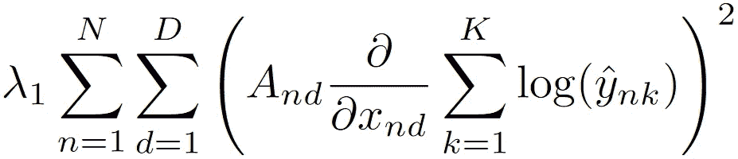
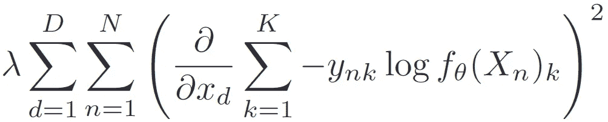

# 输入梯度正则化的许多用途

> 原文：<https://towardsdatascience.com/the-many-uses-of-input-gradient-regularization-e2af244e6950?source=collection_archive---------24----------------------->

## 将这一通用的概念添加到您的深度学习工具带中，以实现对抗鲁棒性、输入稀疏性、更好的泛化能力等

菲利普·斯温伯恩在 [Unsplash](https://unsplash.com?utm_source=medium&utm_medium=referral) 上拍摄的照片

*正则化*是机器学习的基本技术之一。这个想法是，我们对理想模型的结构做出假设，并修改我们的训练过程，以鼓励产生满足这些期望的模型。通常，正则项是损失函数的一部分。也许机器学习中最常见的正则化是模型权重上的 L1 范数(假设:稀疏权重)和 L2 范数(假设:小权重)，分别导致套索和岭回归。相对较新的是 [dropout](http://jmlr.org/papers/volume15/srivastava14a.old/srivastava14a.pdf) 的概念，我们喜欢网络中的冗余。

在这篇文章中，我讨论正则化的输入梯度。具体来说，这意味着对输入的梯度如何表征 *x* wrt 施加一些结构约束。我们的损失函数表现为。自然，这种技术只能应用于训练完全可微分的模型，如神经网络。

对输入梯度施加约束的想法确实很古老，但似乎只是在最近几年才受到重视。为了理解它的有用性，我们需要理解输入梯度的*的含义*。直观地说，输入梯度告诉我们，在非常小的输入扰动下，模型损耗如何变化。输入梯度是输入空间中导致局部损耗变化最大的方向。

这个特性使它成为许多可解释的 ML 技术的核心，试图用输入来解释输出。(例如，参见[综合梯度](https://arxiv.org/abs/1703.01365)、[显著图](https://arxiv.org/abs/1312.6034)、[迭代梯度](https://arxiv.org/abs/1704.03296v3)。)这个想法是，知道输入的哪一部分在小扰动下剧烈地改变输出，告诉我们什么输入对当前输出负责。

从广义上来说，输入梯度告诉我们网络*关注的是*。因此，调整输入梯度给了我们改变模型看世界方式的能力。

# 引导网络注意力

限制输入梯度的最自然的方法是告诉模型哪些输入区域是重要的，哪些是要忽略的。 [Ross 等人](https://arxiv.org/abs/1703.03717)实现了一个简单的惩罚，阻止神经网络查看输入的某些部分。

要添加到损失中的惩罚条款。a 是要惩罚的掩码。它适用于损耗 wrt 的梯度。 *x* 。存在 D 维的 N 个数据点，导致 K 维输出 *y* 。

在图像处理应用中，通过训练网络仅关注前景对象并在背景元素上具有零梯度，可以潜在地避免噪声或虚假相关。

如果成功应用，这种正则化可能会提高泛化能力(忽略虚假的相关性)并加快学习速度(仅使用输入的重要部分)。

# 对抗鲁棒性

另一个有趣的应用是使用输入正则化实现对抗鲁棒性。[已经证明](https://www.aaai.org/ocs/index.php/AAAI/AAAI18/paper/view/17337/15866)输入梯度的 L2 正则化可以避免输入上的大梯度——这正是使网络容易受到敌对攻击的原因。

这个正则化项与前一个相似，但没有应用掩膜，交叉熵损失项的表达方式也不同。

人们可以认为这个正则化器改变了网络对输入的感知，使得它必须稍微注意许多特征，而不是大量依赖少数特征。从这个意义上说，这种正规化与辍学有着相似的动机。

有趣的是，为输入梯度正则化网络创建的对抗性攻击可以成功地转移到在相同数据集上训练的其他网络。这使得这个简单的正则化器不仅是一个防御工具，还可能在不知道目标网络的情况下制造攻击。

# 输入稀疏度

在查看了 L2 正则化在输入梯度上的用途之后，探索 L1 正则化的效用是很自然的。幸运的是，[这已经为我们完成了](https://asross.github.io/publications/RossLageDoshiVelez2017.pdf)。事实上，使用 L1 规范改变了网络对数据的感知，使得它在任何时候都只认为很少的输入是相关的。

当获取特征的成本很高，并且人们更喜欢仅使用少量特征的模型时，这可能是有用的。或许，它也可以用作分析特征相关性的分析工具，类似于传统的神经注意机制。

正则化方法的优点是简单。您可以轻松地将输入梯度正则化应用于任何网络(但需要一些计算成本)。

希望你学到了有用的东西！