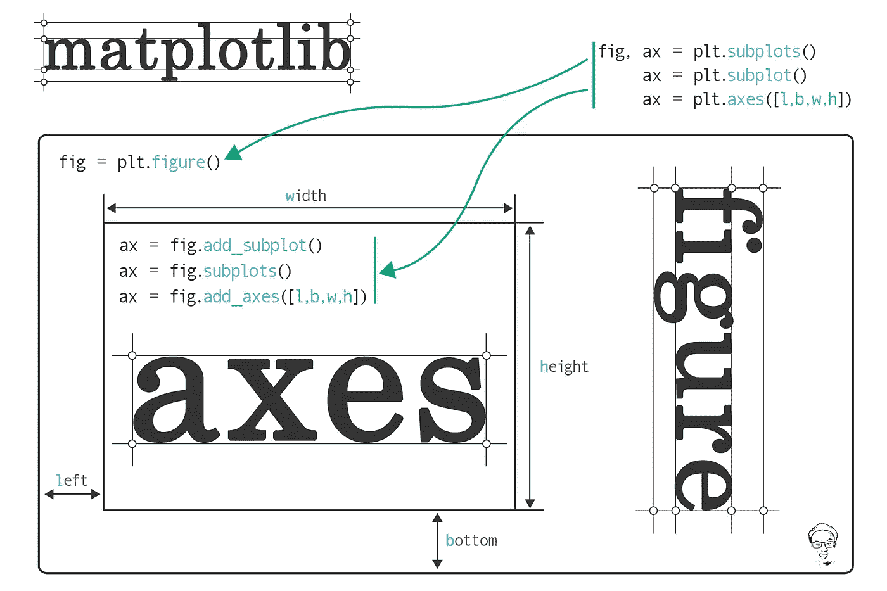
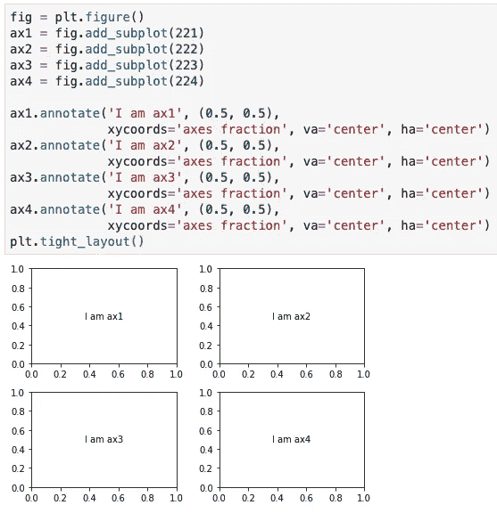
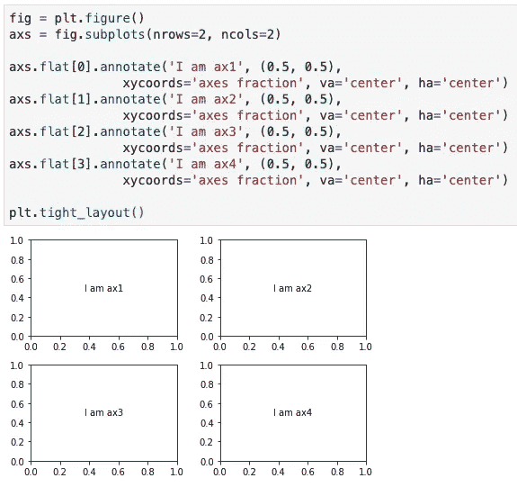
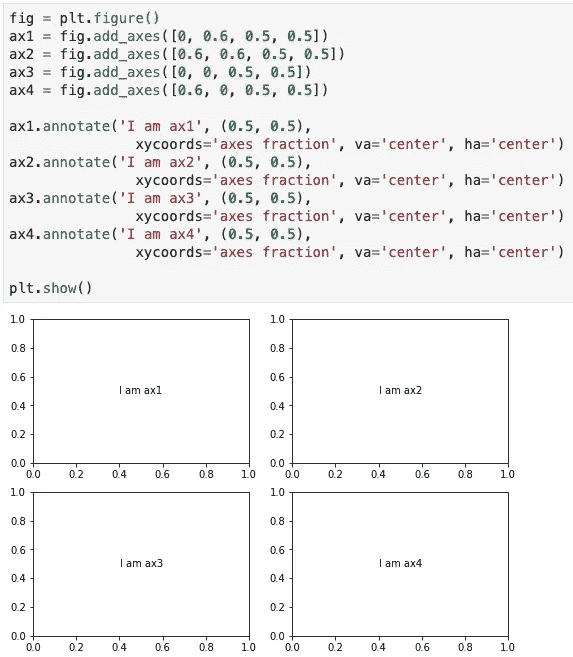

# Matplotlib 中调用轴的多种方法

> 原文：<https://towardsdatascience.com/the-many-ways-to-call-axes-in-matplotlib-2667a7b06e06?source=collection_archive---------6----------------------->



Jun 的总结图

## 学习 matplotlib 的初学者笔记

答虽然`matplotlib`非常强大，唯一的限制可能是我们的想象力，但对于新用户来说，找到正确的路径有点挑战性，因为在`matplotlib`中总是有不止一种方法来实现相同的目标。打电话给`axes`就是其中之一。

假设你只是决定使用`matplotlib`中的**面向对象接口** ( *又名* [*美工图层绘制*](/plt-xxx-or-ax-xxx-that-is-the-question-in-matplotlib-8580acf42f44) )进行绘制。然而，我敢打赌，当你试图实例化`axes`来开始你的绘图时，你很快就会遇到问题。你可能会发现`plt.subplots()`和`plt.subplot()`都可以还你`axes`。是的，它们只有一个字母“s”不同。稍后，您会注意到`plt.axes()`也可以调用`axes`。这还没有结束，你很可能会遇到下面的函数`fig.add_subplot()`、`fig.add_axes()`、`fig.subplots()`，它们都可以为你创建`axes`。我完全理解你有多惊慌，因为我在学习`matplotlib`时也有同样的困惑。

在这篇文章中，我将总结这些函数(*即* `*plt.subplot()*` *，* `*plt.subplots()*` *，* `*plt.axes()*` *，* `*fig.add_subplot(),*` `*fig.subplots()*` *，* `*fig.add_axes()*`)的区别，并演示如何相应地使用它们。

在`matplotlib`术语中，一个基本情节从一个`figure`和至少一个`axes`开始(*如果你对这些术语感到困惑，你可能会发现* [*这个帖子*](/plt-xxx-or-ax-xxx-that-is-the-question-in-matplotlib-8580acf42f44) *是有用的*)。与绘画非常相似，`figure`是画布，`axes`是艺术构图。一幅画布(`*figure*`)上可以只有一种类型，也可以有多种不同类型的艺术构图(`*axes*`)。有鉴于此，让我们首先从只有一个`axes`的`figure`的简单案例开始，然后深入到有多个`axes`的`figure`。

## `Figure`只有一个`axes`

在大多数情况下，我们通过调用`fig = plt.figure(…)`实例化一个`fig`对象，然后通过调用`ax = fig.add_subplot()`将一个`axes`对象添加到`fig`中。默认情况下，如果将括号留空，该函数通过`fig.add_subplot(1, 1, 1)`传递，这意味着在 1 行 1 列`axes`网格中添加# 1 `axes`。我们也可以使用一种没有逗号的三位数整数格式(*即* `*fig.add_subplot(111)*`)。但是，对于 3 位整数格式，每个整数都不能大于 9。使用此功能，我们一次只添加一个`axes`。

```
# *Create a figure*
fig = plt.figure()# *Add a subplot*
ax = fig.add_subplot()

*# Equivalent method*
ax = fig.add_subplot(111)# *Another equivalent but more general method*
ax = fig.add_subplot(1, 1, 1)
```

有时，我们能够使用`ax = fig.subplots()`添加一个`axes`对象。这个功能最初是为了方便通过单次调用在**普通布局**中创建一组支线剧情。它将`nrows`和`ncols`作为位置参数(*，即该函数应该一次添加多个*`*axes*`*)。然而，如果我们将括号留空，默认情况下该函数通过`fig.subplots(1, 1)`传递，这意味着创建一个 1 行 1 列的`axes`网格(*即一个* `*axes*` *在* `*fig*`上)。因此`axes`中只包含一项(*即* `*len(ax)*` *为 1* )。*

```
*# *Create a figure*
fig = plt.figure()

*# Create a subplot*
ax = fig.subplots()*# Equivalent method*
ax = fig.subplots(1, 1)*
```

*很少，对于有一个情节的`figure`，我们也可以使用`ax = fig.add_axes([left, bottom, width, height])`在`fig`上添加一个`axes`。该功能通过获取新`axes`的尺寸(*你可以在这里* 找到一个 [*的例子)来启用`fig`上`axes`的**任意布局。所有四个数字都应该是`figure`宽度和高度的分数。换句话说，我们控制`axes`的位置和大小。`fig.add_axes([0, 0, 0.78, 0.78])`创建与`fig.add_subplot(111)`和`fig.subplots(1, 1)`相同大小的地块。正如你在这里看到的，`axes`和`figure`大小不一样。默认情况下`axes`和`figure`之间有空格。***](/plt-xxx-or-ax-xxx-that-is-the-question-in-matplotlib-8580acf42f44)*

```
*# *Create a figure*
fig = plt.figure()*# Add a subplot* ax = fig.add_axes([0, 0, 0.78, 0.78])*
```

*在演示了以上三个函数的区别之后，理解`plt.subplot()`、`plt.subplots()`、`plt.axes()`就相当容易了。它们来自`matplotlib`的**基于状态的接口** ( *又名脚本层标绘*)，只是将`fig = plt.figure()`对应的包装了`fig.add_subplot()`、`fig.subplots()`、`fig.add_axes()`。*

*`plt.subplot()`只返回一个`axes`并自动创建一个`figure`对象。您可以通过调用`ax.figure.xxx()`来更改`figure`级属性或保存`figure`。例如，`ax.figure.savefig('example.png')`会将`figure`保存为`example.png`。*

```
**# Creates just a figure and only one subplot*
ax = plt.subplot()# *Equivalent method* fig = plt.figure()
ax = fig.add_subplot(1, 1, 1)*
```

*`plt.subplots()`返回包含图形和轴对象的元组。我们需要解包这个元组，并将它的项分别分配给变量`fig`和`ax`。*

```
**# Creates just a figure and only one subplot*
fig, ax = plt.subplots()# *Equivalent method* fig = plt.figure()
ax = fig.subplots(1, 1)*
```

*当没有提供参数时，`plt.axes()`使用`fig.add_subplot(1, 1, 1)`返回一个`axes`，就像`plt.subplot()`一样，它自动创建一个`figure`对象。`plt.axes()`也在其后端使用`fig.add_axes([left, bottom, width, height])`接受尺寸(`*[left, bottom, width, height]*`)。以下两组代码创建了相同的绘图。*

```
*# ***Set one***
*# Creates just a figure and only one subplot*
ax = plt.axes()# *Equivalent method* fig = plt.figure()
ax = fig.add_subplot(1, 1, 1)-------------------------------------------# ***Set two***
*# Creates just a figure and only one subplot*
ax = plt.axes([0, 0, 0.78, 0.78])# *Equivalent method* fig = plt.figure()ax = fig.add_axes([0, 0, 0.78, 0.78])*
```

## *`Figure`带多个`axes`*

*当在`figure`上绘制多个`axes`时，这些函数(*即* `*plt.subplot()*` *，* `*plt.subplots()*` *，* `*plt.axes()*` *，* `*fig.add_subplot()*` *，* `*fig.subplots()*` *，* `*fig.add_axes()*`)之间的区别就显而易见了。同样，让我们用例子来证明这一点。由于`plt.subplot()`、`plt.subplots()`和`plt.axes()`与`fig.add_subplot()`、`fig.subplots()`和`fig.add_axes()`本质上是相同的，因此我将只展示后三种功能的示例。*

*如上所述，我们在使用`fig.add_subplot()`时，一次增加一个`axes`。`axes`的内置顺序是在`axes`网格内从左到右、从上到下开始(图 1)。*

**

***图一。** fig.add_subplot()创建一个 2×2 轴网格*

*用一行代码使用`fig.subplots()`可以获得相同的布局(图 2)。它返回一个`ndarray`对象`axs` ( *我在* `*ax*` *后面加了一个‘s’表示它包含多个对象*)。就像 2D 数组对象一样，`axs`中的每个`ax`也可以使用`axs[x, y]`来访问(*即 ax1 可以使用 axs[0，0]* 来访问)。而且，如果你喜欢在`axs`内给每个`ax`赋值，可以这样使用 tuple 解包，`((ax1, ax2), (ax3, ax4)) = fig.subplots(nrows=2, ncols=2)`。2D 数组的展平是从`axs`访问`ax`的另一种方法，如图 2 所示。*

**

***图 2** 创建一个 2×2 轴的网格*

*通常，`fig.add_axes()`用于任意布局，例如入口支线剧情或支线剧情相互重叠的剧情。这是因为我们可以通过尺寸来微调每个子情节的位置和大小(`*[left, bottom, width, height]*`)。话虽如此，我们仍然可以使用`fig.add_axes()`(图 3)做出如图 1 和图 2 所示的普通布局。*

**

***图 3** 。创建一个 2×2 轴的网格*

*综上所述，这六个函数(*简而言之应该是三个函数，即*`*fig.add_subplot(),*`*`*fig.subplots()*`*`*fig.add_axes()*`)在你用一个`axes`做一个`figure`的时候可以互换使用。然而，它们有各自的优势，在制作不同布局的多个`axes`的`figure`时，可以单独使用或组合使用。***

**看完这篇帖子，希望你对`matplotlib`中如何调用`axes`有更清晰的认识。这篇文章中的所有代码都可以从这个 [jupyter 笔记本](https://github.com/Perishleaf/data-visualisation-scripts/blob/master/matplotlib_init_fig_ax/matplotlib_init_fig_ax.ipynb)中访问。如果您知道此处未列出的其他可调用`axes`的功能/案例，请随时留下您的评论。让我们一起来学习`matplotlib`。**

**和往常一样，我欢迎反馈、建设性的批评以及倾听您的数据科学项目。你可以在 Linkedin 和我的网站上找到我。**