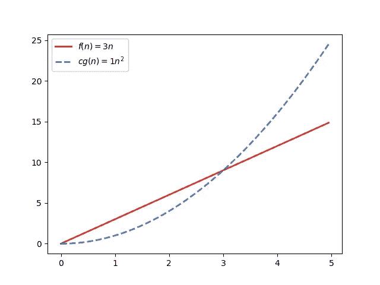
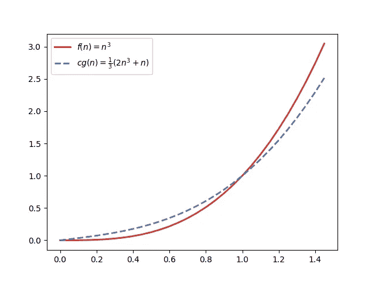
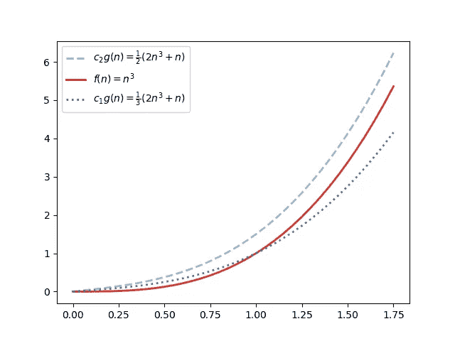

# “大 O”和其他渐近符号背后的数学

> 原文：<https://towardsdatascience.com/the-math-behind-big-o-and-other-asymptotic-notations-64487889f33f?source=collection_archive---------17----------------------->

## 像“大 O”、“大ω”和“大θ”这样的符号的正式定义。

舒巴姆·莎兰在 [Unsplash](https://unsplash.com/?utm_source=unsplash&utm_medium=referral&utm_content=creditCopyText) 上拍摄的照片。

***大 O*** (读作“大 oh”)是计算机科学中广泛使用的一种数学符号，用于描述算法的效率，无论是计算时间还是内存空间。这个和其他所谓的*渐近符号*的主要目的是通过比较它们的“增长顺序”来描述数学函数的行为。

在这篇文章中，我首先简要介绍了大 O 符号在实践中是如何用来描述算法效率的。后来，我提出了它的数学定义，以及其他类似的符号，如“大ω”(ω)和“大θ”(θ)。此外，我还提供了一些正式的方法，您可以使用这些方法根据这些定义对数学函数进行分类。

# 简而言之就是“大 O”

*注意:如果你习惯于和算法打交道，你可能以前用过或见过大 O 符号。如果您认为您已经对大 O 的含义以及如何用它来描述算法的效率有了大致的了解，那么您可以跳到下一节，在那里您将找到大 O 和其他类似符号的数学定义。*

大 O 符号通常用于将算法分成几个*基本效率类*，比如*O(log(n)】*、 *O(n)* 、 *O(n*log(n))* 、 *O(n )* 等等。我们说一个标准的[线性搜索](https://www.geeksforgeeks.org/linear-search/)算法*在 O(n)* 中运行，因为它的运行时间预计会随着它的输入大小线性增加。同样，我们知道[二进制搜索](https://www.geeksforgeeks.org/binary-search/)是 *O(log(n))* ，最高效的[排序算法](https://www.geeksforgeeks.org/sorting-algorithms/)可以运行在 *O(n*log(n))* 。

然而，说一个算法是 *O(n )* 并不意味着它对给定大小为 *n* 的输入执行精确的 *n* 运算。假设算法 A 总是执行 *f(n)=2n +n+1* 运算。人们通常对这个函数做的是去掉它的非支配项(像+ *n* 和+ *1* )和它的常数(像 *2n* 中的 *2* )得到它的渐近符号 *O(n )* 。如果有一个算法 B 总是执行 *f(n)=4n +3n+3* 运算，也可以描述为 *O(n )* ，虽然它对 *n* 的任意值执行的运算都是算法 A 的两倍以上。

但这并没有错。当我们使用像大 O 这样的渐近符号时，我们感兴趣的是比较增长的顺序，而不是关心精确的数字。此分析的主要目的是描述算法所需的运行时间或内存空间如何根据输入大小 *n* 增加，尤其是当 *n* 相当大时。

如果一个算法是 *O(n)，*这意味着如果我们将输入大小加倍，那么执行的操作数将是*大约*的四倍。通过将 *n=100* 增加到 *n=200* ，算法 A 执行的运算次数将从 20，101 次增加到 80，201 次，而算法 B 的运算次数将从 40，303 次增加到 160，603 次。每个算法执行的操作数大约乘以*4(尽管不精确)。*

另一方面，算法是 *O(2ⁿ)* 或 *O(n！)*具有高得多的增长阶数，甚至对于 *n* 的小值也可以注意到这一点。例如，简单地从 *n=10* 到 *n=20* 将导致 *O(2ⁿ)* 算法多执行大约 1024 次运算。而且，对于一个 *O(n！)*算法*，*这将意味着比以前多 6700 亿次运算。

# 渐近符号的形式定义

如果您不太熟悉大 O 符号，我希望上面的快速介绍足以让您大致了解像大 O 这样的渐近符号是如何工作的，以及为什么在评估算法效率时应用这种形式主义如此有意义。如果你觉得你仍然没有完全理解这个概念，也许你应该在进入这篇文章将要讨论的更复杂的数学定义之前，查看其他有额外例子的文章([像这个](/understanding-time-complexity-with-python-examples-2bda6e8158a7))。

在下文中，我将更深入地探讨 O 在数学上是如何定义的。我还将介绍一些其他类似的渐近符号，它们也在计算机科学中用于评估算法的效率。

## 大 O:上限

到目前为止，我一直以最常用的方式使用大 O 符号:作为对算法效率的精确描述。然而，这在技术上是不正确的——正如我将在下面展示的，大 O 只提供了一种表示*上限的方法。*所以请记住，从现在开始，我将根据*对*的数学定义来称呼大 O，而不是通常在实践中使用的*。(如果你有兴趣对这个非常普遍的误解进行更深入的讨论，可以查看[我之前的这篇文章](https://levelup.gitconnected.com/what-big-o-really-means-e5f15044c9d2)。)*

*非正式地说， *O(g(n))* 可以理解为包含所有不**比 *g(n)* 增长更快的*数学函数集合*。例如， *O(n )* 是包含 *n +3n* 、 *3n* 、 *n* 、 *log(n)* 以及其他无限个当 *n → ∞* 时增长速度不超过 *f(n)=n* 的函数的集合。***

**现在，这里是大 O 的正式定义:**

> **f(n)∈ O(g(n)) *当且仅当存在某个正常数* c *和某个非负整数* nₒ *使得* f(n) ≤ cg(n) *对于所有* n ≥ nₒ.**

**例如，让我们检查一下 *3n∈ O(n )* 。取 *c=1* 并绘制函数 *f(n)=3n* 和 *cg(n)=1n* ，我们可以看到两者相交于 *nₒ* =3:**

****

**绘图 *f(n)=3n* 和 *cg(n)=1n* 。请注意 n∈ℕ，但为了清晰起见，我将功能域标为ℝ。用 Matplotlib 创建。**

**看图我们不难看出，对于所有的 *n≥3* 来说 *3n ≤ 1n* 。但这还不够，因为我们需要实际上*证明*这一点。我们可以用[数学归纳法](https://www.mathsisfun.com/algebra/mathematical-induction.html)来做。事情是这样的:**

1.  **我们需要一个基础案例 *nₒ* ，我们知道 *f(nₒ) ≤ cg(nₒ)* 。但是我们已经有一个了，因为我们知道我们可以使用 nₒ=3。**
2.  **然后我们假设对于给定的 *n≥nₒ* ，f(n)≤cg(n) 。在我们的例子中，我们假设对于给定的 *n≥3* ，3n ≤ 1n 。**
3.  **现在我们需要证明，如果 *f(n)≤cg(n)* ，那么 *f(n+1) ≤ cg(n+1)* 。在我们的例子中，我们需要证明如果我们上面的假设(2)成立，那么 *3(n+1) ≤ (n+1)* 也成立。这也可以写成 *3n+3 ≤ n + 2n + 1* 。但是，由于我们从(2)中已经知道 *3n ≤ n* ，我们可以从不等式的左边减去 *3n* ，从右边减去 *n* ，而不影响它的关系。这就给了我们 *3 ≤ 2n+1* 。我们知道 *n≥3* ，只要(2)成立，这个不等式就永远成立。这就完成了对于所有的 *n≥3，*以及*3n∈O(n)*3n≤1n*的证明。***

*注意:对于两个给定的函数 *f(n)* 和 *g(n)* ，有一个更方便的方法来检查 *f(n)∈ O(g(n))* 。这将在本文中进一步讨论，在我们完成介绍一些其他渐近函数的正式定义之后。*

***大ω(ω):下界***

****大ω***的定义方式与大 O 类似，只不过它代表的是下界而不是上界。因此，它的形式定义只是颠倒了 *f(n)* 和 *cg(n)之间的关系。*换句话说，“≤”变成了“≥”:*

> *f(n)∈ω(g(n))*当且仅当存在某个正常数* c *和某个非负整数* nₒ *使得* f(n)≥cg(n) *对于所有* n ≥ nₒ.*

*举个例子，考虑*n∈ω(2n+n)*。为了证明这种说法，你可以试试 *c=1/3* 和 *n=1* ，使用如上所述的归纳法。这是一个图形表示:*

**

*绘图 *f(n)=n* 和 *cg(n)=(1/3)(2n +n)* 。用 Matplotlib 创建。*

***大θ(θ):紧界***

****位θ***用于表示函数的紧界。说*f(n)∈θ(g(n))*是指 *f(n)* 与 *g(n)有*恰好* *相同的*增长顺序。**

*基本上，大θ是大 O 和大ω的交集。基于这一事实，这里有两个关于大θ的简单定义:*

> *1)f(n)∈θ(g(n))*当且仅当* f(n) ∈ O(g(n)) *和*f(n)∈ω(g(n))。*
> 
> **2)*θ(g(n))= o(g(n))⋂ω(g(n))。*

*但是，大θ也可以定义为类似于我们如何定义大 O 和大ω，通过将两个定义合并在一起:*

> *f(n)∈θ(g(n))*当且仅当存在一些正常数* *c* ₁ *和* c₂ *和一些非负整数* nₒ *使得 c*₁*g(n)≤*f(n)≤c₂g(n)*对于所有* n ≥ nₒ.*

*就像我们对大ω做的一样，我们也可以证明*n∈θ(2n+n)。*为此，考虑 *c₁=1/3* 、 *c₂=1/2* 和 *nₒ=1* :*

**

*绘图*c*₂*g(n)=(1/2)(2n+n)，f(n)=n* ，以及*c*₁*g(n)=(1/3)(2n+n)*。用 Matplotlib 创建。*

## *小ω(ω)和小 O (o):松边界*

*没错，渐近符号并不总是很大。还有这两个*小*记法: ***小ω***(ω)和 ***小 O*** (o)。它们没有大的用得多，但是为了完整起见，我喜欢提到它们。*

*这两种符号用于表示不“紧”的下限或上限。更具体地说， *ω(g(n))* 包括所有在*ω(g(n))*中但不在*θ(g(n))*中的函数。形式上，*ω(g(n))=ω(g(n))–θ(g(n))*。同样，*O(g(n))= O(g(n))–θ(g(n))。**

*比如 *n ∈ o(n )* ，但是 *n ∉ o(n )* 。*

*以下是这两个小符号的正式定义:*

> *f(n)∈ o(g(n)) *当且仅当存在一个非负整数* nₒ *使得* f(n)≤cg(n) *对于所有* n ≥ nₒ *和对于***任何一个正常数* c**
> 
> **f(n)∈ ω(g(n)) *当且仅当存在一个非负整数* nₒ *使得* f(n)≥cg(n) *对于所有* n ≥ nₒ *和对于* ***任何*** *正常数***c****

****你看出区别了吗？虽然对于大ω和大 O 来说， *c* 的单个值就足够了，但是小ω和小 O 要求属性对于*c*的任何值都有效。****

# ****使用极限比较两个函数****

****在上面的例子中，我已经展示了如何使用数学归纳法来证明对于任意两个函数 *f(n)* 和 *g(n)】，是否*f(n)∈O(g(n)】*。*但是有一个更方便的方法来系统地建立两个函数之间的比较，当涉及到它们的增长顺序时*。*****

****为此，你需要计算当 *n → ∞时的极限 L = *lim(f(n)/g(n))* 。如果存在这样一个极限，当比较 *f(n)* 和 *g(n)* 时，它的值马上告诉你哪个渐近符号是有效的:*****

1.  ****如果 *L=0* ，那么 *f(n)∈ O(g(n))* 和 *f(n)∈ o(g(n))* 。****
2.  ****如果 *L → ∞* ，那么*f(n)∈ω(g(n))*和 *f(n)∈* ω *(g(n))* 。****
3.  ****对于 *L* 的其他常数值，则*f(n)∈θ(g(n))*。****

****作为例子，再考虑一下 *f(n)=n* 和 *g(n)=2n +n.* 对于这些函数，你会发现 L=1/2，也就是说*n∈θ(2n+n)。(*但是注意，根据定义，它也意味着*n∈ω(2n+n)*和 *n ∈ O(2n +n)。)*****

# ****最后的想法****

****为了使用像大 O 这样的渐近符号，你并不需要对它们背后的数学有深入的理解。然而，知道它们的含义和定义可能是有用的，特别是当两个函数之间的关系不是很明显的时候。*θ(log(n))*比*θ(√n)*快吗？ *O(2ⁿ)* 和 *O(3ⁿ)* 一样吗？ω*(log₂(n))**ω(ln(n))*呢？现在你知道了这些符号是如何被数学定义的，你可以试着自己去寻找这类问题的答案。****

# ****参考****

*   ****[Anany Levitin 的设计介绍&算法分析](https://www.amazon.com/gp/product/0201743957/ref=as_li_tl?ie=UTF8&tag=chaulio0b-20&camp=1789&creative=9325&linkCode=as2&creativeASIN=0201743957&linkId=aff0d43922d6a31ae64de969b8441371)。****

*****披露:这篇文章包含一个或多个亚马逊服务有限责任公司协会项目的链接。作为代销商，我从通过这些链接购买的商品中获得佣金，客户无需支付额外费用。*****

# ****相关文章****

**** [## “大 O”的真正含义是什么

### 大多数时候，大 O 符号的用法都有点不正确。

levelup.gitconnected.com](https://levelup.gitconnected.com/what-big-o-really-means-e5f15044c9d2)  [## C/C++中测量执行时间的 8 种方法

### 不幸的是，没有放之四海而皆准的解决方案。在这里你会找到一些可用的选项。

levelup.gitconnected.com](https://levelup.gitconnected.com/8-ways-to-measure-execution-time-in-c-c-48634458d0f9)  [## 通过 Python 示例理解时间复杂性

### 如今，面对我们每天消耗和生成的所有这些数据，算法必须足够好才能处理…

towardsdatascience.com](/understanding-time-complexity-with-python-examples-2bda6e8158a7)****