# Deepfakes 背后的数学

> 原文：<https://towardsdatascience.com/the-math-behind-deepfakes-b9ef8621541f?source=collection_archive---------22----------------------->

由 [Unsplash](https://unsplash.com/?utm_source=unsplash&utm_medium=referral&utm_content=creditCopyText) 上的 [Pietro Jeng](https://unsplash.com/@pietrozj?utm_source=unsplash&utm_medium=referral&utm_content=creditCopyText) 拍摄

## 入门指南

## GANs 概述

虽然许多人都熟悉 deepfakes 产生的令人难以置信的结果，但大多数人都很难理解 deepfakes 实际上是如何工作的。希望这篇文章能揭开创造一个 deepfake 的一些数学秘密。

> **Deepfake** 通常指的是一个人(通常是公众人物)的面部和/或声音被人工智能软件处理过的视频，这种处理方式使修改后的视频看起来真实可信。
> —[*Dictionary.com*](https://www.dictionary.com/e/tech-science/deepfake/)

事实证明，deepfake 是一个笼统的术语，没有明确的创建方式。然而，大多数 deepfakes 都是用一个深度学习框架创建的，该框架被称为生成式对抗网络，或 GANs，因此这将是本文的主要焦点。

# *什么是甘？*

**生成对抗网络**——简称 GANs 是一种深度学习模型，由 Ian Goodfellow 和他的同事在 2014 年的一篇论文中首次提出。该模型通过在对抗游戏中同时训练两个神经网络来运行。

抽象地说，我们会有生成模型 *G* ，即试图学习复制数据集分布 *p_data* 的分布 *p_g* ，而判别模型 *D* 试图确定一段数据是来自数据集还是来自生成器*。虽然第一次看到这一点可能会感到害怕，但当看到一个例子时，这个数学变得相对简单。*

传统上，GANs 是用制造假币的类比来解释的。为了建立这种情况，有一个伪造者组织试图制造假币，而警方则试图检测货币是否是伪造的。在这里，我们的伪造者可以被视为生产假币的生成模型 *G* 与分布 *p_g* 。分布本质上是描述货币特征的特征“地图”。基本上，伪造者生产的货币具有分布 *p_g* 所描述的一些特征。此外，警察的角色是鉴别真假货币，所以他们扮演鉴别模型的角色。在实际中，这些模型往往是**多层感知器**，但在只讨论理论时不需要指定神经网络的类型。

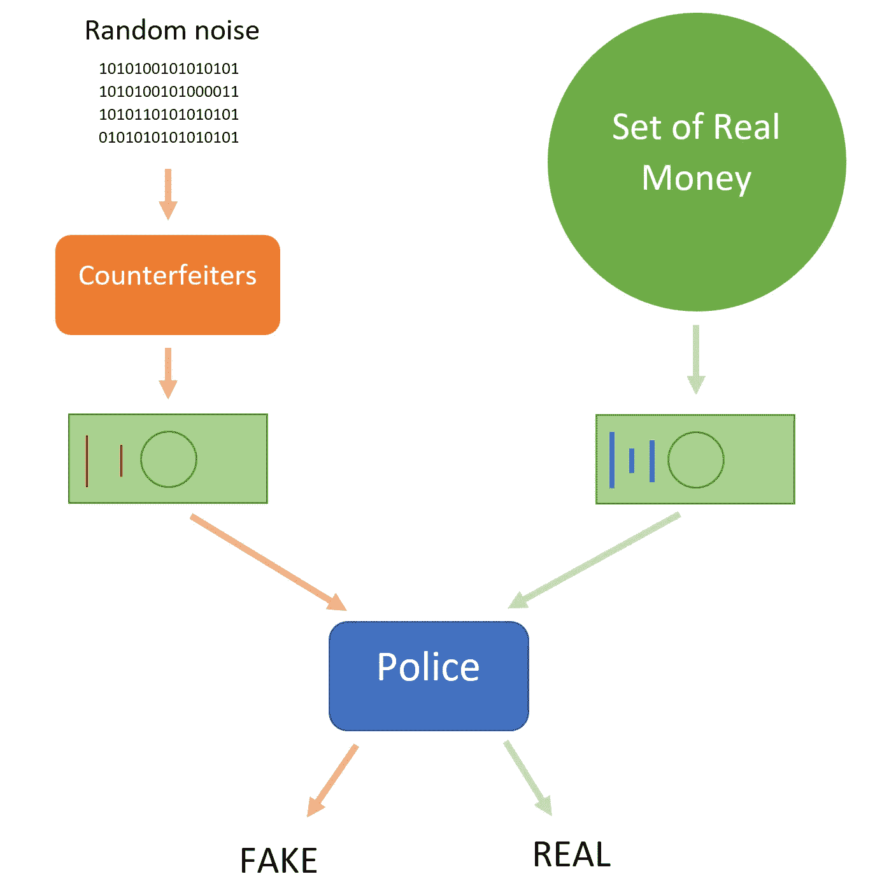

这是我们示例场景的设置

最初，伪造者生产的货币可能有许多缺陷，因此警察可以很容易地检测到货币是由伪造者生产的；换句话说，警察知道钱什么时候来自分配 *p_g* 。随着时间的推移，警察和伪造者都变得更加精通他们的工作。对于伪造者来说，这意味着他们生产的货币将更像真钱；从数学上讲，当假币的分布 *p_g* 接近真币的分布 *p_data* 时，就会出现这种情况。另一方面，警方在检测金钱是否来自 *p_data* 或 *p_g* 方面变得更加准确。然而，伪造者最终会达到一个地步，即假币可以冒充真币，骗过警察。当分布 *p_g* 和 *p_data* 相同时会出现这种情况；简单地说，假币的特征与真币的特征相匹配。事实证明，这种“距离”的度量可以用多种方法计算，每种方法的工作方式略有不同。有了这些知识，我们可以为造假者设定一个目标:学习分布 *p_g* ，使其等于数据 *p_data* 的分布。同样，我们给警察定了一个目标:最大限度地提高检测假币的准确率。

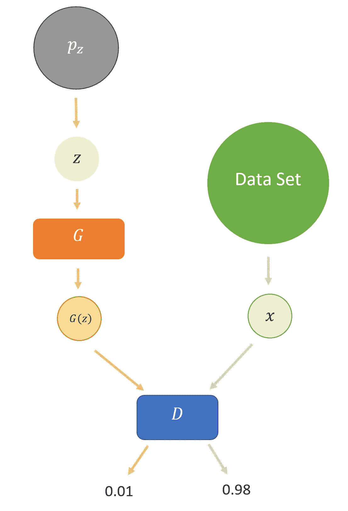

对于这个例子来说，这是一个稍微正式的设置

到目前为止，我们在很大程度上忽略了这些模型如何实际操作的细节，所以我们将从描述发电机 *G* 开始。回到上一个伪造货币的例子，我们的生成器需要接收一些输入，指定正在创建的货币类型。这意味着对应于创建一美元钞票的输入将不同于对应于创建十美元钞票的输入。为了一致性，我们将使用来自分布 *p_z* 的变量 *z* 来定义这个输入。分布图 *p_z* 给出了哪种货币可以被伪造的大致概念。此外，发电机的输出表示为 *G* ( *z* )，可以用分布 *p_g* 来描述。把我们的焦点转移到鉴别器上，我们从检查它所扮演的角色开始。也就是说，我们的鉴别器应该告诉我们一些数据是来自我们的数据集还是来自生成器。原来概率完全适合这个！具体来说，当我们的鉴别器接受一些输入 *x* ， *D* ( *x* )应该返回一个介于 0 和 1 之间的数字，表示 *x* 来自数据集的概率。为了了解为什么我们的鉴别器允许返回 0 到 1 之间的值，我们将检查我们的输入与数据集中的内容有些相似的情况。回到我们之前的例子，假设我们有一张一角有小划痕的美元和另一张印有普京头像的美元。毫无疑问，第二张钞票比第一张可疑得多，所以很容易被归类为假钞(discriminator 返回 0)。然而，我们的第一张钞票仍然有可能是真的，将它归类为 0 意味着它看起来和第二张钞票一样糟糕。显然，我们丢失了一些关于第一张钞票的信息，最好用 0.5 这样的数字对它进行分类，因为我们的鉴别者对它是真的有些怀疑，但不能确定它是假的。简而言之，我们的鉴别器返回一个数字，表示输入来自数据集的置信度。

## 推导误差函数

现在我们已经大致了解了我们的模型 *G* 和 *D* 应该做什么，我们仍然需要一种方法来评估它们的性能；这就是**误差函数**发挥作用的地方。基本上，误差函数 *E* 告诉我们，给定当前的一组参数，我们的模型表现有多差。例如，假设我们有一个被训练来识别各种物体的模型。如果我们向模型展示一辆自行车，而模型看到一辆三轮车，那么误差函数将返回一个相对较小的误差，因为这两者非常相似。然而，如果模型将自行车视为卡车或学校建筑，误差函数将返回更大的数字，因为它们之间几乎没有相似性。换句话说，如果我们的模型的预测与实际数据非常匹配，误差就很小，而当预测与实际数据完全不匹配时，误差就很大。

有了这些知识，我们开始设计误差函数应该具有的一些特性。首先，当我们的鉴别器对数据进行错误分类时，错误函数应该返回一个大的数字，而当数据被正确分类时，返回一个小的数字。为了理解这意味着什么，我们从定义**分类**开始。本质上，一个分类是一个数据的标签。例如，红知更鸟将被归入鸟类，而金枪鱼将被归入鱼类。在我们的例子中，鉴别器的输入可以来自两个地方，数据集或生成器。为了方便起见，我们将在后面看到，我们对来自生成器的数据进行分类，给它一个标签 0，而来自数据集的数据将被赋予标签 1。利用这一点，我们可以进一步阐述我们的误差函数。例如，假设我们有一些数据， *x* ，标签为 1。如果我们的鉴别器预测 *x* 来自数据集( *D* ( *x* )返回一个接近 1 的数字)，那么我们的鉴别器将会正确预测 *x* 的分类，并且误差将会很低。然而，如果我们的鉴别器预测 *x* 来自生成器( *D* ( *x* )返回一个接近于 0 的数字)，那么我们的鉴别器将会错误地对我们的数据进行分类，并且错误将会很高。

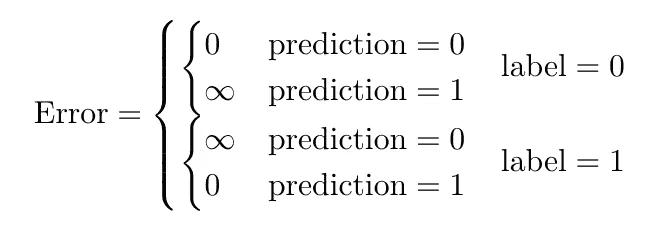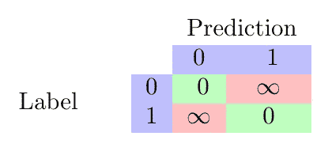

这代表了我们的误差函数应该如何表现

当我们寻找一个理想的函数时，我们注意到区间[0，1]上的图 *y* = log( *x* )经过一些处理后与我们的规范相匹配。

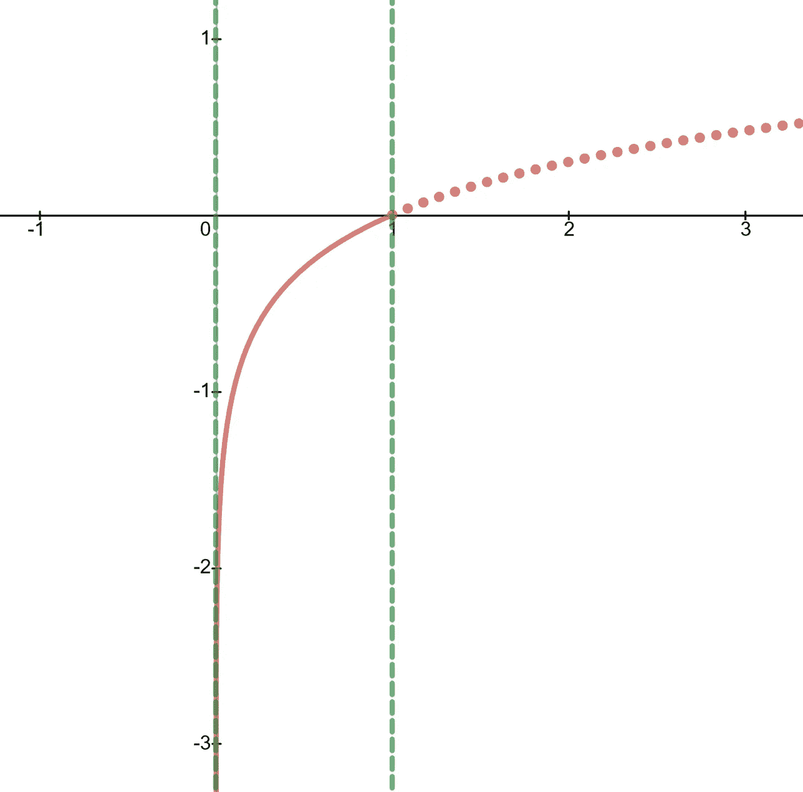

***y = log(x)***

特别是，围绕 *x* 轴翻转图形会产生误差函数，其中我们的标签为 1。通过线 *y* =0.5 反映这个新图形，然后揭示当我们的标签是 0 时的误差函数。这些的方程式分别是 *y* = -log( *x* )和 *y* = -log(1- *x* )，如下图所示。

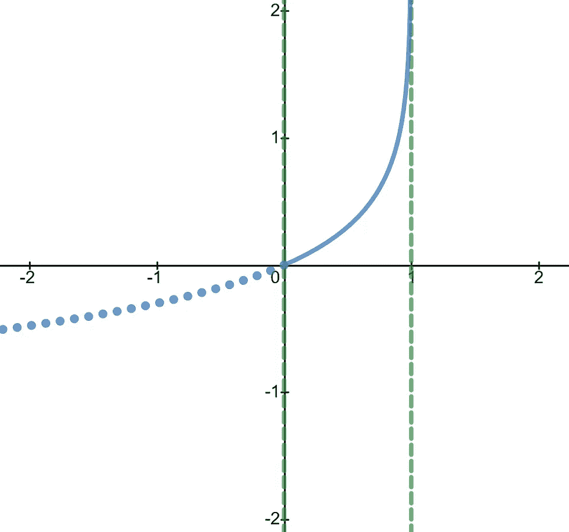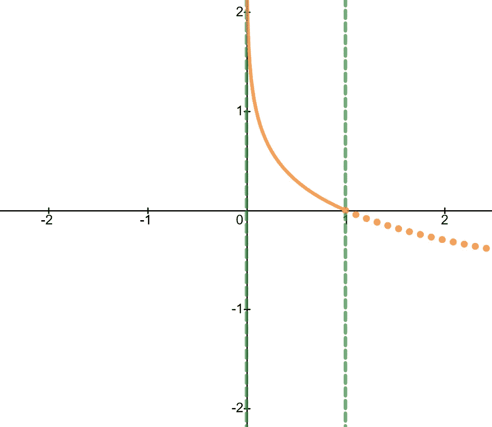

左侧**标签= 0** 右侧**标签= 1** 时的误差函数

将这两个函数放在一起，我们可以创建下面的“分段”函数。

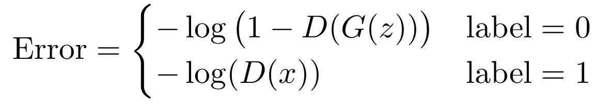

我们可以在 **label = 0** 时代入 **x = D(G(z))** ，在 **label = 1** 时代入 **x = D(x)** 。当 **label = 0 时，**我们正在评估我们的鉴别器在从生成器获取图像作为输入时的误差。当 **label = 1** 时，当我们的鉴别器从我们的数据集中取一些东西作为输入时，我们就找到了它的误差。

遗憾的是，这个公式写出来有点繁琐，所以想找个办法精简到一行。我们首先给我们的误差函数一个合适的名字，比如 *E* 。此外，我们还想创建一个变量来表示我们的标签，因为写出*标签*是低效的；我们将这个新变量称为 *y* 。这就是一点点天才发挥作用的地方。当我们不仅将 *y* 视为一个标签，还将其视为一个数字时，我们实际上可以将此公式简化为:

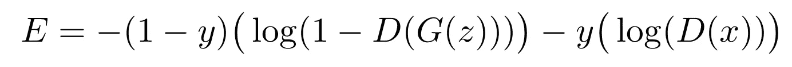

注意，当 *y* = 0(标号为 0)时，(1 - *y* )系数变为 1，而项*y*(log(*D*(*x*))变为 0。当 *y* = 1(标签为 1)时，类似的事情发生。第一项减少到 0，剩下-log( *D* ( *x* ))。事实证明，这些结果正好等于我们的“分段式”函数。另外，这个误差函数也被称为**二元交叉熵**。

需要注意的一点是，介绍 GANs 的论文使用了误差函数- *E* 。因此，为了与原论文保持一致，我们将误差函数重新定义为- *E* 。

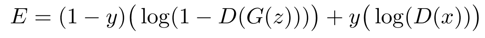

这是经过细微调整后的误差函数，以更好地代表伊恩·古德费勒论文中最初提出的内容

公式中的这一变化意味着不正确的预测(即— *y =* 0，但 *D* 输出 1)将导致误差为-∞，而不是∞。

## 应用误差函数

为 GAN 推导出合适的误差函数后，下一个合理的步骤是将其应用于当前设置。

这个过程的第一步是为我们的模型设定一些目标。本质上，我们的鉴别器， *D，*应该旨在正确地对其所有输入进行分类，而生成器， *G* 应该试图欺骗鉴别器，使其对尽可能多的数据进行错误分类。记住这两个目标，我们现在开始分析我们的误差函数的行为。很容易看出，误差函数达到最大值 0，这仅发生在鉴别器以 100%的置信度对所有事物进行完美分类时(使用我们的误差函数的定义，这一点尤其容易看出)。此外，我们的误差函数在-∞处达到最小值，这仅发生在鉴别器对其预测 100%有把握时，但总是错误的(如果 *D* ( *x* )为 0 但 *y* = 1，这可能发生)。

结合这两种见解，我们能够用数学公式表示两个模型 *G* 和 *D* 之间的竞争。也就是说， *G* 试图最小化我们的误差函数( *G* 希望误差为-∞)，而 *D* 试图最大化它( *D* 希望误差为 0)。这种对抗性竞争也被称为**迷你最大** **游戏**，其中模特 *G* 和 *D* 像玩家一样相互竞争。因此，我们发现调用 *E* a **值函数**， *V* ( *G* ， *D* )，其中 *G* 的目标是最小化 *V* ( *G* ， *D* )的值，而 *D* 的目标是最大化这可以用下面的表达式来描述:

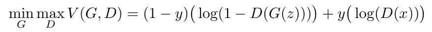

不幸的是，这个表达式还不完整；你看怎么改进？

然而，上面的公式有一个致命的缺陷:它一次只接受一个输入。为了提高这个函数的效用，最好让它计算所有数据的误差(包括数据集和生成器生成的所有数据)。在这种情况下，找到模型在整个数据集上的总误差变得更加有用。事实上，我们只需将每个输入的误差相加，就可以得到总误差。为了了解这将把我们引向何处，我们现在必须检查鉴别器的输入来自数据集的情况，以及输入来自生成器的情况。

当鉴别器的输入来自数据集时， *y* 将等于 1。这意味着数据的单个实例的值函数变成了 log( *D* ( *x* ))。因此，如果我们要找出数据集中每条数据的误差，这些数据条目的总误差将是数据中条目的数量乘以数据集中单个条目的误差。当然，这是假设数据集中每个条目的误差大致相同。此外，我们可以使用𝔼_(*x*∑*p _ data*)从数学上描述数据集中的数据条目数，其中𝔼代表期望值。本质上，该表达式返回分布 *p_data* 中条目的预期数量，该分布描述了我们的数据集。

类似地，当鉴别器的输入来自发生器时， *y* 将等于 0，因此值函数简化为 log(1-*D*(*G*(*z*))。因此，查找生成器生成的所有项目的总误差等于生成器生成的项目数乘以生成器生成的单个项目的误差(假设每个项目的误差大致相同)。我们再一次用𝔼_( *z* ∈ *p_z* 来表示生成器生产的物品数量。我们使用 *z* 代替的原因是，当鉴别器的输入来自发生器时，我们试图发现错误，发生器产生的项目由输入 *z* 定义。本质上，𝔼_( *z* ∈ *p_z* )让我们很好地了解了生成器生成的项目数量。

将我们最后的两个观点放在一起，我们可以得到一个合适的价值函数:

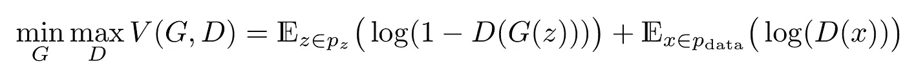

这也是 Goodfellow 原始论文中出现的价值函数

## 训练 GAN

回想一下我们培训的最终目标:生成器必须能够欺骗鉴别器。这意味着发生器的输出分布 *p_g* 必须等于数据集的分布 *p_data* 。然而，我们可能不希望 *p_g* 恰好等于 *p_data* 。要了解这是为什么，请考虑数据集中存在异常值的情况。如果我们训练我们的生成器产生具有精确分布 *p_data* 的输出，由于这些异常值，我们的生成器将不可避免地产生一些错误的输出。这就是为什么我们希望我们的分布大致相等。

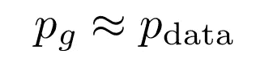

这是我们训练的最终目标

## 分布之间的距离

现在我们知道我们在训练过程中的目标是什么，我们仍然缺乏一种方法来严格定义两个分布相互近似意味着什么。这是数学提出了分布之间距离的概念。本质上，分布之间的距离给了我们两个分布之间相似程度的度量。下图很容易看出这一点。

事实证明，根据我们的距离函数是如何定义的，训练的结果会有所不同。这将在后续阅读中涉及。

## 勾画算法

有了对距离的粗略了解，我们现在有足够的知识来构建训练这些模型的算法框架(事实证明，不同的定义距离的方式会导致不同的结果，这在后续阅读中可以看到)。在其核心，我们的训练算法将依赖于**随机梯度下降**来更新模型参数(梯度下降将不在本文中讨论，因为有许多其他资源涉及该主题)。然而，训练 GAN 是独特的，因为算法必须在模型 *G* 和 *D* 之间交替。这是因为如果所有的焦点都放在训练鉴别器上， *D* 就会变得太善于阻止我们的生成器学习。此外，如果我们只专注于训练生成器， *D* 将无法正确学习，并且还会向生成器提供无用的反馈。因此，我们的算法将继续重复以下循环，直到达到我们的最终目标:

1.  更新鉴别器的参数 *k* 次( *k* 为任意常数)
2.  更新一次发电机的参数

不幸的是，在我们训练的初期，我们的价值函数的梯度可能无法提供足够大的梯度；这使得 *G* 无法有效学习。请注意，对 *G* 的更改仅影响术语 log(1-*D*(*G*(*z*))，因此这成为 *G* 想要最小化的内容。把这个画出来，我们看到最小化这个表达式等于最大化表达式 log(*D*(*G*(*z*))。以这种方式训练我们的模型更有效，因为它在学习的早期阶段提供的梯度更大。

最终，这种训练方法保证收敛于最佳鉴别器，表示为 *D* *。这个最佳鉴别器存在的证据将在进一步的阅读中显示。

# 进一步阅读

## 距离

虽然距离很容易观察到，但如果我们要将距离纳入我们的训练过程，我们需要一个具体的公式。因此，我们必须找到一个合适的距离函数。

我们从 Kullback-Leibler 散度和 T2 Jensen-Shannon 散度开始我们的研究，这也是 Goodfellow 和他的同事们开始研究的地方。

## 库尔贝克-莱布勒散度(KL 散度)

这篇文章的目的仅仅是对 KL 散度的作用有一个大概的了解。首先，需要注意的是 KL 散度不是一个**距离** **度量**，因为它是不对称的，并且不满足三角形不等式。这意味着，给定两个概率分布 *P* 和 *Q* ，从 *P* 到 *Q* 的 KL 散度不同于从 *Q* 到 *P* 的 KL 散度。下面，我们看到的数学公式给出了从分布 *P* 到 *Q* 的 KL 散度。

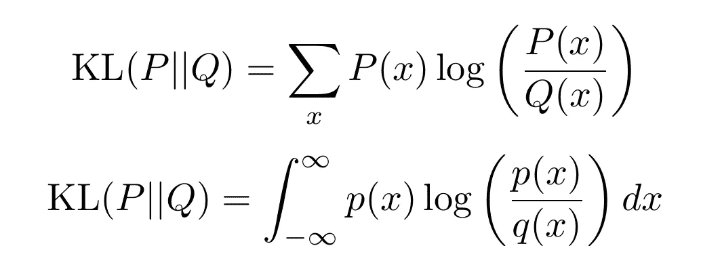

这些是计算分布之间 KL 散度的数学公式

注意计算 KL 散度有两种方法。当 *P* 和 *Q* 为**离散**分布时，使用第一种方式。当 *P* 和 *Q* 为**连续**分布，而 *p* ( *x* )和 *q* ( *x* )分别为 *P* 和 *Q* 的概率密度时，使用第二个公式。有了这些基本定义，我们可以进一步将 KL 发散“分类”为两类:**正向 KL 发散**和**反向 KL 发散**。对于两种分布 *P* 和 *Q* ，前进 KL 定义为 KL(*P*|*Q*)，而后退 KL 定义为 KL(*Q*|*P*)。

因此，当我们在训练 GAN 时试图最小化 *p_g* 和 *p_data* 之间的距离时，我们实质上是最小化分布之间的 KL 散度；数学上，这表示为 min(KL( *p_g||p_data* ))。

现在，我们可以开始分析当我们使用正向和反向 KL 来训练我们的 GAN 时会发生什么。当使用前向 KL 时，我们的目标是最小化 KL( *p_data||p_g* )，因此分布 *p_g* 将基本上在 *p_data* 上展开，以便最小化 KL 发散。如下图所示，其中 *p_g* 标为红色，而 *p_data* 标为蓝色。

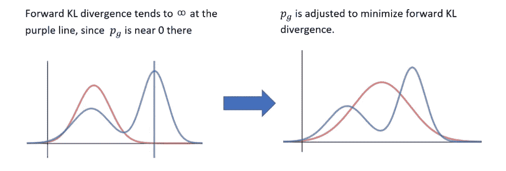

使用前向 KL 训练 GAN

当 *p_g* 如左图所示被初始化时，我们知道沿着曲线有某些地方 *p_g* 接近 0 而 *p_data* 不接近 0。将这些代入我们的前向 KL 散度公式，我们看到 log(*p _ data*(x)/*p _ g*(*x*))将趋近于无穷大。为了防止这种情况发生， *p_g* 基本上被拉伸，使得前向 KL 发散不再爆发。这被称为**寻求均值**或**零规避**行为。

应用反向 KL，我们的目标变成最小化 KL( *p_g||p_data* )。这里，如果分布 *p_data* ，则 *p_g* 将最终覆盖单个模式。这可以从下面看出来:

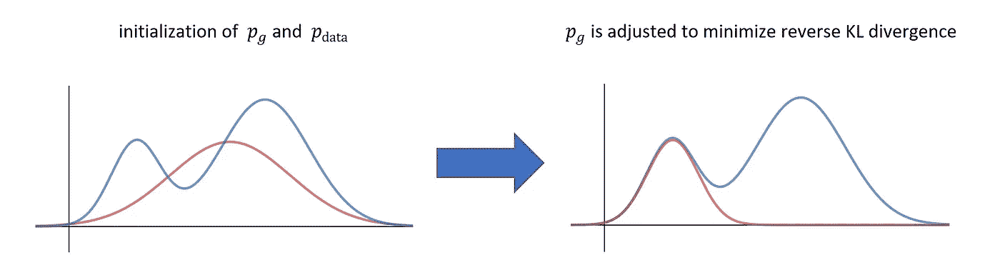

使用反向 KL 训练 GAN

为了最小化反向 KL 发散，我们想要最大化求和中趋向于 0 的项数。这意味着我们希望 *p_g* 有很多点，其中 *p_g* 接近于 0，而 *p_data* 不是(像这样的地方 KL 散度为 0——这可以通过将数字代入我们的公式来验证)。此外， *p_g* 所在的模式也将具有接近 0 的 KL 散度。这是因为表达式 log( *p_g / p_data* )将在 log(1)附近求值，从而减少到 0。这种“收缩”行为被称为**模式搜索**行为。

不幸的是，当我们看到有两个不重叠的离散分布的情况时，KL 散度将扩大到无穷大。这是不希望的，并且会导致训练中的问题。这就是詹森-香农分歧发挥作用的地方。

## 詹森-香农分歧(JSD)

**詹森-香农发散**或 JSD 是测量距离的另一种方法。它使用 KL 散度的元素，但可以处理分布不重叠的情况。计算 JSD 的公式如下所示:

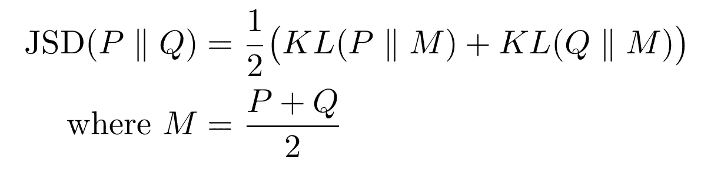

从分布 P 到 Q 计算 JSD 的公式

事实证明，当我们的分布不重叠时，JSD 实际上收敛于 log(2)。这意味着我们现在有一种方法可以有效地测量分布之间的距离，而不必担心散度趋于无穷大；因此，JSD 优于 KL 散度。

这个视频对吉隆坡大分流和 JSD 进行了更深入的研究

这结束了对距离函数以及它们如何被用于训练 GANs 的介绍性一瞥。然而，即使是 JSD 也不是没有缺点。因此，研究人员可能会选择使用 GAN 的变体，如 **Wasserstein GAN** (这使用 Wasserstein 距离)或 **Info GAN** 。

## 最佳鉴别器存在的证明

一旦我们的算法被勾勒出来，我们仍然需要证明它完成了它设定的目标。也就是说，我们想要证明我们的算法产生了最佳鉴别器，表示为 *D* *。

我先提出一个命题:当 *G* 固定时，最佳鉴别器 *D* 由下式给出。

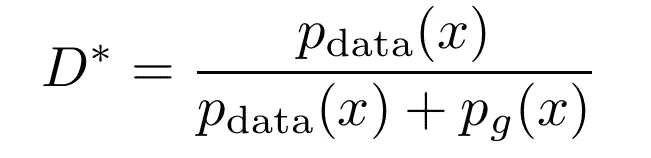

这是给定发生器 **G** 的最佳鉴别器

**证明:**生成器的目标是最大化价值函数 *V* ( *G* ， *D* )。请注意，数据集的期望值可以写成数据分布的积分；类似的规则也适用于发电机。这给我们留下了:

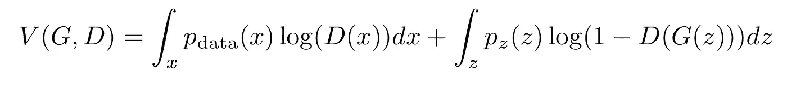

用积分写出的值函数

从这里，我们可以进行“变量的改变”也就是说，我们将 *G* ( *z* )替换为 *x* ，并将我们的分布从 *p_z* 更改为 *p_g* 。这实质上是根据 *G* 产生的输出重写了第二项。

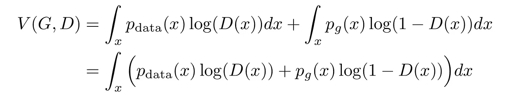

简化价值函数

现在，最大化 *V* 变成了最大化被积函数的问题。从基本微积分中，我们知道表达式*a*⋅log(*x*)+b⋅log(1-*x*的最大值将在( *a* )/( *a+b* )的区间[0，1]上达到最大值。将这个代入我们的值函数，我们得到最大化被积函数的鉴别器将是我们上面提出的。我们的证明到此结束。

# 结论

总之，这篇文章旨在涵盖创建 deepfakes 的数学方法，尤其是 GANs。这篇对 GANs 的介绍性研究将为你提供足够的信息，让你对如何使用人工智能创建 deepfake 有一个大致的了解。除了标题中的图片，所有的图片都是作者创作的，方程式都是在 TexStudio 中用 LaTex 渲染的。如果你有任何问题或者只是想谈谈，请随时通过[felix.liu.2005@gmail.com](http://felix.liu.2005@gmail.com)联系我。

# 参考

[1]https://arxiv.org/pdf/1406.2661.pdf

[https://www.youtube.com/watch?v=_z9bdayg8ZI](https://www.youtube.com/watch?v=_z9bdayg8ZI)

[3][https://github . com/siddrrsh/StartOnAI/blob/master/auto encoders _ _ Meta _ Learning _ _ GANs _ _ wasser stein _ GANs _。pdf](https://github.com/siddrrsh/StartOnAI/blob/master/Autoencoders__Meta_Learning__GANs__Wasserstein_GANs_.pdf)