# 梯度下降和反向传播背后的数学原理

> 原文：<https://towardsdatascience.com/the-math-behind-gradient-descent-and-backpropagation-code-example-in-java-using-deeplearning4j-f7340f137ca5?source=collection_archive---------16----------------------->

## [入门](https://towardsdatascience.com/tagged/getting-started)

## 使用 Deeplearning4J 的 Java 代码示例

本文介绍了两种算法:梯度下降法和反向传播法。我给出了它们如何工作的直觉，也给出了它们背后的数学原理的详细介绍。在本文的最后，我用 Deeplearning4J 给出了这个算法的 Java 实现。然而，它的目的不是介绍 Deeplearning4J 框架，而是实现文章中提出的所有概念。读完这篇文章后，你应该对这两种算法的工作原理和工作方式有一个清晰的理解，并且能够自己实现它们。

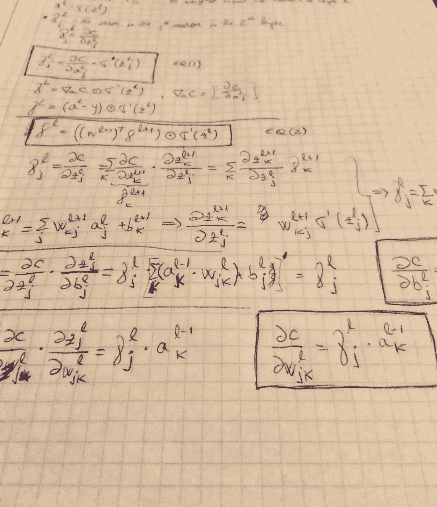

作者图片

# **梯度下降**

通常情况下，我们希望最小化一个函数，比如说 C。一种方法是计算导数，并尝试找到 C 的极值点。如果 C 的变量数量很少，这是一种可行的解决方案，但如果 C 的变量数量很多，就像机器学习算法经常遇到的情况一样，这就不再是一种实用的解决方案，我们需要另一种方法。

让我们假设我们的函数如图 1 所示，一个随机点被选为红点。我们的目标是达到该函数的最小值或底部。那么，从我们最初的位置，我们应该去哪个方向才能到达谷底？直觉上，方向是指向最陡下方的方向。如果我们往那个方向走一点点，然后环顾四周，再次找到最陡的方向，再往那个方向走一点点，重复这个过程很多次，我们最终会到达谷底。但是怎么才能找到最陡下降的方向呢？

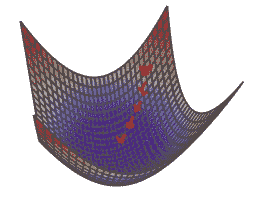

图 1: f(x，y)=x +y(图片由作者提供)

## 方向导数

为了找到我们想要的方向，方向导数的概念将是有帮助的。让我们假设我们的函数 C 有两个变量 *x* 和 *y* ，我们想知道 C 在方向上移动时的瞬时变化率

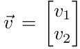

C 沿 *x* 轴的瞬时变化率为

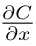

C 关于 x 的偏导数

对于 y 也是一样，向量 v 可以认为是 x 方向的 v₁单位和 y 方向的 v₂单位。因此，C 沿矢量 *v* 方向的方向导数为

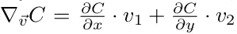

或者更简洁地说:

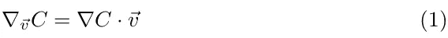

C 在 v 方向上的方向导数

在哪里

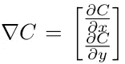

然而，这不是 C 在 v 方向上的斜率。为了得到斜率，向量 v 的范数必须为 1，因为 v 可以按比例放大，这将反映在等式(1)的值中。

让我们回到我们最初的问题:如果我们在点 w=(a，b)，向量 v 是什么使它指向最陡下降方向？当向 v 方向移动时，C 的瞬时变化率必须是负的，绝对值最大，这是最陡的下降。所以，问题归结为找到:

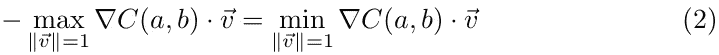

我们有两个向量∇ C(a，b)和 v 之间的点积，这是通过将向量 v 在∇ C(a，b)上的投影长度乘以∇ C(a，b)的长度来计算的(如果投影指向∇c(a b 的相反方向，则它的长度为负值)。那么，向量 v 应该是多少才能使乘积最小呢？如果你向各个方向摆动 v，很容易看出，当 v 指向与∇C(a 相同的方向时，v 的投影最大，而当 v 指向与∇C(a, b).相反的方向时，乘积最小所以，最陡下降的方向与∇C(a 的方向相反。这就是我们要找的矢量 v！

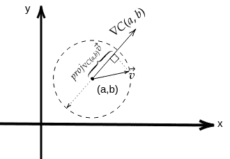

图 2 最陡下降方向(图片由作者提供)

为了接近最小值，剩下要做的就是更新我们的位置直到收敛，如下所示:

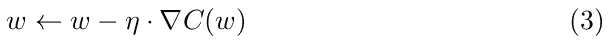

其中 **η** 称为**学习率**。这就是**梯度下降**算法。这不仅适用于两个变量的函数，也适用于任意数量的变量。为了使梯度下降正确工作，必须仔细选择η。如果η太大，更新 w 时我们采取的步骤将会很大，我们可能会“错过”最小值。另一方面，如果η太小，梯度下降算法将运行缓慢。梯度下降算法的一个局限性是它容易陷入局部极小值，但许多机器学习成本函数是凸的，不存在局部极小值。

## 批量梯度下降

在机器学习中，使用成本函数来测量模型的准确性。其中一个函数是**均方误差**或 **MSE** :

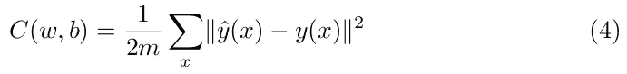

在此等式中，w 和 b 表示模型中所有权重和偏差的集合，m 是训练观测值的数量，ŷ(x 是模型输出的值，y(x)是 x 的真实预测值。c 是平方项的和，我们希望最小化其值，即 C(w，b) ≈ 0。

为了最小化 C(w，b)的值，我们可以应用梯度下降算法。为此，我们可以从 w 和 b 的一些初始值开始，然后重复更新它们，直到它有希望收敛到最小化 C(w，b)的值，如上面等式(3)中所述。然而，这种方法有一个缺点。在每次迭代中，我们必须计算梯度∇C.，但是为了计算∇C，我们必须计算每个训练样本的梯度∇Cₓ，然后对它们进行平均。当有大量训练观测值时，算法可能会很慢。为了加快速度，可以使用另一种叫做随机梯度下降的方法。

## 随机梯度下降

随机梯度下降的思想是一次仅使用一个训练观察来更新参数值。它的工作原理如下:

1.  随机“洗牌”数据集
2.  对于 i =1…m
    (w，b) ← (w，b)——η∇c x(I)(w，b)其中(w，b)是包含所有权重和偏差值的向量

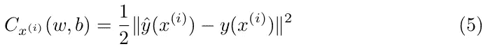

此算法不会扫描所有的训练观察值来更新模型参数，但它会尝试一次适合一个训练示例。随机梯度下降可能不会收敛到全局最小值，但它可以足够接近，是一个很好的近似。

另一种方法是不使用一个训练示例(如在随机梯度下降中)或所有训练示例(如在批量梯度下降中)，而是使用一些中间数量的观察值。这叫做 ***小批量梯度下降*** 。

假设我们随机选择了 k 个训练样本，x，x … xᵏ.这是小批量的。有了足够大的小批量，小批量中梯度的平均值将接近整组训练样本的平均值，即:

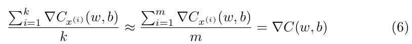

该算法的工作原理是随机选取一个小批量，并使用它们更新参数:

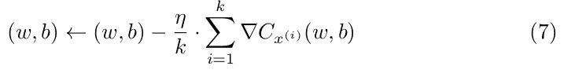

重复这一过程，直到使用了所有的训练样本，从而完成了一个*时期*的训练。之后，我们可以按照相同的程序开始新的训练周期。

# 神经网络

分类问题的一种常见方法是使用 sigmoid 函数。

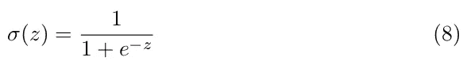

它具有每个输入的权重和总体偏差 b。此函数的一个非常好的特性是σ(wᵗ x + b)取值于区间(0，1)内，因此当其输出大于 0.5 时，我们可以将输入分类为属于类 1 或类 0。

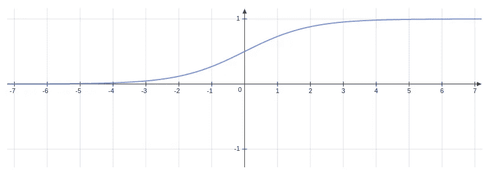

图 3 Sigmoid 函数(图片由作者提供)

然而，如果我们想要使用包括所有二次项的三个特征，我们必须计算

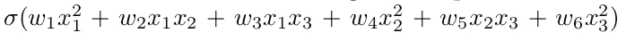

它有六个特点。在这里，我们采用所有两个元素的特征组合。更一般地，为了计算多项式项数，我们可以使用重复的组合函数:

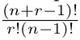

所以，如果我们的输入是一张 100x100 像素的黑白图片，那么特征大小最终将是(100+2–1)！/2!(100–1)=5050.显然，这是不切实际的，我们需要另一种方法。

当创建具有许多特征的复杂模型时，神经网络是另一种选择。神经网络的体系结构如下所示:

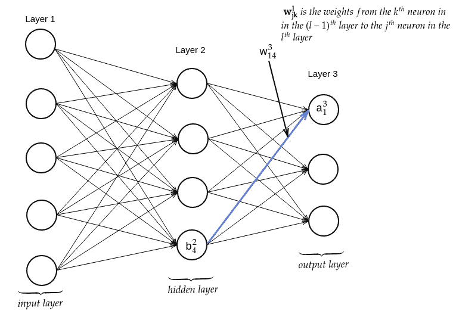

图 4 神经网络(图片作者提供)

神经网络有许多层，每层有一群神经元。第一层称为 ***输入层*** ，该层内的神经元称为输入神经元。最后一层称为 ***输出层*** 和神经元输出神经元。中间的图层称为 ***隐藏图层*** 。一层的输出被用作下一层的输入。这些网络被称为 ***前馈神经网络*** 。

乙状结肠神经元的工作方式如下。神经元的每个输入 x1、x2 …xn 具有相应的权重 w1、w2 …wn。神经元也有一个总偏差 b。神经元的输出是σ(w T x + b ),这是神经元的*激活*。该输出值将作为下一层的输入。

权重被表示为 *wˡⱼₖ* ，意味着从层 *(l-1)* 中的 *kᵗʰ* 神经元到层 *l* 中的 *jᵗʰ* 神经元的权重。b *ˡⱼ* 是 *jᵗʰ* 神经元在 *lᵗʰ* 层的偏置。激活 *lᵗʰ* 层中的 *jᵗʰ* 神经元是一个 *ˡⱼ* 。对于对应于最后一层的值，使用上标 L。

例如，在对图片进行分类的问题中，输入层可以由灰度值在 0.0 和 1.0 之间的所有像素组成。如图 4 所示，为了计算第 2 层中最后一个神经元的激活值，我们计算:

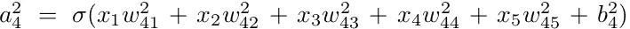

我们如何训练一个神经网络？我们可以使用梯度下降来最小化成本函数。但是为了执行梯度下降，我们必须计算∂C/∂w 和∂C/∂b.。接下来，给出了计算这些偏导数的算法。

# 反向传播

*反向传播*是用于计算成本函数梯度的算法，即偏导数∂C/∂ *wˡⱼₖ和* ∂C/∂b *ˡⱼ.*为了定义成本函数，我们可以使用等式(4):

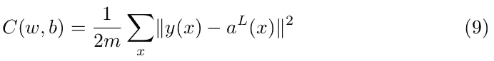

其中第二项是输入 x 的激活值向量，我们知道

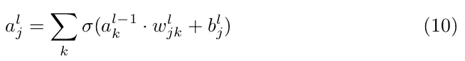

其中总和超过了*(1)ᵗʰ*层中的 k 个神经元。

我们可以定义一个*权重矩阵* Wˡ，它们是连接到 *lᵗʰ* 层的权重，而权重 *Wˡⱼₖ* 对应于 wˡ中具有行 j 和列 k 的条目。类似地，我们可以定义一个包含层 l 中所有偏差的偏差向量 bˡ，以及激活向量:

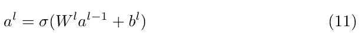

计算中间值也很有用

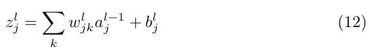

或者以矢量化的形式


很明显，

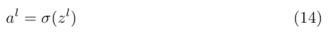

我们还将 l 层神经元 j 的误差定义为δ *ˡⱼ* 。我们从梯度下降算法中知道，当偏导数为 0 或接近 0 时，我们接近最小值，否则斜率越陡，我们就越不正确。考虑到这一点，我们可以定义

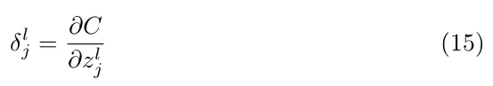

有了所有这些工具，我们可以将输出层中的误差定义如下:

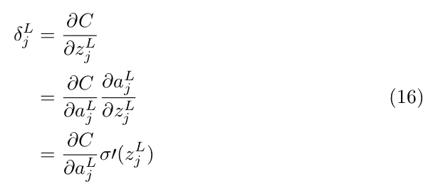

在哪里

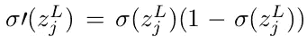

如果我们使用等式(9)中定义的二次函数作为一个例子，那么

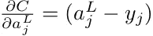

我们可以将∇ₐC 定义为包含 c 相对于最后一层中的每个激活的偏导数的向量，然后我们可以写出(16)的矢量化形式:

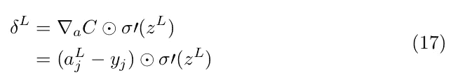

现在让我们尝试计算任何神经元的误差。特别

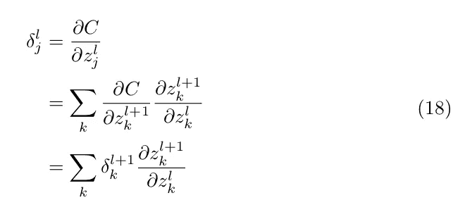

但是

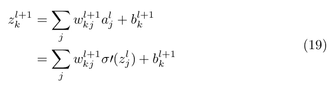

因此，我们有

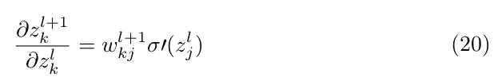

代入等式(18 ),我们得到:

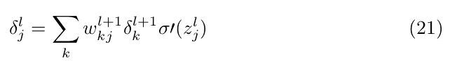

或者矢量化的形式:

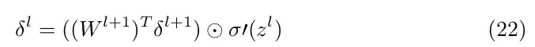

因此，使用这个公式，如果我们知道层 *l* 的δ，我们可以计算 *l-1，l-2* 等的δ。那就是我们*反向传播*的错误，因此算法的名字。我们已经在等式(17)中看到了如何计算δ L。

现在让我们试着计算∂C/∂b *ˡⱼ*

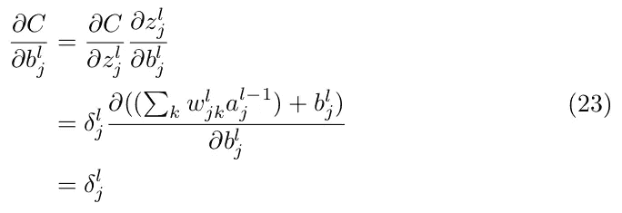

第二个等式由等式(15)和等式(12)得出。等式(23)表明:

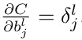

这是个好消息，因为我们已经看到了如何计算任意 l 的δ *ˡⱼ*

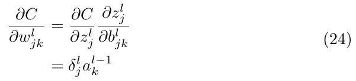

等式(23)和(24)示出了如何计算成本函数的梯度。

## 交叉熵

在上一节中，我描述了使用二次成本函数(9)的反向传播算法。用于分类问题的另一个成本函数是 ***交叉熵*** 函数。

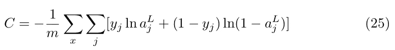

让我们把这个函数分解成几个部分，看看它为什么有意义。如果 y=1，则第二项抵消，ln *和 a* 剩余。如果我们看这个函数的图形，我们看到当 *a* 接近 1 时，函数的值接近 0，当 *a* 越接近 0 时，函数趋于无穷大。也就是说，a 越接近 y 的真实值，成本就越小。类似地，对于 y=0。剩下的一项是 ln(1 a)。当 *a* 接近 1 时，函数值接近无穷大，a 越接近 0，函数值越接近 0。交叉熵函数中 j 上的和意味着输出层中所有神经元上的和。

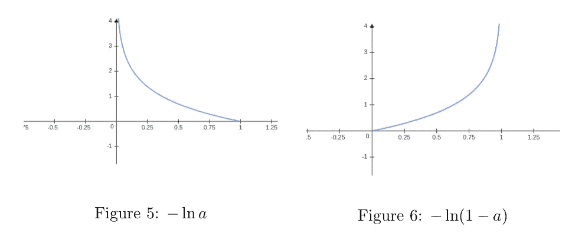

作者图片

在实践中，交叉熵成本似乎是最常用的，而不是二次成本函数。我们一会儿就会明白为什么会这样。我们前面介绍过反向传播算法。对于这个新功能，它有什么变化？等式(16)为我们提供了一种计算输出层误差的方法，我们还看到了二次成本函数的情况。现在让我们计算交叉熵函数。


似乎与二次函数的唯一区别是，我们去掉了等式(16)中的第二项，即 sigma 质数。这有多重要？如果我们观察图 3，我们可以注意到，当 sigmoid 函数接近 0 或 1 时，图形变平，因此σ'(x)非常接近 0。例如，如果输出层神经元将输出非常接近 0 的值，则σ’将接近 0。但是如果真值是 1，δ的值接近 0 将使得相应权重的偏导数非常小，因此学习将非常慢，并且将需要多次迭代。但是当使用交叉熵函数时，σ'项消失了，学习可以更快。计算相对于权重和偏差的偏导数的方式与上一节中描述的方式相同，唯一的区别是计算等式(26)的方式。

**正规化**

正则化是克服过度拟合的一种方法。实现正则化的技巧有很多，但这里我只描述***【L2】***。L2 正则化的思想是通过增加正则化项来惩罚大的权值。然后，正则化的交叉熵变成:

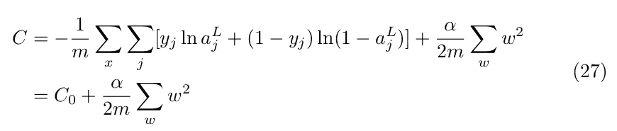

正则化参数是α。正则化项中不包括偏差，因此偏差的偏导数不变，梯度下降更新规则也不变:


权重的更新规则变为:

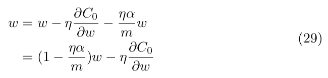

你可以注意到，第一项缩小了权重。这也叫做*重量衰减。*

## 代码示例

使用上述概念，我们将尝试使用 MNIST 手写数字数据库来识别手写数字。

完整的代码可以在[这里](https://github.com/enghinomer/deep-learning/tree/master/NN)找到。

首先，指定层大小来构建网络

```
*/**
 * The constructor takes as input and array of integers
 * representing the number of nodes in each layer
 * */* public Network(int[] layerSizes) {
    this.layerSizes = Arrays.*copyOf*(layerSizes, layerSizes.length);
    this.layers = layerSizes.length;

    //initialise biases
    for (int i = 1; i<layerSizes.length; i++) {
        biases.add(Nd4j.*randn*(layerSizes[i], 1));
    }

    //initialise weights
    for (int i = 1; i<layerSizes.length; i++) {
        weights.add(Nd4j.*randn*(layerSizes[i], layerSizes[i-1]));
    }
}
```

为了训练网络，我实现了随机梯度下降算法。

```
*/**
 * Performs mini-batch gradient descent to train the network. If test data is provided
 * it will print the performance of the network at each epoch
 ** ***@param*** *trainingData data to train the network
 ** ***@param*** *epochs number of epochs used to train the network
 ** ***@param*** *batchSize the size of batch
 ** ***@param*** *eta the learning rate
 ** ***@param*** *testData data to test the network
 * */* public void SGD(DataSet trainingData, int epochs, int batchSize, double eta, DataSet testData) {
    int testSize=0;
    if (testData != null) {
        testSize = testData.numExamples();
    }
    int trainingSize = trainingData.numExamples();
    for (int i=0; i<epochs; i++) {
        trainingData.shuffle();
        for(int j=0; j<trainingSize; j+=batchSize) {
            DataSet miniBatch = trainingData
           .getRange(j,j+batchSize<trainingSize ? j+batchSize :    trainingSize-1);
            this.updateMiniBatch(miniBatch, eta);
        }
        if (testData != null) {
            System.*out*.printf("Epoch %s: %d / %d ", i, this.evaluate(testData), testSize);
            System.*out*.println();
        }
    }
}

*/**
 * Updates the weights un biases of the network using backpropagation for a single mini-batch
 ** ***@param*** *miniBatch the mini batch used to train the network
 ** ***@param*** *eta the learning rate
 * */* public void updateMiniBatch(DataSet miniBatch, double eta) {
    INDArray [] gradientBatchB = new INDArray[layers];
    INDArray [] gradientBatchW = new INDArray[layers];
    for (int i=0; i < this.biases.size(); i++) {
        gradientBatchB[i+1] = Nd4j.*zeros*(this.biases.get(i).shape());
    }
    for (int i=0; i < this.weights.size(); i++) {
        gradientBatchW[i+1] = Nd4j.*zeros*(this.weights.get(i).shape());
    }
    List<INDArray[]> result;
    for(DataSet batch : miniBatch) {
        result = this.backpropagation(batch.getFeatures(), batch.getLabels());
        for(int i=1; i<layers; i++) {
            gradientBatchB[i] = gradientBatchB[i]
.add(result.get(0)[i]);
            gradientBatchW[i] = gradientBatchW[i]
.add(result.get(1)[i]);
        }
    }
    for (int i=0; i<this.biases.size(); i++) {
        INDArray b = this.biases.get(i).sub(gradientBatchB[i+1]
.mul(eta/miniBatch.numExamples()));
        this.biases.set(i, b);
        INDArray w = this.weights.get(i).sub(gradientBatchW[i+1]
.mul(eta/miniBatch.numExamples()));
        this.weights.set(i, w);
    }
}
```

SGD 方法基本上是从训练集中取批，调用 updateMiniBatch 方法。在这种方法中，调用反向传播方法，它返回为该小批量计算的梯度，偏差和权重数组根据随机梯度下降部分给出的规则进行更新。

反向传播方法如下计算上述方程:

```
//feedforward
INDArray activation = x;
INDArray [] activations = new INDArray[layers];
INDArray [] zs = new INDArray[layers];
activations[0] = x;
INDArray z;
for (int i=1; i<layers; i++) {
    z = this.weights
.get(i-1).mmul(activation).add(this.biases.get(i-1));
    zs[i] = z;
    activation = sigmoid(z);
    activations[i] = activation;
}
```

这里计算等式(13)和(14)，然后使用(22)计算δ项。有了 deltas，我们可以用(23)和(24)计算偏导数。代码如下:

```
//back pass
INDArray sp;
INDArray delta = costDerivative(activations[layers-1], y).mul(sigmoidPrime(zs[layers-1]));
gradientB[layers - 1] = delta;
gradientW[layers - 1] = delta.mul(activations[layers2].transpose());
for (int i=2; i<layers; i++) {
    z = zs[layers-i];
    sp = sigmoidPrime(z);
    delta = (this.weights
.get(layers - i).transpose().mmul(delta)).mul(sp);
    gradientB[layers - i] = delta;
    gradientW[layers - i] = delta
.mmul(activations[layers - i - 1].transpose());
}
```

在本文中，我们看到了梯度下降和反向传播是如何工作的。我介绍了描述它们的数学概念和这些算法的实现。您可以使用代码并尝试调整参数，看看您的分类有多准确。