# 机器学习算法背后的数学

> 原文：<https://towardsdatascience.com/the-math-behind-machine-learning-algorithms-9c5e4c87fff?source=collection_archive---------8----------------------->

## 不同的机器学习算法是如何从数据中学习，并在看不见的数据上进行预测的？

罗马法师在 [Unsplash](https://unsplash.com?utm_source=medium&utm_medium=referral) 上拍摄的照片

机器学习算法是以这样一种方式设计的，即它们从经验中学习，并且随着它们获取越来越多的数据，它们的性能会提高。每种算法都有自己学习和预测数据的方式。在本文中，我们将介绍一些机器学习算法的功能以及这些算法中实现的一些数学方程，这些算法有助于学习过程。

## 机器学习算法的类型

机器学习算法可以大致分为以下四类:

*   **监督学习:** *预测的目标或输出变量已知*。这些算法生成一个将输入映射到输出变量的函数。回归和分类算法属于这一类。在回归中，输出变量是连续的，而在分类中，输出变量包含两个或多个离散值。一些监督学习算法包括线性回归、逻辑回归、随机森林、支持向量机(SVM)、决策树、朴素贝叶斯、神经网络。
*   **无监督学习:** *目标或输出变量未知*。这些算法通常分析数据并创建数据聚类。关联、聚类和维数约简算法都属于这一类。K-means 聚类、PCA(主成分分析)、Apriori 算法是一些无监督学习算法。
*   **半监督学习:**它是监督和非监督学习方法论的结合。它使用已知数据来训练自己，然后标记未知数据。
*   **强化学习:** *机器或代理被训练从‘试错’过程中学习。*机器从过去的决策经验中学习，并使用其学习来预测未来决策的结果。强化学习算法的几个例子是 Q 学习、时间差分等。

## 线性回归

线性回归用于通过拟合数据点上的最佳直线来预测连续变量的结果。最佳拟合线定义了因变量和自变量之间的关系。该算法试图找到预测目标变量值的最佳拟合线。*通过最小化数据点和回归线之间的平方差之和，获得最佳拟合线。*

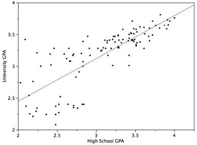

线性回归(来源: [onlinestatbook](http://onlinestatbook.com/2/regression/intro.html)

> **方程式:** Y = c + m₁X₁ + m₂X₂ + …..+mnXn
> 
> Y →因变量或目标变量
> 
> m →斜率
> 
> c →截取
> 
> X →独立变量

## 逻辑回归

逻辑回归是一种分类算法，用于根据自变量估计分类变量的结果。它通过将数据拟合到逻辑函数来预测事件发生的概率。*通过最大化* [*似然函数*](https://machinelearningmastery.com/what-is-maximum-likelihood-estimation-in-machine-learning/) *来优化逻辑函数中独立变量的系数。*决策边界被优化，使得成本函数最小。可以通过使用梯度下降来最小化成本函数。

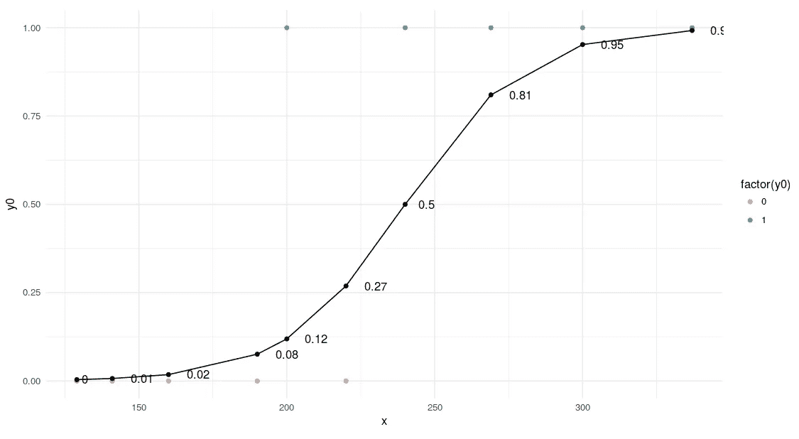

逻辑回归的 sigmoid 曲线

逻辑回归的成本函数

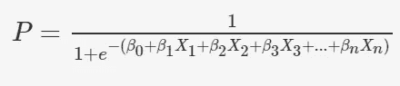

逻辑回归方程

## 朴素贝叶斯

朴素贝叶斯是一种基于[贝叶斯定理](https://en.wikipedia.org/wiki/Bayes%27_theorem)的分类算法。*该算法假设自变量之间不存在相关性。即一个类别中特定特征的存在与同一类别中另一个特征的存在无关。*我们根据类别(目标变量的不同值)为所有预测值创建一个频率表，并计算所有预测值的可能性。使用朴素贝叶斯方程，计算所有类别的后验概率。朴素贝叶斯分类器的结果将是所有类概率中概率最高的类。

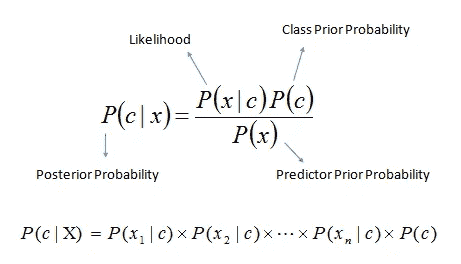

c →类，X→预测器

## 决策树

决策树主要用于分类问题，但也可以用于回归分析。在该算法中，我们根据最有效地划分数据集的属性，将数据集划分为两个或多个同类集合。选择将分割数据集的属性的方法之一是计算熵和信息增益。*熵捕捉变量中杂质的数量。信息增益是父节点的熵减去子节点的熵之和。* *选择提供最大信息增益的属性进行拆分。*我们还可以使用基尼指数作为杂质标准来分割数据集。为了防止过度捕捞，我们优化了决策树的超参数，如 max_features、min_samples_split、max_depth 等。

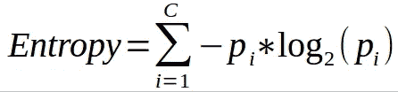

熵，c →类别数

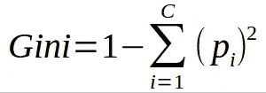

基尼

## 随机森林

随机森林由几个决策树组成，这些决策树作为一个整体运行。集合由一组用于预测结果的模型组成，而不是单个模型。*在随机森林中，每个决策树预测一个类结果，投票数最多的类结果成为随机森林的预测。* *为了准确预测，决策树之间的相关性应该最小。*确保这一点的几种方法是通过打包和特征选择。Bagging 是一种从数据集中选择随机观察样本的技术。特征选择允许决策树仅在随机特征子集上建模。这可以防止单个树使用相同的特征进行预测。

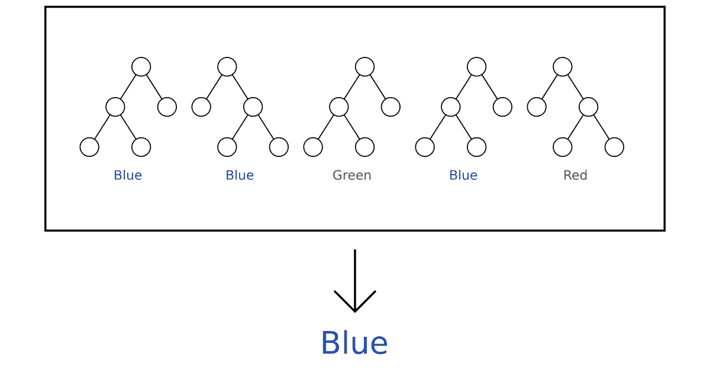

随机森林(来源: [victorzhou](https://victorzhou.com/blog/intro-to-random-forests/) )

## k 近邻

该算法也可用于回归和分类。该算法通过计算其与所有数据点的距离来寻找数据点的 k 个最近邻。*数据点被分配给 k 个邻居中点数最高的类(投票过程)。在回归的情况下，它计算 k 个最近邻的平均值。*可以使用的不同距离度量是欧几里德距离、曼哈顿距离、闵可夫斯基距离等。为了消除平局的可能性，k 的值必须是奇数。这种算法计算量很大，因为每个数据点的距离是用每隔一个数据点来计算的。

距离度量

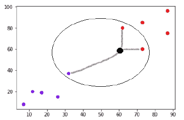

k-NN(来源:[辅导点](https://www.tutorialspoint.com/machine_learning_with_python/machine_learning_with_python_knn_algorithm_finding_nearest_neighbors.htm))

## k 均值

K-Means 是一种无监督学习算法，用于形成数据的聚类。形成的聚类应该使得一个聚类内的数据点尽可能相似，并且这些聚类彼此之间尽可能不同。它随机选择 K 个位置，每个位置作为一个聚类的质心。数据点被分配给最近的聚类。在分配数据点之后，计算每个聚类的质心，并且再次将数据点分配给最近的聚类。重复该过程，直到数据点保持在相同的聚类中，或者聚类的质心在每次连续迭代中不变。我们还可以指示算法在执行一定次数的迭代后停止计算。

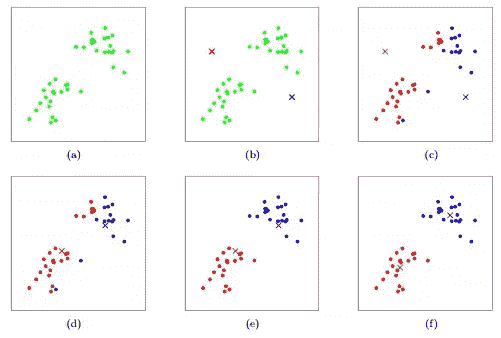

k-均值聚类(来源:[斯坦福](https://stanford.edu/~cpiech/cs221/handouts/kmeans.html)

## Apriori 算法

Apriori 算法是一种基于关联规则的算法，用于从数据库中识别频繁项集。*频繁项集是支持度值大于阈值(支持度)*的项集。关联规则可以被认为是一种 IF-THEN 关系。它通常用于购物篮分析，发现不同项目之间的关联。支持、信心和提升是有助于确定关联的三个衡量标准。

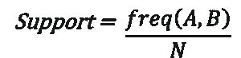

支持(A 和 B 是不同的项目)

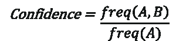

信心

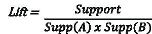

电梯

支持度指示某些项集一起出现的频率。

置信度计算其中一个项目出现时，该项目集出现的概率。

提升表示关联规则的强度。支持是用户定义的阈值。

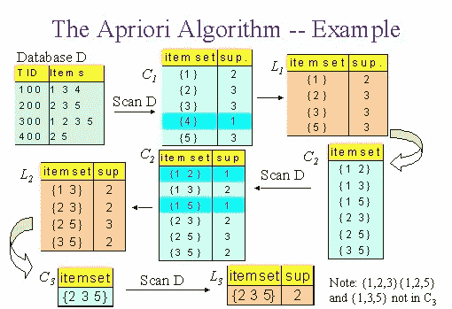

## XGBoost

XGBoost 是一种基于决策树的梯度推进算法(另一种类型的集成)。XGBoost 涉及一组弱学习器，它们组合起来做出显著的准确预测。 Boosting 是一种顺序集成，其中每个模型都是基于对先前模型错误分类的校正来构建的。换句话说，它接收前一个模型的错误，并试图通过学习这些错误来改进模型。

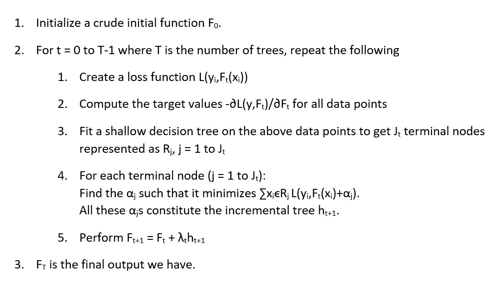

## 支持向量机(SVM)

SVM 也是一种监督学习算法，可用于分类和回归问题。SVM 试图在 N 维空间中找到一个最佳超平面(N 指的是特征的数量)，这有助于对不同的类别进行分类。*使用* [*铰链损失*](https://en.wikipedia.org/wiki/Hinge_loss) *函数，通过最大化类的观测值之间的边缘距离，找到最优超平面。*超平面的维度取决于输入特征的数量。如果特征的数量是 N，那么超平面的维数是 N-1。

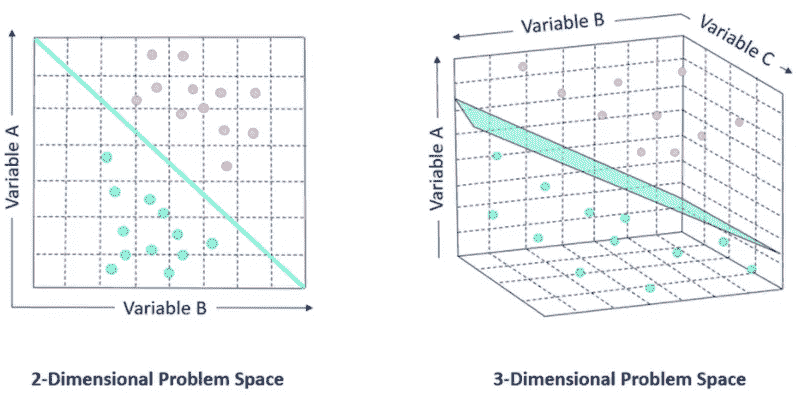

SVM(来源: [alteryx](https://community.alteryx.com/)

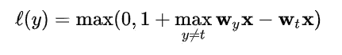

铰链损失函数:t →目标变量，w→模型参数，x →输入变量(来源:[维基百科](https://en.wikipedia.org/wiki/Hinge_loss))

## **感谢您阅读本文。**