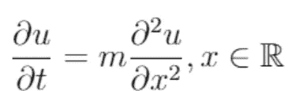
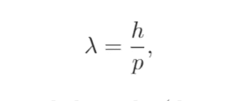
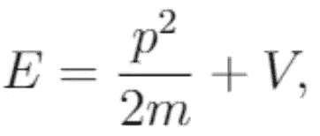
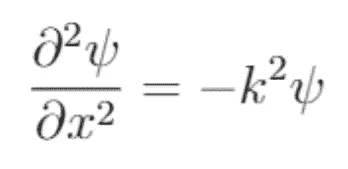
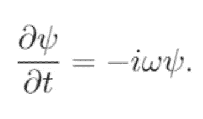
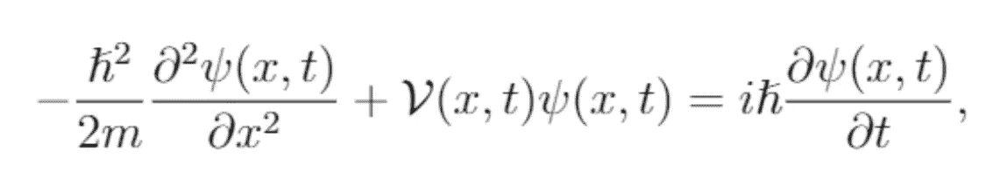
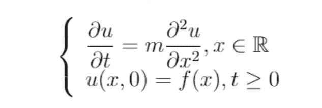
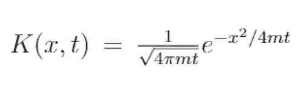
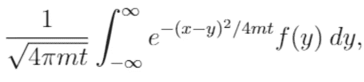
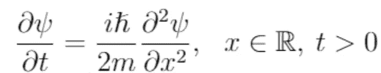

# 薛定谔方程背后的数学:波粒二象性和热方程。

> 原文：<https://towardsdatascience.com/the-math-behind-schr%C3%B6dinger-equation-the-wave-particle-duality-and-the-heat-equation-d5837bf4b13f?source=collection_archive---------7----------------------->

## 薛定谔方程的历史和半形式推导。

在[量子力学](https://en.wikipedia.org/wiki/Quantum_mechanics)中，一个事件的结果没有确定性，就像在[经典物理学](https://en.wikipedia.org/wiki/Classical_physics)中一样。这是因为每个事件都有关联的概率，这就是薛定谔方程告诉我们的关于粒子的信息。但是，[埃尔温·薛定谔](https://en.wikipedia.org/wiki/Erwin_Schr%C3%B6dinger)如何解决这个问题呢？理查德·费曼曾经说过:

> 它不可能从你知道的东西中推导出来，它只是简单地从薛定谔的头脑中出来。

然而，我们会看到它与约瑟夫·傅立叶在 1822 年提出的热方程(扩散方程±傅立叶)有关系，阿尔伯特·爱因斯坦和路易·德布罗意的粒子波假设给了我们一个半形式推导的提示。

图 1:热量方程。来源:作者

# 1.波粒二象性

1897 年有人提出，当原子吸收光的能量时，会发射出电子，这种现象被称为光电效应。后来，在 1905 年，爱因斯坦通过假设量子或离散能量单位的存在，对此事件做出了解释。

图二。爱因斯坦的提议。来源:作者

图 2 中的关系告诉我们，一个粒子的能量 ***E*** 可以取普朗克常数***h***的倍数，只与波的[频率](https://en.wikipedia.org/wiki/Frequency) ***v*** 有关。换句话说，爱因斯坦提出波在某些过程中表现得像粒子一样，因为只需要知道它的频率。

在 20 年代初，衍射电子束的可能性仍然是迫切需要的。事实上，可以预期的是，电子在孔径附近(大小与波长相当)的波结构中的扭曲会使其扩散。直到 1924 年路易·德布罗意在[让·佩兰](https://en.wikipedia.org/wiki/Jean_Baptiste_Perrin)和[保罗·朗之万](https://en.wikipedia.org/wiki/Paul_Langevin)的博士论文指导下，给出了一个表达式，明确计算出一个波的[波长](https://en.wikipedia.org/wiki/Wavelength)

图 3。德布罗意的提议。来源:作者

其中 ***λ*** 和 ***p*** 分别代表质点的长度和[动量](https://en.wikipedia.org/wiki/Momentum)。现在，我们如何从先前的后置定语中得到图 7 中的等式呢？三个词:能量，空间和时间，具体来说:

图 4。粒子的总能量。来源:作者

*   **能量需求。**一个粒子的总能量([动能](https://en.wikipedia.org/wiki/Kinetic_energy)和[势能](https://en.wikipedia.org/wiki/Potential_energy)让我们找到了与波粒二象性的关系。换句话说，我们需要满足一个能量要求，才能模拟粒子的行为。

图 5。关于空间的变化。来源:作者

*   **太空中的行为。*****k***，描述了以空间为单位的波数。此外，相对于空间的变化(如果位置改变，震级如何变化)向我们展示了波的初始状态在空间频率方面如何演变。

图 6。相对于时间的变化。来源:作者

*   **行为及时。*****ω***，描述了以时间为单位的波数。此外，波的初始状态相对于时间的变化(幅度如何随时间变化)导致我们用角频率来表示它。

因此，我们得到了与时间相关的薛定谔方程(图 7)。如果您对技术细节感兴趣，请参阅[4]的第 1 章。

图 7。含时薛定谔方程。来源:作者

# 2.热量方程

当傅立叶开始研究这个方程时(大约 1802 年)，热学和微分方程理论处于发展的早期阶段。具体地说，已经确立了通过温差和蓄热的热传导。比如 1804 年[让·巴普蒂斯特·比奥](https://en.wikipedia.org/wiki/Jean-Baptiste_Biot)关于不连续体之间热传导的工作或者 1783 年[拉瓦锡](https://en.wikipedia.org/wiki/Antoine_Lavoisier)和[拉普拉斯](https://en.wikipedia.org/wiki/Pierre-Simon_Laplace)对热容的测量。

图 8。金属茶壶中的热扩散。史蒂夫·库克通过 [pixabay](https://pixabay.com/) ( [来源](https://pixabay.com/photos/teapots-pots-cook-stove-flame-1858601/))拍摄的照片

离开了 Biot 的观点，Fourier 用连续体(如金属薄片)中的偏微分方程来描述热传导。因此，他可以从三个方面考虑这个问题:

1.  太空中的热传输。
2.  身体各部分的热量储存。
3.  [边界条件](https://en.wikipedia.org/wiki/Boundary_value_problem#Boundary_value_conditions)。

边界条件是允许元素或主体的外部与内部相互作用的条件，在数学上，它们被表示为第二个方程，***【x，0】***，如下图所示(图 9)。

图 9。具有初值条件的热传导方程。来源:作者

让我们分解上面的问题来理解它:

*   第一个方程是约瑟夫·傅立叶公式化的，即热量相对于时间的变化(∂ u / ∂ t)等于通过物体的加速度热量(∂ u / ∂ x)乘以某个常数 ***m*** 。
*   第二个方程是热量最初的行为，我指的是最初，因为它建立了数学术语中所谓的 ***初值条件*** ，时间 ***t = 0 时的行为。***

现在，我们可以问自己如何解决这个问题，即热量如何在连续体中通过空间***【x】***和时间 ***t*** 演化？让我们回到图 8，想象茶壶底部是我们的初值条件。然后，要问的几个自然问题是

1.  锅盖还是锅底会更暖和？
2.  热量的减少是如何发生的，是快还是慢？

数学是我们的答案，特别是所谓的[热核](https://en.wikipedia.org/wiki/Heat_kernel)(图 10)，它是图 9 中问题解决方案背后的核心。

图 10。热核。来源:作者

如果你熟悉[正态分布](https://en.wikipedia.org/wiki/Normal_distribution)，这个函数可能看起来很容易辨认，因为它们背后的根是高斯函数。现在，如果你上过一次概率课，你会记得大多数值都集中在平均值 ***μ*** 附近，衰减可以用方差 ***σ来解释。*** 同理，对于热核来说，热的扩散取决于时间 ***t*** 和常数 ***m*** 。因此，这个函数的衰减向我们解释了热量是如何通过时间和空间扩散的。对于茶壶(图 8)，来自燃烧器的热量在到达壶盖和时间流逝时是如何扩散的。

但是，这个方程能保证边界条件吗？是的，这里有个窍门 ***整合*** 。正如人们在概率课程中所记得的，概率分布必须满足它整合为一。用茶壶的术语来说，人们可以测量茶壶不同的温度。所以，假设热核满足这个性质，我们可以从数学上证明它整合到 ***f(x)中。*** 试试看，整合图 11 中的函数，作为提示，你可以检验一下[狄拉克δ](https://en.wikipedia.org/wiki/Dirac_delta)函数的概念。

图 11。热方程初值问题的求解。来源:作者

最后，我们之前说过热量方程和含时薛定谔方程之间的关系，为了提醒我们，让我们再看一下图 1 和图 7。乍一看，似乎没有任何关系，但如果我们考虑两个方程中的共同项，并通过设置 ***V(x) = 0*** (没有力作用在粒子上)，我们可以将图 7 中的方程重新表述如下。

图 12。自由薛定谔方程。来源:作者

因此， ***薛定谔方程是热方程但带有虚数*** ，参见[虚数](https://en.wikipedia.org/wiki/Imaginary_number)的概念。

# 3.薛定谔方程是什么？

路易·德布罗意的开创性著作出版后，没有人能理解它。事实上，埃尔温·薛定谔一开始就拒绝了他的观点，直到维克多·亨利回复他“你应该再读一遍德布罗意的论文；朗之万认为这是一部非常好的作品”，因此欧文开始发展他的想法。此外，大约在那个时候，彼得·约瑟夫·威廉·德拜和欧文·马德隆试图设计一种原子层次的波动理论。

薛定谔需要两次尝试来为现在所知的非相对论波动力学奠定基础。在第一篇文章中，他试图将德布罗意波推广到氢原子上的电子(束缚粒子)。然而，结果与实际观察不一致，因为他没有考虑电子的自旋。几个月后，在他的第二次尝试中，他注意到通过以非相对论的方式处理电子，他的方法与观察一致。因此，在 1926 年发表他的卓越文章**《作为正当值问题的量子化》**。

最后， ***什么是薛定谔方程？*** 它是基于原子或亚原子粒子的当前状态或初始状态(初值条件)，描述原子或亚原子粒子将如何随时间变化的一种表述。

# 4.更多主题

在薛定谔方程系列文章的第二部分，我们将发展波包的概念作为初值条件和时间无关的情况来研究量子隧穿效应。关于本文中数学发展的技术细节，参见[4]的第 1 章和第 2 章。

## 参考

[1]罗伯特·艾斯伯格。量子物理学。约翰·威利父子公司，1985 年。

[2]干扰机，最大。量子力学概念的发展。美国物理研究所，1989 年。

[3] Naramsinhan，T.N .傅立叶热传导方程:历史、影响和联系。

[4]米格尔·特雷霍。schredinger 教育数学解释(Tesis)。网址:[https://github.com/TremaMiguel/Thesis-Schrodinger-Equation](https://github.com/TremaMiguel/Thesis-Schrodinger-Equation)

5 布鲁斯·惠顿。老虎和鲨鱼。剑桥大学出版社，1983 年。