# 预测模型的统计决策理论

> 原文：<https://towardsdatascience.com/the-math-you-need-to-develop-your-own-predictive-models-fdb771cc1ddf?source=collection_archive---------29----------------------->

> 沉默的统计学家改变了我们的世界；不是通过发现新的事实或技术发展，而是通过改变我们推理、实验和形成观点的方式。伊恩·哈金

你能从观察值中写出一个预测函数来最小化误差偏差吗？还是平均误差？你能找到能最小化任何给定损失函数的最佳理论预测值吗？

这篇文章将通过快速介绍统计决策理论来回答这些问题。**这不是另一个机器学习的线性代数基础教程**。我假设读者有一点数学背景。一年级的 Stems 本科生所知道的就足够了。

照片由[克里斯·利维拉尼](https://unsplash.com/@chrisliverani?utm_source=unsplash&utm_medium=referral&utm_content=creditCopyText)在 [Unsplash](https://unsplash.com/s/photos/stats?utm_source=unsplash&utm_medium=referral&utm_content=creditCopyText) 拍摄

# 统计决策理论

我们的模型是根据几个假设定义的:

*   我们有一个输入向量 *X* 的 *p* 随机参数。
*   我们有一个期望的输出变量 *Y* 。
*   目标是找到一个预测函数 *f* 来预测给定 *X* 的 *Y* 。
*   为了搜索给定标准的最优 *f* ，我们将根据该标准选择损失函数 *Lf* 。
*   根据我们的标准，如果预测与现实相差甚远，我们的损失函数将返回最大值。

由于预测器的质量是由 Lf 的损失函数来测量的，所以最佳预测器 f 仅在 Lf 规定的意义上是最佳的。损失函数的不同选择导致不同的最优解。

一般来说，不可能想出一个在所有可以想到的方面都是最佳的预测器。因此，为了在一组预测因子中进行选择，我们将比较它们损失函数的平均值 E。

## 最佳预测器的搜索

我们将任何概率分布表示为 *ℙ* ，期望值表示为 *E* 。

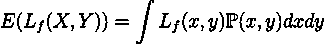

从贝叶斯定理，

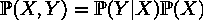

然后通过分解二元积分，

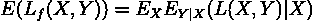

现在可以通过逐点最小化期望误差来求出 f。
设 c ∈ ℝᵖ，

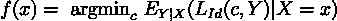

用 *L_Id* 将损失函数应用于身份函数。通过最小化上述期望，无论是解析地还是数值地，我们可以找到最佳匹配预测器 *f* 。

案例研究将有助于阐明如何在给定的损失函数上找到 f。

## 案例研究:均方误差

ML/DL 中最常用的损失函数通常是均方误差:

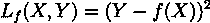

从上一节来看，

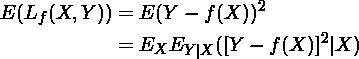

因此，

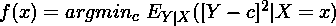

解是 f(x) = E(Y|X=x)，因为:

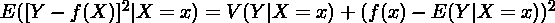

我们刚刚证明，当损失函数是均方误差时，Y 在任一点 X=x 的最佳预测值是条件均值:

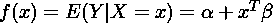

这个预测值通常被称为线性回归。通过将 f(x)注入多元积分并使关于β的矢量导数等于零，可以求解β。

损失函数的另一种可能选择是偏差的绝对值:

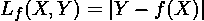

可以证明最佳预测值是条件中位数:

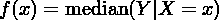

这是一种不同的位置度量，它的估计比条件均值的估计更稳健。不幸是，偏差的绝对值在其导数中具有不连续性，这阻碍了它们在损失函数中的广泛应用。

# 分类变量的预测值

当我们预测一个变量 *Y* 取离散值 *c₁，c₂，…，cₖ* 可视为某种群体标签时，我们经常会谈到分类。

我们的损失函数可以用一个 *K×K* 矩阵 *Lf* 来表示，其中 *K* 为类的数量。 *Lf(ci，cj)* 是对类别 *j* 而不是类别 *i* 的错误分类的损失。

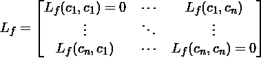

然后，我们计算损失函数的平均值:

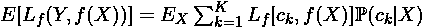

现在可以最小化逐点损失的期望值，得到 f 的表达式:

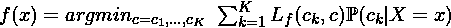

## 案例研究:贝叶斯分类器

损失函数的一个非常常见的例子是零一损失。如果类谓词是正确的，那么 loss 是 0。如果是错的，损失是 1:

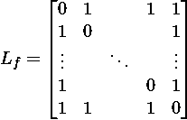

然后，用 *δ* 作为克罗内克δ，期望损失为:

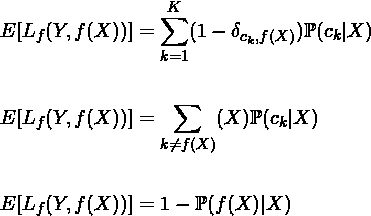

因此，对于每个 *x* ，最小化 *1−ℙ(f(X)|X)* 的 *f* 的最佳选择为:

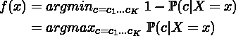

这个预测器被称为贝叶斯分类器。由于这些“真实”的概率本质上是永远不知道的，因为在实践中很难计算出 *ℙ* (c|X=x)，这更多的是一个理论概念，而不是你可以实际使用的东西。通过对该量应用贝叶斯定理，然后假设所有参数相互独立:

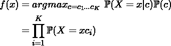

这就是 [*朴素贝叶斯分类器*](https://en.wikipedia.org/wiki/Naive_Bayes_classifier) ，然后可以在实践中实现。

# 一个问题，两种解决方案

我们在前面几节中研究的所有预测器都有明显的缺点。如果在输入数据 *X* 中存在特殊结构，回归不能减少估计的偏差和方差。此外，如果 *X* 的[尺寸较高](https://en.wikipedia.org/wiki/Curse_of_dimensionality)，回归会导致较大的误差。

我们的目标是找到对函数 *f(x)* 的有用近似*f(x)*，该函数是具有大的和高维状态空间的输入和输出之间的预测和潜在结构化关系的基础。

这个问题可以通过两种不同的方法来解决。

## 统计估计量

应用数学和统计学采用的方法是从函数逼近和估计的角度。

输入和输出被视为欧几里得空间中的点，并且预测估计器将这些点对映射到该空间的超平面中。估计量现在表示为:

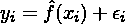

通过对拟合的模型类别施加一些严格的限制来选择估值器:**粗糙度惩罚、核方法和基函数**就是其中的一些。

## 通过实例学习

这种方法试图通过旨在最小化损失函数的教师来学习 f。教师的目标是根据输入产生输出*f(Xi)*。在学习过程完成后，我们希望预测输出和实际输出足够接近，以便对实践中可能遇到的所有输入集都有用。

这种方法通常被称为监督学习。**据我们所知，机器学习旨在从技术上解决这个问题。**

[*安托万冠军 2020 年 4 月 6 日*](http://antoinechampion.com)

# 参考

哈斯蒂，特雷弗，蒂布拉尼，罗伯特和弗里德曼，杰罗姆。*统计学习的要素*。美国纽约州纽约市:斯普林格纽约公司，2001 年。

尼尔斯·理查德，*预测和分类*，哥本哈根大学，2006 年

John L. Weatherwax，David Epstein，*解决方案手册和注释:统计学习的要素*，第 2 章，2020 年