# 概率的数学基础

> 原文：<https://towardsdatascience.com/the-mathematical-foundations-of-probability-beb8d8426651?source=collection_archive---------7----------------------->

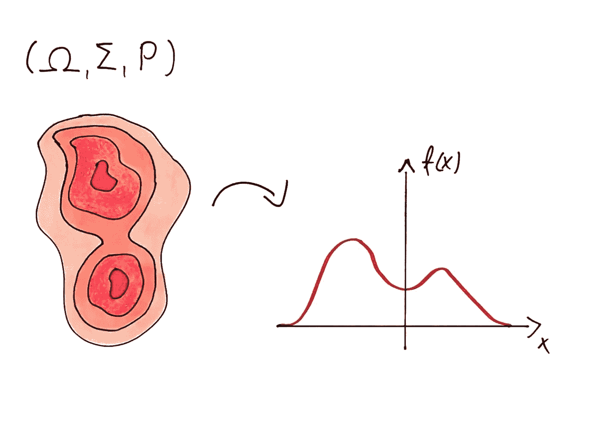

## 测度论导论

抽象是为了隐藏不相关的东西，只关注重要的细节。虽然有时看起来很可怕，但它是管理复杂性的最佳工具。

如果你问 *n* 位数学家定义数学是什么，你可能会得到 *2n* 个不同的答案。我的定义是，它是一门将事物抽象到只剩下核心的科学，为任何事物的推理提供最终框架。

你有没有想过概率到底是什么？你肯定用它来对数据进行推理，进行统计分析，甚至通过统计学习来构建算法为你进行推理。在本帖中，我们将深入兔子洞，用放大镜探索概率论。

## 先决条件

要坚持到底，你不需要任何高等数学，我正专注于从基础开始解释一切。但是，如果您了解以下内容，这对您是有益的:

*   集合和集合运算，如并、交和差。
*   极限和一些基本的微积分。

# 集合和度量

概率可以被启发式地认为是一个函数，*衡量*一个事件发生的可能性。尽管从数学上来说，目前还不清楚什么是事件和度量。在我们能够恰当地讨论概率之前，我们需要先建立一个坚实的基础。所以，先说事件。

## 事件

*“我用这个骰子掷出奇数的概率是多少？”*

当谈到概率时，这个简单的问题会作为一个例子出现在我们的脑海中。在这个简单的问题中，事件是掷出一个奇数。为了对此进行数学建模，我们使用集合。“宇宙”，即包含该实验结果的基本集合，简单来说就是*ω= { 1，2，3，4，5，6}* ，而**事件**是ω的子集。这里滚动一个奇数对应的是子集 *A = {1，3，5}* 。

所以，为了定义概率，你需要一个底层集合ω和它的子集集合σ，我们称之为事件。然而，σ不能仅仅是任何子集的集合。有三个条件必须满足。

1.  ω是事件。
2.  如果 *X* 是事件，那么它的补码*ω\ X*也是事件。也就是说，没有发生的事件也是另一个事件。
3.  事件的联合就是事件。也就是说，(事件或另一个事件)也是一个事件。换句话说，σ接近于并集。

如果满足这些条件，σ被称为σ代数**。用恰当的数学术语来说:**

**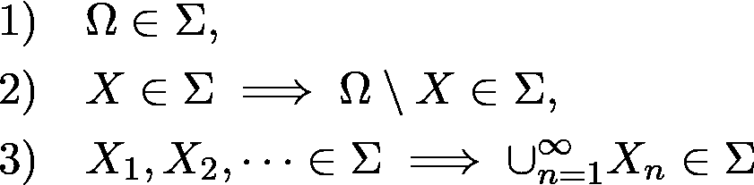**

**在我们的情况下，我们有**

**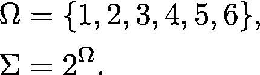**

**当ω是实数集时，会出现一个更有趣的情况。稍后我们会看到，如果实数的所有子集都被认为是事件，那么会发生非常奇怪的事情。**

## **描述σ-代数**

**我们用σ-代数定义的这些事件空间很难描述。人们可以立即看到，为了在非平凡基集ω上有一个有意义的事件空间，我们应该有无限数量的事件。例如，我们在木板上射击子弹，想要计算击中某个区域的概率。在这些情况下，指定一些子集并取包含这些子集的最小σ代数就足够了。**

**让我们假设我们正在射击一块长方形的板。如果我们说我们的事件空间是包含棋盘上所有矩形子集的最小σ代数，我们**

1.  **对σ代数有一个非常简单的描述，**
2.  **会有各种形状，因为σ-代数在并下是闭的。**

**很多集合可以描述为矩形的无限联合，如下图所示。**

**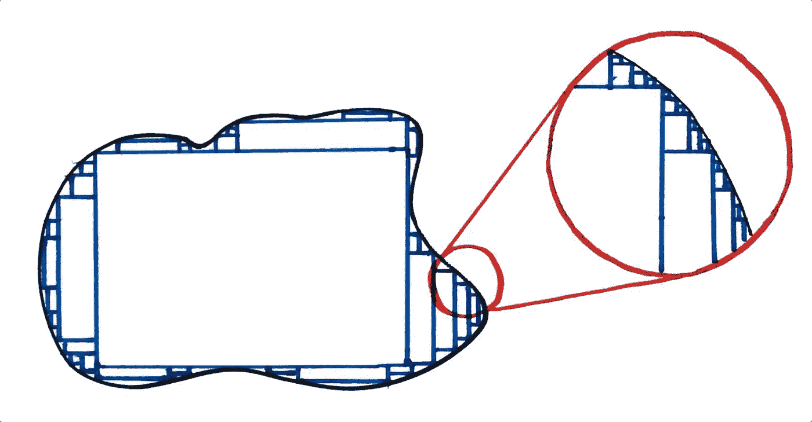**

**不规则形状如并集或无限矩形。**

**我们称棋盘内的矩形集合为**生成集**，而我们称最小的σ代数为**生成σ代数**。**

**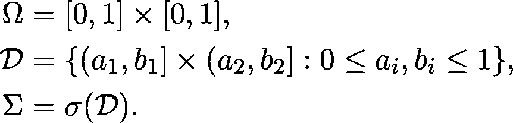**

**你可以把这个生成过程想象成获取你的生成集的所有元素，并以所有可能的方式获取并和补集。**

**现在我们有了一个处理事件的数学框架，我们将把注意力转向度量。**

## **措施**

**尽管直观地衡量某些东西是清楚的，但这是一件*非常*难以恰当形式化的事情。度量基本上是一个函数，将一个集合映射到一个数字。考虑一个简单的例子，测量一个三维物体的体积似乎足够简单，但即使在这里，我们也有严重的问题。你能想到空间中一个你不能测量其面积的物体吗？**

**大概你不能马上，但绝对不是这样。可以证明，如果空间的每个子集都有明确定义的体积，那么你可以拿一个单位体积的球体，把它切成几块，然后把两个单位体积的球体放在一起。**

**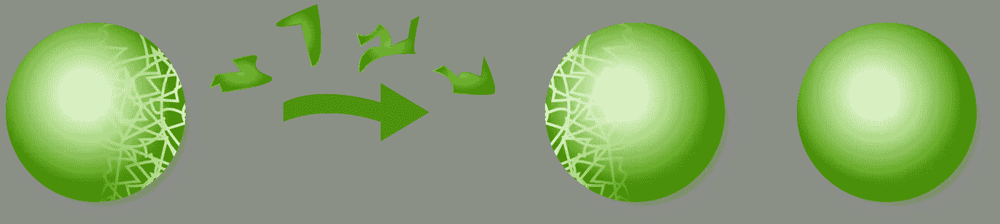**

**巴拿赫-塔尔斯基悖论。来源:[维基百科](https://en.wikipedia.org/wiki/Banach%E2%80%93Tarski_paradox#/media/File:Banach-Tarski_Paradox.svg)**

**这被称为巴拿赫-塔尔斯基悖论。因为你不能真正做到这一点，所以你不能测量空间中每个子集的体积。**

**但是在这种情况下，措施到底是什么？真的，我们只有三个要求:一个度量应该永远是正的；空集的度量应该为零；如果你把不相交集合的测度相加，你就得到了它们并的测度。**

**为了正确定义它们，我们需要一个基集ω和一个σ*σ*-子集代数。该功能**

**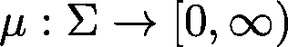**

**是一个**测量值**如果**

**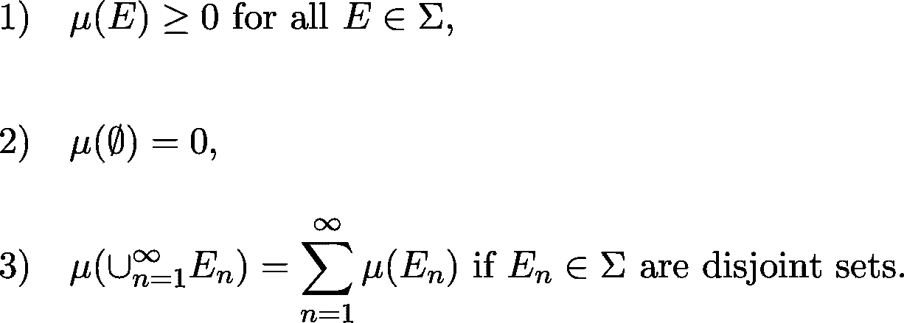**

**房产 3。叫做***σ*——可加性**。如果我们只有有限数量的集合，我们将简单地称之为测度的可加性。**

**这个定义只是对体积测量的抽象。这可能看起来很奇怪，但这三个属性才是最重要的。其他一切都是从他们那里来的。例如，我们有**

**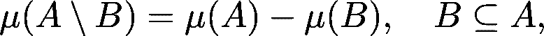**

**这是由于 *A \ B* 和 *B* 不相交，它们的并是 *A* 。**

**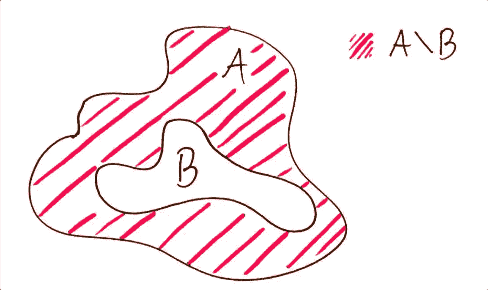**

**设置差异。**

**另一个重要的特性是度量的连续性。这上面说**

**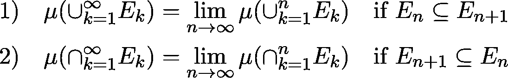**

**这个性质类似于实值函数的连续性定义，所以这个名字不是偶然的。**

## **描述度量**

**正如我们已经看到的 *σ* 代数，你只需要给出一个生成集，而不是一个完整的 *σ* 代数。这在我们使用度量时非常有用。尽管测度是在 *σ* 代数上定义的，但是在生成子集上定义它们就足够了，因为由于 *σ* 可加性，它决定了 *σ* 代数的每个元素上的测度。这是从**

# **概率的定义**

**现在一切都被设定为数学定义概率。**

**一个**概率空间**由元组定义**

**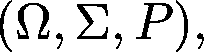**

**其中ω是基集，σ是其子集的*σ*-代数，并且 *P* 是这样的度量**

**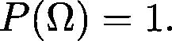**

**因此，概率与面积和体积等量密切相关。面积，体积，概率都是各自空间的度量。但是，这是一个相当抽象的概念，我们来举几个例子。**

## **扔硬币**

**最简单的概率空间，用抛硬币事件来描述。假设我们用 0 编码头部，用 1 编码尾部，我们有**

**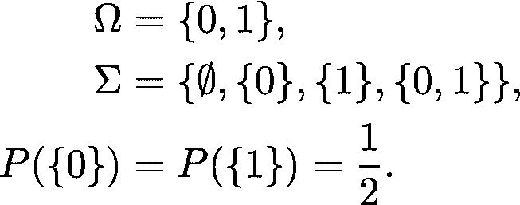**

**由于σ代数和测度的性质，你只需要定义事件 *{0* }(正面)和事件 *{1}* (反面)的概率，这就完全决定了概率测度。**

## **随机数**

**一个更有趣的例子与随机数生成有关。如果你熟悉 Python，你可能用过`random.random()`函数，它给你一个 0 到 1 之间的随机数。虽然这看起来很神秘，但是用概率空间来描述它是非常简单的。**

**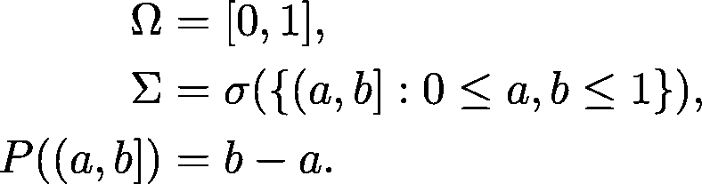**

**再次注意，给出生成集元素的概率就足够了。例如，我们有**

**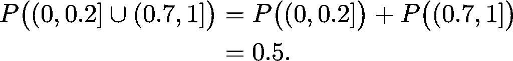**

**再看一个更复杂的例子，什么是 *P({0.5})* ？怎么才能算出挑到 0.5 的概率？(或 0 到 1 之间的任何其他数字。)为此，我们需要依赖测度的性质。我们有**

**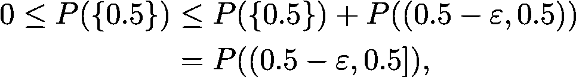**

**其中这适用于所有ε > 0 的情况。这里，我们使用了概率测度的可加性。因此，可以得出结论**

**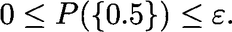**

**同样，因为它适用于所有ε > 0 的情况。这意味着概率小于任何一个正实数，所以一定为零。**

**对于任何 *0 ≤ x ≤ 1* ，类似的论点成立。令人惊讶的是，选择一个特定的数字的概率为零。所以，在你生成了随机数并观察了结果之后，要知道它发生的概率是 0。然而，结果仍然摆在你面前。**

> **零概率的事件都有可能发生。**

# **分布和密度**

**我们已经走了很长的路。尽管如此，从实用的角度来看，使用测度和σ-代数并不十分方便。幸运的是，这不是处理概率的唯一方法。**

**为了简单起见，让我们假设我们的基集是实数集。具体来说，我们有概率空间*(ω，σ，P)* ，其中**

**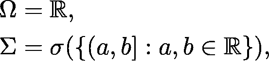**

**而 *P* 是这个空间上的任意概率测度。我们之前已经看到，事件 *(a，b】*的概率决定了事件空间中其余事件的概率。然而，我们可以进一步压缩这些信息。实际上，这个函数**

**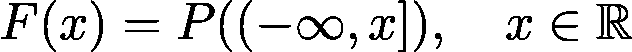**

**包含了我们必须知道的关于概率测度的所有信息。想想看:我们有**

**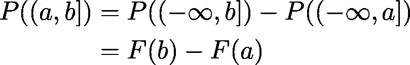**

**对于所有的 *a* 和 *b* 。这被称为 *P* 的**分配函数**。对于*所有的*概率测度，分布函数满足以下性质:**

**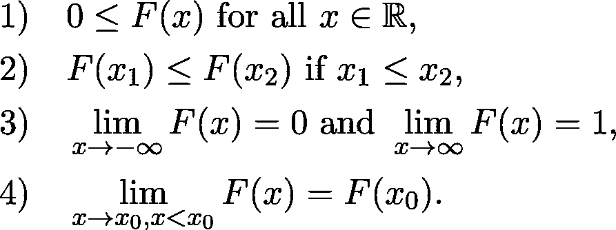**

**(第四个叫左连续性。如果你不熟悉连续性的定义，不要强调，它现在不是必不可少的。)**

**同样，如果这太抽象，让我们考虑一个例子。对于前面的随机数生成示例，我们有**

**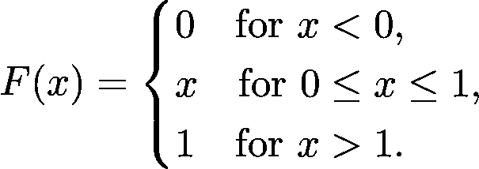**

**这被称为[0，1]上的**均匀分布**。**

**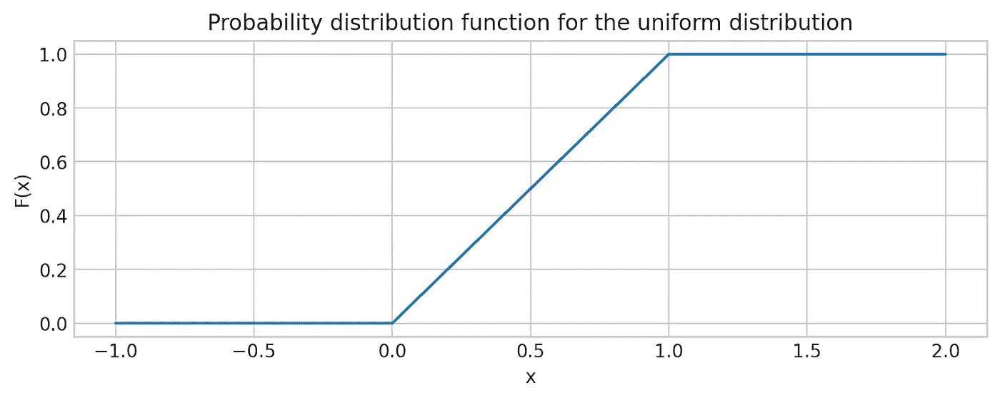**

**总而言之，**如果你给我一个概率测度，我会给你一个描述概率测度的分布函数**。然而，这并不是分布函数的最佳之处。从数学的角度来看，同样正确的是**如果你给出一个满足上述性质 1)-4)的函数，我可以从它构造一个概率测度**。而且，如果两个分布函数处处相等，那么它们对应的概率测度也是相等的。因此，从数学的角度来看，在某些情况下，分布函数和概率度量是相同的。这对我们极其有用。**

## **密度函数**

**正如我们所见，分布函数从概率度量中提取所有信息，并对其进行压缩。这是一个很好的工具，但有时并不方便。例如，当我们只有一个分布函数时，计算期望值是很困难的。(如果您不知道什么是期望值，请不要担心，我们现在不会使用它。)**

**出于许多实际目的，我们用**密度函数**来描述概率度量。一项功能**

**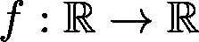**

**是概率测度 P 的密度函数**

**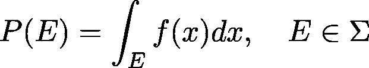**

**适用于所有的*E**σ*-代数*σ*。也就是说，启发式地，给定集合的概率由 *f(x)* 曲线下的面积决定。这个定义可能看起来很简单，但是这里隐藏了很多细节，我就不赘述了。例如，如何在任意集合 *E* 上积分一个函数一点也不简单。**

**你可能熟悉微积分中著名的牛顿-莱布尼茨法则。这里写着**

**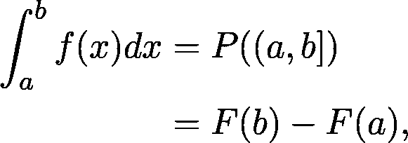**

**这基本上意味着，如果分布函数是可微的，它的导数就是密度函数。**

**有些概率分布只有密度函数是已知的封闭形式。(具有封闭形式意味着可以用有限个标准运算和初等函数来表示。)最著名的分布之一是这样的:高斯分布。它的定义是**

**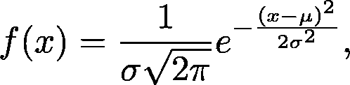**

**其中，μ和σ是参数。**

**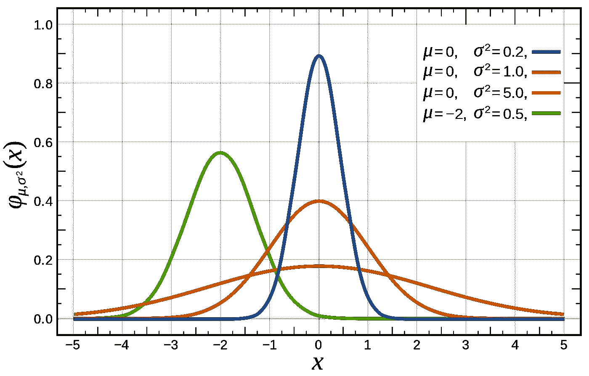**

**高斯分布的概率密度函数。来源:[维基百科](https://en.wikipedia.org/wiki/Normal_distribution#/media/File:Normal_Distribution_PDF.svg)**

**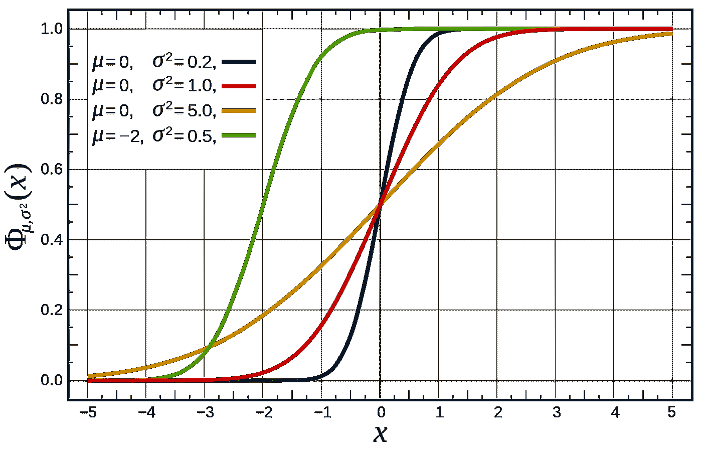**

**高斯分布的概率分布函数。来源:[维基百科](https://en.wikipedia.org/wiki/Normal_distribution#/media/File:Normal_Distribution_CDF.svg)**

**不管看起来多么令人惊讶，我们不能以封闭的形式表达高斯分布函数。并不是数学家只是还没想通，是证明了不可能。(相信我，在数学中证明某件事是不可能做到的有时是极其困难的。)**

# **从这里去哪里？**

**到目前为止，我们所看到的只是冰山一角。(想起来，这可以在每次关于数学的讨论结束时说。)这里，我们只是以数学上(半)精确的方式定义了什么是概率。**

> **真正有趣的东西，比如机器学习，还在我们面前。**

**如果你想开始深入，我写了一篇关于机器学习如何用概率论来表述的文章。看看吧！**

** [## 机器学习的统计基础

### 超越函数拟合的视角

towardsdatascience.com](/the-statistical-foundations-of-machine-learning-973c356a95f)** 

**[***如果你喜欢把机器学习概念拆开，理解是什么让它们运转，我们有很多共同点。看看我的博客，我经常在那里发表这样的技术文章！***](https://www.tivadardanka.com/blog)**