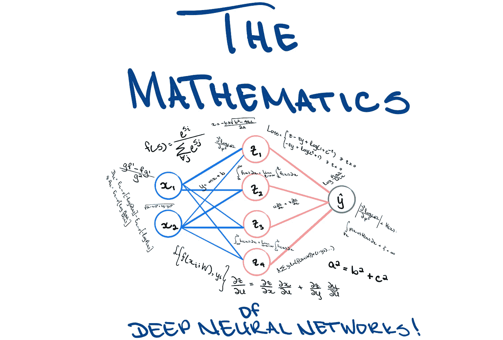
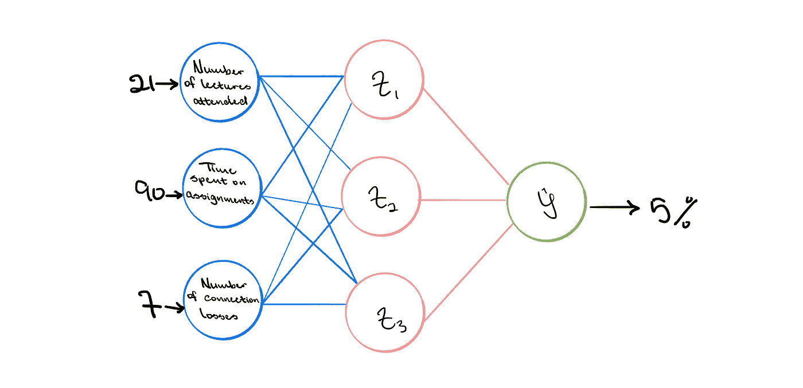
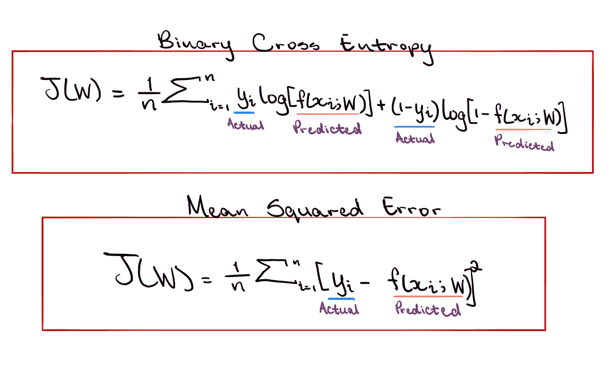
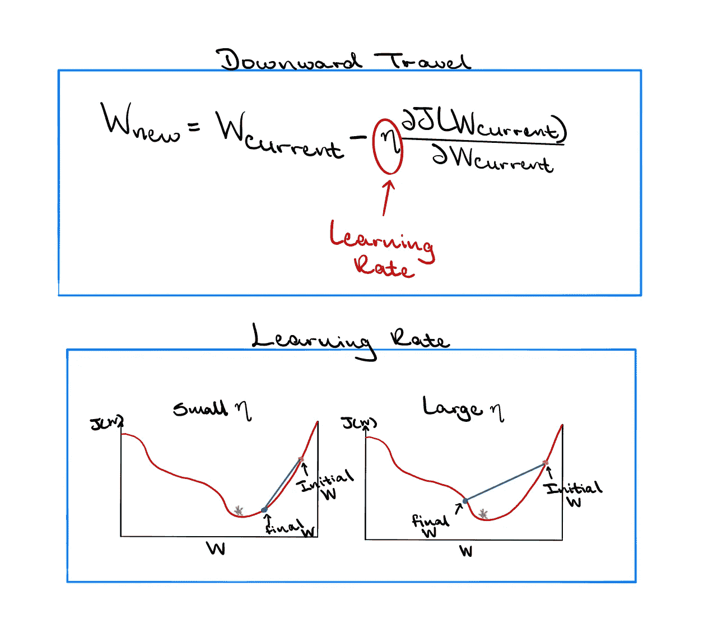
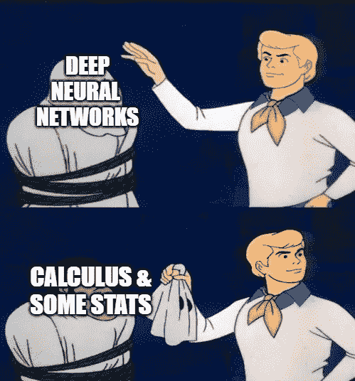

# 深度学习背后的数学

> 原文：<https://towardsdatascience.com/the-mathematics-behind-deep-learning-f6c35a0fe077?source=collection_archive---------11----------------------->

## 深度神经网络如何学习和适应的解释

图片作者:特里斯特·约瑟夫

深度神经网络(DNNs)本质上是通过具有多个连接的感知器形成的，其中感知器是单个神经元。将人工神经网络(ANN)想象成一个包含一组输入的系统，这些输入沿着加权路径馈送。然后对这些输入进行处理，并产生一个输出来执行某项任务。随着时间的推移，人工神经网络“学习”，并开发不同的路径。各种路径可以具有不同的权重，并且在模型中，被发现更重要(或产生更期望的结果)的路径比产生更少期望结果的路径被分配更高的权重。

在一个 DNN 中，如果所有的输入都密集地连接到所有的输出，那么这些层被称为**密集层**。此外，DNNs 可以包含多个**隐藏层**。隐藏层基本上是神经网络的输入和输出之间的点，在这里激活函数对输入的信息进行转换。它被称为隐藏层，因为它不能从系统的输入和输出直接观察到。神经网络越深入，网络就越能从数据中识别。

然而，尽管目标是尽可能多地从数据中学习，但深度学习模型可能会遭受过度拟合。当模型从训练数据中学习了太多内容(包括随机噪声)时，就会出现这种情况。然后，模型能够确定数据中非常复杂的模式，但这会对新数据的性能产生负面影响。训练数据中拾取的噪声不适用于新的或看不见的数据，并且该模型不能概括所发现的模式。非线性在深度学习模型中也非常重要。虽然模型将从多个隐藏层中学到很多，但是将线性形式应用于非线性问题将导致较差的性能。

图片作者:特里斯特·约瑟夫

现在问题来了，“这些层是怎么学习东西的？”好吧，让我们将人工神经网络应用于一个真实的场景来解决一个问题，并了解如何训练该模型来实现其目标。由于当前的疫情，许多学校已经过渡到虚拟学习，这导致一些学生担心他们通过课程的机会。“我会通过这门课吗”这个问题是任何人工智能系统都应该能够解决的。

为了简单起见，让我们考虑这个模型只有 3 个输入:学生参加的讲座的数量，在作业上花费的时间，以及在整个讲座期间互联网连接丢失的次数。该模型的输出将是二元分类；这个学生要么通过这门课，要么不及格。现在是学期末，学生 A 已经参加了 21 次讲座，花了 90 个小时做作业，并且在整个学期中失去了 7 次互联网连接。这些输入被输入到模型中，输出预测学生有 5%的机会通过课程。一周后，最终成绩公布，学生 *A* 通过了课程。那么，模型的预测出了什么问题呢？

技术上来说，没什么问题。这种模式本可以像目前开发的那样发挥作用。问题是模型不知道发生了什么。我们可能已经初始化了路径上的一些权重，但是模型目前不知道什么是对的，什么是错的；因此重量是不正确的。这就是学习的来源。这个想法是，模型需要理解什么时候它是错误的，我们通过计算某种形式的“损失”来做到这一点。正在计算的损失取决于手头的问题，但它通常涉及最小化预测输出和实际输出之间的差异。

图片作者:特里斯特·约瑟夫

在上面的场景中，只有一个学生和一个错误点需要最小化。然而，通常情况并非如此。现在，考虑有多个学生和多个差异要最小化。因此，总损失通常计算为所有预测值和实际观测值之差的平均值。

回想一下，正在计算的损失取决于手头的问题。因此，由于我们当前的问题是二元分类，适当的损失计算将是**交叉熵损失**。该函数背后的思想是，它将学生能否通过课程的预测分布与实际分布进行比较，并试图最小化这些分布之间的差异。

假设我们不再想预测学生是否会通过这门课，但是我们现在想预测他们在这门课上会得到的分数。交叉熵损失不再是合适的方法。相反，**均方误差损失**会更合适。这种方法适用于回归问题，其思想是试图最小化实际值和预测值之间的平方差。

图片作者:特里斯特·约瑟夫

现在我们已经了解了一些损失函数，我们可以进入损失优化和模型训练。拥有良好 dnn 的一个关键因素是拥有合适的权重。损耗优化应该试图找到一组权重， *W* ，其将最小化计算的损耗。如果只有一个重量分量，那么可以在二维图上画出重量和损失，然后选择使损失最小的重量。然而，大多数 dnn 具有多个权重分量，并且可视化一个 *n 维*图是相当困难的。

相反，计算损失函数相对于所有权重的导数，以确定最大上升的方向。既然模型知道哪条路是向上和向下的，它就向下行进，直到到达局部最小值的收敛点。一旦这个体面的完成，一组最佳的权重将被返回，这就是应该用于 DNN(假设该模型是发达国家)。

计算这个导数的过程被称为**反向传播**，它本质上是来自微积分的链式法则。考虑上面显示的神经网络，第一组权重的微小变化如何影响最终损失？这就是导数或梯度试图解释的。但是，第一组权重被输入到一个隐藏层，该隐藏层具有另一组权重，从而导致预测的输出和损失。因此，权重的改变对隐藏层的影响也应该被考虑。现在，这是网络中仅有的两部分。但是，如果有更多的权重需要考虑，这个过程将通过从输出到输入应用链式法则来继续。

图片作者:特里斯特·约瑟夫

训练 DNN 时需要考虑的另一个重要因素是学习速度。当模型寻找一组最优的权重时，它需要用某个因子来更新它的权重。虽然这看起来微不足道，但是决定模型应该移动的因素是相当困难的。如果这个因子太小，那么这个模型要么会以指数级的速度运行很长一段时间，要么会陷入某个非全局最小值的地方。如果因子太大，那么模型可能完全错过目标点，然后发散。

虽然固定速率可能是理想的，但是**自适应学习速率**减少了前面提到的问题的可能性。也就是说，该因子将根据当前的梯度、当前权重的大小或其他一些可能影响模型下一步找到最佳权重的因素而变化。

图片作者:特里斯特·约瑟夫

可以看出，dnn 是建立在微积分和一些统计的基础上的。评估这些过程背后的数学是有用的，因为它可以帮助人们理解模型中真正发生的事情，这可以导致开发更好的整体模型。但是，即使这些概念不容易理解，大多数程序都带有自动微分等工具，所以不用担心。编码快乐！

**参考文献:**

[digital trends . com/cool-tech/what-a-artificial-neural-network/](https://www.digitaltrends.com/cool-tech/what-is-an-artificial-neural-network/)

[deepai . org/machine-learning-glossary-and-terms/hidden-layer-machine-learning #:~:text = In % 20 neural % 20 networks % 2C % 20a % 20 hidden，inputs % 20 enter % 20 into % 20 the % 20 network。](https://deepai.org/machine-learning-glossary-and-terms/hidden-layer-machine-learning#:~:text=In%20neural%20networks%2C%20a%20hidden,inputs%20entered%20into%20the%20network.)

[ncbi.nlm.nih.gov/pmc/articles/PMC4960264/](https://www.ncbi.nlm.nih.gov/pmc/articles/PMC4960264/)

[towards data science . com/introduction-to-artificial-neural-networks-ann-1 EAE 15775 ef9](/introduction-to-artificial-neural-networks-ann-1aea15775ef9)

[explainthatstuff.com/introduction-to-neural-networks.html](https://www.explainthatstuff.com/introduction-to-neural-networks.html)

[neuralnetworksanddeeplearning.com/](http://neuralnetworksanddeeplearning.com/)

[mathsisfun.com/calculus/derivatives-rules.html](https://www.mathsisfun.com/calculus/derivatives-rules.html)

[d2l . ai/chapter _ appendix-深度学习数学/多变量微积分. html](https://d2l.ai/chapter_appendix-mathematics-for-deep-learning/multivariable-calculus.html)

**其他有用的材料:**

[deeplearning.mit.edu/](https://deeplearning.mit.edu/)

[math . UC Davis . edu/~ kouba/CalcOneDIRECTORY/chainruledirectory/chain rule . html](https://www.math.ucdavis.edu/~kouba/CalcOneDIRECTORY/chainruledirectory/ChainRule.html)

[youtube.com/watch?v=tGVnBAHLApA](https://www.youtube.com/watch?v=tGVnBAHLApA)

[https://www.inertia7.com/tristn](https://www.inertia7.com/tristn)

[youtube.com/watch?v=aircAruvnKk](https://www.youtube.com/watch?v=aircAruvnKk)

youtube.com/watch?v=bfmFfD2RIcg

[https://towards data science . com/what-is-deep-learning-ADF 5d 4 de 9 AFC](/what-is-deep-learning-adf5d4de9afc)