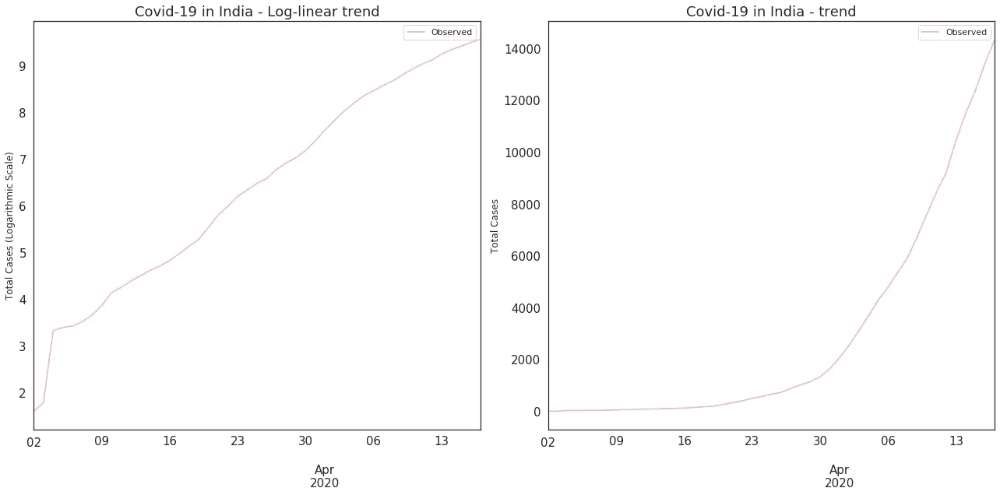
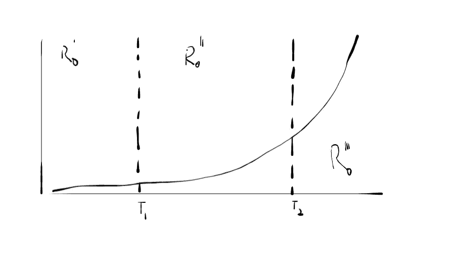
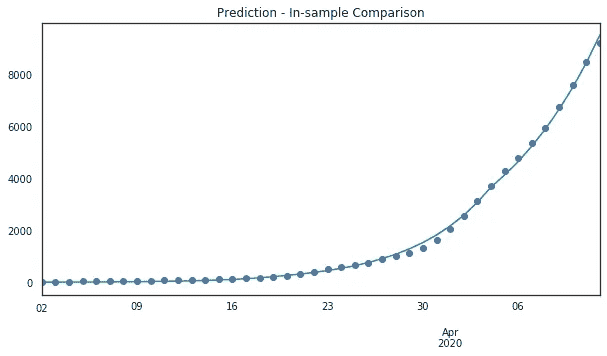
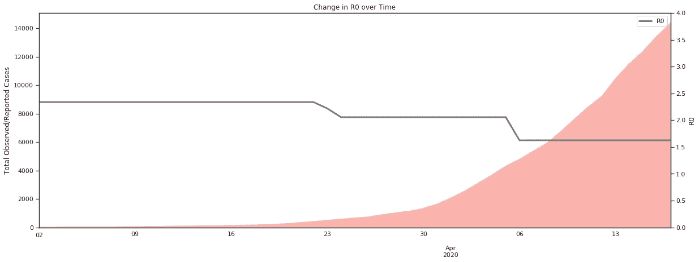
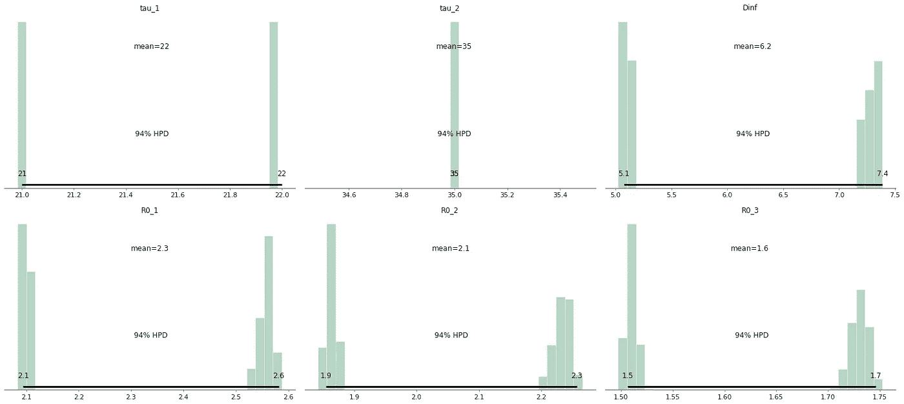

# 封锁一个国家背后的数学

> 原文：<https://towardsdatascience.com/the-mathematics-behind-the-lock-down-of-a-country-af5e31a8fdf?source=collection_archive---------21----------------------->


照片由来自 [Pexels](https://www.pexels.com/photo/person-doing-handcraft-face-mask-190589/?utm_content=attributionCopyText&utm_medium=referral&utm_source=pexels) 的 [Prasanta Kr Dutta](https://www.pexels.com/@pkddapacific?utm_content=attributionCopyText&utm_medium=referral&utm_source=pexels) 拍摄

## 理解 2020 年的印度大封锁

**免责声明:以下文字无意引起恐慌或伤害感情。这篇文章没有提出任何政治判断。这纯粹是一篇观点文章。我既不擅长数学建模，也不擅长流行病学。这项研究的结果有逻辑和推理的支持，并通过了适当的审查程序。**

**4 月 14 日，新德里:**当 10 点的钟声敲响时，印度总理纳伦德拉·莫迪在经历了 21 天的疯狂封锁后向全国发表讲话，成为头条新闻。

另一边是 13 亿人民，屏息静气地听他讲话。

这是至关重要的公告。这将决定未来几个月这个国家运作的条件。该国爆发的 n-CoV-SARS-2(也称为新冠肺炎)病例数刚刚超过 10，000 例。

到上午 10:30，消息传出去了。

该国在 5 月 3 日之前一直处于封锁状态。虽然我内心的客观现实主义者在这场险些酿成的灾难中松了一口气，但我内心的人性却只能感受到越来越多的沮丧和绝望。

到上午 10 点 45 分，电话开始打进来。

我妈妈先打电话来的。她被困在喀拉拉邦南部城市高知。自从我上次见到她已经快 4 个月了，我们现在都意识到我们再次见面还需要一段时间。

然后我的小弟弟打电话来了。他和我们的祖父母住在一起，在学校宣布停课前，他及时搬出了他的大学。他们都在首都新德里，也是此次疫情中受影响最严重的地区之一。他说他没事，但我能感觉到他的担心。还是我自己的？

我的家人接受他们眼中的生活。他们是现实主义者。既不悲观，也不乐观。我们都意识到这次关闭是必要的。重要。

在这个国家里，我们并不是唯一分散的、分离的群体。

[印度最近面临封锁后最大的移民危机，该国大城市近百万移民决定寻找回家的路。](https://www.bbc.com/news/world-asia-india-52086274)

我们都渴望回家。不是物理空间，而是与之相关的一切:稳定、爱、和平。

但是，有谁知道这种封锁是否有效吗？我们不知道。我不知道。

然而，我们希望，我们祈祷。

在我之前的帖子[请保持距离](/keep-your-distance-please-a-case-for-social-distancing-in-troubling-times-ff979f8e91a8)中，我试图通过一些复杂的数学，以及一些相当直观的概念来解释为什么以及如何产生社交距离。

这篇文章得到的热烈反响让我大吃一惊，也让我受宠若惊。谢谢你的支持，尤其是我的那些不愿透露姓名的评论者。

在这篇文章中，我试图提出我对诸如封锁这样的极端措施是否有效的想法。发表意见很容易，但用经验证据来支持一个观点要困难得多。在这篇文章中，我们试图寻找这种支持的证据。

但在继续之前，我必须提醒读者，我们将试图用一个数学模型来证明这一点。预计会有误差。

我们尝试将这个模型应用到印度的数据中。有人担心在这个国家进行的测试数量，这是我们必须认识到的警告。

任何概率模型的先验往往是一个有争议的问题，我乐于听取对我的选择的不同观点。

# 流行病学 101 —是的，先生

我们使用的是上一篇文章中提到的模型，[请保持距离](/keep-your-distance-please-a-case-for-social-distancing-in-troubling-times-ff979f8e91a8)。一个 SIR 模型。

作为一个复习，SIR 模型——首先在 1927 年开发——是一组微分方程，试图将一个群体分割成可接受群体、不可接受群体和可移动群体。

通过将模型与数据拟合，可以获得参数β和γ的估计值。

β、γ是该模型中最重要的两个元素。

*   β控制着接触率，即每个感染者每天被感染的平均接触次数
*   γ控制每天的清除率或恢复/死亡/隔离人员的比例

他们一起给予

*   R₀ = β/γ ∝ *每个原发病例的继发病例数*

与更复杂的模型相比，我选择 SIR 方法的原因是为了限制系统最终做出的假设数量。

我们如何求解这些参数？
嗯，有两种突出的方式。

# 确定性解还是概率性解？

在我之前的文章中，我们尝试的是一个确定性的模型——一个产生单一解决方案的模型。

另一方面，概率模型可以被证明是一种范式转变。它们通常使用模拟来解决。

这两种方法有什么区别？

一个**确定性的**模型不包括随机性的元素。每次你用相同的初始条件运行模型，你都会得到相同的结果。

大多数日常情况的简单数学模型是确定性的。你灯里的电压？决定性的。
通过银行账户赚取的利息？决定性的。

一个**概率**模型包含了随机性元素。每次运行模型时，即使初始条件相同，结果也可能略有不同。这些模型包含了随机变化的某些方面。

这些模型是如何工作的？

概率方法最直观的解释类似于用地图导航。

假设，你在一个你从未去过的城市，你必须确定你在哪里。你只有一张地图。就在你失去所有希望的时候，你的朋友打电话告诉你你在城市的南部*。这个信息叫做*。**

**你打算如何定位自己？嗯，你四处看看。**

**你猜测到你周围地标的距离。这些就是我们所说的 ***观察值*** 。**

**从逻辑上讲，你所需要做的就是在给你的地图上识别这些观察结果，瞧，你已经找到了你自己。**

**但对于一台机器来说，这并不是那么简单。那么，机器是如何做到的呢？**

**为此，我们使用 MCMC 采样或马尔可夫链蒙特卡罗采样。我们从先前的**中随机选取点**，即城市南部的随机点。**

**使用 Bayes 定理，每个人在他们的高中都必须学习的结果，MCMC 方法为每个采样点计算以下形式的机会…**

> **“假设我在 200 米处看到这个地标，我在这个位置的可能性有多大？”**

**这就是 MCMC 的闪光点。它智能地搜索**。它旨在通过探索附近的位置并从那些区域连续取样，向更高概率的区域收敛(*希望是*)。所以随着时间的推移，你能够识别你的位置。这是一个分布——因此，你可以理解估计值的变化，否则估计值会减少到一个点。****

****不过，理论已经说够了。****

********

****[罗马法师](https://unsplash.com/@roman_lazygeek?utm_source=medium&utm_medium=referral)在 [Unsplash](https://unsplash.com?utm_source=medium&utm_medium=referral) 上拍摄的照片****

# ****让我们换个话题——变点分析****

****前面的部分看了用贝叶斯术语陈述问题。
为了模拟新冠肺炎，概率方法针对每天的观测提出以下形式的问题:****

> ****“假设我们在第 19 天观察到了 8000 个案例，那么在 R₀为 2 的情况下发生这种情况的可能性有多大？”****

****事实上，流行病建模的概率方法已被广泛用于预测新冠肺炎的传播——最显著的应用是伦敦卫生和热带医学院和 London⁴.帝国理工学院所做的工作[这两个机构都在指导英国应对全球危机的策略。](https://www.nature.com/articles/d41586-020-01003-6)****

****我们使用两个 python 库`requests`和`pandas`，从[这里](https://www.covid19india.org/)访问印度的 CoViD 案例。它们提供 API，一个简单的 python 脚本就可以提取数据。这是一个众包数据库，数据与其他新闻报道一致。****

****让我们将数据可视化:****

********

****为了研究封锁的影响，我们设置了变化点。那是什么意思？一个简单的草图解释了这个想法。****

********

****绘制变化点——它们是如何工作的？****

****我们实质上是说，R₀变化有两个时间点。****

****在这里，点τ₁，τ₂在本质上是离散的，未知的。该过程将尝试估计这些。在这些时间段的每一个中，R₀也是未知的。****

****我们首先修改微分方程来解决这个问题****

```
****def _simulate_with_changepoints(parameters, times, N):
 beta_1, beta_2, beta_3, gamma, tau1, tau2 = [float(x) for x in parameters] def SIR(y, t, p):
    beta_1, beta_2, beta_3, gamma = p[0], p[1], p[2], p[3]
    tau1, tau2 = p[4], p[5]
    if t < tau1:
       beta = beta_1
    elif t >= tau1 and t < tau2:
       beta = beta_2
    elif t >= tau2:
       beta = beta_3
    S, I = y[0], y[1]
    dSdt = -beta * S * I / N
    dIdt = beta * S * I / N - gamma * I
    return dSdt, dIdt values = odeint(SIR, y0, times, (parameters,))
 return values.T[1]****
```

****我们在`pymc3`中陈述这个模型——一个用于概率编程的 python 包。****

```
****num_days = len(Infected)
with pm.Model() as SIR_forward_model:    
    R0_1 = pm.Uniform('R0_1', lower=1, upper=6, testval=2)
    R0_2 = pm.Uniform('R0_2', lower=1, upper=6, testval=2)
    R0_3 = pm.Uniform('R0_3', lower=1, upper=6, testval=2) tau_1 = pm.DiscreteUniform('tau_1', lower=1, upper=num_days)
    tau_2 = pm.DiscreteUniform('tau_2', lower=tau_1, upper=num_days) Dinf = pm.Uniform('Dinf', lower=0, upper=15, testval=7) gamma = pm.Deterministic('gamma', 1 / Dinf)
    beta_1 = pm.Deterministic('beta_1', R0_1 / Dinf)
    beta_2 = pm.Deterministic('beta_2', R0_2 / Dinf)
    beta_3 = pm.Deterministic('beta_3', R0_3 / Dinf) forward = th_forward_model(beta_1, beta_2, beta_3, gamma, tau_1, tau_2)
    Y = pm.Poisson('Y', mu=forward, observed=Infected)****
```

****在上面的模型定义中，我们假设所有的 R₀'s 都来自从 1 到 6 的均匀分布。****

> ****这意味着 1 到 6 之间的每个数字都有相等的出现概率****

****感染期，1/γ，或者定义为 D∞，来自 0 天到 15 天的均匀分布。****

> ****这意味着 0 到 15 之间的每个数字都有相等的出现概率****

****由此我们构造出γ和β₁、β₂、β₃.的方程****

> ****γ = 1 / D∞
> βᵢ = R₀ᵢ / D∞****

****我们假设这种病毒的感染期不会随着时间的推移而改变。只有接触率发生变化。****

****切换点被设置为离散的统一先验，这意味着它们只能取从 1 日到数据最后一天的离散值，每天的概率相等。****

****有了这些**先验**，我们可以使用泊松分布来拟合模型，因为我们处理的数据是原始计数数据。****

****考虑到我们正在处理近 50 天的数据，我已经分离出最近 10%的数据进行验证。我们运行 6000 次模拟来估计参数。****

****模特合体看起来怎么样？****

********

****这导致了 17%的 MAPE(平均绝对百分比误差)。
这意味着预测值在∓实际值的 17%以内。****

****为了建立信心，我们对照尚未输入模型的数据检查结果，即被隔离且未用于导出参数的 5 天( ***基于时间序列分割的样本外验证*** )。****

****在这个数据集上，我们得到了 14%的 MAPE。****

****这为基于该模型构建推论提供了一些信心。****

****那么，这些推论是什么呢？****

********

****来自 [Pexels](https://www.pexels.com/photo/yellow-bulb-1556704/?utm_content=attributionCopyText&utm_medium=referral&utm_source=pexels) 的[丹尼尔·雷彻](https://www.pexels.com/@daniel-reche-718241?utm_content=attributionCopyText&utm_medium=referral&utm_source=pexels)的照片****

# ****结论****

****一旦模型拟合完成，并且模型的预测能力得到评估，我们就可以看到参数推断是什么。****

****如果你画出平均 R₀随时间的变化，结果是你永远无法理解的。我第一次看到这个的时候，有点震惊。****

****锁定似乎起作用了！****

********

****其他参数呢？****

****鉴于我们提取了 3 月 2 日的数据，这就使我们对以下情况有了正确的认识:****

*   ****τ₁位于 3 月 23 日至 3 月 24 日之间(从 3 月 2 日起 21-22 天)。这与封锁的开始(3 月 25 日)相一致。
    在此之前，R₀在 2.1 到 2.6 之间。这是一个很高的数字。如果早一点实施封锁，这种情况本可以得到遏制。****
*   ****τ₂在 4 月 5 日(离 3 月 2 日还有 35 天)。
    从上图可以看出，在 3 月 24 日到 4 月 5 日之间，R₀的估计值在 1.9 到 2.3 之间变化。这可能意味着，虽然一些国家正在实施社会距离做法，从而看到 R₀下降，但其他国家的反应较慢。****
*   ****4 月 5 日以后，R₀从 1.5 到 1.7 不等。这比印度危机的初始阶段减少了 31%。****
*   ****感染期 D∞，估计在 5.1 天和 7.4 天之间。这与[最近的研究](https://www.thelancet.com/journals/langlo/article/PIIS2214-109X(20)30074-7/fulltext)提供的估计相符。****

****从下图中，我们可以看到大多数结果都是双峰的。这意味着有两个收敛点——*直方图*中的条在特定点达到峰值，具体来说是两个点。这可能是因为在广阔的印度次大陆上有大量的移民。对于即将到来的危机，每个州都有自己的立场。****

********

****抽样后的后验分布估计****

****这一见解让我兴奋地去理解和进一步分析这个国家各州的数据。这种性质的分析有多种应用，我计划大约每周使用一种。所以，请继续关注这些更新！****

# ****结论****

****分析结束时，我百感交集。我想起了阿兰达蒂·洛伊最近一篇文章中的一句话。****

> ****我们当中谁不是庸医流行病学家、病毒学家、统计学家和预言家？****

****我确实想提倡这种分析。有足够的理由这样做。印度数学科学研究所[最近的一项研究得出结论，扁平化的影响在 4 月 6 日开始显现。](https://www.financialexpress.com/lifestyle/health/india-coronavirus-cases-near-10000-flattening-of-covid-19-curve-still-a-little-away/1927332/)这些都符合上面的估计。感染期和 R₀在印度媒体报道的范围之内。
[一位著名的经济学家也认同这些发现，尽管采用了不同的方法，这份报告已于 4 月 24 日提交给印度政府。](https://theprint.in/india/is-indias-covid-19-curve-flattening-cases-now-double-every-10-days-from-3-before-lockdown/404616/)****

****然而，这个模型也有警告。这个系统没有考虑到无症状的个体。这个系统没有计算潜伏期。我们假设人口是同质的。****

****此外，印度因没有进行足够的试验而受到批评。如果这是正确的，没有进行足够的测试可能意味着所有的预测和见解都是不真实的。毕竟，这个模型符合现有的数据。****

****至于根据这个模型的输出来做决定，我反对。如果有什么推论的话，那就是:****

******参数的双模态性质表明传染病仍然逍遥法外。请呆在家里。冒险出去不安全。******

******保持物理距离。隔离。******

******封锁只有在人们不出门的情况下才能起作用。******

****当我写这篇文章时，时钟已经敲响了凌晨 4 点。看着这些数字，我的希望很高，我不禁觉得我们会渡过难关。****

****我提醒自己:我们是现实主义者。既不悲观，也不乐观。****

****然而，我们希望，我们祈祷。****

*******编者按:*** [*走向数据科学*](http://towardsdatascience.com/) *是一份以数据科学和机器学习研究为主的中型刊物。我们不是健康专家或流行病学家，本文的观点不应被解释为专业建议。想了解更多关于疫情冠状病毒的信息，可以点击* [*这里*](https://www.who.int/emergencies/diseases/novel-coronavirus-2019/situation-reports) *。*****

******参考文献:******

1.  ****[https://www . livemint . com/news/India/coronavirus-update-新冠肺炎-印度病例数-超过 10，000-国家数量-11586831204582.html](https://www.livemint.com/news/india/coronavirus-update-covid-19-cases-in-india-rise-over-10-000-state-wise-numbers-11586831204582.html)****
2.  ****W. O .科马克和 A. G .麦肯德里克。1927."对流行病数学理论的贡献."英国皇家学会学报，A 辑 115:700–721。****
3.  ****J.库恰尔斯基等人。all，2020，新冠肺炎传播和控制的早期动力学:一项数学建模研究，The Lancet(传染病)，[https://www . The Lancet . com/journals/LAN INF/article/piis 1473-3099(20)30144-4/full text](https://www.thelancet.com/journals/laninf/article/PIIS1473-3099(20)30144-4/fulltext)****
4.  ****弗拉克斯曼等人。all，2020，估计 11 个欧洲国家的感染人数和非药物干预对新冠肺炎的影响，伦敦帝国理工学院，[https://www . Imperial . AC . uk/MRC-global-infectious-disease-analysis/新冠肺炎/report-13-Europe-NPI-impact/](https://www.imperial.ac.uk/mrc-global-infectious-disease-analysis/covid-19/report-13-europe-npi-impact/)****