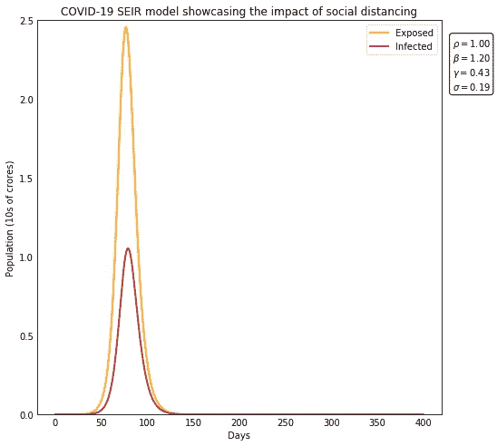
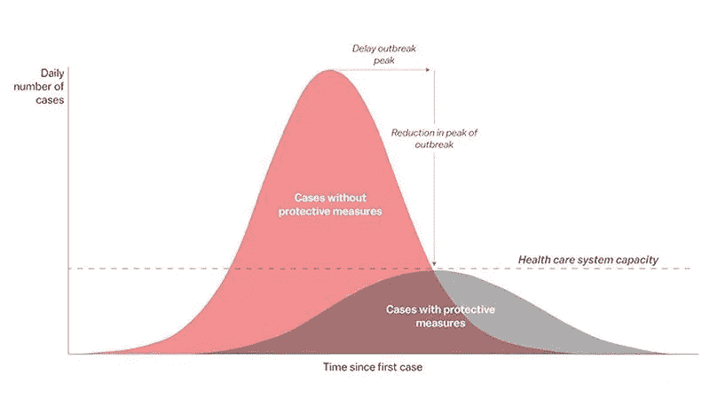
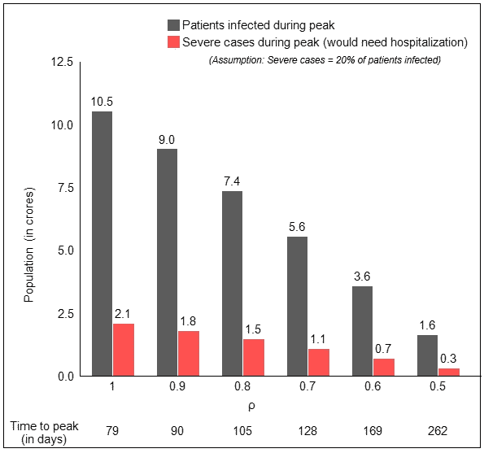
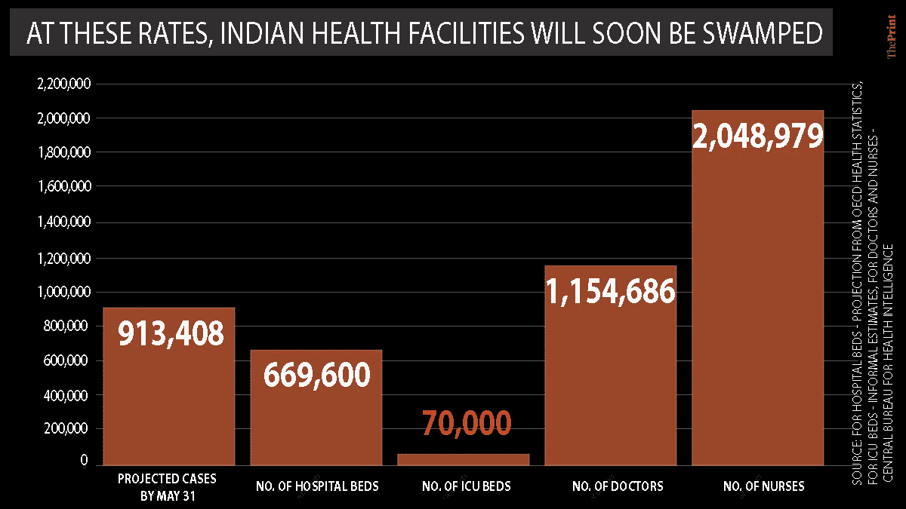
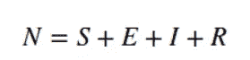
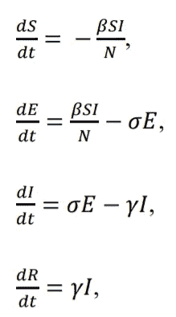
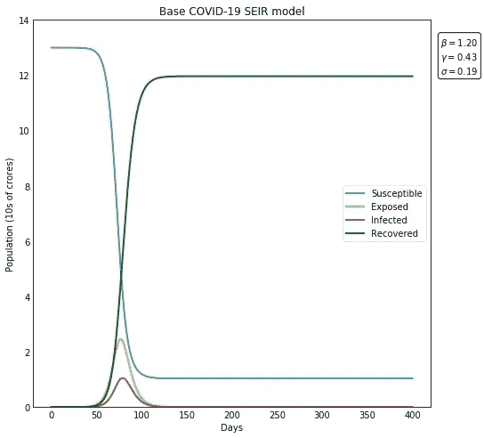

# 锁定和社交距离的数学

> 原文：<https://towardsdatascience.com/the-mathematics-of-lockdown-social-distancing-1257bc685022?source=collection_archive---------27----------------------->

## 使用经典 SEIR 模型量化社会距离在遏制新冠肺炎病毒传播中的影响

*(* ***)免责声明:*** *这项工作中出现的见解是方向性的，因为这里使用的 SEIR 模型是一个经典模型。尽管如此，该模型仍然能够很好地量化社交距离锁定的影响以及它们在“拉平曲线”中所起的作用。但由于我不是流行病学家，这篇文章的观点不应被解释为专业建议。)*

为了遏制新冠肺炎的蔓延，印度采取了一项激烈的措施，从 2020 年 3 月 25 日开始，印度进入了为期 21 天的封锁期。即使是病毒的发源地中国，也没有采取如此极端的措施，只是封锁了几个处于冠状病毒传播高峰期的省份。

别误会，鉴于目前的情况，我完全赞成全面封锁。但是全国范围的封锁让我好奇，情况(或者可能是预测的情况)可能有多糟糕，政府决定将 13 亿人关在家里 3 周。这个想法让我兴奋不已，我开始浏览网页寻找更多信息，最终找到了世卫组织网站上发布的研究论文和 ICMR 最近完成的研究。这些研究构成了我这篇博文的基础。

为了这个项目，我基本上建立了一个经典的 SEIR 流行病学模型来模拟在不同程度的社会距离措施下新冠肺炎在印度的传播。

博客分为两部分。在第一部分中，我试图在模型产生的投影背后发展一种高层次的直觉。在第 2 部分中，我更深入地研究了分析的数学方法，并谈到了我是如何实现这个模型的。

# **第 1 部分:为什么印度现在需要全面封锁？**

ρ=0 表示完全封闭，而ρ=1 表示完全没有社交距离。观察随着社交距离的增加，即ρ的降低，曲线变平，峰值延迟

这篇文章的重点是变量ρ，它的范围是从 0 到 1，是这个模型衡量社会中正在实行的社会距离的程度。ρ=0 表示社区中的完全封锁，而ρ=1 表示根本没有社交距离或隔离。

还要注意的是，如果一个人已经感染了疾病，但仍处于潜伏期(即，该人或多或少没有症状，但携带病毒)，则该人被称为*。潜伏期结束后，患者进入 ***感染*** 阶段。*

*从上面的可视化中可以看出，ρ的降低，以及由此导致的社会距离严重性的增加—
a)导致受感染个体的峰值变平
b)延迟了曲线达到峰值所需的时间*

*因此，如果严格的隔离和隔离得到遵守，那么当高峰到来时，感染病例的数量将会低得多。在乐观的情况下，这个数字会足够低，以至于印度的医疗保健系统不会在高峰期间感染人数的重压下崩溃。*

**

*来源: [Vox](https://www.vox.com/2020/3/10/21171481/coronavirus-us-cases-quarantine-cancellation)*

*这个模拟确实显示了完全封锁在降低峰值方面的重要作用。但我们真正谈论的是多少奉承。为了理解这一点，让我们来看看预计在不久的将来可能需要住院治疗的受感染人数。*

**

*感染和严重感染病例的预计数量与ρ的函数关系*

*从上图中可以看出，即使相当乐观的ρ为 0.6(如果实行自愿的社会距离，可能会是这种情况)，从现在起大约 5 个月后，印度将有大约 35 亿人感染。各种科学文章[以及世卫组织的这篇报道](https://www.businesstoday.in/top-story/covid-19-cases-rise-to-107-india-faces-shortage-of-ventilators-icu-beds/story/398269.html)[称，20%的感染者需要住院治疗，甚至可能需要重症监护室级别的护理。如果我们将同样的数字外推到我们的模拟中，我们将会有大约 700 万人在高峰期需要住院治疗。客观来看，印度总共只有大约 70 万张医院病床和 7 万张重症监护室病床。](https://www.who.int/docs/default-source/coronaviruse/situation-reports/20200306-sitrep-46-covid-19.pdf?sfvrsn=96b04adf_2)*

**

*来源: [The Print](https://theprint.in/opinion/current-rate-india-30000-covid-19-deaths-may-no-hospital-bed-june-data/385386/)*

*这就是为什么印度需要一个激烈的措施，如全国范围的封锁，以尽可能降低这个ρ。*

*不用说，现在ρ=1 意味着我们在劫难逃。*

# ***第二部分:了解 SEIR 流行病学模型！***

*SEIR 是用于模拟疾病如何在人群中传播的房室模型。是**易感、暴露、感染、康复**的首字母缩写。*

**

*来源:[世卫组织](https://www.who.int/bulletin/online_first/20-255695.pdf)*

****易感*** 人群包括尚未感染或未患病的所有人。如果一个人已经感染了这种疾病，但仍处于潜伏期(即，尽管他携带病毒，但或多或少没有症状)，那么他就被称为 ***暴露者*** 。潜伏期结束后，患者进入 ***感染*** 阶段。接下来，他移动到最后的*移除* 阶段，在那里他不再被感染。现在，取决于你的思想构成有多黑暗(也取决于你正在阅读的教科书)，这个阶段可能意味着个体 ***康复*** 并且现在对疾病免疫，或者他死于疾病，因此不在人口中，或者可能是两种情况的结合。*

*接下来，如果 N 是考虑中的总人口，并且如果我们可以假设在病毒传播期间人口中没有增加任何个体，下面的等式应该成立-*

**

*其中 S 是易患该疾病的人数，E 是暴露的人数，R 是康复或死亡的人数。*

*在这个项目中，我使用了 N = 1.3 亿(印度人口)，并借用了以下印度新冠肺炎的统计数据，这些数据是 3 月 25 日从[卫生部&家庭福利](https://www.mohfw.gov.in/)的网站上获得的，并将它们输入到模型中*

**当前 I =确诊(感染)病例数:563
当前 R=痊愈数:43 +死亡数:10 = 53**

*为了计算初始 E，我采用了
*中引用的方法当前 E = 2.399 *天前的感染病例数(*[*249*](https://en.wikipedia.org/wiki/Timeline_of_the_2020_coronavirus_pandemic_in_India)*)~ 600**

*最后，我们有下面一组非线性常微分方程，它们一起形成了基本的 SEIR 模型(排除了社会距离的影响):*

**

*其中 **β，σ，γ** 是一个人从一个阶段进入另一个阶段的概率或速率。*

1.  ***β:** 控制传播速度；它表示在易感者和感染者之间传播疾病的可能性。(我用[【2】](http://www.ijmr.org.in/temp/IndianJMedRes000-1048895_025448.pdf)*中引用的生殖数字计算出这个值为 1.19)。*
2.  ***σ:** 是潜伏(暴露)个体变得有传染性的速率。它相当于 1/Y，其中 Y 是平均孵化持续时间。(模拟使用 Y=5.2，如引用的[【1】](https://www.who.int/bulletin/online_first/20-255695.pdf))*
3.  ***γ** =1/D，其中 D 为感染的平均恢复期 D。(模拟使用了[【1】](https://www.who.int/bulletin/online_first/20-255695.pdf)中引用的 D=2.3)*

*( ***** a .再生数，Ro =β/γ
b . ICMR 的研究表明，在最乐观的情况下 Ro 等于 1.5，在悲观的情况下 Ro 等于 4。我取了这两个数字的平均值来得出这个项目的β值)*

**

*下一步，我们需要考虑一个变量来捕捉社会距离的影响。这就是我们引入已经详细讨论过的 **ρ** 的时候。我们需要做的就是在上述方程组中用 **ρβ** 替换 **β** ，并针对不同的ρ值进行仿真。*

*最后，为了用 python 解决这个修改过的非线性 ODE 系统，我使用了 scipy 库的 *odeint* 函数。你可以在这里找到代码。*

*SEIR 模拟代码*

*希望现在你能更好地理解为什么印度在接下来的几周需要封锁。也许现在你可以理解总理莫迪警告严格遵守 21 天的封锁或看着这个国家被推回 21 年背后的重量。*

*希望现在你理解了锁定和社交距离的数学原理！*

*对这个国家来说，这真是一个艰难的时刻。你至少可以呆在你的沙发上，洗洗手，保持安全！*

**找我* [*这里*](http://definitelyarnav.github.io) *了解更多。**