# 深度学习的数学优化

> 原文：<https://towardsdatascience.com/the-mathematics-of-optimization-for-deep-learning-11af2b1fda30?source=collection_archive---------3----------------------->

## 关于如何最小化具有数百万个变量的函数的简要指南

通常，神经网络的整体性能取决于几个因素。通常最引人注目的是网络架构，然而，这只是众多重要组件中的一个。一个经常被忽略的对高性能算法的贡献者是优化器，它被用来拟合模型。

为了说明优化的复杂性，ResNet18 架构有 11689512 个参数。寻找最优参数配置就是在 11689512 维空间中定位一个点。如果我们强行这样做，我们可能会决定将这个空间划分为一个网格，假设我们沿着每个维度选择 10 个点。然后，我们必须检查 10 个⁶⁸⁹⁵可能的配置，计算每个配置的损失函数，并找到损失最小的配置。客观地看，这个可观测的宇宙大约有 10⁸原子，估计年龄为 4.32 x 10 ⁷秒(约 137 亿年)。如果我们每秒钟检查的参数组态和从大爆炸开始的原子数一样多，那么到目前为止，我们已经能够检查 4.32×10 个⁴点。

说这甚至不接近是一种轻描淡写。如果我们让宇宙中的每一个原子都检查一个自大爆炸以来的构型，网格的大小仍然比我们所能检查的大大约 10⁸ ⁸⁴倍。

因此，优化是非常重要的。他们正在管理这种不可理解的复杂性，允许你在几天内而不是几十亿年内训练神经网络。接下来，我们将深入研究优化者的数学，看看他们是如何处理这个看似不可能的任务的。

# 优化的基础

让我们从简单的开始，假设我们有一个我们想要最大化的一元函数。(在机器学习上下文中，我们一般以最小化损失函数为目标，但最小化与最大化函数的负值是相同的。)定义

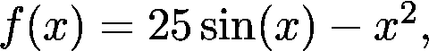

如果我们画出它的图表，它看起来像下面这样。

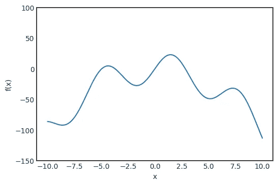

一个显而易见的优化方法是将线分成网格，检查每个点的值，并选择函数最大化的点。正如我们在简介中看到的，这是不可扩展的，因此我们将寻找另一种解决方案。让我们想象这是一个山区景观，我们是登山者，试图到达顶峰。假设我们在标有红点的地方。

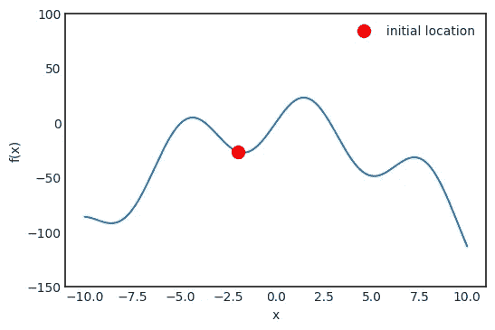

如果我们想找到顶峰，我们应该朝哪个方向走？当然要去坡度越来越大的地方。这个概念通过函数的*导数*来形式化。数学上，导数定义为

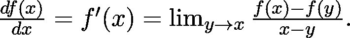

虽然这个量乍一看似乎很神秘，但它有一个非常简单的几何意义。让我们更仔细地看看函数在求导点的位置。

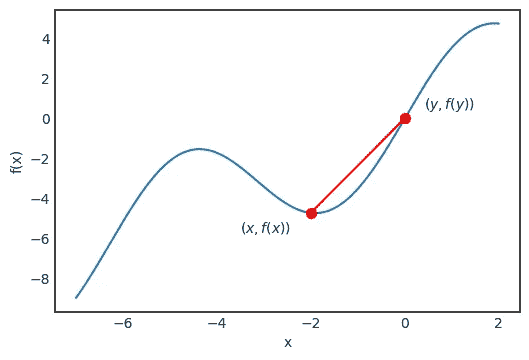

对于任一 *x* 和 *y* ，通过 *f(x)* 和 *f(y)* 的直线由下式定义

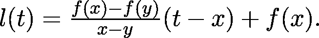

一般来说，如果我们有一条由 *at + b* 定义的线，对于某些 *a* 和 *b* ，量 *a* 称为该线的*斜率*。这可以是负的，也可以是正的，正斜率的线向上，负斜率的线向下。绝对值越大，线条越陡。如果我们让 *y* 越来越接近 *x* 就像它在导数的定义中一样，我们看到这条线变成了函数图在 *x* 处的切线。

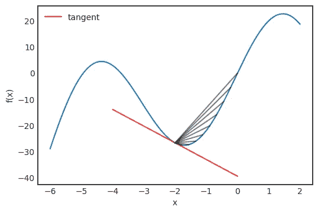

f(x)在 x = -2.0 处的切线和逼近线

正切值由函数给出

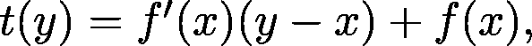

而它的方向可以用向量 *(1，f’(x))*来描述。

如果我们再次把自己想象成一个登山者的位置，从 *x0 = -2.0* 开始，我们应该往切线上升的方向走。如果切线的斜率很大，我们也愿意迈一大步，而如果斜率接近于零，我们就应该迈一小步，以确保不越过峰值。为了从数学上形式化这一点，我们应该转到下一点

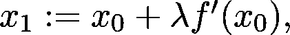

其中λ是一个参数，设置步长应该是正确的方向。这叫做*学习率*。一般来说，后续步骤由以下内容定义

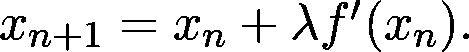

正导数意味着切线是增加的，所以我们想前进，而负导数是减少的，所以我们想返回。我们可以想象这个过程。

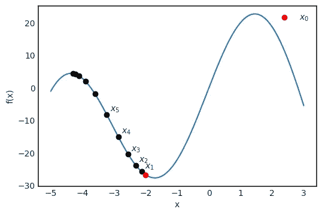

我们可以看到，这个简单的算法成功地找到了一个峰值。但是，这并不是函数的全局最大值，看图像就能看出来。稍微超前一点，这是一个广泛的优化算法家族的潜在问题，但是有解决方案。

在这个简单的例子中，我们只最大化了一个单一变量的函数。这有助于说明这个概念，但是，在现实生活中，可能存在数百万个变量。对于神经网络来说，肯定是这样的。在下一部分中，我们将会看到这个简单的算法是如何被推广到多维函数的优化中的！

# 多维度优化

对于一个单变量的函数，我们可以认为导数是切线的斜率。然而，对于多个变量，情况并非如此。我们先通过看一个具体的例子来试着建立直觉吧！定义函数

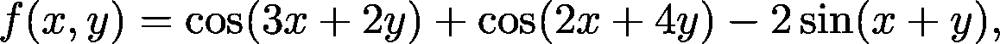

这将是本节中的玩具示例。

f(x，y)的图

对于二元函数，图形是一个曲面。我们立即看到切线的概念没有很好的定义，因为我们有许多线与曲面上的一个给定点相切。事实上，我们有一整架飞机。这被称为*切面*。

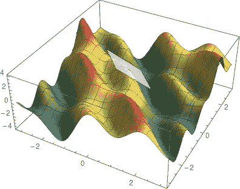

f(x，y)在(0，0)处的切平面

然而，这个切面包含两个非常特殊的方向。假设我们在看 *(0，0)* 处的切面。对于每一个多变量函数来说，除了一个变量之外，固定所有的变量基本上是一个单变量的函数。在我们的情况下，我们会

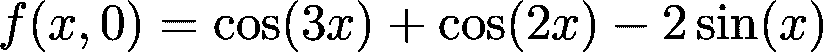

和

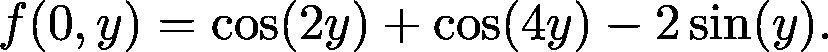

这些功能可以通过用一个垂直于其中一个轴的垂直平面来切割表面来可视化。平面和曲面相交的地方就是 *f(x，0)* 或者 *f(0，y)* 的图，这取决于你用的是哪个平面。

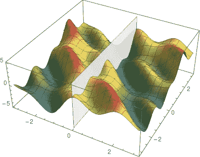

用垂直平面切割曲面以可视化 f(0，y)

对于这些函数，我们可以像上一节那样定义导数。这些被称为*偏导数*，它们在推广我们之前的峰值发现算法中起着重要作用。从数学上来说，它们被定义为

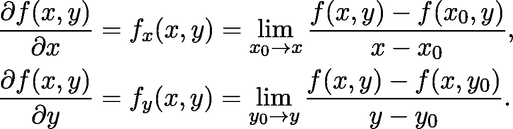

每一个偏导数代表我们切面上的一个方向。

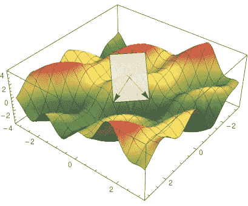

可视化切面上偏导数的方向。

偏导数的值是特殊切线的斜率。最陡上升方向由*坡度*给出，其定义如下

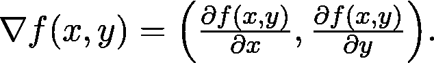

注意，梯度是参数空间中的一个方向。梯度可以很容易地在二维平面中可视化，在我们的例子中如下所示。

f(x，y)的渐变

总而言之，峰值发现算法现在是

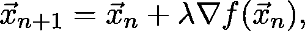

这被称为*梯度上升*。如果我们想找到一个函数的最小值，我们将向负梯度方向迈出一步，这是最陡下降的方向:

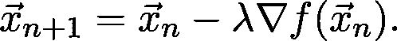

这个版本被称为*梯度下降*，你可能更频繁地看到这个版本，因为在机器学习中，我们实际上希望最小化损失。

## 为什么坡度指向最陡的上坡？

在这种情况下，为什么坡度会给我们最陡上升的方向，这并不是无关紧要的。为了给出精确的解释，我们需要做一些数学计算。除了用垂直于 *x* 或 *y* 轴的垂直面切割表面外，还可以用任意方向 *(a，b)* 给定的垂直面切割。有了偏导数，我们就有了

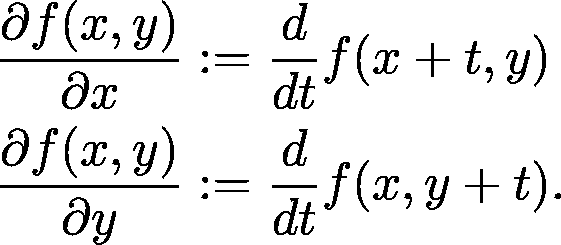

我们可以把这些看作是 *f(x，y)* 沿 *(1，0)**(0，1)* 方向的导数。虽然这些方向有特殊的意义，但是对于任何方向我们都可以这样做。假设我们有方向

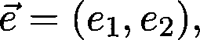

那么*相对于该方向的方向导数*定义如下

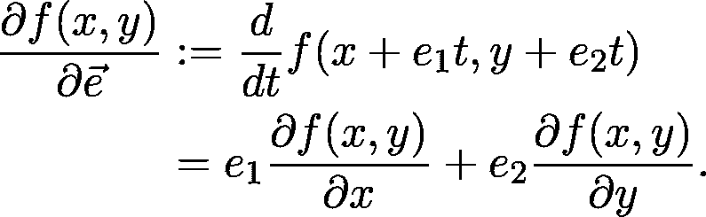

请注意，最后一个恒等式就是方向向量和梯度的点积(也称为标量或内积),这个点积你们可能在高中几何课上遇到过。所以，

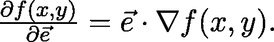

问题如下:哪个方向的方向导数最大？这将是最陡上升的方向，所以如果我们想优化，我们想知道这个特定的方向。要看到这不是别的，而是我们提到的梯度本身，回想一下，点积可以写成

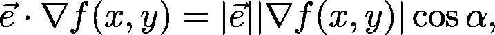

其中|。|表示向量的长度，α是两个向量之间的角度。(这在任意维数都成立，不仅仅是二维。)很容易看出这个表达式在 *cos α = 1* 时最大化，即α为零。这意味着两个向量是平行的，因此 *e* 的方向必须与梯度相同。

# 训练神经网络

现在我们准备从理论走向实践，看看如何训练神经网络。假设我们的任务是将图像的 *n* 维特征向量分成 *c* 类。为了在数学上形式化我们的情况，我们的神经网络由函数 *f* 表示，将 *n* 维特征空间映射到 *c* 维空间:

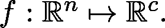

神经网络本身是一个参数化的函数。为了表示方便，我们可以用一个单一的 m 维向量来表示它的参数

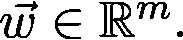

为了明确表达对参数的依赖，习惯上要写

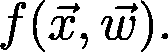

训练神经网络相当于寻找损失函数的最小值

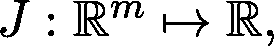

将神经网络参数空间映射到实数。损失函数采取以下形式

在哪里

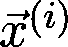

第*个数据点是否有观测值*

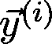

并且 *L* 是逐项损失函数。例如，如果 *J* 是交叉熵损失，那么

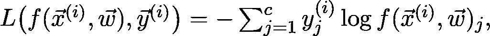

在哪里

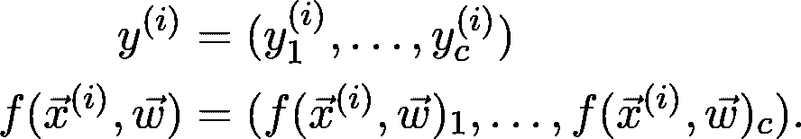

这可能看起来很简单，但是计算起来确实很困难。在现实生活中，数据点的数量 *N* 可以以百万计，更不用说参数的数量 *m* 了。因此，我们有一个包含数百万项的和，为此我们需要计算数百万个导数来最小化。如何在实践中解决这个问题？

## 随机梯度下降

为了使用梯度下降，我们必须计算

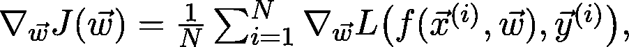

如果 *N* 很大，并且 *N* 很有希望*非常*大(因为我们需要大量数据)，那么这在计算上是非常密集的。我们能简化这个吗？一种方法是省略 sum 中的一些成员。虽然这听起来像一个临时的解决方案，但它有坚实的理论基础。要看到这一点，请注意 *J* 实际上可以写成*期望值*:

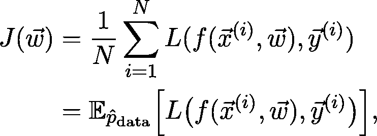

在哪里

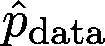

是由我们的训练数据给出的(经验)概率分布。我们可以处理这个序列

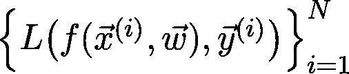

独立的，同分布的随机变量。根据大数定律，

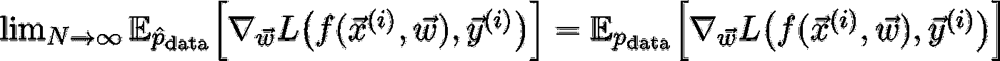

保持，在哪里

才是真正的底层分布。(具体哪个不得而知。)更详细地说，这意味着随着我们增加训练数据，我们的损失函数收敛于真实损失。因此，如果我们对数据进行二次抽样，并且只计算梯度

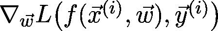

对于某些人而不是所有人，如果我们计算得足够多，我们仍然可以得到一个合理的估计。这被称为*随机梯度下降*或简称 SGD。

在我看来，有三个基本的发展使研究人员和数据科学家能够有效地训练深度神经网络:利用 GPU-s 作为通用计算工具，反向传播，以及最后的随机梯度下降。可以肯定地说，没有 SGD，深度学习的广泛采用是不可能的。

与几乎所有新方法一样，SGD 也引入了一个全新的问题。显而易见的问题是，我们的子样本量应该有多大？太小的尺寸可能导致有噪声的梯度估计，而太大的尺寸具有递减的收益。选择子样本也需要小心谨慎。例如，如果所有子样本都属于一个类别，估计值可能会相差一英里。然而，这些问题在实践中可以通过实验和数据的适当随机化来解决。

# 改进梯度下降

梯度下降(SGD 变体也是如此)有几个问题，在某些情况下会使它们无效。例如，正如我们已经看到的，学习率控制着我们在梯度方向上的步长。通常，关于这个参数，我们会犯两个错误。首先，我们可以把步长做得太大，这样损失就不会收敛，甚至可能发散。第二，如果步长太小，我们可能永远达不到局部最小值，因为我们走得太慢。为了演示这个问题，我们来看一个简单的例子，研究一下 *f(x) = x + sin x* 函数。

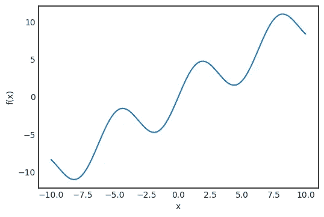

假设我们从 *x0 = 2.5* 开始梯度下降，学习率α = 1，α = 0.1，α = 0.01。

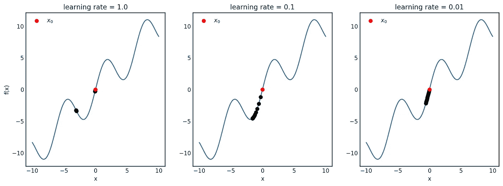

这里发生了什么可能并不明显，所以让我们为每个学习率画出 *x* -s。

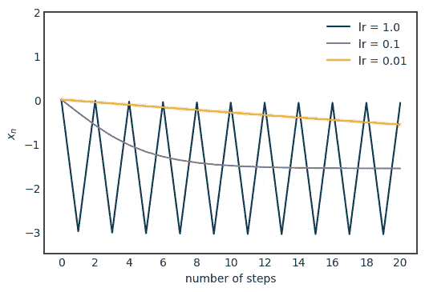

对于α = 1，序列实际上在两点之间振荡，不能收敛到局部最小值，而对于α = 0.01，收敛似乎非常慢。在我们的具体例子中，α = 0.1 似乎刚刚好。在一般情况下，如何确定这一点？这里的主要思想是学习率不一定是恒定的。启发式地，如果梯度本身的大小很大，我们应该降低学习速率，以避免跳得太远。另一方面，如果幅度很小，这可能意味着我们正在接近局部最优，因此为了避免超调，学习率肯定不应该增加。动态改变学习率的算法称为*自适应*。

AdaGrad 是这种自适应算法最流行的例子之一。它累积存储梯度幅度，并根据梯度幅度调整学习速率。AdaGrad 定义了一个累积变量 *r0 = 0* 并用规则更新它

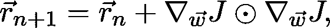

在哪里

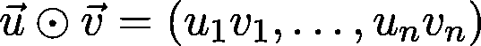

表示两个向量的分量乘积。然后用它来衡量学习速度:

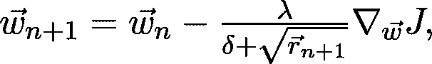

其中，δ是数值稳定性的一个小数值，平方根按分量计算。首先，当梯度较大时，累积变量增长相当快，从而降低了学习速率。当参数接近局部最小值时，梯度变小，因此学习率几乎停止下降。

当然，阿达格拉德是这个问题的一个可能的解决方案。每年都有越来越多的高级优化算法问世，解决了与梯度下降相关的广泛问题。然而，即使是最先进的方法，尝试学习率和调整它是非常有益的。

关于梯度下降的问题，另一个例子是确保我们找到一个全局最优值或一个接近它的局部最优值。正如你在前面的例子中看到的，梯度下降经常陷入一个糟糕的局部最优。为了更好地了解这个问题和其他问题的解决方案，我建议通读深度学习教材的[第八章，作者是伊恩·古德菲勒、约舒阿·本吉奥和亚伦·库维尔。](https://www.deeplearningbook.org/)

# 深度神经网络的损失函数是什么样的？

在前面几节的示例中，我们只可视化了非常简单的玩具示例，如 *f(x) = 25 sin x — x* 。这是有原因的:对于两个以上的变量，绘制一个函数并不简单。由于我们固有的局限性，我们最多只能在三维空间中观察和思考。然而，为了理解神经网络损失函数的困难，我们可以使用一些技巧。关于这一点的一篇优秀论文是郝力等人的[可视化神经网络的损失图](https://arxiv.org/pdf/1712.09913.pdf)，他们能够通过选择两个随机方向并绘制两个变量的函数来可视化损失函数

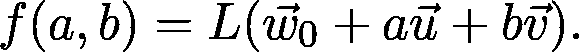

(为了避免尺度不变性造成的失真，他们还为随机方向引入了一些归一化因子。)他们的研究揭示了 ResNet 架构中的跳跃连接如何塑造损耗格局，从而使其更易于优化。

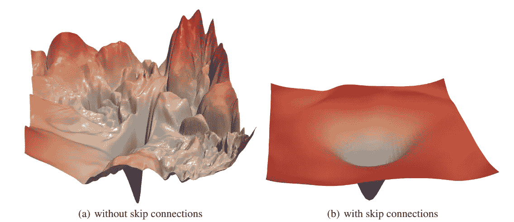

来源:[郝力等](https://arxiv.org/pdf/1712.09913.pdf)可视化神经网络损失景观。

不管 skip 连接带来了多大的改进，我的观点是证明高度多维的优化是困难的。通过观察图的第一部分，我们看到有许多局部极小值、尖锐的峰值、平稳段等等。好的架构设计可以让优化者的工作变得更容易，但是通过深思熟虑的优化实践，我们可以处理更复杂的损失场景。这些是相辅相成的。

# 结论

在前面的章节中，我们已经了解了梯度背后的直觉，并以数学上精确的方式定义了它们。我们看到，对于任何一个可微函数，不管变量的数量是多少，梯度总是指向最陡的上升，这是梯度下降算法的基础。虽然它在概念上非常简单，但当应用于具有数百万个变量的函数时，它有很大的计算困难。这个问题通过随机梯度下降得到了缓解，但是还有更多的问题:陷入局部最优，选择学习速率等等。由于这些原因，优化是困难的，需要研究者和实践者的关注。事实上，有一个非常活跃的社区在不断改进它，并取得了惊人的成果！在理解了深度学习优化的数学基础之后，现在你已经走上了提高艺术水平的正确道路！一些让你开始的好文章:

*   由郝莉、徐征、加文·泰勒、克里斯托夫·斯图德和汤姆·戈尔茨坦共同完成
*   由 Diederik P. Kingma 和 Jimmy Ba 编写的《Adam:一种随机优化方法》
*   [校准自适应学习速率以提高 ADAM 的收敛性](https://arxiv.org/abs/1908.00700v2)作者:千千·童、关南亮和毕金波
*   【关于自适应学习率的方差及其超越】蒋、、何鹏程、、、高剑锋、韩佳伟

[***如果你喜欢把机器学习概念拆开，理解是什么让它们运转，我们有很多共同点。看看我的博客，我经常在那里发表这样的技术文章！***](https://www.tivadardanka.com/blog)