# 反向传播背后的数学

> 原文：<https://towardsdatascience.com/the-maths-behind-back-propagation-cf6714736abf?source=collection_archive---------2----------------------->

## 全民数据科学

## BP 算法幕后的一瞥

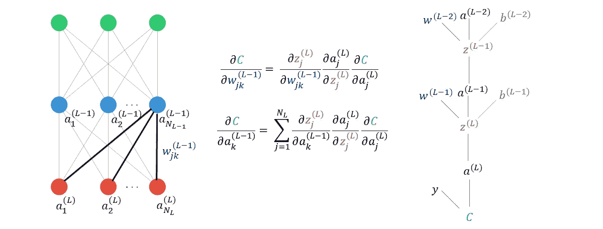

是的，一样。

# 介绍

对于大多数人来说，反向传播(BP)如何工作的高级解释在概念上是相当容易理解的。

1.  计算成本函数 C(w)
2.  计算 C(w)相对于你的神经网络(NN)中所有权重、 **w** 和偏差、 **b、**的梯度
3.  调节 **w** 和 **b** 与它们的梯度大小成比例。

更可怕的是我们到底是如何计算这些梯度的。

## 你为什么要关心 BP 是如何工作的？

看看上面的图片就足以让我们当中除了最注重数量的人之外的所有人远离这个深度学习的领域。尤其是有了这么多的高级库(例如 Keras ),人们很容易忽略 BP 实际上是如何工作的。然而，理解 BP 如何工作将有助于你理解许多用于提高普通神经网络性能的技术。此外，了解 BP 将为您提供一个很好的基础，来攻击那里更奇特的深度学习架构，因为它们几乎都在引擎盖下使用它。

我真的相信大多数人能够理解上面介绍的内容，因为它只不过是高中数学，用一些花哨的符号来记录神经网络中数百万个参数。我们只需要把它分解成它的组成部分，然后把它们翻译成英语，这样我们就能理解这些方程想要表达的意思。

在本文中，我将阐明驱动 BP 的方程——驱动深度学习的奇迹算法。在继续之前，我假设读者已经知道神经网络是如何训练的。具体来说，假设在高水平上理解神经网络的正向和反向传播阶段。如果这些听起来很奇怪，那么我会把你引向我的 [**上一篇文章**](/a-beginners-guide-to-neural-nets-5cf4050117cb) ，我在其中解释了这一点。

在接下来的文章中，我将继续我上一篇文章中识别手写数字的例子。所以让我们继续吧。

# 简单的一对一网络

与大多数问题一样，我们可以通过简化场景来取得很大进展。因此，让我们先考虑一个简单的 1-1-1 网络，而不是通常的神经元和层以各种方式连接到一切。

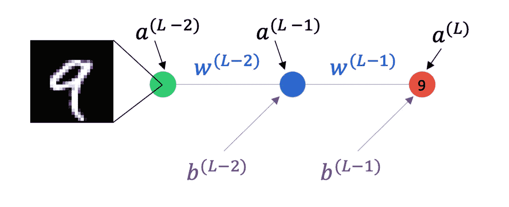

图 1:标有激活、权重和偏差的 1–1–1 网络。

图 1 显示了这样一个网络，其中绿色、蓝色和红色神经元分别代表输入、隐藏和输出神经元。我们将最后一层神经元的激活称为 a^(L，将前一层神经元的激活称为 a^(l-1)，其中 l 是我们网络的层数(在这种情况下 L = 3)。类似地，将层(L-1)和 l 之间的权重和偏差定义为 w^(L-1)和 b^(L-1).

想象一下，我们把一个 9 的 1 像素图像(只是逗逗我，显然这是不可能的)通过我们的神经网络的前向传播阶段，这个输出神经元对应于数字 9。期望的输出是 1。但是我们的神经网络给我们一个随机值，比如 0.68。我们将使用均方误差作为我们的成本函数。一个训练示例的成本 C 就是(0.68–1)。

## 第一层

所以现在我们想计算我们的成本 C . w . r . t .的梯度，即连接 L 层到 L-1 层的神经元的权重。为了了解如何做到这一点，我们可以展开网络的最后一层。

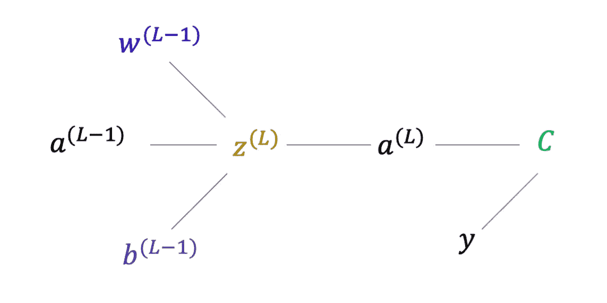

图 2:图 1 的最后一层展开以显示术语如何影响成本函数 c。

图 2 示出了对最终层的激活(a^(L)有贡献的每一项如何对成本 c 有贡献。为了得到最终层的加权和(z^(L ),我们将来自层(L-1)的激活乘以连接两层的权重 w^(L-1).然后我们加上一个偏差项，b^(L-1).最后，我们将加权和通过非线性函数σ(z^(L)，来计算 a^(L).

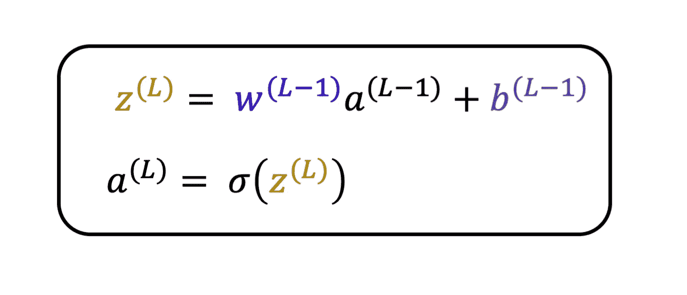

图 3:最终层的加权和与激活的等式。

现在我们想知道如果我们改变 w^(L-1).，c 会改变多少换句话说，我们想计算 dC/dw^(L-1).要做到这一点，我们可以使用我们所有人在中学时都学过的东西: [***链式法则***](https://www.khanacademy.org/math/ap-calculus-ab/ab-differentiation-2-new/ab-3-1a/a/chain-rule-review) ***。***

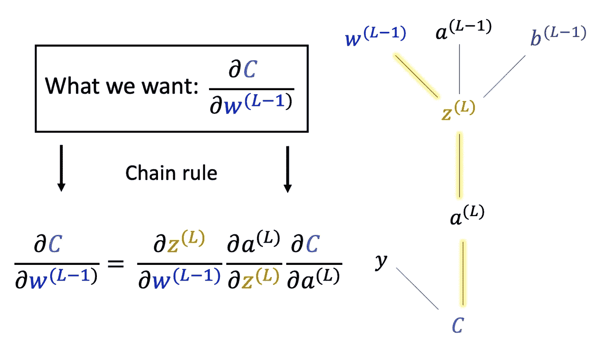

图 4:用于计算成本函数相对于最终层权重的梯度的链式法则。还显示了展开的网络，以显示权重 w^(L-1 如何间接影响 c

从图 4 可以看出重量 w^(L-1)影响 c 的路径。w^(L-1)对加权和 z^(L)有贡献，加权和)用于计算活化度 a^(L)，活化度本身直接用于计算 c。因此，通过对适当的项取导数，我们可以构建 c 对重量 w^(L-1).的梯度方程

在链式法则中使用来自图 3 的 z^(L 和 a^(L 的方程给出

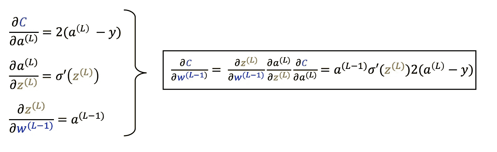

图 5:图 4 的链式法则中每一项的解析表达式，得到 w^(L-1).梯度的表达式

图 5 左侧三项中的第一项是 a^(L).的梯度因为我们使用 MSE(a^(l)-y)，作为我们的成本函数，梯度是 2(a^(L)-y).

第二项是最终层的激活梯度与最终层的加权和。这就是我们正在使用的非线性函数的导数，所以我们称之为σ’。例如，如果我们使用 sigmoid 作为我们的非线性函数(1/(1+e^-z)，那么导数将计算为 [(e^-z/(1+e^-z) )](/derivative-of-the-sigmoid-function-536880cf918e) 。

*【注意:这就是为什么选择一个处处可微的非线性函数很重要，否则你不能传播(计算)你的梯度，尽管有类似* [*ReLU 激活函数*](https://www.analyticsvidhya.com/blog/2020/01/fundamentals-deep-learning-activation-functions-when-to-use-them/)*】*的警告

最后一项是连接层(L-1)和 L 的加权和的导数。根据图 3，这简单地等于层(L-1)的激活。

我们还想知道，如果我们改变偏置项，b^(L-1).，我们的成本函数会如何变化因此除了偏置项之外，可以构建与图 4 类似的展开图。

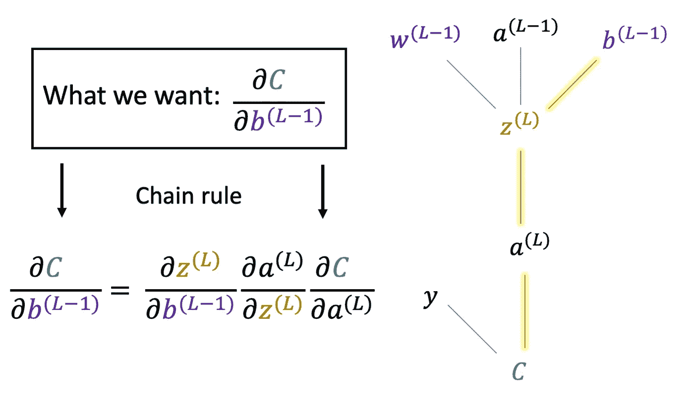

图 6:用于计算成本函数相对于最终层偏差的梯度的链式法则。还显示了展开的网络，以显示权重 b^(L-1 如何间接影响 c

链式法则中唯一改变的项是第一项，现在最后一层的加权和的导数相对于偏差。

像以前一样，我们仔细检查并计算链式法则所需的每一项的值。

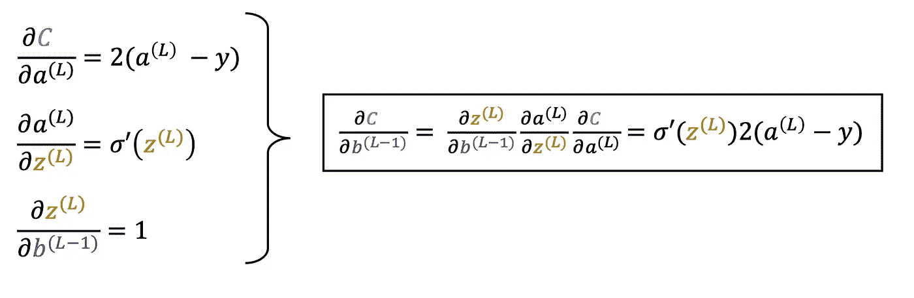

图 7:图 6 的链式法则中每一项的解析表达式，得到 b^(L-1).梯度的表达式

很好，现在神经网络可以使用权重更新方程中的这些方程来计算出下一轮训练中 w^(L-1 和 b(L-1)的值。

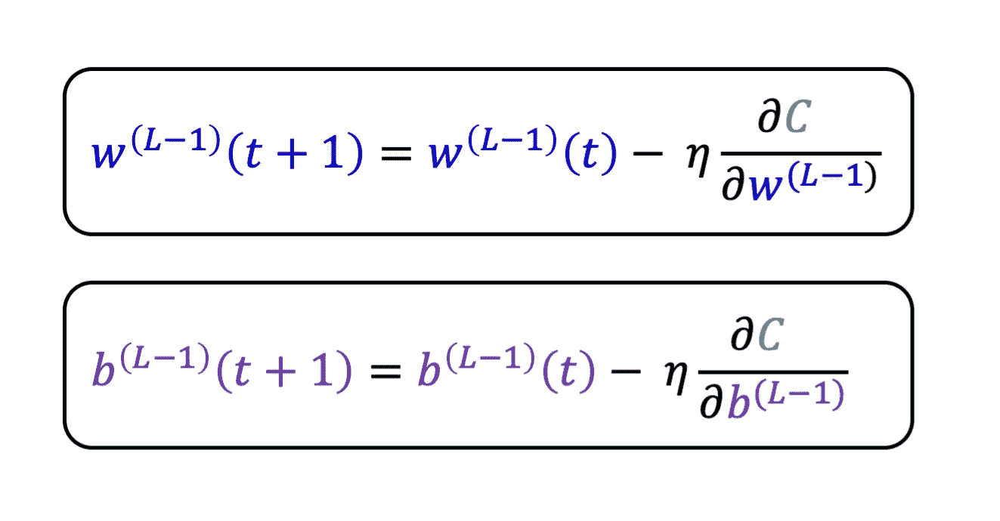

图 8:最终层权重和偏差项的权重更新方程。

尽管神经网络对 a^(L-1 没有直接控制，但当我们考虑进一步进入神经网络时，很快就会发现我们需要它，所以让我们重复上述过程，但对 a^(L-1).来说

再次，我们沿着回到 a^(L-1 的路径，并构建链接 a^(L-1 的变化如何影响 c 的链式规则

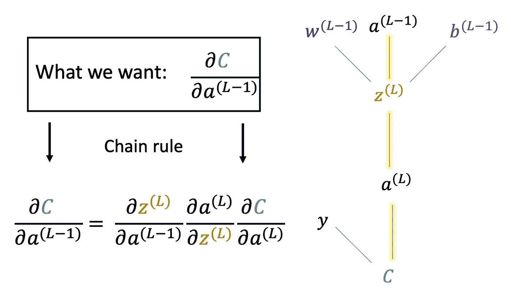

图 9:用于计算成本函数相对于(L-1)层激活的梯度的链式法则。还显示了展开的网络，以显示激活 a^(L-1 如何间接影响 c

和以前一样，我们只是替换了链式法则中的第一项。然后我们计算这三项以获得

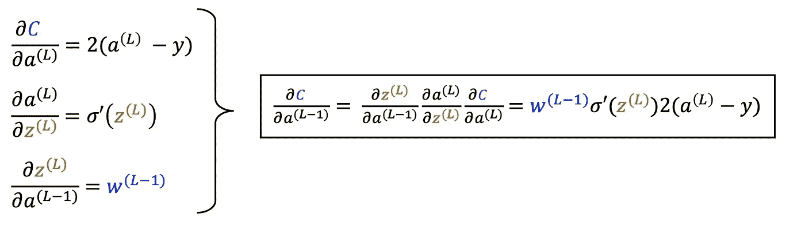

图 10:图 9 的链式法则中每一项的解析表达式，得到 a^(L-1).梯度的表达式

如果你一直坚持到这一点，你已经完成了大部分工作！再多一点点，你就能得到几乎所有的方程了。

## L-2 层

现在让我们考虑一下，如果我们改变层(L-2)中的一个权重，C 会发生什么变化。和前面一样，我们可以画一个展开图来说明 w^(L-2)是如何间接影响 c 的

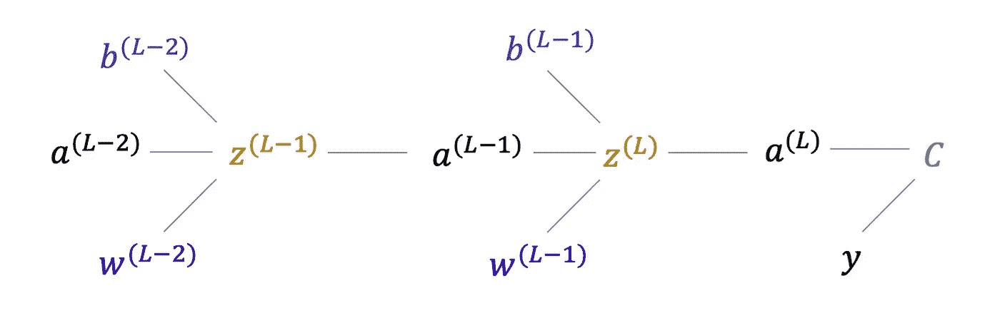

图 11:展开图 1 的三层以显示术语如何影响成本函数 c

构建适当的链式规则表达式，其将 w^(L-2 的变化如何影响成本函数 c 联系起来

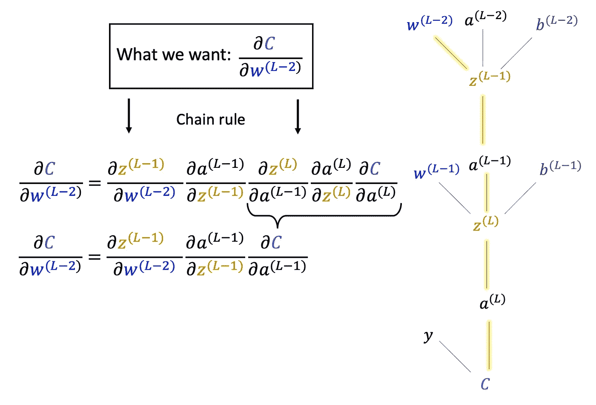

图 12:用于计算成本函数相对于(L-2)层权重的梯度的链式法则。还显示了展开的网络，以显示权重 w^(L-2 如何间接影响 c

从图 12 中，你可以看到连接 w^(L-2 和 c 的路径。因此，我们在链规则中使用路径中所有项的偏导数。但是我们刚刚算出了 a^(L-1 的变化如何影响 c 的表达式(见图 10)。所以我们用一个偏导数代替最后三个偏导数，因为我们已经有了它的表达式。

前两项与之前非常相似，但现在我们只是替换了图 5 中上标的负 1。这样，我们就可以得到重量 w^(L-2).的梯度的下式

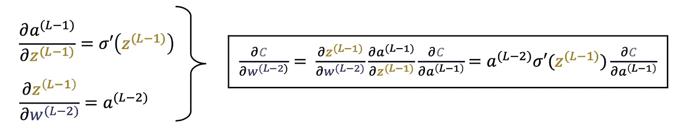

图 13:图 12 的链式法则中每一项的分析表达式，得到 w^(L-2).梯度的表达式

你可以看到，如果我们有一个更深的网络，甚至更远的一层，这个表达式将调用梯度 dC/da^(L-2)，前一个将调用 dC/da^(L-3)，等等。因此，通过计算每层激活的 C . w . r . t .的导数，我们可以递归地计算 C . w . r . t .的梯度，而不考虑网络中的任何权重或偏差。这个过程被称为**反向传播**，因为你是字面上传播梯度从最后一层回来。

如果你已经做到了这一步，那么你会很高兴听到以上是 90%的反向传播。我们刚刚针对 1–1–1 网络的简单情况执行了上述所有操作。将其推广到任意大小的网络，只意味着我们必须添加一些求和以及更多的指数，以跟踪每一项对应于层中的哪个神经元。但是我们刚刚推导出的方程具有完全相同的形式。

# 通用网络

现在让我们考虑如何修改上面的方程，以应用于每层有许多神经元而不是只有一个神经元的一般网络。

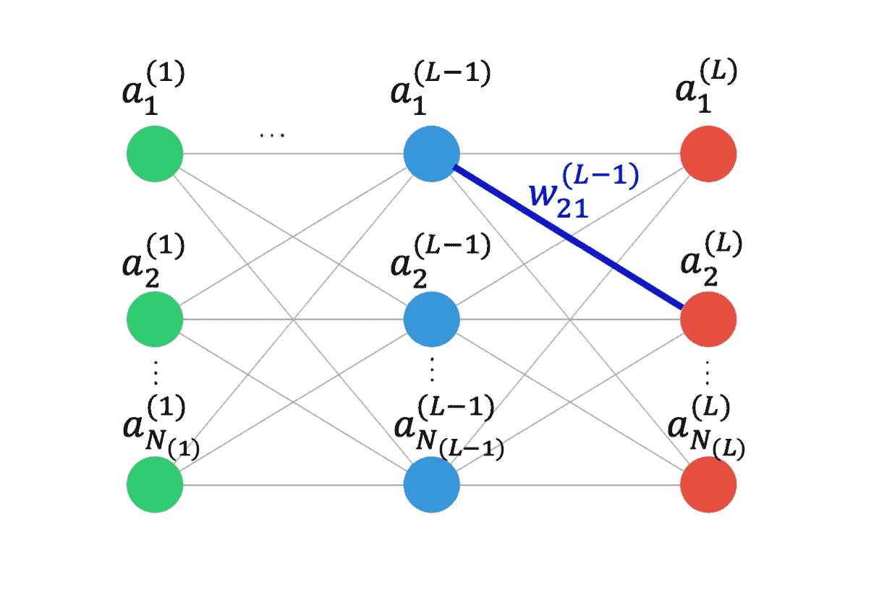

图 14:标记了激活和权重的一般网络。与图 1 相反，现在每一项都有一个下标来表示它所指的是层中的哪一个神经元。

图 14 示出了这样的网络，其中有 L 层，并且层 L 具有 N _ 1 个神经元。例如，如果 N _ 1 = 5，则最后一层中有 5 个神经元，如果 N_3 = 7，则意味着第 3 层有 7 个神经元。还显示了连接不同层中的神经元的权重之一。和以前一样，它有一个上标来表示它对应于哪一层，还有一个下标来表示它连接每一层中的哪一个神经元。例如，图中的权重 w_21 连接 L-1 层的神经元 1 和 L 层的神经元 2。

*【注意:我将只考虑权重方程如何变化，因为这与偏差方程的过程相同。]*

## 调整正向传播方程

让我们首先来看看前向传播的术语在 1–1–1 情况和最终层的成本、加权和以及激活的一般情况之间是如何变化的。

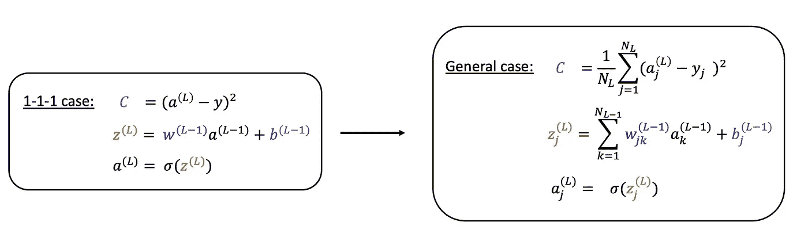

图 15:简单 1-1-1 情况(左)和一般情况(右)的成本、加权和以及激活的等式。

在 1–1–1 的情况下，成本函数只取决于输出层中单个神经元的值。但是现在在更一般的情况下，我们在最后一层有 N_L 个神经元。在我们的数字识别例子中，N _ L = 10——每个数字对应一个神经元。所以我们需要对最后一层中每个神经元的平方误差求和。最后，因为我们使用均方误差作为我们的成本函数，所以我们除以该层中神经元的数量。

对于一般情况下的加权和，现在有来自前一层(L-1)中所有神经元的贡献，这是 k 上的和，此外，由于一层中有多个神经元，我们必须确保指定我们指的是哪一个，因此我们为此添加下标 j。与往常一样，这是最容易理解的图表和简化的例子，其中最后和倒数第二层都有 3 个神经元，如图 16 所示。

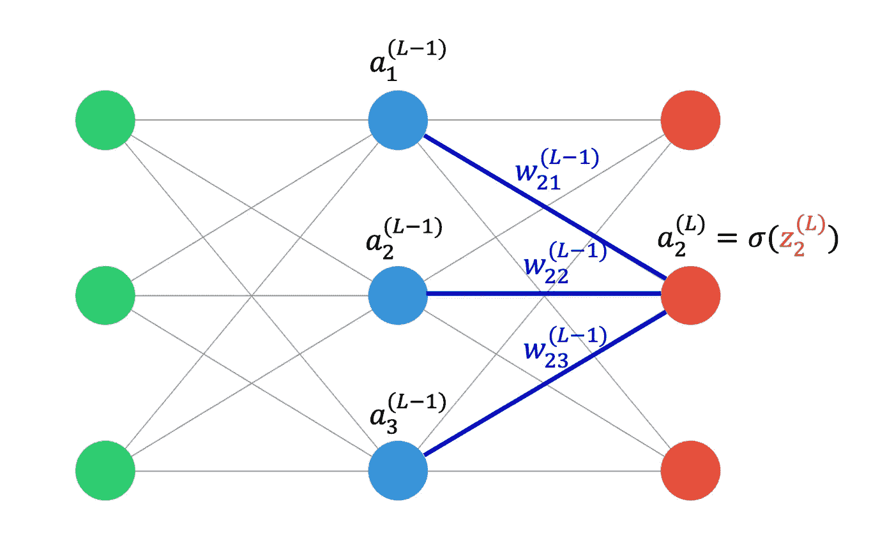

图 16:每层有 3 个神经元的网络。示出了对最终层中的第二神经元的加权和有贡献的激活和权重。

因此，如果我们考虑哪些项对最后一层中第二个神经元的加权和有贡献，我们会看到前一层中的每个激活都有贡献。它们被乘以一个权重，该权重将它们连接到最后一层中的第二个神经元，因此我们给权重一个下标，其中两个数字对应于这两个神经元。您还可以将单个偏差项添加到加权和中(未显示)。

最后，图 15 中的第三项没有改变，所以你将这个加权和通过一个非线性函数来获得神经元的激活。我们唯一要做的是添加一个下标，来显示我们所指的是哪一层中的神经元。例如，a₁^(L)是最后一层中第一个神经元(图 16 中右上神经元)的激活，同样，a₃^(L)是最后一层中第三个神经元(图 16 中右下)的激活。

很好，我们已经调整了条款，以解决所有激活，并最终在正向传播中使用的成本。现在，我们需要对用于反向传播的梯度进行同样的操作。

## 调整反向传播方程

## **L-1 层**

和以前一样，我会先陈述结果，然后我们会看到调整的原因。

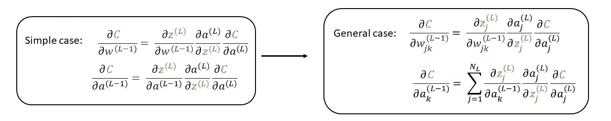

图 17:简单 1-1-1 情况(左)和一般情况(右)下成本函数梯度与(L-1)层活化和重量的关系式。

C w.r.t .的梯度与(L-1)层的权重相比没有太大变化，除了我们增加了一个下标，正如我们在调整前向传播方程时所做的那样。

真正改变的术语是 C w.r.t 上一层活化的梯度。当我们调整加权和方程时，推理与以前基本相同，通过图表和简化的 3-3-3 网络更清晰。

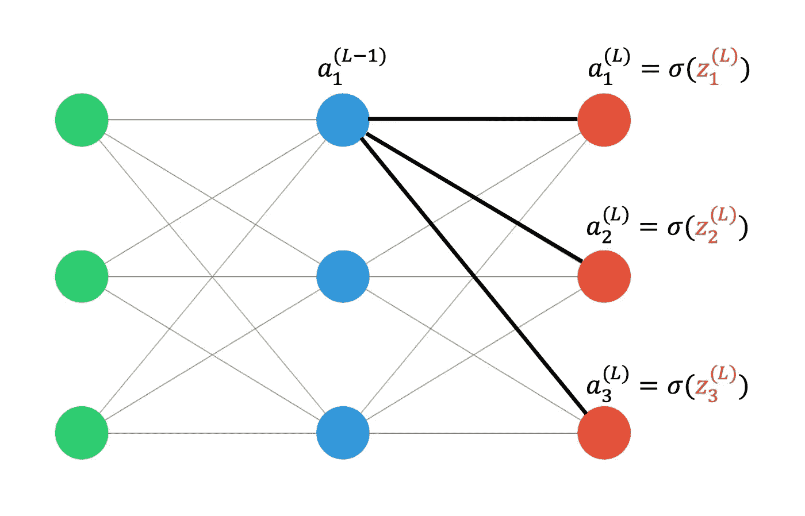

图 18:每层 3 个神经元的网络该图显示了(L-1)层中特定神经元的激活现在如何影响 L 层中的所有激活，从而通过这些 N_L 通道影响 C。在这种情况下，它有 3 个不同的渠道来影响成本。

图 18 显示来自(L-1)层中单个神经元的激活现在如何影响最终层的所有激活。然后将所有这些激活相加以计算成本 c。因此，在该示例中，改变 a₁^(L-1)将影响下一层中的所有 N_L 神经元，这将影响成本。这就是为什么梯度现在是下一层神经元上的总和，以说明将受该激活值变化影响的所有通道。

关键是它和以前的形式完全一样，我们只是引入了求和和下标来说明每层有多个神经元。

## L-2 层

最后，我们进一步回到这个网络中，问，如果我改变层(L-2)中的权重会发生什么？

让我们首先考虑一下，通过改变将层(L-2)中的第一个神经元连接到层(L-1)中的第一个神经元的权重，我们预计会影响哪些项。另一幅救援图！

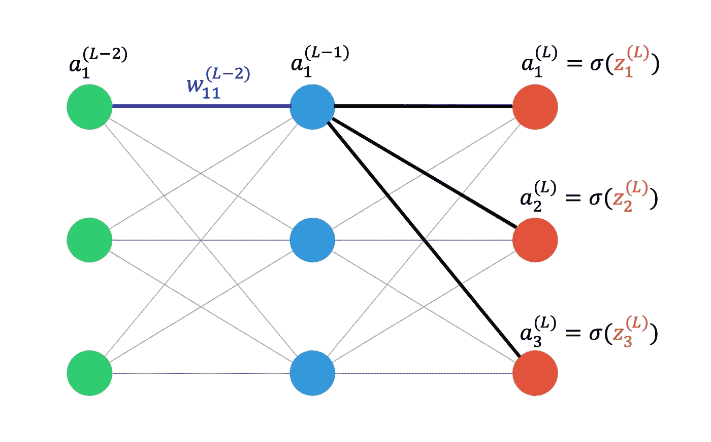

图 19:每层 3 个神经元的网络该图显示了改变(L-2)和(L-1)层中第一个神经元之间的重量现在如何影响 L 层中的所有激活，从而通过这些 N_L 通道影响 C。在这种情况下，它有 3 个不同的渠道来影响成本。

改变(L-2)和(L-1)层第 1 个神经元之间的重量会改变(L-1)层第 1 个神经元的激活。但是，正如我们刚才看到的，这现在影响了通过 N_L 通道的成本，因为它连接到最后一层的所有神经元。因此，我们预计这个权重的梯度将包含这些 N_L 通道上的和。

图 20 示出了成本函数相对于层(L-2)中的权重的导数的调整方程。如果我们像以前一样，只调整 1–1–1 情况下的表达式，加上下标 If，可能看起来我们没有包括这些 N_L 通道。

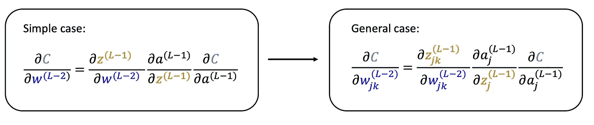

图 20:简单 1-1-1 情况(左)和一般情况(右)下成本函数梯度与层(L-2)中权重的等式。

*但是，*如果我们现在输入上面图 17 的表达式，对于图 20 右侧的最后一个导数，我们确实看到 N_L 个通道已经包括在这个表达式中。

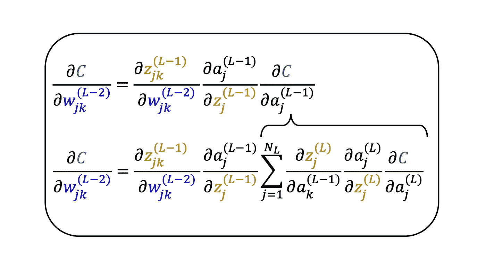

我们现在遵循与之前完全相同的过程，由此计算网络中任何 权重的梯度，我们只是递归地找到成本函数 w.r.t .的梯度，所有的激活都在成本和感兴趣的权重之间。换句话说，我们 ***反向传播*** 梯度计算一直回到感兴趣的权重。

遵循相同的程序来获得网络中任何偏差的梯度。

就是这样！

【鸣谢:[https://gi phy . com/gifs/reaction-扰流板-外域人-LSNqpYqGRqwrS](https://giphy.com/gifs/reaction-spoilers-outlander-LSNqpYqGRqwrS) 】

# 摘要

祝贺你，如果你能在一次阅读中理解所有的内容。如果这是你第一次看这些方程，它们肯定会因为所有的下标和上标而显得非常混乱。但是通过观察网络和跟踪一个项影响 C 的渠道，你可以推理出求和应该发生在哪里。这使得方程看起来不那么可怕了。

最好的事情是，因为网络中更后面的每个梯度都依赖于网络中它之后的梯度项，所以您不需要构建长得离谱的链式规则表达式，因为您已经从前面的层中获得了您需要的表达式。

在本文中，我们首先使用简单的 1–1–1 网络来推导反向传播方程的一般形式。这是一个展开网络的问题，以明确地看到从网络中的术语到成本函数的路径，然后构建适当的链式规则表达式。一旦我们有了这个，我们就可以简单地计算出这些表达式是什么。然后，我们看到层(L-1)中的项如何依赖于层 L 中的项。因此，我们可以通过不断地将后面层中的项链接在一起，将我们的计算结果传播回网络。

最后，我们转向网络的一般情况，每层有多个数量可变的神经元。这个简单案例和这个案例的区别在于:

1.  包含下标来跟踪我们所指的神经元
2.  确保一个项的变化可能影响 C 的所有渠道都考虑在内的总和。

不要误解我，支持反向传播的方程乍一看并不容易理解(或者第二、第三、第四等)。但它们所代表的实际数学工具只是导数和加法。其余的只是奇特的簿记。

我希望你喜欢研究黑盒的方程式。下一篇文章再见。

【鸣谢:[https://tenor.com/vemb.gif](https://tenor.com/vemb.gif)