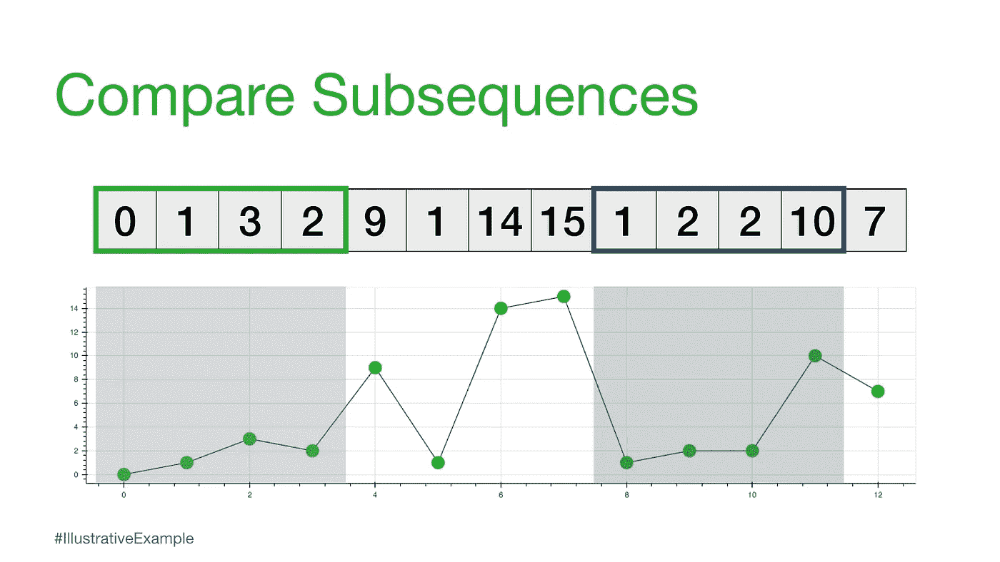

# 第 1 部分:矩阵简介

> 原文：<https://towardsdatascience.com/the-matrix-profile-e4a679269692?source=collection_archive---------10----------------------->

## STUMPY:用于现代时间序列分析的强大且可伸缩的 Python 库


(图片由[约书亚·索蒂诺](https://unsplash.com/@sortino?utm_source=unsplash&utm_medium=referral&utm_content=creditCopyText)提供)

# 整体大于部分之和


(图片由作者提供)

[STUMPY 是一个强大且可扩展的 Python 库，用于现代时间序列分析](https://github.com/TDAmeritrade/stumpy)，在其核心，有效地计算出一种叫做*矩阵轮廓*的东西。这个多部分系列的目标是解释什么是 matrix profile，以及如何开始利用 [STUMPY](https://stumpy.readthedocs.io/en/latest/) 完成所有现代时间序列数据挖掘任务！

(作者视频)

*注:这些教程最初出现在* [*STUMPY 文档*](https://stumpy.readthedocs.io/en/latest/tutorials.html) *中。*

第一部分:[矩阵轮廓图](/the-matrix-profile-e4a679269692)
第二部分: [STUMPY 基础知识](/stumpy-basics-21844a2d2d92)
第三部分:[时间序列链](/part-3-time-series-chains-da281450abbf)
第四部分:[语义分割](/part-4-semantic-segmentation-b42c3792833d)
第五部分:[快速近似矩阵轮廓图与 STUMPY](/part-5-fast-approximate-matrix-profiles-with-scrump-c6d9c984c560)
第六部分:[用于流式时间序列数据的矩阵轮廓图](/matrix-profiles-for-streaming-time-series-data-f877ff6f9eef)
第七部分:[快速模式搜索与 STUMPY](/part-7-fast-pattern-searching-with-stumpy-2baf610a8de1)
第八部分:【T2 10: [发现多维时间序列模体](/part-10-discovering-multidimensional-time-series-motifs-45da53b594bb)
第十一部分:[用户引导的模体搜索](/part-11-user-guided-motif-search-d3d317caf9ea)
第十二部分:[机器学习的矩阵轮廓](/part-12-matrix-profiles-for-machine-learning-2dfd98d7ff3f)

# 奠定基础

在一个简单的句子中，*矩阵配置文件*本质上是一个向量，它存储了时间序列中任何子序列与其最近邻居之间的 [z 归一化欧几里德距离](https://youtu.be/LnQneYvg84M?t=374)。

为了充分理解这意味着什么，让我们后退一步，从一个简单的示例以及一些基本定义开始:

# 长度 n = 13 的时间序列

```
time_series = [0, 1, 3, 2, 9, 1, 14, 15, 1, 2, 2, 10, 7]
n = len(time_series)
```

为了分析这个长度为`n = 13`的时间序列，我们可以可视化数据或计算全局汇总统计数据(即平均值、中值、众数、最小值、最大值)。如果你有一个长得多的时间序列，那么你甚至会觉得有必要建立一个 ARIMA 模型，执行异常检测，或尝试一个预测模型，但这些方法可能会很复杂，可能经常有假阳性或没有可解释的见解。


(图片由作者提供)

然而，如果我们应用奥卡姆剃刀，那么我们可以对这个时间序列进行分析的最简单和直观的方法是什么？

要回答这个问题，让我们从我们的第一个定义开始:

# 子序列/ˈsəbsəkwəns/名词

## 完整时间序列的一部分或一段

因此，以下都被认为是我们的`time_series`的子序列，因为它们都可以在上面的时间序列中找到。


(图片由作者提供)


(图片由作者提供)


(图片由作者提供)

```
print(time_series[0:2])
print(time_series[4:7])
print(time_series[2:10])[0, 1]
[9, 1, 14]
[3, 2, 9, 1, 14, 15, 1, 2]
```

我们可以看到每个子序列可以有不同的序列长度，我们称之为`m`。例如，如果我们选择`m = 4`，那么我们可以考虑如何比较任意两个相同长度的子序列。

```
m = 4
i = 0  # starting index for the first subsequence
j = 8  # starting index for the second subsequence

subseq_1 = time_series[i:i+m]
subseq_2 = time_series[j:j+m]

print(subseq_1, subseq_2)[0, 1, 3, 2] [1, 2, 2, 10]
```



(图片由作者提供)

比较任何两个子序列的一种方法是计算所谓的欧几里德距离。

# 欧几里德距离/yo͞oˈklidēən/ /ˈdistəns/名词

## 两点之间的直线距离


(图片由作者提供)

```
import math

D = 0
for k in range(m):
    D += (time_series[i+k] - time_series[j+k])**2
print(f"The square root of {D} = {math.sqrt(D)}")The square root of 67 = 8.18535277187245
```

# 距离轮廓-成对欧几里得距离

现在，我们可以更进一步，保持一个子序列不变(参考子序列)，以滑动窗口的方式改变第二个子序列，并计算每个窗口的欧几里德距离。成对欧几里得距离的结果向量也称为距离轮廓。


(图片由作者提供)

当然，并不是所有这些距离都有用。具体来说，自匹配(或平凡匹配)的距离并不提供信息，因为当您将子序列与其自身进行比较时，距离将始终为零。因此，我们将忽略它，取而代之的是，从距离配置文件中记录下一个最小的距离，并选择它作为我们的最佳匹配:


(图片由作者提供)

接下来，我们可以一次在一个元素上移动我们的参考子序列，并重复相同的滑动窗口过程来计算每个新的参考子序列的距离分布。


(图片由作者提供)

# 距离矩阵

如果我们把为每个参考子序列计算的所有距离分布图一个接一个地堆叠起来，那么我们就得到一个叫做距离矩阵的东西


(图片由作者提供)

现在，我们可以通过只查看每个子序列的最近邻居来简化这个距离矩阵，这将带我们进入下一个概念:

# 矩阵轮廓/mātriks//ˈprōˌfīl/名词

## 存储时间序列中任何子序列与其最近邻居之间的 [(z 归一化)欧几里得距离](https://youtu.be/LnQneYvg84M?t=374)的向量

实际上，这意味着矩阵简档只对存储来自每个距离简档的最小非平凡距离感兴趣，这显著地将空间复杂度降低到 O(n):


(图片由作者提供)

我们现在可以在原始时间序列下绘制这个矩阵图。并且，事实证明，具有小矩阵分布值的参考子序列(即，它具有显著“靠近”的最近邻居)可以指示可能的模式，而具有大矩阵分布值的参考子序列(即，它的最近邻居显著“远离”)可以暗示异常的存在。


(图片由作者提供)

因此，通过简单地计算和检查矩阵轮廓，人们可以很容易地挑出顶部模式(全局最小值)和最罕见的异常(全局最大值)。一旦你计算出矩阵的轮廓，这仅仅是可能的一小部分！

# 真正的问题是——暴力方法

现在，在这一点上看起来很简单，但我们需要做的是考虑如何有效地计算完整的距离矩阵。让我们从强力方法开始:

```
for i in range(n-m+1):
    for j in range(n-m+1):
        D = 0
        for k in range(m):
            D += (time_series[i+k] - time_series[j+k])**2
        D = math.sqrt(D)
```

乍一看，这可能看起来不太糟糕，但如果我们开始考虑计算复杂性以及空间复杂性，那么我们就开始理解真正的问题了。事实证明，对于较长的时间序列(即 n >> 10，000)，计算复杂度为 O(mn^2(如上面代码中的三个 for 循环所示)，存储完整距离矩阵的空间复杂度为 O(n^2).

为了客观地看待这一点，想象一下，如果您有一个单一的传感器，在 5 年的时间里每分钟收集 20 次数据。这将导致:

```
n = 20 * 60 * 24 * 364 * 5  # 20 times/min x 60 mins/hour x 24 hours/day x 365 days/year x 5 years
print(f"There would be n = {n} data points")There would be n = 52416000 data points
```

假设内循环中的每个计算需要 0.0000001 秒，那么这将需要:

```
time = 0.0000001 * (n * n - n)/2
print(f"It would take {time} seconds to compute")It would take 137371850.1792 seconds to compute
```

相当于 1，598.7 天(或 4.4 年)和 11.1 PB 内存来计算！因此，使用我们简单的暴力方法来计算距离矩阵显然是不可行的。相反，我们需要找出如何通过有效地生成矩阵轮廓来降低计算复杂度，这就是 [STUMPY](https://stumpy.readthedocs.io/en/latest/index.html) 发挥作用的地方。

# 多残株的

2016 年秋天，来自加州大学河滨分校[和新墨西哥](https://www.cs.ucr.edu/~eamonn)[大学](https://www.cs.unm.edu/~mueen/)的研究人员发表了一组漂亮的[背靠背论文](https://www.cs.ucr.edu/~eamonn/MatrixProfile.html)，描述了一种叫做 STOMP 的精确方法，用于计算任何时间序列的矩阵轮廓，计算复杂度为 O(n2)！他们还使用 GPU 进一步证明了这一点，他们将这种更快的方法称为 GPU-STOMP。

考虑到学者、数据科学家和开发人员，我们采用了这些概念，并开源了 [STUMPY](https://stumpy.readthedocs.io/en/latest/index.html) ，这是一个强大的可扩展库，可以根据这一已发布的研究有效地计算矩阵轮廓。此外，由于其他开源软件，如 [Numba](http://numba.pydata.org/) 和 [Dask](https://dask.org/) ，我们的实现是高度并行化的(对于具有多个 CPU 或多个 GPU 的单个服务器)，高度分布式的(多个 CPU 跨多个服务器)。我们已经在多达 256 个 CPU 内核(分布在 32 台服务器上)或 16 个 NVIDIA GPU 设备(在同一台 DGX-2 服务器上)上测试了 [STUMPY](https://stumpy.readthedocs.io/en/latest/index.html) ，并获得了与公布的 GPU-STOMP 工作类似的[性能](https://github.com/TDAmeritrade/stumpy#performance)。


(图片由作者提供)

# 结论

根据原始作者的说法，“这些是过去二十年中时间序列数据挖掘的最佳想法”，并且“鉴于矩阵配置文件，[大多数时间序列数据挖掘问题都可以在几行代码中解决](https://www.cs.ucr.edu/~eamonn/100_Time_Series_Data_Mining_Questions__with_Answers.pdf)”。

根据我们的经验，这绝对是真的，我们很高兴与您分享 [STUMPY](https://stumpy.readthedocs.io/en/latest/index.html) ！请联系我们，让我们知道 [STUMPY](https://stumpy.readthedocs.io/en/latest/index.html) 是如何帮助您完成时间序列分析工作的，我们非常希望听到您的反馈！

# 附加注释

为了完整起见，我们将为那些想将自己的 matrix profile 实现与 STUMPY 进行比较的人提供更多的评论。然而，由于原始论文中省略了许多细节，我们强烈建议您使用 [STUMPY](https://stumpy.readthedocs.io/en/latest/) 。

在我们上面的解释中，我们只考虑了无关紧要的匹配。然而，这是不够的，因为附近的子序列(即`i ± 1`)很可能是高度相似的，并且我们需要将其扩展到相对于对角线平凡匹配更大的“排除区”。在这里，我们可以看到不同的隔离区是什么样子:


然而，在实践中，已经发现`i ± int(np.ceil(m / 4))`的排除区域工作良好(其中`m`是子序列窗口大小),并且在为`ith`子序列提取矩阵轮廓值之前，在该区域中计算的距离被设置为`np.inf`。因此，窗口尺寸越大，禁区就越大。此外，请注意，由于 NumPy 索引具有包含性起始索引和排他性终止索引，确保对称排除区的正确方法是:

```
excl_zone = int(np.ceil(m / 4))
zone_start = i - excl_zone
zone_end = i + excl_zone + 1  *# Notice that we add one since this is exclusive*
distance_profile[zone_start : zone_end] = np.inf
```

# 资源

[STUMPY Matrix Profile 文档](https://stumpy.readthedocs.io/en/latest/)
[STUMPY Matrix Profile Github 代码库](https://github.com/TDAmeritrade/stumpy)

## [第二部分:短粗基础知识](/stumpy-basics-21844a2d2d92) →