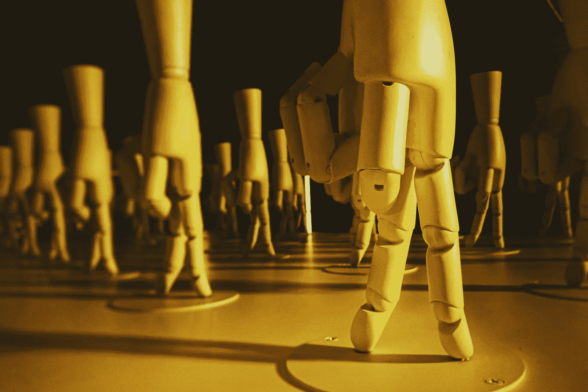
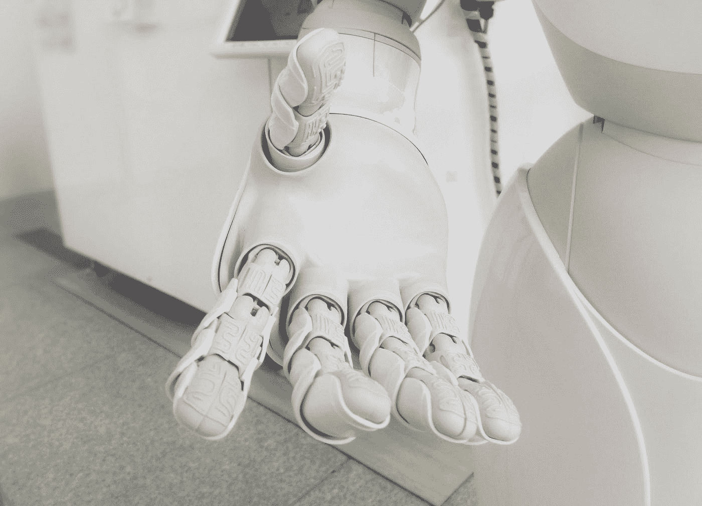
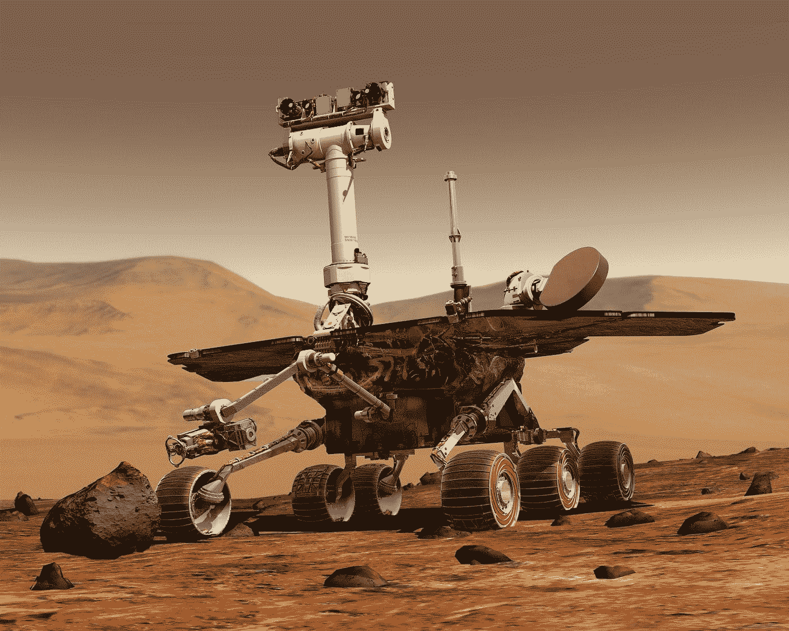
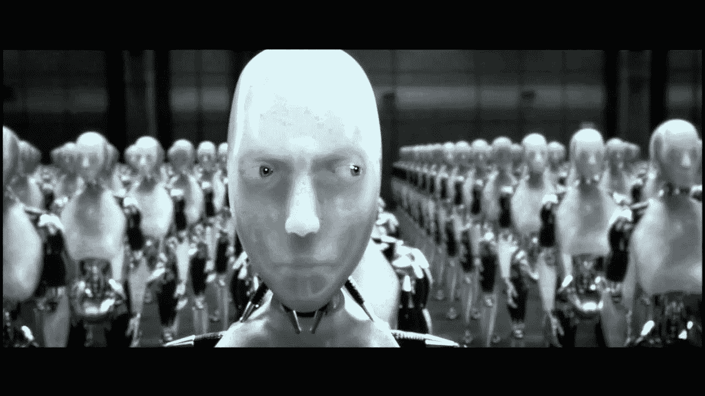
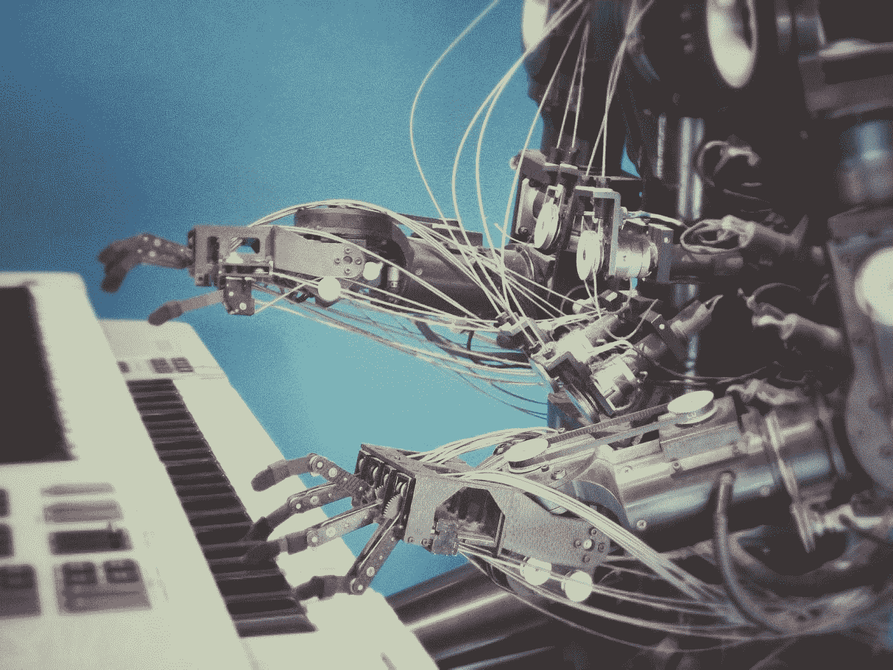
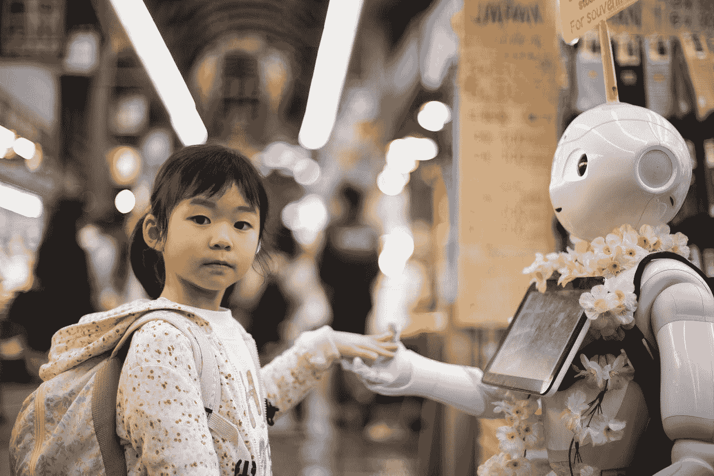

# AI 接管之事:人工智能会取代人类吗？

> 原文：<https://towardsdatascience.com/the-matter-of-ai-takeover-will-artificial-intelligence-replace-human-beings-79d2c788f358?source=collection_archive---------4----------------------->

## 人工智能会接管人类吗，不管是崇拜者还是批评家？

[Jason Yuen](https://unsplash.com/@fanfandyuen?utm_source=unsplash&utm_medium=referral&utm_content=creditCopyText) 在 [Unsplash](https://unsplash.com/?utm_source=unsplash&utm_medium=referral&utm_content=creditCopyText) 上的照片

所谓的机器人/人工智能起义一直是许多反乌托邦小说的流行情节点。无论是在大银幕上还是在小银幕上，我们都见证了由人工智能驱动的机器人霸主缓慢、肯定和无情地接管人类的情节。然而，在电影中，人类总是赢家。我们还不确定人工智能接管的结果，如果它发生在现实生活中！

人工智能革命的话题很有争议。虽然有些人对人工智能革命没有什么可说的，但[许多人工智能专家公开表示](https://en.wikipedia.org/wiki/Open_Letter_on_Artificial_Intelligence)人工智能可能对社会产生的负面影响，并要求研究人员调查人工智能的社会影响。

人工智能无所不知、无所不在、几乎无所不能的能力一再受到质疑。这项技术的未来可能性很容易与潘多拉魔盒的神话相提并论。然而，我们知道潘多拉盒子里装的是什么，另一方面，人工智能的未来仍然很模糊，这证明了我们一次又一次面临的问题，那就是-人工智能会取代我们人类吗？

# 人工智能接管:终结的开始

今天，人工智能技术正被用来执行从琐碎到重大的任务。无论是用人工智能相机增强移动摄影还是金融资产管理，人工智能在人类生活的各个领域都有一些真正令人惊叹的应用。

但是随着人工智能应用的增加，越来越多的人开始怀疑它是否会消除人类技能和经验在不同任务中的重要性。当手持增强型人工智能相机的人只需对准相机并点击时，一位资深摄影师的技能和经验会发生什么变化？当人工智能被训练来预测股票并帮助人们基于此做出决策时，一名经验丰富的股票经纪人的技能和直觉会发生什么变化？

来源:照片由 [Franck V.](https://unsplash.com/@franckinjapan?utm_source=unsplash&utm_medium=referral&utm_content=creditCopyText) 在 [Unsplash](https://unsplash.com/?utm_source=unsplash&utm_medium=referral&utm_content=creditCopyText) 上拍摄

有些人会争辩说，人工智能只是帮助用户获得多年经验的好处，而不必努力多年来获得这种经验。但是，当获得经验的过程被完全移除，没有任何东西阻挡用户获得最佳结果时，人类的基本价值观会发生什么呢？

如果你把所有这些问题都记在心里，那么整个“AI 将取代人类”的前提似乎就没有那么荒谬了。然而，为了证实或拒绝这种想法，我们真的必须弄清人工智能对社会的明显积极和消极影响。

# 人工智能自动化:同一枚硬币的不同面

任何事物都有其积极和消极的影响，这是显而易见的。人工智能也不例外。人工智能自动化的效果从非常好到非常糟糕不等。在对人工智能在社会中的长期影响做出任何假设之前，需要密切观察和分析这些影响。

## 硬币的正面

人工智能有许多积极的方面——从加速平凡的任务到增强更大行业的内部工作。人工智能的分析和预测能力已被证明是许多行业的宝贵资产。无论是预测天气还是股市，人工智能技术预测能力的准确性正在以积极的方式影响许多行业。不仅是数据分析和在此基础上做出预测，人工智能还被用于更危险的任务，如太空探索，海洋探索等等。

下一个积极因素无疑是加强医疗行业的诊断和监测程序。通过可穿戴集成，今天的医生能够更好地诊断患者并监控他们的情况，从而提供更好、更准确的治疗。人工智能效应不仅改善了医疗程序，而且还大大降低了全世界的医疗成本。

来源:https://www.pexels.com/photo/gray-and-white-robot-73910/

[由于智能家居自动化发展的增加](https://www.unifiedinfotech.net/blog/smart-home-app-development-guide/)，人工智能也进入了我们的家庭，并将其变成了一个更智能的家庭。基于人工智能的智能家居系统，通常被称为“幻影负载”或“吸血鬼能量”，在降低功耗和控制家庭碳足迹方面创造了奇迹。基于人工智能的面部识别系统也有助于当局以先进的方式对付罪犯。

人工智能还有很多很多其他的积极用途。但简而言之，我们可以肯定地说，人工智能的积极方面不仅跨越不同的行业，还影响着那些行业中每个人的个人生活。

## 硬币的反面

既然有积极的一面，[AI 也必然有消极的一面](https://bernardmarr.com/default.asp?contentID=1827)。从人工智能偏见到社交媒体操纵，人工智能正在以以前不可想象的方式影响社会。

人工智能自动化的引入给现代人类的生活方式带来了重大转变。那些曾经需要手工劳动的任务，今天可以不费一根手指就完成。这意味着今天的用户有更多的空闲时间，他们正在寻找新的体验来填补这一空白。然而，这种对新体验的寻求对一些人来说比其他人更容易，这对社会产生了一些严重的社会和心理影响。

来源:[https://www . Harvard . co . uk/6-things-you-need-know-on-artificial-intelligence/](https://www.harvard.co.uk/6-things-you-need-to-know-about-artificial-intelligence/)

人工智能负面影响的一个最明显的例子是涉及种族主义医疗人工智能系统的[事件，该事件将数百万人的生命置于危险之中。人类社会的种族偏见通过用于训练人工智能系统的数据集进入了人工智能。这导致数百万黑人由于没有得到足够好的治疗而患病。](https://www.nature.com/articles/d41586-019-03228-6)

除此之外，还有更邪恶的影响，比如社交媒体操纵，这正在改变我们的观点，缺乏隐私和安全，这从[中国的社会信用体系](https://www.fastcompany.com/40563225/chinas-terrifying-social-credit-surveillance-system-is-expanding)中显而易见，等等。人工智能的所有这些负面影响的主要问题是，直到它们就在我们面前，我们才想到这些影响。人工智能的负面影响看起来很肤浅，但实际上它正在更深层次上发挥作用，改变我们所知的社会结构。

# AI 能否渗透到所有行业和领域？

直到现在，我们都认为人工智能可以应用于广泛的行业。但是它能在所有的地方使用吗？

尽管人工智能正在扰乱多个研究和工作领域，但在许多其他领域，人工智能并不那么有效。无论是一个组织的人力资源经理、公共关系经理还是一名艺术家，有些领域需要更多的人类同情、经验和技能。

来源:照片由 [Unsplash](https://unsplash.com/s/photos/artificial-intelligence?utm_source=unsplash&utm_medium=referral&utm_content=creditCopyText) 上的 [Franck V.](https://unsplash.com/@franckinjapan?utm_source=unsplash&utm_medium=referral&utm_content=creditCopyText) 拍摄

尽管有各种可能性，人工智能仍被认为处于发展的第一阶段。我们今天所看到的一切只是一个更聪明、更智能的版本的先驱。这就是为什么我们可以放心，因为今天的人工智能仍然没有达到完成大量工作所需的技能。

写作和编辑、平面设计、教学等工作尚未实现自动化，因为这些工作需要人的参与。当然，有了基于人工智能的系统，这些工作可以变得简单。但是 AI 还不能完全接管这些任务，现在还不行。学术领域也不受人工智能自动化趋势的影响。给论文评分等任务可以分配给人工智能系统，但当涉及到教学或研究时，该领域仍然需要人类的影响。

# 它们的区别在哪里——人工智能与人类

如果我们要最终回答人类是否会被人工智能系统取代的问题，我们需要理解[人类的心理和人工智能系统](https://www.educba.com/artificial-intelligence-vs-human-intelligence/)之间存在根本的差异。

来源:安迪·凯利在 [Unsplash](https://unsplash.com/?utm_source=unsplash&utm_medium=referral&utm_content=creditCopyText) 上拍摄的照片

虽然两者都具有认知功能，如解决问题、记忆、计划、推理和感知收集，但人类的大脑更有能力完成这些简单的任务。人类大脑能够将他们的情商、自我意识和人类经验整合到这些任务中，并给它一个每个人都独一无二的闪光。另一方面，人工智能系统还没有发展到能够自主学习的程度。它仍然需要由人类使用数据集进行训练，以便他们可以执行不同的任务。

归根结底，人工智能是人类思维的发明。由于人类的想象力，今天各种任务的完全自动化成为可能。尽管我们是否会被人工智能取代的问题仍然存在，但我们可以放心，就目前而言，人工智能系统还远远没有达到接管人类的技术成熟程度。

# 结论

对于人工智能在各个行业取代人类的问题，可能没有任何结论性的答案。我们只有预测和观察。这里是我们在思考人工智能收购时可以考虑的三大观察结果

*   人类已经创造了人工智能，即使正在进行更大的尝试来通过人工智能系统复制人类智能，我们仍然有很长的路要走，才能创造出一个可以超越我们的智能系统。
*   人工智能将在一些工作和行业中取代人类，这是不可避免的。许多需要手工劳动的工作将来会自动化。然而，这并不是人工智能统治的第一步。当计算机成为主流时，类似的事情也发生了，但我们还不是它的奴隶。(尽管我们痴迷于电脑和智能手机)
*   有了足够的监管和限制，我们可以为人工智能的接管做好准备。即使现在，人工智能行业也需要适当的监管法律，包括关于人工智能如何训练、使用以及它如何影响用户的法律。

在人工智能技术的负面影响变得太大之前，它的快速扩张需要不断的监管和观察。有了适当的法律保护用户，人工智能的接管将只限于反乌托邦电影和虚构世界的娱乐情节。