# 混乱的深渊

> 原文：<https://towardsdatascience.com/the-maw-of-chaos-a7b42cbc30cf?source=collection_archive---------52----------------------->

## 为什么时间预测如此具有挑战性？


你知道，如果开始下大雨，事情会变得很糟糕。古巴，2015。图片由作者提供。

# 介绍

我对自己发誓不写新冠肺炎。

然而，由于我最近倾向于回归基本面，重新审视数学中一些更有趣的话题，我认为解释为什么**预测时间序列**(例如疾病进展)如此具有挑战性将是有趣和有用的。更准确地说，我想通过展示事物在基本层面上是如何工作的，来解释为什么做这样的模拟有时真的很难。

我们将从一些基本方程开始，讨论与**数据**和构建**模型**相关的主要挑战。然后，我们将转向一个更复杂的数学现象，称为*混沌*。就像在[小偷:黑暗计划](https://www.eurogamer.net/articles/2018-11-18-thief-the-dark-project-is-20-years-old-and-you-should-play-it-today)(我以前最喜欢的一个)中一样，我们会逐渐进入其中，但这一次，我们将配备 python。；)

# 最简单的模型

## 指数生长

不失一般性，让我们联系在一个给定的时间步骤感染疾病的人数。确定进展的最简单模型是以下更新规则:

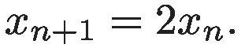

这是一个简单的*递归*公式，它在每次应用时都将值加倍。这里 2 只是一个比例常数，它告诉扩散发生的*速率*。

由于时间是连续的，因此将 *x* 视为时间相关值 *x(t)* 是有意义的。此外，将它解释为人口的一部分而不是一个绝对数量也是有意义的。这样，我们可以将问题重新表述为一个简单的一阶微分方程(ODE):

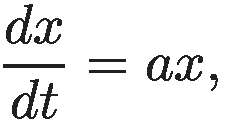

用*一个> 0 个*。

这个方程的解用经典的*指数*函数表示

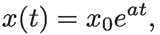

其中 *x0 = x(t = 0)* 就是所谓的*初始条件*。

它的形式正是戏剧性增长背后的原因。然而，当 *x* 开始变得过大时，这个函数就是一个糟糕的模型。毕竟，正如我们同意用来描述人口的*分数*一样，它不能超过 1。在某种程度上，它必须放慢速度，因为如果一个被感染的人只与被感染的人接触，就不会再有新的感染发生。

## 逻辑增长

在定义我们的模型时，考虑这种“停顿”机制似乎是一个自然的步骤。下面这款怎么样？

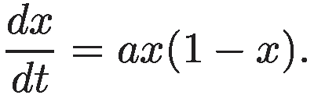

这个公式定义了*逻辑增长*。我们来考虑一下它的性质。最初，当 *x* 较小时， *a(1 - x)* ≈ *a* 和，增长是指数型的。然而，一旦 *x* 接近 0.5， *(1 - x)* 开始抑制增长，使其在 *x = 1* 时完全停止。

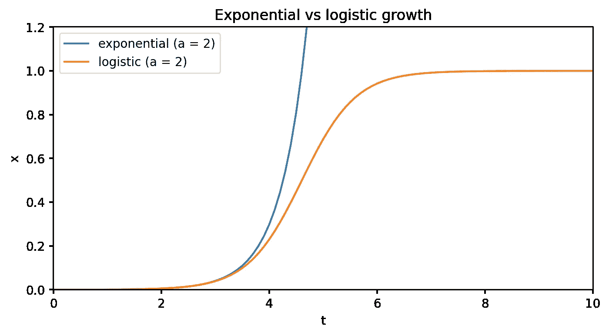

图一。指数增长和逻辑增长的比较。观察它们对于作者的小 x. Image 是多么的相似。

# 事情变得复杂…

逻辑增长看起来可以接受。我们喜欢它，因为它很容易理解，抓住了一些现实，给了我们希望，只要我们接近“临界点”(在这个例子中是 *x = 0.5* )，我们就可以阻止指数增长，并逐渐减缓整个事情。也许我们只需要参数化这里和那里的逻辑更新规则，它肯定会帮我们一个忙。我们知道这至少可以为我们赢得宝贵的时间。

不幸的是，这就是事情变得困难的地方。

## 与数据相关的问题

此类模拟(如[此处](https://www.sciencedirect.com/science/article/pii/S0960077920306378)或[此处](https://reader.elsevier.com/reader/sd/pii/S0048969720323512?token=9EED6EB763A840ED01BAAF6B40C20E7EE7980D09DBF798D4B3AFC14C0A763726388F3C80DD73D96CE7380ED6B3D8A0CE))的共同出发点是首先修改逻辑增长方程以捕捉更多现实情况，找到数据(如某个国家每天发生的病例数)，最后将数据拟合到分析解中(如果存在)或使用数据对其进行数字整合以进行微调。如果一个解决方案 *x(t)* 很好地捕捉到了数据，我们就可以做出预测或者进行进一步的“假设”分析。

这听起来很简单，但坏消息是大多数参数很难估计。例如，让我们稍微修改一下等式，通过添加 *x(∞) = x(t → ∞)* 系数(就像这里的[中的](https://www.sciencedirect.com/science/article/pii/S1201971220303039)一样)来说明也许不是每个人都会感染这种疾病。该等式将变成如下:

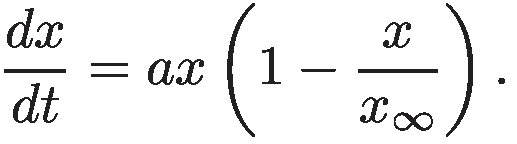

该系数本身表示最终会被感染的人口比例。虽然这是一个未知数，但人们可以通过比较参数化逻辑曲线与指数曲线的偏差来估计它。图二。显示了该参数的影响。

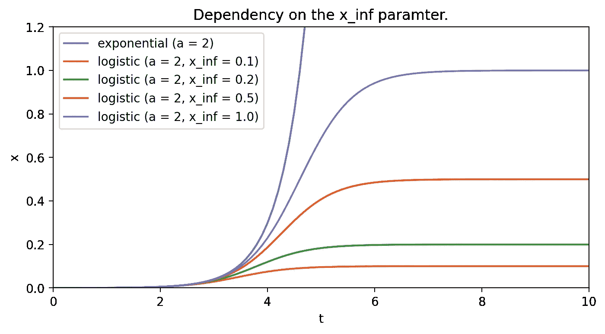

图二。系数对逻辑增长级数的影响。图片由作者提供。

由于大多数数据都有噪声，噪声很容易转化为对某些系数的错误估计。在微分方程的情况下，这些微小的变化可能会进一步放大，从而导致大胆的“错误估计”(稍后将详细介绍)。

尽管如此，数据上的噪声只是更大图景的一部分…

## 模型相关问题

添加 *x(∞)* 该参数表明朝着正确的方向迈出了一步，以捕捉更多的现实。然而，它并没有抓住全部。人们搬家，生病，有些人康复，有些人再次生病，有些人死亡，有些人出生。有的也是因为完全不相关的原因而死。

整个人口是一个动态的实体，这应该转化为一个新的方程。当然，并不是所有的过程都需要考虑在内，决定哪些过程重要，哪些不重要，以及如何考虑它们，这本身就是一个更大的挑战。

让我们看看下面的例子:[波兰](https://en.wikipedia.org/wiki/Template:COVID-19_pandemic_data/Poland_medical_cases)的数据。考虑到第一个 100 天，似乎很明显，疾病进展确实可以用修正的逻辑生长方程的解来表示:

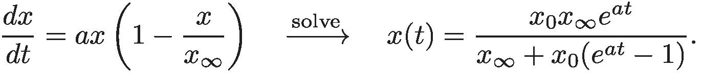

```
import pandas as pd
import numpy as np
from scipy.optimize import curve_fit

df = pd.read_csv('./poldata.csv').set_index('day')
ddf = df.head(100)

t = np.linspace(0.0, 10.0, num=101)

def logistic(t, a, x0, xi):
    return x0 * xi * np.exp(a * t) / (xi + x0 * (np.exp(a * t) - 1))

(*params,) = curve_fit(logistic, t[1:], ddf['cases'].to_numpy())[0]
solution = logistic(t, *params)
```

图 3。显示结果。

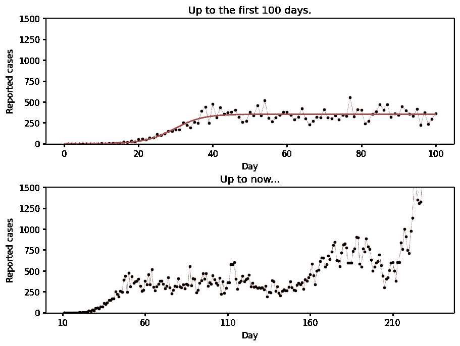

图 3。将逻辑增长函数拟合到前 100 天收集的数据中(上图)。226 天后的进展显示出不同的趋势(下图)。图片由作者提供。

事实是，在第一个 100 天之后，人们似乎彻底改变了他们的态度。说到数学，不仅我们的等式没有捕捉到几个可能重要的影响因素(例如，人们康复或再次感染)，而且常数(例如， *a* )也不是真正的常数。

因此，由于数据似乎反映了某种趋势(不同于逻辑，但仍然是一种趋势)，指责模型过于简单是有道理的。

没错。像这样的情况可能，的确，给我们希望，用正确的成分，应该有可能建立必要的方程，一旦解决，可以用于预测。

不幸的是，还有最后一个问题似乎是数学本身。

# 混乱

一片混乱。如果没有随机性、嘈杂的数据或“错误校准”的方程，混沌可能会让所有的预测完全变成废话。这是一个纯粹的数学现象，它起源于数字。

为简单起见，让我们回到纯逻辑增长更新规则 *ax(1 - x)。*让我们也编写递归应用这条规则的代码。以后会更容易形象化。

```
from functools import lru_cache

def logistic_growth(x, a=2.0):
    return a * x * (1 - x)

@lru_cache(100)
def update(x_init, i, rule=logistic_growth):
    x = rule(x_init)
    i -= 1
    if i == 0:
        return x
    else:
        return update(x, i, rule=rule)
```

## 蛛网图

有了这段代码，我们可以使用所谓的*蛛网*图来调查初始化解决方案的结果。通过绘制更新规则和一条对角线 *x = t* 来构建该图。然后，通过用某个数字初始化 *x(0)* ，我们通过随后应用规则并把输出反馈给输入来跟踪它。从视觉上看，这相当于将点从曲线上弹开(图 4。).

```
from functools import partial

def cobweb_plot(ax, x0_init, a, rule=logistic_growth, max_iter=10, 
    xlim=(0, 1), ylim=(0, 1)):

    x = np.linspace(xlim[0], xlim[1], num=101)
    update_rule = partial(rule, a=a)

    ax.plot(x, update_rule(x), 'b')
    ax.plot(x, x, color='k')

    x0, x1 = x0_init, update(x0_init, 1, rule=update_rule)
    y0, y1 = 0.0, update(x0_init, 1, rule=update_rule)

    ax.plot((x0, x0), (0, y1), 'r', lw=0.5)

    x0, x1 = x0_init, update(x0_init, 1, rule=update_rule)
    y0, y1 = 0.0, update(x0_init, 1, rule=update_rule)

    for i in range(1, max_iter):
        y1 = update(x0_init, i, rule=update_rule)
        ax.plot((x0, x1), (x1, x1), 'g', lw=0.5)
        ax.plot((x1, x1), (x1, y1), 'g', lw=0.5)
        x0, x1 = x1, y1

    ax.set_xlabel('x')
    ax.set_ylabel(f'{a} x(1 - x)')
    ax.set_title(f'Logistic growth progression, x0={x0_init}')
    ax.set_xlim(xlim)
    ax.set_ylim(ylim)

fig, axs = plt.subplots(2, 2, figsize=(10, 10), dpi=100)
for ax, x_init in zip(axs.flatten(), (0.11, 0.25, 0.66, 0.88)):
    cobweb_plot(ax, x_init, 2.0)
```

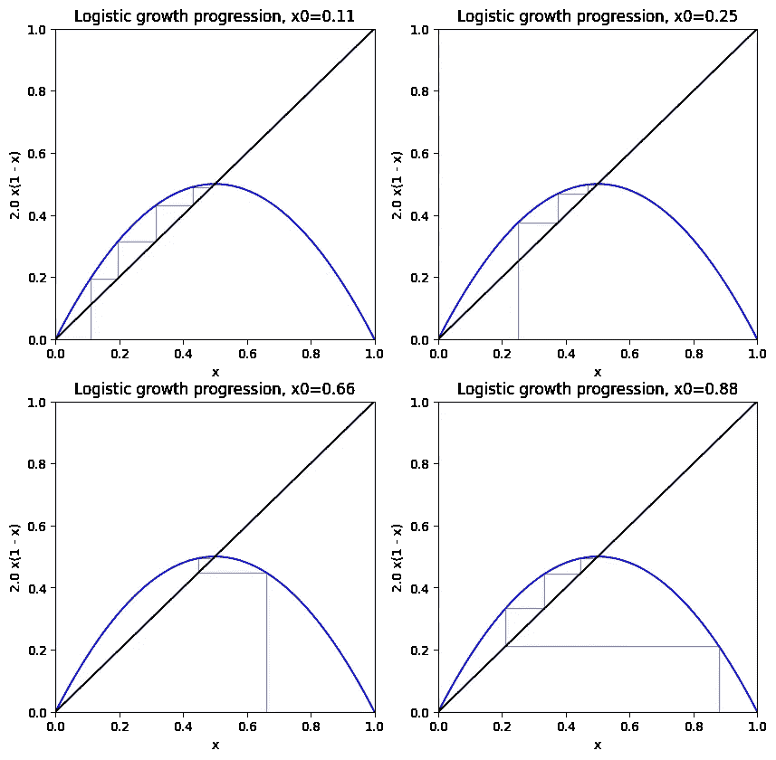

图 4。使用四种不同的初始条件为“a = 2”准备的蛛网图。不管“x0”如何，观察解如何收敛到 0.5。图片由作者提供。

*x(t) = t* 的点称为*不动点*。它们很重要，因为它们包含了整个系统的信息。这里(图 4。)，显然 *x = 0.5* 是一个特定的不动点，它倾向于*吸引*解。更正式的说法是叫一个*稳定不动点*，因为无论我们如何初始化解， *x* 最终都会稳定在 0.5。

## 不是每个 x 都是“有吸引力的”

逻辑规则是如此简单，以至于没有人会认为它会出错。我们知道 *a* 系数决定了扩散率(在文献中通常称为 *R* )。现在，让我们把它改成一些不同的值。

```
fig, axs = plt.subplots(2, 2, figsize=(10, 10), dpi=100)

axs = axs.flatten()
cobweb_plot(axs[0], 0.12, 3.31, maxiter=150)
cobweb_plot(axs[1], 0.62, 3.31, maxiter=150)
cobweb_plot(axs[2], 0.12, 3.51, maxiter=150)
cobweb_plot(axs[3], 0.12, 3.99, maxiter=150)
```

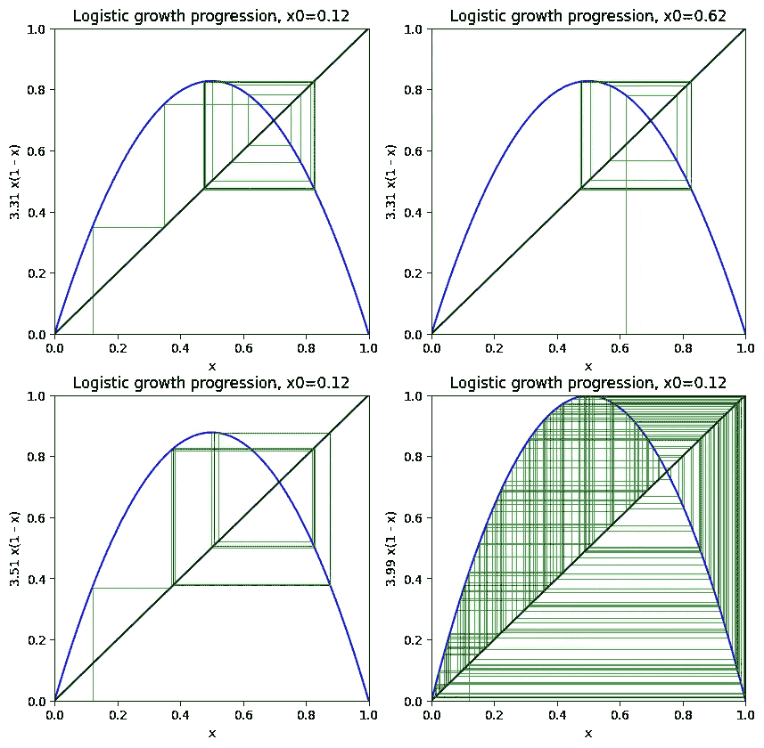

图 5。系统的不同演化情况。顶部:` a = 0.31 '和不同的初始值。下图:相同的初始值“0.12”，但不同的比率“a = 3.51”和“a = 3.99”。图片由作者提供。

正如我们在图 5 中看到的。选择稍高的复制率值 *a = 3.31* ，我们获得两个固定点。系统变得双稳态，并且当 *t → ∞* 时，解在 0.825664338273154 和 0.4465353535 之间交替翻转。1982 . 00000000005

进一步增加速率 a = 3.51，我们得到 4 倍的周期。最后，对于更高，似乎没有一点吸引解决方案了。它变得*不稳定*，其中初始值 *x0* 的微小变化导致完全不同的路径。字面意思就是[蝴蝶效应](https://www.imdb.com/video/vi1771308569?playlistId=tt0289879&ref_=tt_ov_vi)。

请注意，这是**而不是**随机性，因为我们的计算是完全确定的。然而，正是由于刚才提到的不稳定性，在实践中，即使对于完美的数据集和设计良好的方程，我们也可能面临无法做出任何长期预测的情况。

这只是…数学。

## 分叉

在我们结束这一部分之前，想象一个更有趣的图形可能会很有趣。

```
N_SAMPLES = 200

def get_fixed_point(x_init, a):
    return update(x_init, 100, rule=partial(logistic_growth, a=a))

a_values = np.tile(np.linspace(0.0, 4.0, num=200000) \
    .reshape(-1, 1), N_SAMPLES)
df = pd.DataFrame(a_values) \
    .applymap(lambda a: (np.random.random(), a)) \
    .applymap(lambda c: get_fixed_point(*c))

df = df.unstack().xs(1)
```

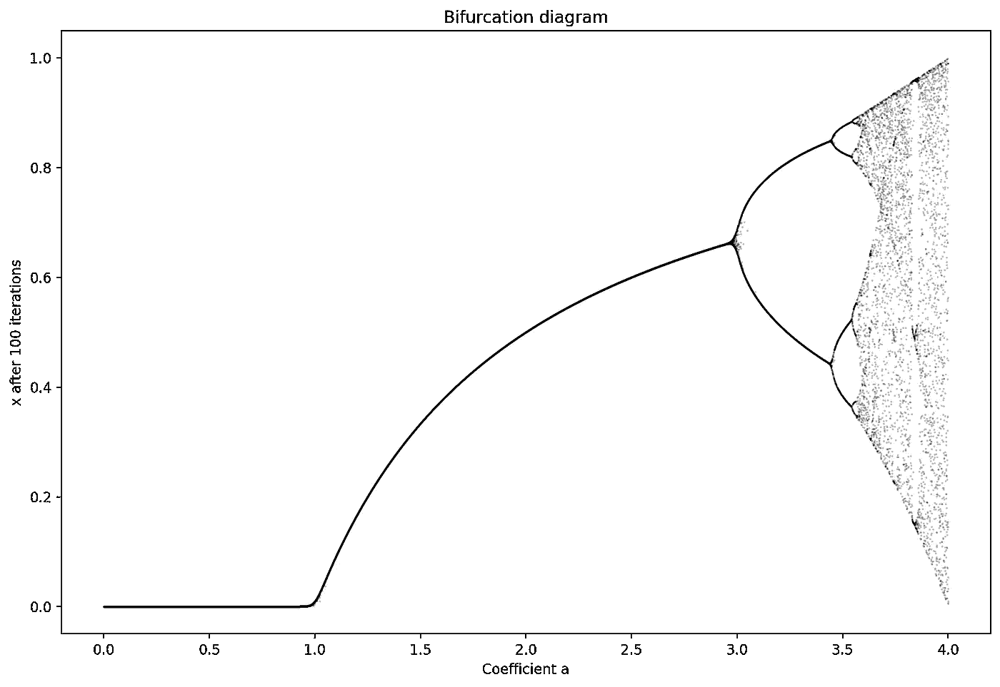

图。分支图是通过扫描“a”和每个“a”随机初始化“200 次并让系统每次进化 100 次迭代而获得的。图片由作者提供。

图 6。显示了所谓的分叉图，它显示了不同的 *x(∞)* 值作为 *(a，x0)* 的函数。我们可以看到，只要 *a < 1* ，最终的被感染比例就会降到零。对于 *1 < a ≈ < 3，*它会非零，但至少有一个解。然而，随着进一步增加，系统的最终行为变得越来越不可预测，即使 *a* 被精确估计。这个系统对微小的变化过于敏感，因此不能被信任。

# 结论

创建数学模型并非易事。我们已经看到了人们可能面临的三种主要挑战，最后一种挑战似乎是数学本身在捉弄我们。尽管如此，许多人发现，即使是简单的方程也能表现出如此丰富的行为，这令人着迷。

从实践的角度来看，预测模型通常由数学“驱动”,包括某种更新规则。即使它们不是直接基于微分方程，这些模型产生的解是否*稳定*也常常值得考虑。正如我们所看到的，即使是简单的规则，连续应用它们的长期效果可能会直接导致混乱。

# 还会有更多…

我计划把文章带到下一个层次，并提供简短的视频教程。

如果您想了解关于视频和未来文章的更新，**订阅我的** [**简讯**](https://landing.mailerlite.com/webforms/landing/j5y2q1) **。你也可以通过填写[表格](https://forms.gle/bNpf9aqZJGLgaU589)让我知道你的期望。回头见！**

*原载于*[*https://zerowithdot.com*](https://zerowithdot.com/time-forecasting-challenges/)*。*