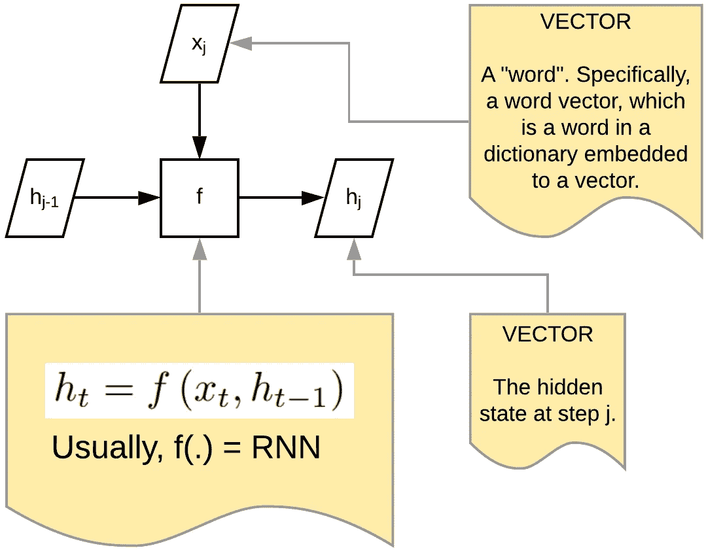
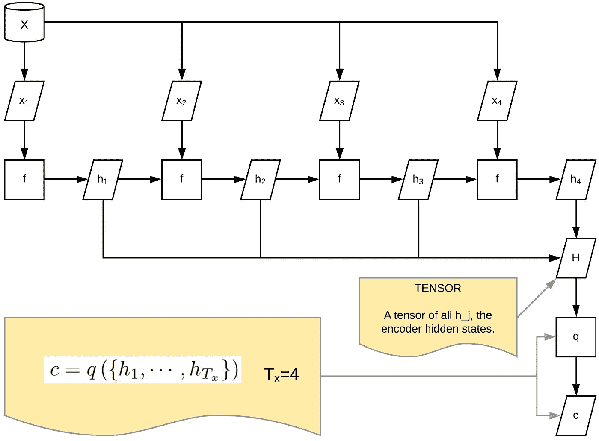
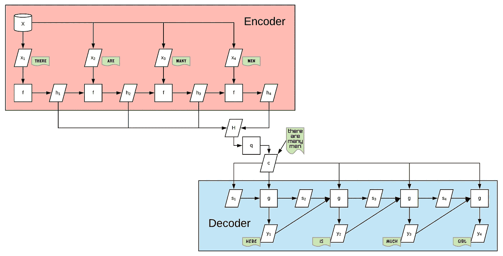
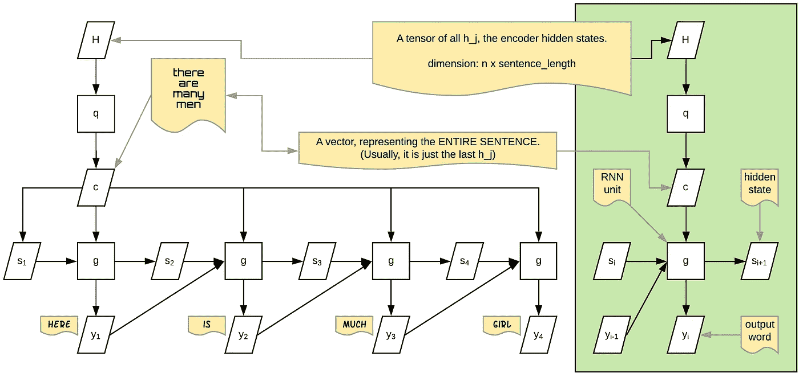
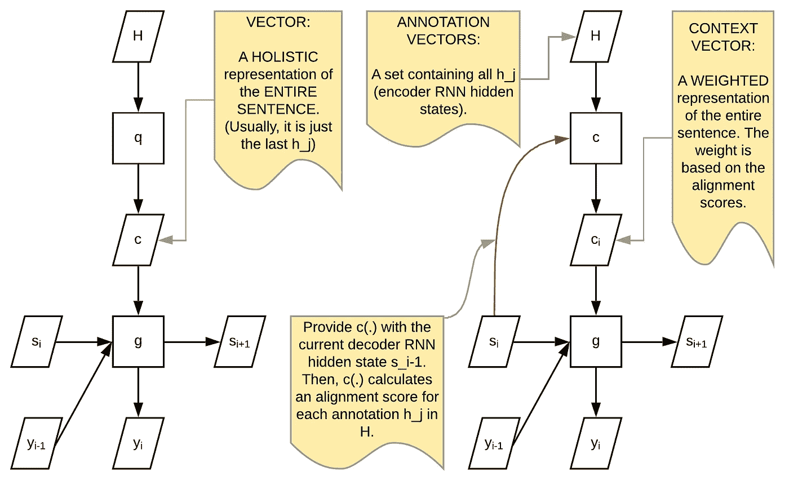
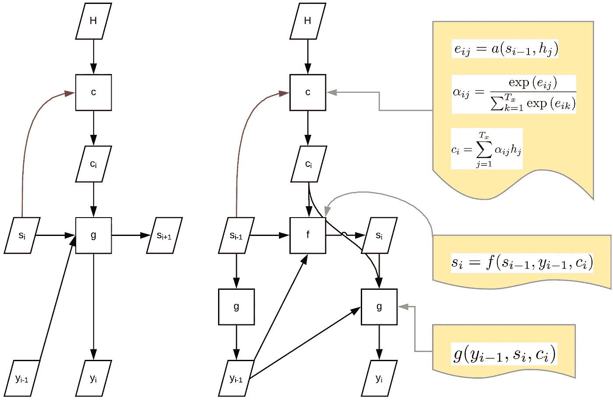
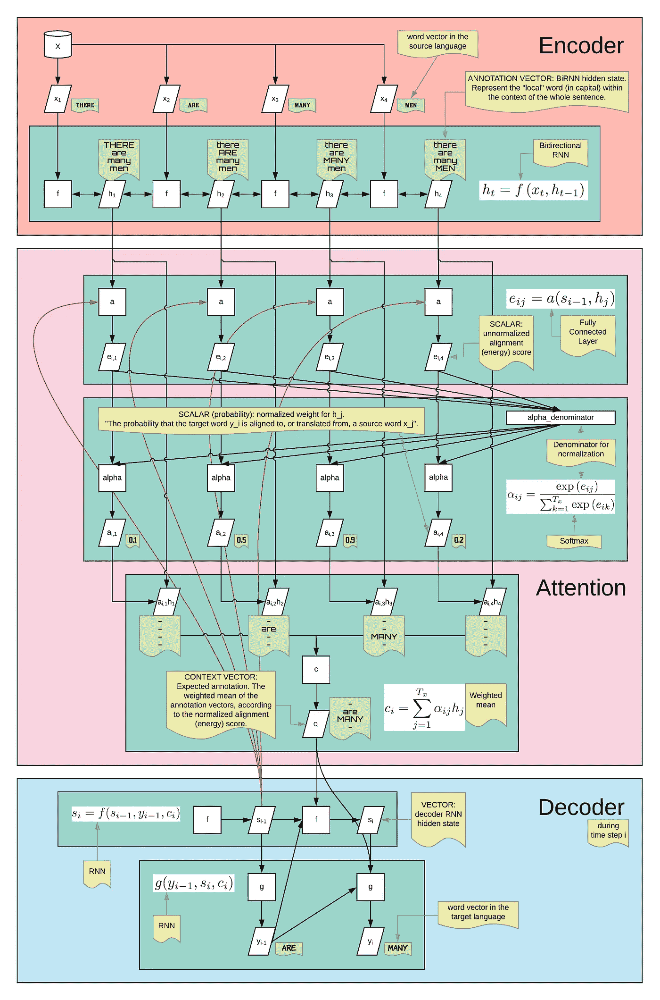
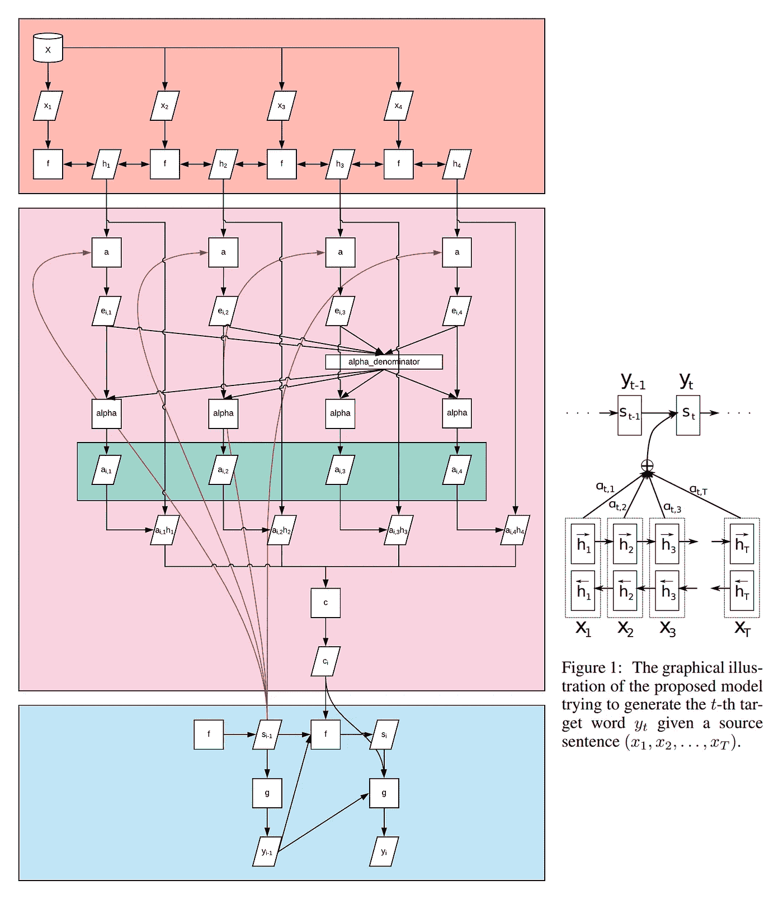
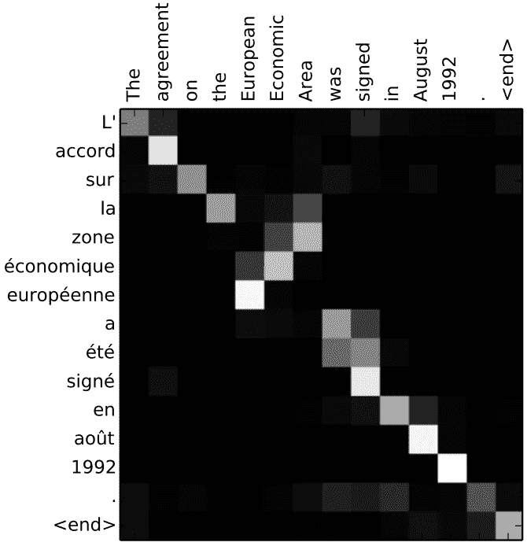

# 流程图中的注意机制

> 原文：<https://towardsdatascience.com/the-mechanics-of-attention-mechanism-f6e9805cca66?source=collection_archive---------22----------------------->

## **TLDR** :这基本上是关于将[yo shua beng io 小组的原始注意文件](https://arxiv.org/abs/1409.0473)【1】转换成流程图。查看附录前的最后一张图，了解完整的流程图。

*认知状态:我试图正确理解注意力机制，在这个层面上，我知道如何对任何类型的数据/问题或任何形式实施它，以及如何调整它以改善它。这篇文章就像是我自己教自己的笔记。最后，由于我自己没有实现注意力机制，所以我写这篇文章时不够资格，也过于固执己见。*

注意。Justin Chrn 在 [Unsplash](https://unsplash.com/s/photos/attention?utm_source=unsplash&utm_medium=referral&utm_content=creditCopyText) 上拍摄的照片

动机:[网上大部分解释](/intuitive-understanding-of-attention-mechanism-in-deep-learning-6c9482aecf4f)[做好](https://hackernoon.com/attention-mechanism-in-neural-network-30aaf5e39512) [在解释](https://pathmind.com/wiki/attention-mechanism-memory-network) [什么注意力机制](https://www.analyticsvidhya.com/blog/2019/11/comprehensive-guide-attention-mechanism-deep-learning/) [是关于](https://www.kdnuggets.com/2019/08/deep-learning-transformers-attention-mechanism.html)的，但不是它如何工作的确切的机械细节，比如哪个向量跟哪个矩阵走。虽然原始论文做得很好，但它就像一个非常浓缩的版本，典型的学术写作，这意味着我需要很大的努力来解开它。这是那个。

# 简要背景

原始论文正在处理一个特定的[自然语言处理(NLP)](https://en.wikipedia.org/wiki/Natural_language_processing) 问题，这是一个[机器语言翻译任务](https://en.wikipedia.org/wiki/Machine_translation)，将一个句子从源语言翻译成目标语言。它被制定为一种[编码器-解码器序列到序列(seq2seq)](https://en.wikipedia.org/wiki/Seq2seq) 架构，通常使用 [RNN](https://en.wikipedia.org/wiki/Recurrent_neural_network) 的变体来完成，如 [LSTM](https://en.wikipedia.org/wiki/Long_short-term_memory) 和 [GRU](https://en.wikipedia.org/wiki/Gated_recurrent_unit) ，它们是一类[深度学习](https://en.wikipedia.org/wiki/Deep_learning)算法，是[人工神经网络(ANN)](https://en.wikipedia.org/wiki/Artificial_neural_network) 的一部分，是人工智能(AI)的[数据驱动/机器学习范式，而不是模型驱动范式](https://medium.com/datadriveninvestor/how-is-machine-learning-different-and-why-it-is-better-d5671b52dd65)。本文的其余部分假设您熟悉这些概念。

# 香草 RNN

香草 RNN 编码器单元。

巴赫达瑙等人。艾尔。通过以下等式描述了典型的 RNN 编码器单元。我用下图解开了这个等式。x_t 是一个用向量表示的[字。函数 f(。)通常是某种类型的 RNN，像 LSTM 和格鲁。在论文中，他们使用的是](https://en.wikipedia.org/wiki/Word_embedding)[双向 RNN](https://en.wikipedia.org/wiki/Bidirectional_recurrent_neural_networks) (BiRNN)。最后，h_t 是 RNN 隐藏态。

完整的编码器架构如下，其中 c 是对整个句子进行编码的向量。通常，c = h_T，这基本上只是最后一个 RNN 隐藏态。

普通 RNN 编码器(T_x=4)

下面是一个典型的编码器-解码器 seq2seq RNN 的完整结构，翻译中有夸大的错误。想象一种语言，其中关于距离(这里对那里)、可数性([多](https://en.wikipedia.org/wiki/Count_noun)对[多](https://en.wikipedia.org/wiki/Mass_noun))和[性别](https://en.wikipedia.org/wiki/Grammatical_gender)/年龄/ [数量](https://en.wikipedia.org/wiki/Grammatical_number)(男人对女孩)[的信息包含在一个单词](https://en.wikipedia.org/wiki/Synthetic_language)中，被翻译成[另一种语言，其中这些信息必须被分割成多个单词](https://en.wikipedia.org/wiki/Analytic_language)，这些单词甚至可能彼此不相邻，反之亦然。此外，还有动词“to be”的问题，这是一个在所有语言中都不通用的特征。然后，我们可能会看到这类错误。

典型编码器-解码器的结构 seq2seq RNN 用机器发现翻译困难的夸张例子。不同的字体(字样)显示不同的语言(包括编码)。

(我在假装函数 g(。)产生下一个单词(技术上来说是单词向量，因为是嵌入的，但我打算从现在开始就称它为“单词”)。在本文中，它实际上是所有单词的概率向量。但这不是注意力机制的重要区别。)

# 香草 RNN 的局限

由于注意力机制只应用于解码器部分，所以我们可以忽略编码器部分，而专注于 H 也就是所有 h_j 的集合(原论文中有一个符号变化，所以我在这里反映出来。“j”是编码器部分的索引，“I”是解码器部分的索引，以前是“t”。)

左图:典型的 RNN 解码器。右图(绿框):典型 RNN 解码器的一个单元。

首先，在注意机制中，我们将使用 H，所有 h_j(所有隐藏状态的集合)的集合，而不仅仅是最后一个，所以让我们保持在那里。其次，为了简化起见，我们将重点关注一个 RNN 解码器单元，如上图右侧所示。

函数 g(.)(一个 RNN 单元)主要负责产生下一个单词(向量，嵌入的)y_i，这个决定是通过结合来自 c(代表原语言中的**整句**)、y_i(前一个单词)、s_i(前一个隐藏状态)的信息做出的。

作者意识到的是，使用“c”是一种非常糟糕的做事方式。首先，当一个人试图翻译下一个单词时(假设他们已经弄清楚了[的语序](https://en.wikipedia.org/wiki/Word_order)，**，他们只会关注(阅读:注意)一个(最多几个)单词**，而不是整个句子。然而，通过使用“c”作为输入，网络/模型的体系结构在某种程度上暗示我们应该试图从对整个句子的某种整体理解中找出下一个单词，但事实绝对不是这样。

(为什么是几个字而不是一个？根据语言的不同(特别是当从一种[分析语言](https://en.wikipedia.org/wiki/Analytic_language)翻译成综合语言的时候)，我们必须根据上下文来决定使用哪种形式。许多语言根据许多不同的语法方面改变形式，如单数/复数、男性/女性/中性、过去/现在/未来等。例如，想象从一种第三人称代词不区分性别的语言翻译过来，(像[印度尼西亚语“dia”](https://en.wiktionary.org/wiki/dia#Indonesian)翻译成英语 he/she)。网络必须**注意**单词“dia”**和**任何可能给出问题人物性别线索的单词，以便正确翻译。)

# 注意力的要点

注意机制使用通过计算解码器 RNN 隐藏状态(红色箭头)和 h 中的每个注释向量之间的对齐而创建的唯一上下文向量 c_i(而不仅仅是一般的“c”)

注意的要点基本上是用一个上下文向量 c_i 来代替一般的“c ”,而不是每一步都给解码器一个相同的“c ”,我们会在每一步给解码器一个不同的 c_i。希望这个 c_i 给予**注意**源句子中的相关单词。

为了做到这一点，函数 c(.)需要关于原始句子的详细信息(因此我们使用注释向量 H，而不仅仅是最后的 h_j)和当前解码器 RNN 隐藏状态 s_i(因此红色箭头)。理想情况下，上下文向量 c_i 将包含关于相关单词的大量信息，以及关于其他不太相关的单词的少量信息。

# **解码器实际上是如何实现的**

三个模块，每个输出一个:c(.)，f(。)，g(。).

每个解码步骤有 3 个重要输出:

1.  y_i，目标语言中的一个单词。
2.  s_i，当前解码器当前时间步的 RNN 隐藏状态。
3.  c_i，源句子的加权表示(权重基于注意力)。

[我不确定这是否是真正的动机，但是…]有 3 个不同的模块是有意义的，其中每个模块负责每个输出:c(。)，f(。)，还有 g(。):

*   c(H，si-1)= c _ I
*   f(c_i，s_i-1，y_i-1) = s_i
*   g(c_i，s_i，y_i-1) = y_i

# 最后，注意！

最后一个问题是，如何计算上下文向量 c_i？这可以通过下面的完整模型得到最好的解释(根据注释，我希望这是不言自明的)。

注意机制的完整模型。方程式转录成流程图。

最重要的部分是比对分数 e_i，j(出于某种我不明白的原因，也被称为能量)。它基于当前解码器 RNN 隐藏状态计算源语言中每个单词的相关性(由注释 h_j 表示)。然后，我们给更相关的单词更大的权重，给不太相关的单词更小的权重。这相当于把**的注意力**给了更相关的词。下一步只是使用 softmax“标准化”权重。(出于某种我不明白的原因，等同于概率)。最后，我们计算源语言句子中所有单词的加权平均值，得到上下文向量 c_i。

# 附录

将我们的流程图与原始文件中的简化图进行比较。

对齐矩阵。(来自原论文)

要获得著名的比对矩阵图，只需绘制所有的 a_i，j，其中 I 是列，j 是行。

## 软注意和硬注意

这里描述的注意机制可以被认为是软注意，因为它使用的是 softmax。如果使用最大值(。)函数，那么 c_i 将只是最相关的单词向量。这可能不太有利，因为一些单词与另一种语言中的多个单词对齐。更重要的是，我们不能通过 max(使用反向传播。)，而我们可以用 softmax 做同样的事情。

# 参考文献和致谢

[1] D. Bahdanau，K. Cho 和 Y. Bengio，[联合学习对齐和翻译的神经机器翻译](https://arxiv.org/abs/1409.0473) (2015)，学习表征国际会议(ICLR)

感谢[陈思](https://www.sichenzhao.com/)教会我注意力是如何工作的。

所有图像属于我，除非在标题中另有说明。