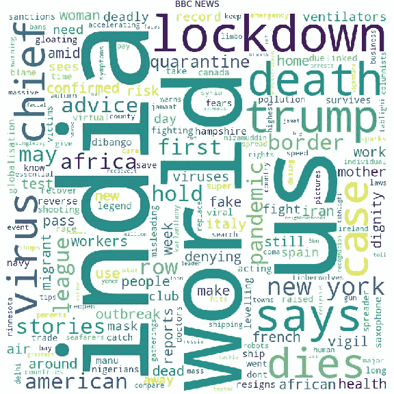
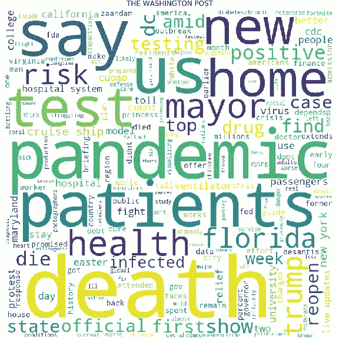
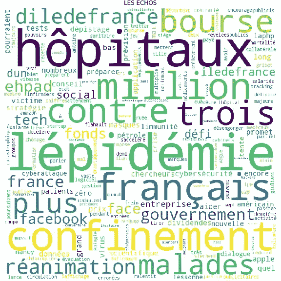
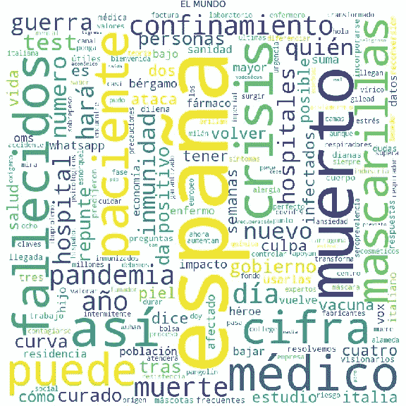
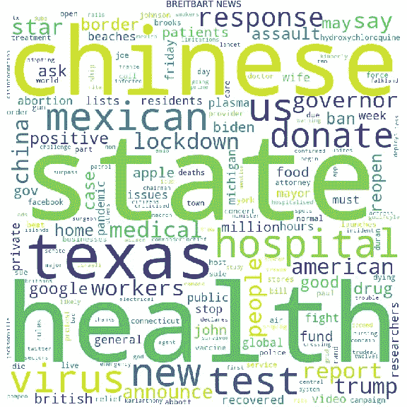
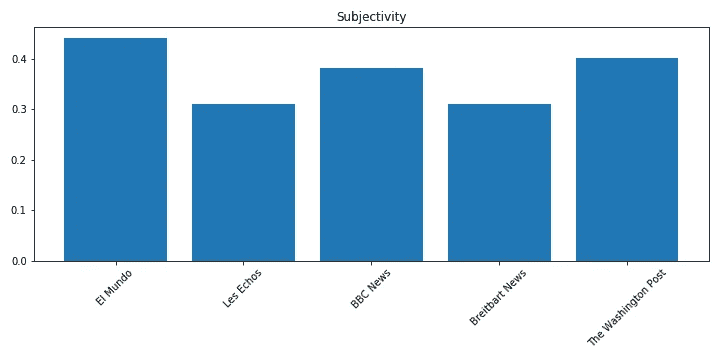

# 媒体的新冠肺炎情绪

> 原文：<https://towardsdatascience.com/the-medias-covid-19-emotions-72b76963357d?source=collection_archive---------33----------------------->

资料来源:Pexels

报纸文章标题的自然语言处理分析

作为一个数据科学的待业学生，我至今还没搞清楚这是不是“21 世纪最性感的工作”。如果你们中的一个有，我很想知道你的观点！关键是，失业意味着我有很多空闲时间，这与你和我都(希望)遵循的社交距离措施相结合，所以我最近阅读了很多关于 COVID 相关问题的新闻。

经过几个月的持续接触，以真正的数据科学家的方式，一个想法浮现在我的脑海中:如果我分析一些最近的新闻文章，看看报纸是在利用积极还是消极的情绪——也许是作为一种让(一些)人产生负罪感的手段，让他们遵循社交距离措施，或者让其他人对他们感到愤怒，会怎么样？

这就是我产生这个想法的“社交媒体”版本。事实上，我很无聊，想做一些“数据科学”的事情，所以我下载了一些数据，并扔了一些我在学校学到的东西，看看会出现什么。

**数据集**

与典型的大数据标准相比，我使用的数据集非常小。我从 2020 年 3 月 22 日开始使用新闻 API(【https://newsapi.org/】T2)为 5 家不同的报纸收集了 100 篇报纸文章。我试图通过为英国(BBC)、西班牙(El Mundo)、法国(Les Echos)、美国(Washington Post)各准备一份受人尊敬的报纸来分散消息来源，并使用通配符作为布莱巴特，因为，嗯，它是布莱巴特。我无法分析文章文本本身(NewsAPI 似乎没有给我完整的文章)，所以我只对标题进行分析。

**假说**

我有两个目标:

1.  获取所有报纸标题的总字数，看看它们是否都集中在某些话题上(假面舞会、死亡、医院等)。)
2.  某些报纸标题是否平均具有积极或消极的倾向，作为它们是否诱导积极或消极情绪以吸引读者参与的(牵强)代理。

**家政**

在我给你看分析之前，有几点需要在这里说清楚:

a)有些标题只包含几个词(在有限的时间范围内)。对于任何一种 ML 技术(包括 NLP ),仅仅用几个数据点来提供结论性的证据要困难得多。

b)这些只是标题，其作用是吸引注意力，而不是表达观点。真正的感悟可以在文章本身找到。尽管如此，标题本身可以是负面的，以引起对文章的注意，所以对它的分析还是有一些价值的。

c)我的其他文章的读者会知道，我倾向于不从数据中得出太多的结论，而是让读者自己解决问题，所以我将在下面向您展示我的发现，我们可以在评论中讨论这些结论。

**字数**

我做的第一件事是计算 5 份报纸标题中使用的单词。它们都有一些有趣的地方:

数据来源:新闻宣传，英国广播公司

BBC:奇怪的是，印度是一个非常常见的词(也许印度有很大的读者群)，但忽略这一点，BBC 的主要观点似乎是对世界的封锁及其[影响]。

数据来源:新闻 API，华盛顿邮报

《华盛顿邮报》:测试似乎是这家报纸最常使用的词，也许是因为它的来源国(美国)的缘故，在美国，测试最近成了一个热门话题。

资料来源:新闻宣传，回声报

《回声报》:封锁是法国的大新闻，监禁是最热门的词。医院也占据首位，单词 cure 或 cured(复活)在词云(也适用于西班牙)中占据显著位置。

数据来源:新闻 API，世界报

《世界报》:如果我可以这么说的话,《世界报》有一点爱国倾向，因为它最常用的词是西班牙语中的西班牙。与其他报纸相比，masques 也成为一个热门话题，尽管这并不奇怪，因为它们已经成为世界范围内的一个重大瓶颈，特别是在西班牙(为了重新开放该国，西班牙决定向所有人发行它们)。

最好的留到最后…

数据来源:新闻 API:布莱巴特

e)布莱巴特:如果你知道布莱巴特代表什么，我想你不会对中文和墨西哥成为热门词汇感到惊讶。

***这一切意味着什么？对于任何一份报纸来说，关键话题都是读者最有兴趣了解的。从愤世嫉俗的角度来看(更确切地说，是匆忙下结论)，这些话题反映了这些报纸的读者的偏见。对布莱巴特来说，这种偏见更加明显，但对像《世界报》这样的报纸来说可能不是(至少对我来说不是)。知道你我所阅读的报纸的偏见在哪里很好，这样我们就可以避免把自己进一步推入过滤泡沫。***

**情绪**

现在让我们来看看，平均来说，是否有些报纸使用的标题包含了更消极的情绪，而另一些则更积极。

数据来源:新闻 API

上图显示了每份报纸所有标题的平均极性。范围从-1(负)到 1(正)，数字越大表示每个方向的极性越大。

我们真的不能在这里说太多，因为所有报纸的极性数字都很低。然而令我惊讶的是，两家欧洲(后英国退出欧盟时代)报纸似乎在标题上有负面倾向。也许这与他们的政治偏见有关，所以对此更了解的人可能会提供一些澄清。BBC 似乎是最中立的。更令人惊讶的是，布莱巴特对其标题的正面情绪相对较高，而《华盛顿邮报》是分析对象中最正面的。

这是什么意思？如果你是西班牙人，也许只阅读世界报的文章会让你对周围的一切都感到消极，所以多样化地阅读 BBC 上的西班牙文文章。再说一次，在这一点上我们不能下任何结论，上面的工作是为了满足我的无聊感，也是为了提供一些有用的信息。

**客观性**

最后，因为我用来做情感分析的 Python 库(TextBlob)也给出了标题的平均客观性，所以我想为什么现在也给你看这个。

数据来源:新闻 API

客观性的衡量标准与情感的衡量标准一样，1 代表客观工作，1 代表主观工作。换句话说，主观性越高、越积极，标题就越不客观。

没有一家报纸在客观性方面得分很高。《世界报》似乎是主观性最强的，而《回声报》是主观性最低的。

我不会走得太远，以至于说你应该忽略这些报纸中的任何一份，因为它们不符合事实，仅仅因为这些是正在被分析的标题，它们必须能够抓住你的注意力——它们天生就能引发情绪。

我想说的是，正如他们所说的，永远不要通过封面来判断一本书，永远不要通过标题来判断一篇文章，但要知道鉴于标题的性质，这篇文章是否可能引发负面情绪。如果这还不够复杂的话，也许，仅仅是也许，这能帮助你避免比我们现在经历的更多的悲伤。

任何意见，一如既往，非常感谢。