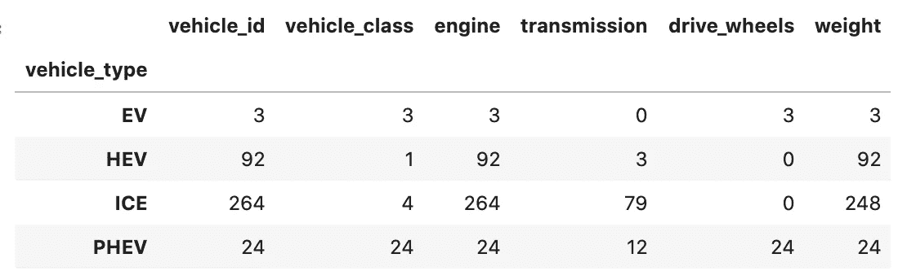
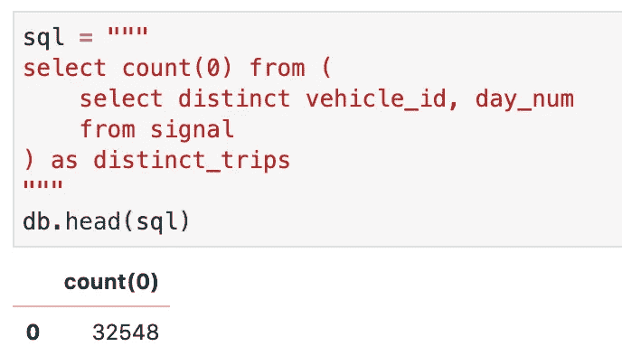
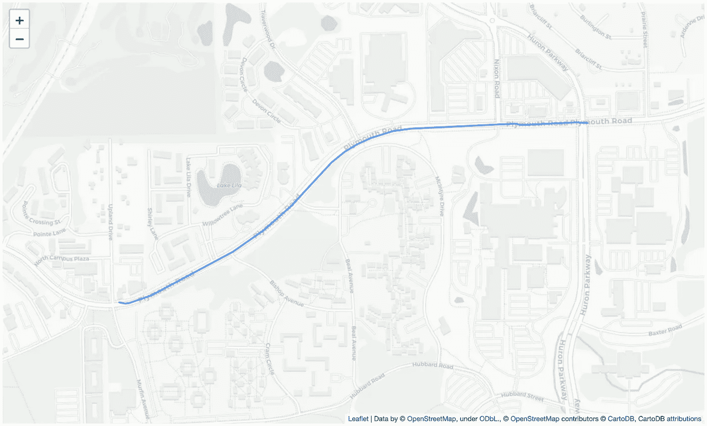

# 中型数据集

> 原文：<https://towardsdatascience.com/the-medium-sized-dataset-632cf0f15bb6?source=collection_archive---------37----------------------->

## 对 RAM 来说太大，对集群来说太小。


马丁·桑切斯在 [Unsplash](https://unsplash.com?utm_source=medium&utm_medium=referral) 上的照片

小数据集很酷。你可以将它们加载到内存中并随意操作它们，不费吹灰之力。海量数据集也很酷。他们有大量的数据和令人兴奋的模型和分析的承诺。您很乐意支付所需集群的价格，只是为了处理所有这些优点。中等规模的数据集是一种痛苦。它们要么足够小，适合您的 RAM，但处理起来太麻烦，要么只是比您的内存大一点，但不值得集群成本。你如何处理这种情况？

有几种解决方案可以处理中型数据集，我最喜欢的是使用本地数据库。您可以将数据放在本地存储中，只将需要处理的内容放入内存中。一个古老但行之有效的解决方案。

我的常规设置是 Python 机器学习和数据分析生态系统支持的 Jupyter 笔记本。对于这样的环境，一个自然的本地数据库选择是 [SQLite](https://www.sqlite.org/index.html) 。Python 发行版附带了该数据库的一个实现，该实现具有简单直观的 API。

在本文中，我用一个中等大小的车辆燃料和电能消耗数据集来说明这种用法，如上所述。

在我们继续之前，我建议您安装一个 SQLite 数据库编辑器，比如 [SQLiteStudio](https://sqlitestudio.pl/) 。在创建和检查数据集时，像这样的工具会让您的生活变得更加轻松，我发现它们的用处非常宝贵。

# 车辆能源数据集

2019 年，G. S. Oh、David J. Leblanc 和 Huei Peng 发表了一篇关于[车辆能源数据集](https://arxiv.org/abs/1905.02081) (VED)的论文，其中包含一年的车辆轨迹和能源消耗数据。这些数据是从 2017 年 11 月至 2018 年 11 月在安阿伯收集的，参考了 383 辆不同类型和动力源的车辆样本。有关数据集及其内容的官方描述，请参见本文。

数据集从作者的 [GitHub 存储库](https://github.com/gsoh/VED)分发，由两个名为*动态*和*静态*数据的子集组成。前者包含所有收集的信号数据，而后者由两个 Microsoft Excel 文件组成，其中包含有关所研究车辆的信息。两个压缩文件包含整个动态数据集。

下面展示的所有代码都可以在本文的 [GitHub 库](https://github.com/joaofig/ved-explore)中找到。

# 获取数据

要下载数据，我们可以简单地将存储库克隆到本地存储。这个过程很容易做到:

```
git clone [https://github.com/gsoh/VED.git](https://github.com/gsoh/VED.git) ./ved
```

克隆后，新创建的本地目录包含许可证文件、文档文件和包含两个数据集的数据目录。在继续之前，我们必须首先使用特定工具解压缩动态数据文件:

```
7z x ./ved/Data/VED_DynamicData_Part1.7z -o./data
7z x ./ved/Data/VED_DynamicData_Part2.7z -o./data
```

请注意，您可能必须安装适当的文件压缩工具，以上命令行才能工作。一旦完成，本地数据目录将有 55 个 CSV 文件和每周动态数据。我们现在可以读取它们并将其插入到 SQLite 数据库中。

你可以在附带的 [GitHub 库](https://github.com/joaofig/ved-explore)中找到作为第一个 [Jupyter 笔记本](https://github.com/joaofig/ved-explore/blob/master/1-download-ved.ipynb)实现的下载和解压过程。

# 数据库

在使用它之前，我们必须首先通过提供的 Python API 创建 SQLite 数据库。为了使整个过程更简单、更易于管理，我创建了一个更高级别的类来与数据库交互。要访问它，您只需要实例化一个对象:

```
from sqlapi import VedDbdb = VedDb()
```

对象实例化在后台执行几个任务，比如打开数据库文件，如果它还不存在，就创建一个基线结构。该代码使用外部存储的 SQL 脚本创建数据库表和索引，如下所示，该脚本创建包含所有车辆的表。

```
CREATE TABLE vehicle (
    vehicle_id      INTEGER PRIMARY KEY ASC,
    vehicle_type    TEXT,
    vehicle_class   TEXT,
    engine          TEXT,
    transmission    TEXT,
    drive_wheels    TEXT,
    weight          FLOAT
);
```

外部 JSON 文件对这些文件的执行顺序进行编码。这种设置允许直接扩展 SQL 文件及其执行顺序。下面是撰写本文时 JSON 文件内容的一个示例:

```
{
  "sequence": ["tables", "indexes"],
  "tables": [
    "tables/vehicle.sql",
    "tables/signal.sql",
    "tables/move.sql"
  ],
  "indexes": [
    "indexes/idx_signal_vehicle_day_ts.sql",
    "indexes/idx_move_vehicle_day.sql"
  ]
}
```

“sequence”标记包含一个列表，其中列出了要按顺序执行的 JSON 标记的名称，因此在本例中，我们首先创建表，然后创建索引。“表”列表中的每个条目都是要执行的 SQL 脚本的相对路径。基路径是默认的构造函数参数。

数据库准备就绪后，我们可以开始从下载的 VED 数据文件导入数据。

# 导入数据

VED 动态数据保存在几个可管理的 CSV 文件中，因此我们可以一次一个地将它们读入 Pandas 数据帧，并将数据批量插入数据库。Pandas 库使得读取 CSV 文件变得非常容易，因此我们可以使用它来轻松地将数据读入内存。下面是这样做的代码(请参考 [GitHub 库](https://github.com/joaofig/ved-explore)中的[第二笔记本](https://github.com/joaofig/ved-explore/blob/master/2-import-data.ipynb)):

```
for file in tqdm(files):
    df = read_data_frame(file)

    signals = []
    for row in df.itertuples(index=False):
        signals.append(row)

    db.insert_signals(signals)
```

插入信号的函数也使用外部存储的 SQL 脚本。为了管理这些外部引用，我创建了一个类，它按需从存储中加载 SQL 脚本，并使用字典将它们存储在内存中。这种解决方案的优点是允许您在不更改 Python 代码的情况下更改 SQL 脚本，并且内存缓存意味着您在第一次加载文本文件时只会受到很小的性能影响。下一次对性能的影响几乎为零。该函数如下所示:

```
def insert_vehicles(self, vehicles):
    conn = self.connect()
    cur = conn.cursor()
    sql = self.sql_cache.get("vehicle/insert")
    cur.executemany(sql, vehicles)
    conn.commit()
    cur.close()
    conn.close()
```

正如您可能已经猜到的那样，脚本的键名是文件的相对路径名，不带扩展名。

同样的过程也适用于静态数据集，但是这次使用 Panda 的函数将 Excel 文件读入数据帧。

# 探索数据

为了说明如何使用 SQLite 接口探索数据集，让我们从分析生成数据的车辆类型开始。我们首先发出一个查询，并将结果存储在 Pandas 数据帧中:

```
vehicles = db.query_df("select * from vehicle")
```

将所有车辆数据加载到 DataFrame 后，我们可以使用标准查询方法来揭示数据结构:

```
vehicles.groupby(by='vehicle_type').count()
```

该命令产生以下输出:



车辆特征计数

我们还可以通过`head`和`tail`函数进行快速检查，如下所示:

```
db.head("select * from signal where vehicle_id = 10", rows=20)
```

# 跳闸检测

我们现在可以使用上面描述的简单工具进行一些更复杂和更深入的分析。数据集中高频位置数据的存在允许我们执行轨迹分析，以帮助表征车辆行为。检测已知停靠点之间的单个车辆行程通常是一个复杂的过程。幸运的是，我们很幸运拥有这个数据集，因为数据匿名化过程为我们提供了这个数据集。

VED 的数据收集流程通过一个相对简单的三步法确保了驱动程序的匿名化。这个过程被证明与这项研究非常相关，因为它产生了一个副产品，一条重要的信息:个性化的车辆轨迹。为了匿名化驾驶员信息，研究作者应用了*随机模糊*、*地理围栏*和*主要交叉路口边界*的技术。随机雾化方法移除行程开始和结束附近的观察位置。地理围栏技术在围绕城市边界定义的边界框之外裁剪观测值。作者还在第一个和最后一个重要的十字路口附近修剪了行程。除了驾驶员匿名化，这些程序还具有生成易于使用的个人轨迹的好处。

粗略检查之后，很容易意识到我们可以仅使用两个特征来识别行程，即“天数”和车辆标识符。让我们先计算一下不同车辆的行驶次数。



使用 SQL 查询计算车辆行驶次数。

数据集中有超过 32000 次旅行。知道了如何唯一地标识车辆行程，我们就可以创建一个包含每个行程的汇总信息的表。该表将证明其在迭代行程时作为信号表索引的有用性，并有助于汇总每辆车的行程。

数据库启动代码创建了一个名为“move”的额外表来存储每个旅行标识符。我们可以使用更复杂的查询来填充该表:

```
insert into move (vehicle_id, day_num, ts_ini, ts_end)
select    tt.vehicle_id
,         tt.day_num
,         ( select min(s1.time_stamp)
            from signal s1
            where s1.day_num = tt.day_num and
                  s1.vehicle_id = tt.vehicle_id
            ) as ts_ini
,         ( select max(s2.time_stamp)
            from signal s2
            where s2.day_num = tt.day_num and
                  s2.vehicle_id = tt.vehicle_id
            ) as ts_end
from (select distinct vehicle_id, day_num from signal) tt;
```

您可以尝试使用“查询”功能从笔记本中运行此操作，或者使用数据库接口对象中的现成快捷方式:

```
db.generate_moves()
```

这个函数说明了从 Python 代码中分离 SQL 脚本的原理。它首先通过 SQL 脚本缓存对象加载文本，然后执行它。结果是一个包含每辆车所有独特行程的表。如果我们需要检查一辆车的行程，我们可以使用简单的连接到信号表的查询来获取必要的详细信息。让我们用一张地图来说明这一点。

# 规划旅行

为了提取任意行程的地理信息，我们可以使用“移动”表作为“信号”表的选择器。

```
sql = """
select      s.latitude
,           s.longitude
from        signal s 
inner join  move m on m.vehicle_id = s.vehicle_id and 
                      m.day_num = s.day_num
where       m.move_id = 1
"""
locations = db.query(sql)
```

关于上面的代码，有两点需要注意。首先，我通过惟一的标识符选择了一个任意的旅程。更现实的情况是选择车辆和行程检查周期。其次，这个版本的查询函数返回一个元组列表，其顺序与 SQL 文本中声明的顺序相同。这种安排非常方便，因为我们可以立即将查询结果返回给所选择的地图对象，一个[叶子](https://python-visualization.github.io/folium/) [折线](https://python-visualization.github.io/folium/modules.html?highlight=polyline#folium.vector_layers.PolyLine)。

```
tiles = "cartodbpositron"
map = folium.Map(prefer_canvas=True)
folium.TileLayer(tiles).add_to(map)color='#3388ff'
opacity=0.7lats = [l[0] for l in locations]
lons = [l[1] for l in locations]
min_lat, max_lat = min(lats), max(lats)
min_lon, max_lon = min(lons), max(lons)
map.fit_bounds([[min_lat, min_lon], [max_lat, max_lon]])polyline = PolyLine(locations, color=color, opacity=opacity)
polyline.add_to(map)
```

结果如下:



在交互式地图上绘制的车辆行程的地理位置。

# 摘要

在本文中，我展示了在管理中型数据集时，如何使用 SQLite 作为 Pandas 的部分替代方案。当 RAM 不足时，这种方法尤其实用。通过将熟悉的 Pandas API 与一点 SQL 混合，您可以对不适合您的主存的数据集执行令人信服的分析。

我将在本文之后对 VED 进行更深入的分析，因为它是一个如此有趣的数据集，将地理信息与车辆能源性能数据相结合。敬请关注即将发布的文章。

# 参考

[1] G. S. Oh，David J. Leblanc，Huei Peng。[汽车能源数据集(VED)，用于汽车能耗研究的大规模数据集](https://arxiv.org/abs/1905.02081)。

[2] [GitHub 库](https://github.com/joaofig/ved-explore)

[3] [SQLiteStudio](https://sqlitestudio.pl/)

# 相关文章

[](/geographic-clustering-with-hdbscan-ef8cb0ed6051) [## 使用 HDBSCAN 进行地理聚类

### 如何使用 HDBSCAN、H3、图论和 OSM 探索地理数据。

towardsdatascience.com](/geographic-clustering-with-hdbscan-ef8cb0ed6051) [](https://www.linkedin.com/in/joao-paulo-figueira/) [## joo Paulo Figueira-数据科学家- tb.lx by 戴姆勒卡车和公共汽车| LinkedIn

### 查看 joo Paulo Figueira 在全球最大的职业社区 LinkedIn 上的个人资料。圣保罗列出了 1 份工作…

www.linkedin.com](https://www.linkedin.com/in/joao-paulo-figueira/)