# 真实世界数据的混乱:用逻辑函数追踪 COVID19 的生长因子。

> 原文：<https://towardsdatascience.com/the-messiness-of-real-world-data-tracking-r0-of-covid19-with-logistic-function-31cb4d6edd98?source=collection_archive---------33----------------------->

## TLDR:这是一个关于现实世界的数据如何不能很好地符合一个过于简单的模型的故事。又名:假设[完美球形奶牛](https://en.wikipedia.org/wiki/Spherical_cow)如何导致[阴性结果](https://en.wikipedia.org/wiki/Null_result)。

*认知状态:我对深度学习有足够的研究，知道它是一个数据饥渴的模型，我们没有足够的数据让 COVID19 把它当作一个时间序列。所以不妨拟合一条古老的逻辑曲线。鉴于我在流行病学方面完全缺乏能力，我写这篇文章时资格不足且过于固执己见。而我对此有证明:* ***勘误表:*** *我把 R0 误认为是生长因子，懒得去固定数字。如果这还不够免责声明的话，下面是来自编辑的样本版本:*

***编者注:*** [*走向数据科学*](http://towardsdatascience.com/) *是一份以数据科学和机器学习研究为主的中型刊物。我们不是健康专家或流行病学家，本文的观点不应被解释为专业建议。想了解更多关于疫情冠状病毒的信息，可以点击* [*这里*](https://www.who.int/emergencies/diseases/novel-coronavirus-2019/situation-reports) *。*

球形奶牛。来源:[http://www.cs.cmu.edu/~kmcrane/Projects/ModelRepository/](http://www.cs.cmu.edu/~kmcrane/Projects/ModelRepository/)

# 这个计划

计划很简单:

1.  观看上面 3blue1brown 的[指数增长和流行病](https://youtu.be/Kas0tIxDvrg)。
2.  了解 [logistic 模型](https://en.wikipedia.org/wiki/Logistic_function)了解[生长因子](https://en.wikipedia.org/wiki/Exponential_growth#Basic_formula)(来自视频)。
3.  获取 [COVID19 数据](https://github.com/CSSEGISandData/COVID-19)。
4.  用一个逻辑模型来拟合它(查看附录中的数学公式)并追踪 r。
5.  确认这适用于中国的数据(中国的数据已经接近逻辑曲线的平顶)
6.  然后再外推到全世界的数据。
7.  找出世界现在在逻辑曲线上的位置。
8.  ???
9.  利润！

# 理论

第 1 部分到第 3 部分很简单。第 4 部分在理论上可行:

确诊病例(黑色)形成了一个很好的 s 形(或者 sigmoid，如果你想花哨一点的话)逻辑曲线。一阶导数(红色的每日新案例)形成了一条漂亮的钟形曲线(据我所知不是正态/高斯曲线)。生长因子(蓝色，使用右轴)平稳下降。当生长因子达到生长因子=1 标志(水平蓝色虚线)时，新病例数开始下降。我们可以将逻辑斯谛曲线分成 4 个部分，由 3 条垂直的绿线来划分，分别标记最大值、拐点和最小值。

是的，这里和那里有些不连续，因为我用的是离散方法(因为实际数据无论如何都是离散的)。但一般来说，这在理论上是行得通的。(曲线是垂直归一化的，因为我们并不真正关心实际值，而是更关心曲线的形状。)

# 中国

即使使用中国数据拟合逻辑模型，直到一阶导数，一切仍然相当好:

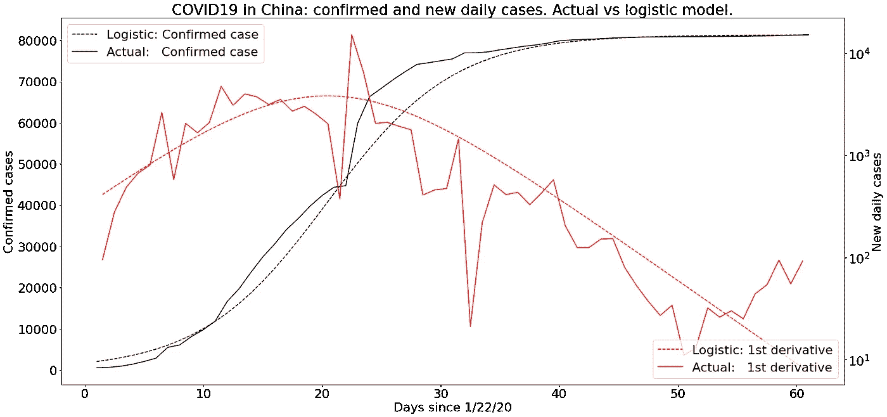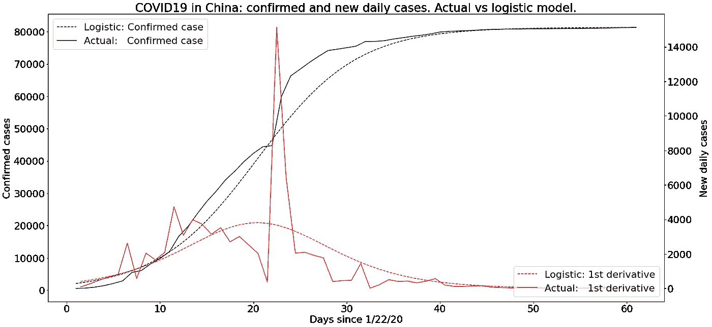

这个看起来很有前景！(除了第 50 天以后，好像每天的新增病例都在慢慢增加！这是令人恐惧的第二波浪潮的开始吗？).

(还有另外一个顾虑。数据太吻合了。有一些主要的干预措施，但一切看起来都像噪音(除了由于诊断定义的变化而在第 22 天左右突然出现的峰值)。中国做了很多干预，但为什么这些干预消失在噪音中，没有出现突然下降或类似的情况？干预没用吗？这是个奇怪的结论。无论如何，这是一个思考的食粮，不仅仅是这些数据，我之前有一个关于这个的博客，它来自许多不同的领域。我猜想这里只是另一个例子:[是现实驱动了图上的直线，还是图上的直线驱动了现实？](https://slatestarcodex.com/2019/03/13/does-reality-drive-straight-lines-on-graphs-or-do-straight-lines-on-graphs-drive-reality/))

不幸的是，当得到完整的模型时，它是非常令人失望的。

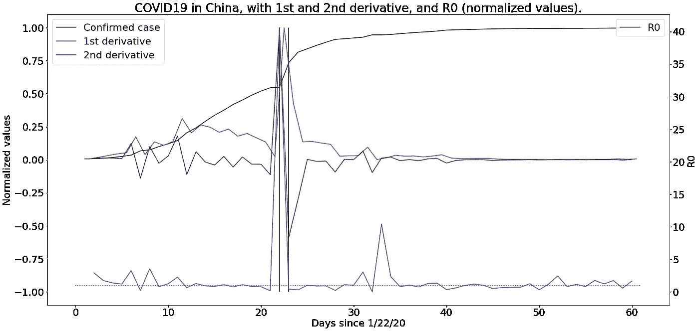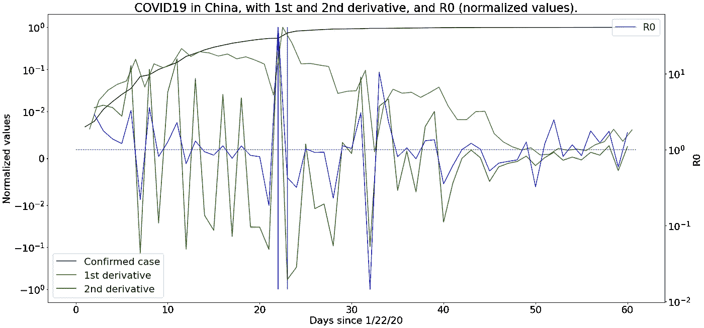

生长因子没有明显的平稳下降。什么时候生长因子=1？好像一直都是！在二阶导数里找地标就更没希望了。也许我们需要一些平滑？因此，让我们不要从原始数据中获取这些值，而是从我们的逻辑模型中获取。

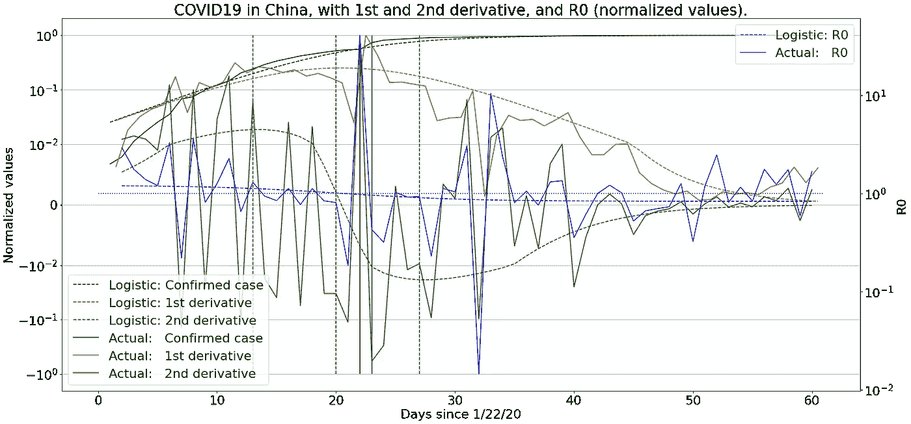

如果你仔细看，你会发现逻辑模型有某种适合度。例如，在第一季度末(第一条绿色垂直虚线)，与最后确诊病例的第 25 个百分位数(纯黑色)非常吻合。第二季度(第二条绿色垂直虚线)也与最终确诊病例的第 50 百分位非常吻合，也与逻辑增长因子降至 1 以下的时间相吻合。由于第 22 天的异常(新的诊断定义)，第 3 季度出现偏差，低估了约 12.5 个百分点。

# 世界

一不做，二不休。第五步失败了，不如完成它。由于简单的逻辑模型有点可疑，让我们看看世界的曲线。

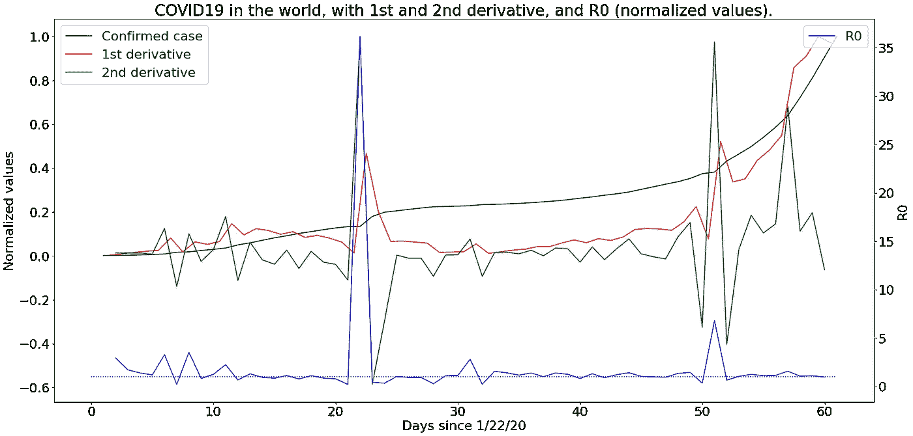

不出所料，数据是嘈杂的。无论如何，事情看起来并不乐观。一阶导数仍在上升，尤其是从第 30 天开始。这意味着，我们仍处于疫情的前半部分。粗略计算，我们预计目前确诊病例至少会增加一倍，死亡人数也会增加。尽管进一步的干预可能会改变一些事情。我真的很高兴全世界的人们都在为此努力。让我们关注那条红色曲线。

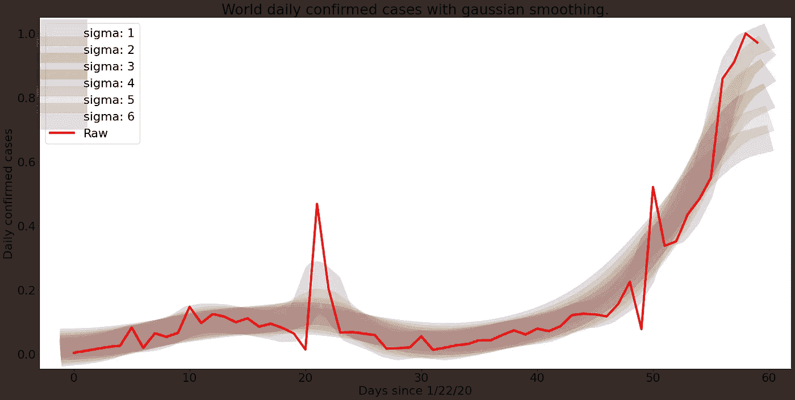

我认为我们可以怀疑增长因素正在放缓和变平。如果这是真的，至少我们已经走了四分之一的路，如果不是刚刚通过的话。请注意，当谈到确诊病例/死亡的天数或数量时，这不是季度。就曲线形状而言，只有四分之一。(这是一种奇怪的平滑曲线和可视化的方式，但我认为它有点整洁，所以它在这里。)

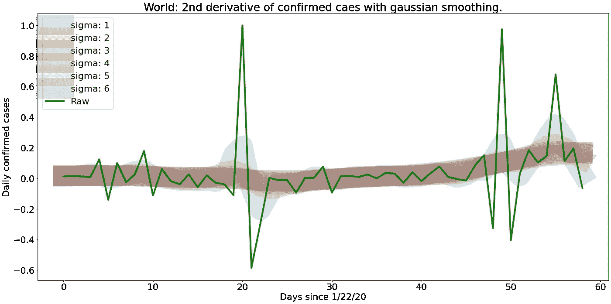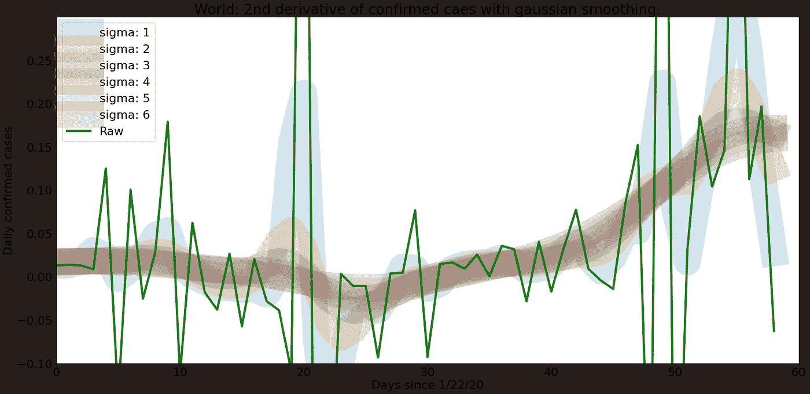

似乎二阶导数也在讲述同样的故事。它变平了。(日志看起来几乎相同。)

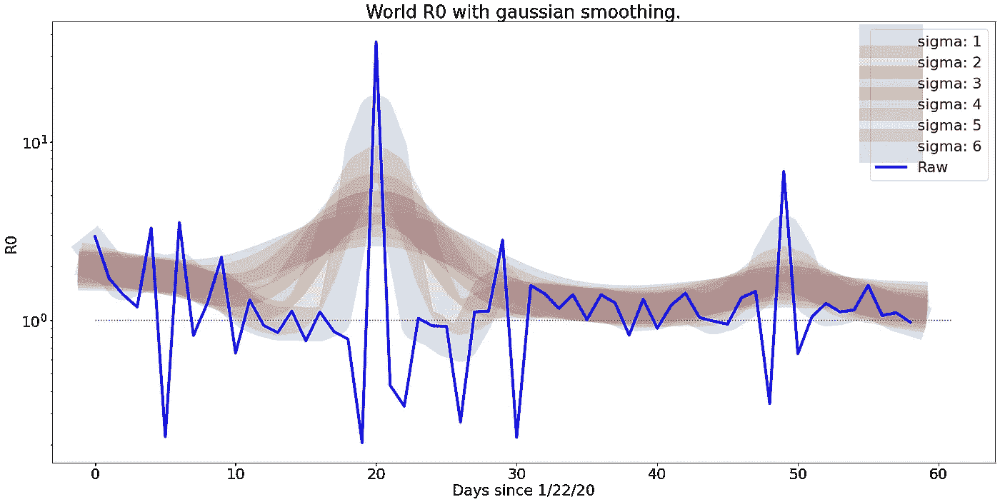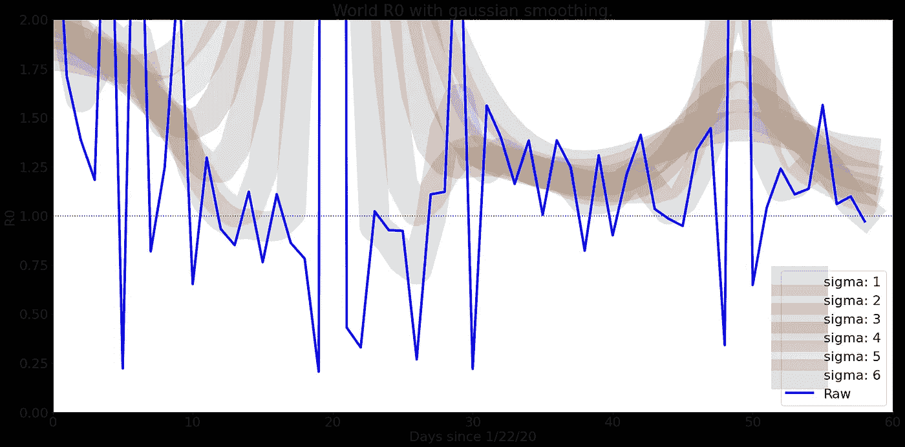

最后是成长因素。总的来说，它在下降。现在肯定比第 35 天到第 45 天的时候低。它还没有触及增长因子=1 的关口，这表明我们还没有超过第二季度。

# 定论

通常，我会把它放在 TLDR。但是，由于这些数据非常嘈杂，我的方法也非常简单，我认为，如果不大声疾呼:“这只是为了好玩！”就得出任何有意义的结论都是轻率的。所以我就把它放在这里，只是为了阅读到底俱乐部。免责声明:“无论如何，不要以此为基础做出任何社会/医疗/财务/任何决定”。外面有更多合格的人，听他们的。

如果我们真的在第一季度左右，或者就在第一季度之前，那么我们可以预计事情很快就会变得非常糟糕。看起来病例数量会有一个爆炸，每天都会有一个新的记录。这很糟糕，因为，对于不了解情况的人来说，事情看起来和感觉上都失去了控制，看不到尽头。只是一个指数增长等待感染地球上的 100%。作为一个社会，我们能挺过这个阶段是很重要的。

我喜欢人们传播“平坦曲线”的方式，这也是设定预期的双重作用。以任何标准衡量，COVID19 都是一场灾难。如果我们，作为一个社会，盲目地走进它，感觉会更糟。而感觉是重要的，因为感觉决定了骚乱和社会结构的崩溃，以及法律和秩序是否会发生。但是如果我们知道将要发生什么，即使是一场灾难，我们至少可以振作起来。

过一段时间，也许几周，也许几个月，我们会看到第二季度，新病例开始下降。很难确定这是真的，还是只是数据的暂时下降。只有再过几个星期，噪音才会平息，我们才能确认情况正在好转，记录不再被打破。死亡人数滞后几周，但很快就会跟上。

从情感上来说，即使我们还在半路上，也会感觉一切都快结束了，因为事情正在变好，隧道的尽头有一线光明。重要的是，如果我们保持警惕，情况只会继续好转。如果我们在那个时候放松自己，事情会再次变得更糟。

尽管说了这么多。这可能只是第一波。第二波可能会到来，就像西班牙流感一样。最重要的是，我听说专家们有目的地设计了多种波，因为另一种选择是永远锁定，永远不要用回归常态的计划来建立群体免疫。

这将是一次长途旅行，系好安全带。

# 附录

查看我的代码:[https://colab . research . Google . com/drive/1 wfv 0 pqdwalfn 5n 9 bewnuvwptdjxbq 6 KF](https://colab.research.google.com/drive/1WfV0PqDwALFN5n9BEWNUvWpTdjxbq6Kf)

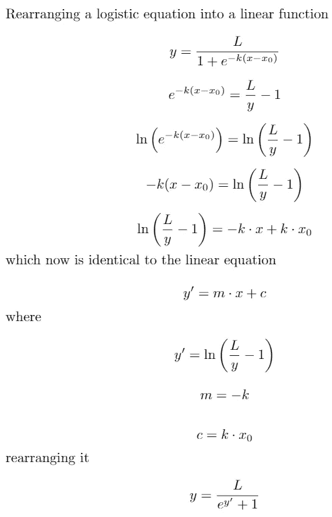

对于中国，我假设 L =最新的数字+1，所以我们不会有 log(0)的问题。我不知道对这个世界来说什么是假设 L 的好方法。

# 参考文献和致谢

数据来自:【https://github.com/CSSEGISandData/COVID-19 

所有图像属于我，除非在标题中另有说明。