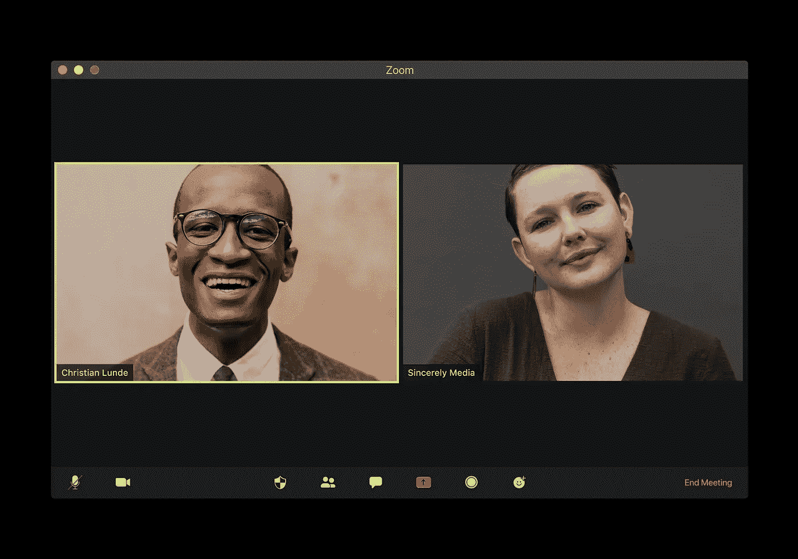

# 微软数据和应用科学家访谈

> 原文：<https://towardsdatascience.com/the-microsoft-data-and-applied-scientist-interview-c0e2b77593dd?source=collection_archive---------16----------------------->

## 微软数据科学访谈和一般访谈的流程、问题和关键概念指南


在[Unsplash](https://unsplash.com/s/photos/microsoft?utm_source=unsplash&utm_medium=referral&utm_content=creditCopyText)【1】上由 [Franck V.](https://unsplash.com/@franckinjapan?utm_source=unsplash&utm_medium=referral&utm_content=creditCopyText) 拍摄的照片。

## 目录

1.  介绍
2.  过程
3.  问题
4.  概念
5.  摘要
6.  参考

# 介绍

这篇文章的目的是给你更多的自信和洞察力，为你在微软的下一次面试做准备。这个指南也适用于类似的大型科技公司，如脸书和苹果。

> 我将讨论微软高级数据和应用数据科学家的角色和面试流程。

我采访了许多公司，过了一段时间，正如我所料，我开始看到一种趋势，即它们是如何被安排和执行的。招聘人员、面试官和公司不仅仅想要一个会编程的人，还想要一个能向非技术人员解释结果的人。我还想强调，有不同的角色，如数据科学家、应用科学家，以及我将要写的内容:数据和应用科学家。除了特定的科学家角色之外，还有级别，包括通常的头衔、高级和校长。在其他公司，你可能会看到像助理和职员这样的角色。我在微软面试中的经历很棒，我会向任何感兴趣的人推荐这个职位。

> 我特别喜欢听特定团队的意见。在这个职位上，对文化和多样性的关注是一个非常吸引人的因素。

在这篇文章中，我将详细介绍整个过程，以及你在面试中可能会遇到的一些问题(或类似的问题)。最后，我想强调的是，这篇文章的目的是最终帮助你在微软或其他类似的大型科技公司面试。我真的相信，作为一个数据科学社区，我们应该相互学习，帮助每个人尽可能做到最好。就像面试官最终会让你知道一样(或者我希望如此)，开放和善于学习比被提问更有价值。下面，了解从申请到最终面试的整个过程、问题和概念，以及对您的高级数据和应用科学家面试之旅的建议。

# 过程



照片由[视觉效果](https://unsplash.com/@visuals?utm_source=unsplash&utm_medium=referral&utm_content=creditCopyText)在[Unsplash](https://unsplash.com/s/photos/zoom?utm_source=unsplash&utm_medium=referral&utm_content=creditCopyText)【2】上拍摄。

整个面试过程出奇的简单。申请之后(希望如此)，你会收到招聘人员的电子邮件或电话，在那里你必须提交一份更新的简历和为什么你适合微软的信息。如果你在这一点上有所进展，你将有 30-45 分钟的电话时间与经理讨论为什么你认为你是这个职位的合适人选，以及你对此感兴趣的地方。你会希望专注于做你自己，了解你的过去，以及这个角色，甚至是微软公司。

这通电话将包括一些技术对话，但下一次面试是你在一轮四位面试官中展示你的技能的时候(通常是面对面，但这次可能是通过视频会议)。这一步实际上是最后的面试，但需要大约四个小时，由协调员安排。这一天面试最重要的部分是了解机器学习算法的关键概念和例子。

```
While coding is greatly used in these types of data science roles, it is arguably more important that you know the theory and point of an algorithm in data science over Python, R, or SQL code.
```

即使是在同一家公司，每次面试的流程很可能都不一样，但流程是一样的。这将需要您之前通过电话交谈的同一位经理，主要是行为方面的，一个人提出的更深入的数据科学算法问题，一个案例研究，然后是对您的数据科学知识的总体最终总结。

以下是典型面试流程的概要:

> 申请这个职位
> 
> 通过电话或电子邮件听取反馈
> 
> 通过电子邮件或电话提交筛选答案
> 
> 初次电话经理面试
> 
> 与团队进行四轮面谈(或最有可能是视频会议)

# 问题


由[劳拉·法尔](https://unsplash.com/@lara_far?utm_source=unsplash&utm_medium=referral&utm_content=creditCopyText)在[Unsplash](https://unsplash.com/s/photos/code?utm_source=unsplash&utm_medium=referral&utm_content=creditCopyText)【3】上拍摄的照片。

以下问题不是确切的问题，但很可能是你将会遇到的确切问题(*因为它们被改变了——但遵循类似的格式*)。这里的主题是什么是关键。如果你现在就能自信地回答这些问题，那么你可以期待总体表现良好。回答问题时，请记住，暂停并思考整个过程是可以的，因为这将显示问题的解决方法和听起来不像记忆的答案。以下是你需要知道的六个问题:

*1。向非技术用户解释机器学习算法*

*2。回顾你在工作中发生冲突的时候*

*3。给出机器学习流水线的例子*

*4。解释梯度下降*

*5。描述降维*

*6。提供一个时间序列的例子*

最好从商业角度考虑你的答案。虽然机器学习模型获得 95%的准确率令人印象深刻，但如果你能向业务用户或利益相关者解释这将为公司节省多少资金，以及你能在多大程度上自动化否则手动的过程，那就更令人印象深刻了。了解常见的数据科学算法，如无监督与有监督，以及时间序列和计算机视觉将是有用的。最后，掌握 sklearn 和 TensowFlow 等常见 Python 库的工作知识也将有助于让您脱颖而出。除了问题和技能之外，还有一些关键的概念将会在你的面试中讨论，如下所述。

# 概念


在[Unsplash](https://unsplash.com/s/photos/machine-learning?utm_source=unsplash&utm_medium=referral&utm_content=creditCopyText)【4】上由 [Hitesh Choudhary](https://unsplash.com/@hiteshchoudhary?utm_source=unsplash&utm_medium=referral&utm_content=creditCopyText) 拍摄的照片。

虽然具体问题或关键问题有助于回顾，但将这些概念应用到你的面试中也是有益的。总之，你会想通过在你的回答或讨论中加入职位的部门或微软产品来很好地了解这个角色。你也想让他们知道你不知道的事情；不要漫无边际地谈论你不清楚的事情，或者作为一种解决方案，可以建议一个类似的例子及其各自的解释。此外，当你用例子来解释一个答案时，不要一遍又一遍地用同一个例子，因为这表明你没有太多的经验(*即使你有*)。最后，尽管角色的描述主要描述了数据科学和以机器学习为中心的技能，但请记住要知道深度学习的关键部分，以及它与传统算法的不同之处。关注以下四个概念:

*   *整合微软产品*
*   *让面试官知道你不知道的事情*
*   *尽量不要反复使用同一个例子*
*   *深度学习*

了解数据科学的基本概念以及它们如何应用于微软及其用户，将是你面试过程中令人印象深刻的一条路线。回顾企业的总体运作方式将是有益的——如果你能提供如何将你的模型整合到一个已经存在的系统中会更好——团队将如何工作，以及最终会出现什么缺点。

> 测试你的模型是数据科学家可能忘记练习的事情。

不是指在数据集上测试您的模型，而是在生产中测试您的模型，以了解它的工作原理、速度、使用的存储空间，以及总体而言，它可能存在的限制。从头到尾了解整个过程，会让你作为候选人脱颖而出。

检索数据、清理和转换数据、构建基础模型、二级和三级模型(等等)，以及最终用户的最终产品是一个您应该熟悉并且能够自信地解释的完整过程。谈论你的 Jupyter 笔记本是件好事，但是阐述面向对象编程将是向面试官炫耀的另一个加分项。向团队展示你是如何创造*的。py* 文件不仅可以轻松编译并与其他数据科学家共享，还可以与其他与您的模型交互的专业人员共享，如软件工程师、机器学习工程师和数据工程师，这将是一个很好的概念。

# 摘要

虽然在面试前你可能有数百个问题和文章要看，但最终，你还是想向面试官展示你解释答案的信心。

> 如果你提供清晰、正确、自信的解释，让面试官对你的回答感到满意，你就更有可能被录用。

请记住，这个概述是针对高级职位的，更具体地说，是针对数据和应用科学家角色的。除了一般职位和非数据科学职位的面试之外，非高级职位以及数据科学家和应用科学家职位很可能会有类似的情况。

```
The common roles are: data scientist, applied scientist, and data and applied scientist.
```

就像具体的角色和部门会有所不同一样，面试你的团队也会有所不同。类似于数据科学模型，您将希望赢得团队的大多数投票来赢得面试。面试过程的另一个重要方面不仅是编码和技术评估，还有行为评估。将你的讨论集中在文化和多样性上是很重要的；找到微软或类似公司的支柱，了解他们的声明，它如何适用于你，以及它对你意味着什么。最后，保持你的简历简单:*你做了什么，它如何帮助业务，结果是什么*。例如，在一个项目中，你可以说:我开发了一个决策树模型，它帮助手工过程自动化了 50%。

我不能保证如果你遵循所有这些步骤，你会得到这份工作，但我相信如果你已经在微软学习数据科学，你会很快得到这份工作。我希望你对这篇文章感兴趣，尤其是对你未来的面试有用。感谢您的阅读！

# 参考

[1]Franck v .在 [Unsplash](https://unsplash.com/s/photos/microsoft?utm_source=unsplash&utm_medium=referral&utm_content=creditCopyText) 上拍摄的照片，(2020)

[2]图片由[视觉效果](https://unsplash.com/@visuals?utm_source=unsplash&utm_medium=referral&utm_content=creditCopyText)在[Unsplash](https://unsplash.com/s/photos/zoom?utm_source=unsplash&utm_medium=referral&utm_content=creditCopyText)(2020)上拍摄

[3]照片由 [Lara Far](https://unsplash.com/@lara_far?utm_source=unsplash&utm_medium=referral&utm_content=creditCopyText) 在 [Unsplash](https://unsplash.com/s/photos/code?utm_source=unsplash&utm_medium=referral&utm_content=creditCopyText) 上拍摄，(2019)

[4]照片由 [Hitesh Choudhary](https://unsplash.com/@hiteshchoudhary?utm_source=unsplash&utm_medium=referral&utm_content=creditCopyText) 在 [Unsplash](https://unsplash.com/s/photos/machine-learning?utm_source=unsplash&utm_medium=referral&utm_content=creditCopyText) 上拍摄，(2018)