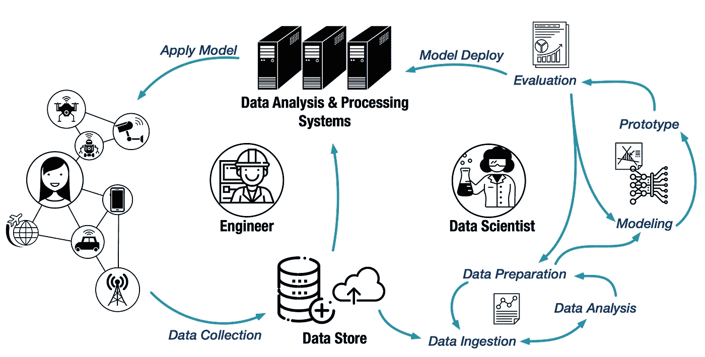
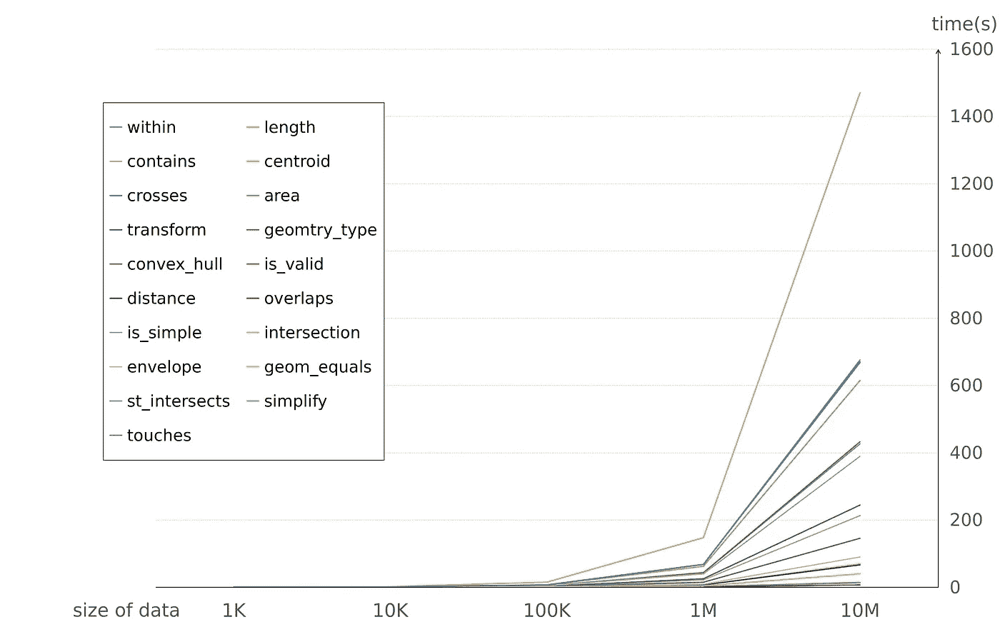
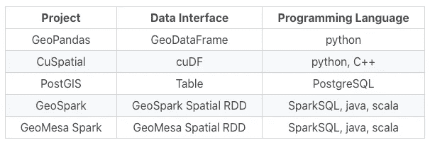
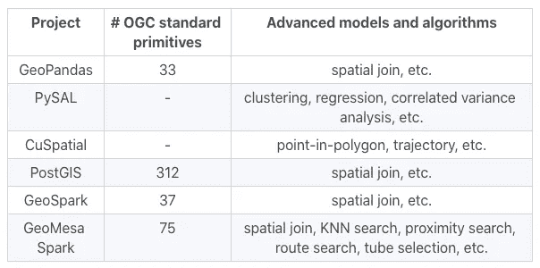
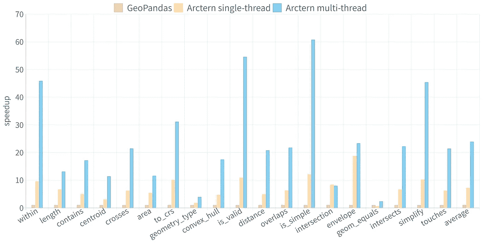

# “任意尺度”时空分析的缺失部分

> 原文：<https://towardsdatascience.com/the-missing-piece-towards-any-scale-spatial-temporal-analytics-2677063d95e3?source=collection_archive---------76----------------------->

## [现实世界中的数据科学](https://towardsdatascience.com/data-science-in-the-real-world/home)

## 我们为什么创建 Arctern 项目

由[希德·维尔马](https://unsplash.com/@sidverma)在 [Unsplash](https://unsplash.com/photos/6usLW9odNjY) 上拍摄的照片

物联网(IoT)和 5G 技术将涉及数量惊人的数据，记录人、设备、事件、位置和时间之间的联系。根据 IDC 的预测，2025 年将有 416 亿个物联网设备产生 79.4 zettabytes 的数据。随着物联网数据和物联网应用的快速增长，对高效时空数据科学工作流的需求不断增加，以从海量数据中获得洞察力。

可扩展性是构建高效数据科学管道的关键。为了应对这一可扩展性挑战，我们推出了 Arctern，这是一个开源时空分析框架，用于提高端到端数据科学性能。Arctern 旨在从两个方面提高可扩展性:

1.  跨不同平台(从笔记本电脑到集群和云)的统一数据分析和处理界面；
2.  丰富且一致的算法和模型，包括轨迹处理、空间聚类和回归等。，跨越不同的数据科学管道阶段。

本文的其余部分探讨了当前的地理空间数据科学管道，并回顾了每个阶段使用的工具、库和系统。通过讨论现有工作流的不足，我们强调了可伸缩性的重要性。我们将展示良好的界面、算法和模型不仅可以减少解决数学或技术问题的时间，还可以提高数据科学家和工程师之间的协作和沟通效率。

# 时空数据科学工作流概述

作者图片

为了更好地理解当前工作流中存在的可扩展性问题，我们需要看一下时空数据科学的管道，如上图所示。原始数据首先由物联网设备生成，然后由数据存储收集。数据科学家对这些数据进行探索性分析。基于技术假设和数据特征，他们选择合适的模型来开发回答业务问题的原型。经过几次反复的评估和调整，该模型最终将部署在一个数据处理系统上，该系统进而通过物联网设备向最终用户提供更好的服务。

整个过程可以分为三个阶段:

*   ***原型开发*。**在这一阶段，数据科学家倾向于使用小型数据集，以实现快速数据探索、高效模型选择和迭代原型润色。轻量级工具在这个阶段受到青睐，因为它们可以提供快速的洞察力，并支持快速迭代。典型的工具包括 NumPy、GeoPandas、scikit-learn、PySAL 和 kepler.gl。
*   ***车型评测*。**为了使原型适合生产环境，更大(甚至接近生产水平)的数据集被用于模型评估。因此，这个阶段的模型评估-修改迭代比原型阶段要敏捷得多。此外，工具链要重得多。大多数常用的工具，比如 PostGIS 和 PySpark，都是基于磁盘的，或者说是分布式的。
*   ***车型部署*。**部署是将模型集成到现有生产环境中提供实际服务的阶段。这一阶段涉及大规模系统，如用于存储的 HDFS、Hbase、TSDB，以及用于数据处理的 Spark、Flink、GeoMesa。

# 可扩展性问题

在时空数据科学的不同阶段，对工具链的需求差异很大。虽然上面提到的库和系统可以共同支持整个数据科学工作流，但单个工具很难跨多个数据科学阶段或跨不同的分析平台(笔记本电脑、集群或云)扩展。结果，工具链变得越来越复杂，以至于很难简化工作流程。具体来说，挑战有三个方面:

*   ***库(系统)接口的差距*。**不同阶段使用的库或系统不共享统一接口。因此，数据科学家可能会在数据分析、原型开发、模型评估和模型部署的整个过程中使用多种语言，如 Python、R、Scala、SQL 和不一致的函数名称。这种接口不一致性极大地加剧了学习曲线，迫使数据科学家花费宝贵的时间和脑力来重写他们的代码，而不是专注于业务问题。
*   ***算法/模型库的差距*。**不同阶段使用的库对算法和模型的支持不同。目前，标准化协议仍处于原语级别，如开放地理空间联盟(OGC)提出的协议。这大大降低了生产率。当在原型开发期间使用高级算法作为解决方案的一部分，但没有为生产环境找到合适的实现时，必须付出巨大的努力来重新发明轮子。
*   ***数据科学家和工程师的差距*。**时空数据科学是一个复杂的领域，需要正确处理数学问题、技术问题和商业问题。它需要数据科学家和工程师之间的无缝协作。然而，整个工作流程中使用的工具的不一致性使得协作变得困难。鉴于在不同的数据科学阶段使用不同的编程语言和算法实现，工程师可能不知道数据科学家使用什么模型，而数据科学家正在努力理解为什么工程师不能让他们的模型工作。

在接下来的几节中，我们将比较时空数据科学中广泛使用的几个库和系统，并对“任意比例”时空分析中缺失的部分进行更多讨论。

# 流行工具及其局限性

随着 Python 成为地理空间数据处理和分析的主要解决方案，数据科学家开发了基于工具集的词汇表，包括 NumPy、Pandas、Shapely、GeoPandas、PySAL 等。有了这些工具，他们可以充分表达自己的想法，并根据想法得出结论。

Shapely 是一个 Python 包，提供了几何数据构造、常见几何操作、关系分析和坐标系投影等原语。GeoPandas 结合了 Pandas 和 Shapely 的功能，简化了 python 中的地理空间数据处理。它将地理空间数据组织为地理系列或地理数据框，并提供构建、分析和操作多种几何的操作。

PySAL 是一个 Python 空间分析库，为地理空间数据的高级分析提供模块。其功能包括空间数据探索性分析，如对点、多边形格的统计测试，以及高级空间分析，如空间聚类和空间回归。

尽管这些工具很受欢迎，但它们无法处理大数据。它们本来就是为独立机器上的小数据集设计的。考虑到现代笔记本电脑和工作站的容量，这些工具可以处理的数据量将高达几个千兆字节。下图显示了 GeoPandas 中 19 种常用原语的性能。正如我们所观察到的，当数据大小达到 10M 时，GeoPandas 中的大多数原语需要几分钟才能完成。在处理大型数据集时，PySAL 与 GeoPandas 面临同样的问题。与 GeoPandas 中的原语相比，PySAL 中的高级算法通常具有更高的计算复杂度，从而可能导致更严重的数据分析和原型开发效率问题。由于数据科学家需要迭代地调整和验证他们的模型，直到他们得到满意的结果，这些原语和算法被频繁和重复地使用。可扩展性问题会严重降低空间数据科学工作流的效率。

由于可扩展性问题，上述工具一般用于小数据集的原型设计。为了处理大型生产级数据集，数据科学家和工程师最终需要将他们的算法迁移到分布式解决方案，如 GeoSpark 和 GeoMesa。

GeoSpark 是一个集群计算系统，它通过一组空间弹性分布式数据集和 SpatialSQL 函数扩展了 Apache Spark 和 SparkSQL，这些数据集和函数可以跨机器有效地加载、处理和分析大规模空间数据。GeoMesa 支持分布式计算系统上的大规模地理空间查询和分析，包括时空索引、流处理和自定义分布式分析。

与 GeoPandas 和 PySAL 相比，GeoSpark 和 GeoMesa 采用了非常不同的 API 抽象。上表显示了界面对比。不同工具之间的数据接口差别很大，没有一对工具共享相同的数据接口。编程语言方面，主要有三大类:python、SQL、Java/Scala。

上表比较了地理空间分析工具中提供的原语和算法。所支持的 OGC 标准原语的数量差异很大，从大约 30 个到 300 个不等。高级算法也显示出很大的分歧。每种工具都提供了一组有限的算法，几乎没有重叠。

由于数据接口、编程语言、算法和模型的显著不一致性，每当将模型原型应用于大型生产数据集时，工程师可能必须重写整个数据处理逻辑。对于空间聚类和回归等高级分析，数据科学家可能需要从头开始重新实施模型和算法。

# Arctern 的方法和目前的进展

在 Arctern 中，为了帮助数据科学家和工程师提高生产力和创造力，我们试图通过在笔记本电脑、集群和云环境中提供具有一致接口的丰富原语、算法和模型来解决空间数据科学工具的不一致性问题。

在我们研究的工具中，我们发现 GeoPandas 的接口最符合 data scientist 的使用习惯，并且易于使用。因此，我们采纳了它的想法，并计划构建可纵向扩展和横向扩展的地理数据框架/地理系列。在此基础上，我们将开发跨执行环境的一致的时空算法集。

我们现在已经开发了一个高效的多线程 GeoSeries 实现，分布式版本正在开发中。在最新版本 0.2.0 中，与 GeoPandas 相比，Arctern 的速度提高了 24 倍。即使在单线程执行的情况下，Arctern 的平均性能也是 GeoPandas 的 7 倍。详细的评估结果如下图所示。

在大型数据集的交互/探索方面，Arctern 提供了可以渲染数据的渲染方法(如热图、choropleth 等。)以秒为单位 10M 的成交量。

我们还在进行时空数据分析和渲染的实验性 GPU 加速。到目前为止，Arctern 提供了六种 GPU 加速的渲染方法和八种空间关系操作，比基于 CPU 的方法提高了 36 倍。

在接下来的几个版本中，我们的团队将专注于:

*   开发 GeoSeries 的分布式版本。我们第一个地理数据框架/地理系列的分布式实现将基于 Spark。自从 Spark 3.0 预览版发布以来，它就与 Spark 3.0 同步开发。Spark 对 GPU 调度和基于列的处理的支持，与我们高性能时空数据处理的理念高度契合。此外，引入的考拉接口为实现一致的地理数据框架/地理系列接口提供了一个有前途的选择。
*   丰富了我们的时空算法集。在项目的早期阶段，我们将专注于 KNN 搜索和轨迹分析。

***了解更多关于 Arctern:***[*https://github.com/arctern-io*](https://github.com/arctern-io)

# 关于作者

郭仁同是 Arctern 项目的研发主管。他获得了中国华中科技大学(HUST)的计算机软件和理论博士学位。他参与并领导数据库、缓存系统、分布式系统和异构计算领域的项目。

易(音译)是 Arctern 项目的高级研究员。易先生毕业于华中科技大学，获得计算机体系结构博士学位。他的研究重点是云和分布式系统中的调度和资源分配。他的作品发表在著名的会议和期刊上，如 IEEE Network Magazine、IEEE TON、IEEE ICDCS 和 ACM TOMPECS。