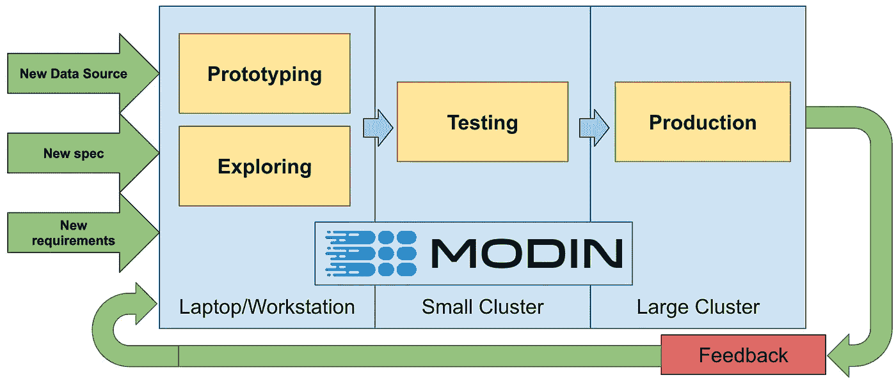

# 攀登熊猫的摩登观点

> 原文：<https://towardsdatascience.com/the-modin-view-of-scaling-pandas-825215533122?source=collection_archive---------27----------------------->

## 将摩丁与达斯克、雷、瓦克斯和拉皮兹进行比较

最近，[写了一篇博文](https://datarevenue.com/en-blog/pandas-vs-dask-vs-vaex-vs-modin-vs-rapids-vs-ray)，比较了一组工具中的各种工具。我想借此机会与摩丁谈论我们的愿景，以及我们希望将数据科学领域带向何方。


https://github.com/modin-project/modin·莫丁()对系统应该如何构建持不同观点。 **Modin 旨在提高数据科学家的工作效率。**当我在加州大学伯克利分校 [RISELab 做博士生时，我注意到一个危险的趋势:数据科学工具在构建时考虑到了硬件性能，但变得越来越复杂。这种复杂性和性能负担被推给了数据科学家。这些工具以数据科学家的时间为代价来优化处理器时间。](https://rise.cs.berkeley.edu/)


这种趋势对数据科学的整体领域是有害的:我们不想强迫每个数据科学家成为分布式系统专家，或者要求他们理解底层实现细节，以避免受到性能的惩罚。**通过将数据科学家的时间优先于硬件时间，Modin 正在颠覆数据科学工具领域。**为此，摩丁已经:

1.  学习新的 API 没有前期成本
2.  与 Python 生态系统的集成
3.  与 Ray/Dask 集群集成(在您现有的设备上运行！)

摩丁开始是作为熊猫的替代者，因为那是我们看到最大需求的地方。使用 Modin 就像使用`pip install modin[ray]`或`pip install modin[dask]`一样简单，然后更改导入语句:

```
# import pandas as pd
import modin.pandas as pd
```

摩丁正在演变成不仅仅是熊猫的替代品([试试最新版本 0.7.4](https://pypi.org/project/modin/0.7.4/) )，我将在本文稍后讨论这一点。首先，我想对 Modin 和其他库做一个更详细的比较，因为许多比较经常遗漏了关键信息。

这些系统旨在解决不同的问题，因此公平的比较具有挑战性。我会尽量坚持定性属性，以避免偏见。

## Dask Dataframe vs. Modin

由于底层系统的架构，dask data frame(【https://github.com/dask/dask】T2)覆盖了大约 40%的 Pandas API。Dask Dataframe 是一个行存储，就像它之前的许多 SQL 系统一样。[然而，数据帧不是 SQL 表](/preventing-the-death-of-the-dataframe-8bca1c0f83c8)。这种架构允许 Dask Dataframe 非常好地扩展，但是阻止它支持所有的 Pandas APIs。Dask Dataframe 还要求用户在数据科学工作负载中添加`.compute()`或`.persist()`调用，以便在触发计算时进行管理。用户还需要指定分区的数量。 [Dask 更加成熟，自首次提交以来已有> 5 年。](https://github.com/dask/dask/graphs/code-frequency)

摩丁目前覆盖了熊猫 API 的 80%以上。Modin 被设计为一个灵活的列存储，因此 Modin 中的分区可以根据需要计算的操作进行更改。这使得 Modin 可以扩展严格的列或行存储所不能扩展的算法。Modin 也不会给用户带来任何计算或分区负担。对用户查询的优化是在幕后运行的，不需要用户的输入。[自第一次提交](https://github.com/modin-project/modin/graphs/code-frequency)以来，两年的时间里，摩丁仍处于婴儿期。

Modin 与 Dask 的调度 API 集成，因此 Modin 也可以在 Dask 集群上运行。[这里有更多关于这种比较的信息](https://github.com/modin-project/modin/issues/515)。

## Vaex vs. Modin

vaex([https://github.com/vaexio/vaex](https://github.com/vaexio/vaex))是一个基于 HDF5 和 Arrow 内存映射文件的查询引擎，所以如果你的数据已经是 HDF5 格式，它是一个可靠的选择。从其他文件格式(CSV、JSON、Parquet)转换为 Vaex 兼容格式需要大量的计算时间和磁盘空间。Vaex 可以支持大约 35%的 Pandas API，但不支持关键的 Pandas 特性，如 Pandas 行索引。从第一次提交到现在，Vaex 已经有将近 6 年的时间了。

在撰写本文时，Modin 依赖 Pandas 作为其 HDF5 文件阅读器，并且不支持 Vaex 支持的内存映射查询风格。Modin 扩展到集群，而 Vaex 试图帮助用户避免对具有内存映射文件的集群的需求。

## 急流城 cuDF 对摩丁

cuDF([https://github.com/rapidsai/cudf](https://github.com/rapidsai/cudf))是一个数据帧库，有一个类似熊猫的 API，运行在 NVIDIA GPUs 上。cuDF 受到内存量(高达 48GB)的限制，溢出到主机内存会带来很高的开销。只要数据合理地适合 GPU 内存，您在 GPU 上获得的性能就非常好。您可以将多个 GPU 与 cuDF 和 Dask 一起使用，生成的分布式 GPU 数据帧将具有与上面 Dask 部分概述的相同的一般属性。 [cuDF 从第一次提交](https://github.com/rapidsai/cudf/graphs/code-frequency)到现在已经 3 年了。

截至发稿时，Modin 还没有 GPU 支持，但 Modin 的架构是分层的，因此 Modin 可以将 GPU 内核与 CPU 一起集成。由于底层架构的灵活性，Modin 甚至可以集成混合 CPU/GPU/*PU 内核。有了这种 GPU 支持，我们将需要确保它以一种允许用户避免考虑 GPU 内存限制的方式实现。[这里有更多关于这个比较的信息](https://github.com/modin-project/modin/issues/978)。

## 雷对摩丁

[Modin 是 Ray 的数据处理引擎。](https://docs.ray.io/en/master/pandas_on_ray.html) Ray 是一个底层的分布式计算框架，用于缩放 Python 代码，而 Modin 有更高级别的 API，用于数据操作和查询。

# 摩丁的未来

摩丁扰乱了交互式数据科学空间，围绕数据科学生产力的讨论超过了基准性能。随着 Modin 的不断成熟，它正在发展成为一个支持各种规模的数据科学的平台。一些重要的特性将在 7 月底推出，今年晚些时候还会推出更多。我将讨论其中的几个功能，如果您想了解更多，请随时在 [GitHub 问题跟踪器](https://github.com/modin-project/modin/issues)或 [ZenHub 板](https://app.zenhub.com/workspaces/modin-5c0d8d104b5806bc2bfbeb61/board?filterLogic=any&repos=138224079)上探索我们的未来计划。



## 用一行代码向外扩展

数据科学家面临的主要困难之一是，他们经常必须在 Jupyter 笔记本电脑之间切换，以在不同的集群或环境上运行代码。当试图在本地调试代码时，这变得很麻烦，所以我们开发了一个 API，只需一行代码就可以在本地运行代码或在多个不同的云或集群环境上运行代码之间进行切换。**注意:该 API 可能会发生变化，在最新版本(** [**0.7.4**](https://pypi.org/project/modin/0.7.4/) **)上尚不可用。欢迎反馈！**

```
import modin
import modin.pandas as pdtest_cluster = modin.cloud.create(provider="AWS", 
                                  instance="m4.xlarge", 
                                  numnodes=2)with modin.local():  # run this code locally
    df_local = pd.read_csv("a_file.csv")
    df_local.head()with modin.cloud.deploy(test_cluster):  # run on my test cluster
    df_test = pd.read_csv("s3://bucket/a_file.csv")
    df_test.head()with modin.local():
    df_local.count()with modin.cloud.deploy(test_cluster):
    df_test.count()with modin.cloud.deploy(production):  # run this on production
    df_prod = ...
```

这可以在标准的 Jupyter 笔记本或任何 python 解释器中工作，并使数据科学家在单个笔记本的环境中比以往任何时候都更加高效。

## Numpy 和 Sci-kit 学习 API

这些 API 已经被请求很久了，并且正在被构建。这将与现有的 Pandas 引擎集成，并避免往返于 Modin 的 dataframe 和 numpy 或 sklearn 的常见瓶颈。就像 Pandas API 的情况一样，它们也将是替代产品。

```
import modin.pandas as pd
import modin.numpy as np
from modin.sklearn.model_selection import train_test_split
```

与 dataframes 的情况一样，Modin 将被分层，以集成其他技术和计算内核。我们可以集成其他计算引擎或内核，例如 [nums](https://github.com/nums-project/nums) (另一个 RISELab 项目)。

# 摘要

数据科学家热爱他们的工具，我们也热爱数据科学家。Modin 旨在让数据科学家能够使用他们喜欢的工具提高工作效率。我们正在努力将数据科学工具的重点转移到重视数据科学家的时间，而不是他们使用的硬件的时间。