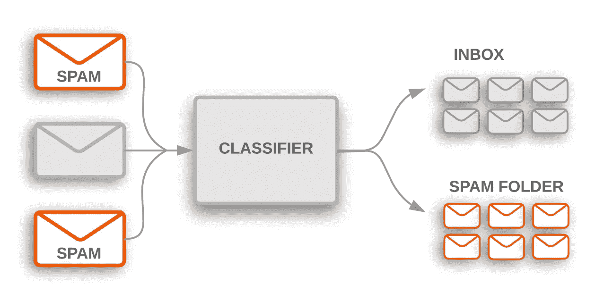

# 蒙蒂霍尔问题:朴素贝叶斯解释！

> 原文：<https://towardsdatascience.com/the-monty-hall-problem-naive-bayes-explained-fadd991edeb2?source=collection_archive---------34----------------------->

## 检查蒙蒂霍尔问题的解决方案，研究朴素贝叶斯分类器，理解贝叶斯定理的应用。

图片作者:特里斯特·约瑟夫

我们做个交易吧！“如果你对机器学习感兴趣，那么很有可能你听说过贝叶斯定理和朴素贝叶斯分类器。你听说过蒙蒂·霍尔问题也是有道理的。如果你没有听说过蒙蒂霍尔问题，那么这是一个著名的数学问题，它来自游戏节目，让我们做一个交易，当它由蒙蒂霍尔主持时。这个节目的参赛者将被告知从三扇门中选择，其中两扇门会有不利的结果。做出选择后，Monty 将揭示两个不利门之一后面是什么，然后询问参赛者是否愿意坚持最初的选择或切换到剩下的关闭的门。因为其中一扇门现在是开着的，参赛者知道奖品一定在两扇关着的门的后面。因此，他们有 50%的机会坚持最初的选择而获得奖励，他们是否改变选择并不重要，对吗？不对。数学表明，如果参赛者改变他们的选择，获胜的概率将增加到 2/3；因此，如果有选择的话，你应该经常换工作。好吧，但是为什么这是真的呢？它和朴素贝叶斯有什么关系？嗯，蒙蒂霍尔问题和朴素贝叶斯分类器都植根于贝叶斯定理，它们高度依赖于事件发生的可能性。因此，我们将在本文中探讨这两个主题！

图片作者:特里斯特·约瑟夫

假设我们不是开门，而是盲目地从包里挑选弹珠。假设袋子有 1 个红色、1 个绿色和 1 个蓝色，其中蓝色的弹球是有利的结果。每个弹珠被选中的几率是一样的，参赛者随机挑选一个，但不知道他们选择的颜色。然后，主持人检查袋子，并显示一个不利的结果。现在有三种可能的情况:

1.  参赛者挑选了蓝色的弹珠。主持人现在可以显示红色或绿色，因为它们都是不利的结果，显示任何一种颜色的概率是 50%。不管主持人展示了什么，如果参赛者选择不转换，他们就赢了。
2.  参赛者挑选了绿色的大理石。主持人现在只能展示红色弹珠，因为这是唯一不利的结果。这是必然发生的，只有当参赛者选择转换时，他们才能赢。
3.  参赛者挑选了红色的弹珠。东道主现在只能展示绿色大理石，因为这是唯一不利的结果。这是必然发生的，只有当参赛者选择转换时，他们才能赢。

当参赛者选择转换时，结果如下:

蓝色= 1/3 + 1/3 = 2/3

绿色= 1/6

红色= 1/6

这说明转行时赢的概率是 2/3，输的概率是 1/3。

当参赛者选择不转换时的结果如下:

蓝色= 1/6 + 1/6 = 1/3

绿色= 1/6

红色= 1/6

这说明不切换时赢的概率是 1/3，输的概率是 2/3。

图片作者:特里斯特·约瑟夫

蒙蒂霍尔问题的解决方案之所以有效，是因为最初，选择不利结果的方式比选择有利结果的方式多。这就是贝叶斯定理的本质；新信息不应该孤立地决定信念。相反，新信息应该用于更新先前的信息。每当存在一个假设、与该假设相关的证据，并且被问及的问题是“假设证据为真，该假设的概率是多少”时，贝叶斯定理都是适用的。让我们看看这个公式。目标是找到这个更新的信息，或者说后验，写为***【Pr(假设|证据)*** 。

在考虑任何证据之前，我们需要确定假设的概率。这是写为 ***Pr(假设)*** 的先验信息。在 Monty Hall 问题的情况下，先验的事实是每个弹球最初有 1/3 的机会被选中。

在此之后，我们需要考虑证据能够被看到的概率，假设假设为真； ***【证据|假设】*** 。这通常被称为可能性，它直观地表示了一个事件可能发生的方式的数量，假设先前的事件为真。在 Monty Hall 的例子中，给定参赛者最初的选择，主持人可以用多少种方式显示不利的结果。

这些数字被相乘，因为它们代表了假设的先验信念和信念符合证据的概率。它们共同提供了确定问题答案所必需的信息。

现在，必须注意的是，即使假设不成立，证据也会出现； ***Pr(证据| ~假设)*** 。当加上 ***Pr(证据|假设)*** 时，我们得出证据为真的总概率； ***公关(证据)*** 。

最后，假设证据是真实的，我们必须将我们所拥有的信息除以证据的总概率来确定假设的概率。

图片来自 developers.google.com

朴素贝叶斯分类器背后的机制就是基于这一原理。朴素贝叶斯是一种概率分类算法，它根据概率为实例分配标签。术语“天真”来自于这样一个事实，即该算法假设特征之间具有很强的独立性。朴素贝叶斯的一个常见应用是电子邮件分类，垃圾邮件与非垃圾邮件。让我们看一个例子:

为简单起见，我们假设有 4 个单词；“你”“需要”“钱”“现在”。

假设对于非垃圾邮件， *Pr(word = you | email =非垃圾邮件)= 0.40*； *Pr(需要|非垃圾)= 0.25；Pr(钱|非垃圾)= 0.20；*和 *Pr(现|非垃圾)=0.15*

假设对于垃圾邮件，*Pr(word = you | email = spam)= 0.30*；*Pr(need | spam)= 0.10；Pr(金钱|垃圾邮件)= 0.45；*和 *Pr(now | spam) =0.15*

假设 *Pr(邮件=垃圾邮件)= 0.80* ，而 *Pr(非垃圾邮件)= 0.20*

假设有一封电子邮件“你现在需要钱钱钱”，它会被归类为垃圾邮件还是不是垃圾邮件？

使用贝叶斯公式， *Pr(垃圾邮件|电子邮件)= ~93%* 和 *Pr(非垃圾邮件|电子邮件)= ~7%* 。

必须注意，朴素贝叶斯并不计算实际概率。相反，该公式通过确定总信息(而不是除以总证据)来给电子邮件打分，然后将电子邮件分类到分数较高的类别中。实际概率是为了举例而计算的，但同样的原则也适用。

因此，由于该电子邮件是垃圾邮件的后验概率高于它是非垃圾邮件的后验概率，所以该电子邮件将被分类为垃圾邮件。但是，请注意，如果垃圾邮件中至少有一个单词的概率为 0，则该邮件将被归类为非垃圾邮件。这一事实很容易在构建模型时产生不正确的分类。因此，通常会在集合中的每个单词上添加一个伪计数(或 1 计数),以确保不会输出 0。伪计数不会改变先验，它主要确保后验非零。

所以，现在你熟悉了贝叶斯定理，你理解了简单的邮件分类，你知道如何在“让我们做笔交易”中平均获胜！但是这篇文章的主要收获是理解信息可以用来更新先前的信念，然后做出数据驱动的决策。贝叶斯定理适用于机器学习，可用于各种过程，开发这种类型的适当模型的关键是理解它的理论来源。

**参考文献:**

[seas.upenn.edu/~cis391/Lectures/naive-bayes-spam-2015.pdf](https://www.seas.upenn.edu/~cis391/Lectures/naive-bayes-spam-2015.pdf)

[courses . cs . Washington . edu/courses/CSE 312/18sp/lectures/naive-Bayes/naive Bayes notes . pdf](https://courses.cs.washington.edu/courses/cse312/18sp/lectures/naive-bayes/naivebayesnotes.pdf)

brilliant.org/wiki/monty-hall-problem/

[Norwegian creations . com/2018/10/Bayes-rule-and-the-monty-hall-problem/](https://www.norwegiancreations.com/2018/10/bayes-rule-and-the-monty-hall-problem/)

[machine learning mastery . com/Bayes-theory-for-machine-learning/](https://machinelearningmastery.com/bayes-theorem-for-machine-learning/)

**其他有用的素材:**

[github . com/Surya-Murali/Email-Spam-Classifier-Using-Naive-Bayes](https://github.com/Surya-Murali/Email-Spam-Classifier-Using-Naive-Bayes)

[statisticsbyjim.com/fun/monty-hall-problem/](https://statisticsbyjim.com/fun/monty-hall-problem/)

[plato.stanford.edu/entries/bayes-theorem/](https://plato.stanford.edu/entries/bayes-theorem/)