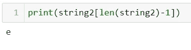

# Python 中字符串的 5 种基本但最容易出错的情况

> 原文：<https://towardsdatascience.com/the-most-5-error-prone-cases-for-strings-in-python-278741668057?source=collection_archive---------47----------------------->


保罗·埃施-洛朗在 [Unsplash](https://unsplash.com/s/photos/programming?utm_source=unsplash&utm_medium=referral&utm_content=creditCopyText) 上拍摄的照片

字符串是一系列字符。它是 Python 中的一种基本数据类型，但你真的知道如何使用它吗？下面我们来讨论最容易出错的 5 种情况。

## 1.单引号、双引号或三引号

1.  例如，如果你想输出字符串:**汤姆说:“你好吗？我也很好。”**，让我们检查不同的方法:

方法 1:使用单引号

代码和结果将是:


方法 2:使用双引号

代码和结果将是:


方法 3:使用三重引号


方法 4:用转义法连单引号


方法 5:将打印功能与三重引号一起使用


方法 6:对多行使用三重引号


你发现结论了吗？因此，要正确显示包含引号的句子，可以使用以下提示:

*   **如果字符串只有单引号，那么可以使用双引号**
*   **如果只有双引号，可以使用单引号**
*   **如果字符串既有单引号又有双引号或者字符串有多行，最好使用三引号**
*   **与直接输出字符串相比，使用打印功能可以避免转义字符**

## 2.len(string)或 len(string)-1:索引或切片

如果有 string = '8euro/piece '，你要

*   获取字符串的最后一个字符
*   获取字符串的最后五个字符

让我们尝试不同的方法，看看结果如何:

```
string2 = '8euro/piece'
```

输出 1:


输出 2:



输出 3:


输出 4:


从结果中，我们知道输出 2 针对问题 1，输出 4 针对问题 2。这是因为:

**要求 1:使用索引。虽然 len()给出了字符串的总字符数，但由于它是从 0 开始的，所以最后一个字符的索引是 len()-1。**

**要求 2:使用切片的方法。切片语法是 S[firstIndex: tailIndex]获取 firstIndex 到 tailIndex -1 的字符**

## 3.int、float 或 int(float)

有两个字符串:

```
string3 = '8.8euro/piece'
```

*   如何从 string3('8.8 ')的数字中得到整数部分？
*   如何四舍五入出 string3 的个数(' 8.8 ')？

让我们试一试:

测试 1:


测试 2:


测试 3:


**提示是:**

**int():仅从:**转换为整数类型

*   **浮动**
*   **字符串中的整数部分**

如果想得到字符串 8.8 的整数部分，先把它转换成 float 类型，然后用 int()。

## 4.bool():真或假

我们将案例总结如下:

```
print("''is",bool(''))
print("space' ' is",bool(' '))
print('None is',bool(None))
print('True is', bool(True))
print('Number 0 is', bool(0))
print('string 0 is',bool('0'))
```

输出是:


一起使用 bool()和 len():


此方法可用作 if 的逻辑条件。

所以基本规则是:

**For bool():如果传递的值为 None、empty 或 0(数字，不是字符串 0)，则返回 False，否则返回 True。**

**5。。join()方法**

当使用 BeautilfulSoup 从一个网站提取数据时，通常数据会被保存为一个列表，然后使用 for 循环读取每个元素。举一个例子:

```
list1=['The Shawshank Redemption','(1994)','9.6']
```

要将其保存为 CSV 文件，需要将其保存为字符串。join()方法在这里有效。


该字符串是不可变的，因此您不能直接在字符串之间删除或插入特定的字符。为此，需要将字符串转换成列表，然后使用。插入()，结合使用。join()方法，示例如下:


今天，我们尝试用 Python 编写最容易出错的字符串代码。你对字符串操作有更清楚的了解吗？玩得开心！