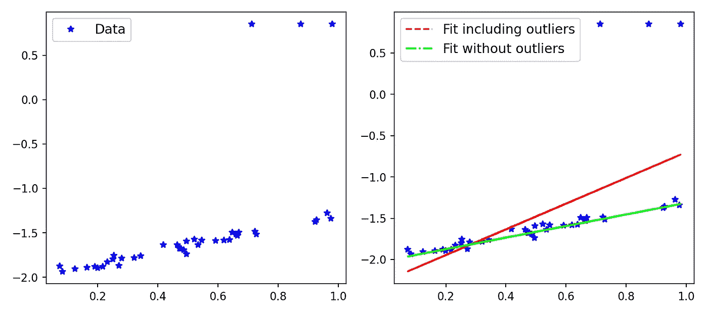

# 最牛逼的损失函数

> 原文：<https://towardsdatascience.com/the-most-awesome-loss-function-172ffc106c99?source=collection_archive---------22----------------------->

## 论文综述:通用和自适应稳健损失函数


玩具火车:(图片由作者提供)

最近，我偶然看到了 [Jon Barron](https://jonbarron.info/) 在 2019 年 CVPR 会议上发表的[惊人论文](https://arxiv.org/abs/1701.03077)，关于为机器学习问题开发一个鲁棒和自适应的损失函数。这篇文章是对那篇论文以及一些必要概念的回顾，它还将包含一个简单回归问题的损失函数的实现。

## 异常值和稳健损失问题:

考虑机器学习问题中最常用的误差之一——均方误差(MSE)。如你所知，它的形式是(y-x)。MSE 的一个关键特征是，与小误差相比，它对大误差具有高灵敏度。用 MSE 训练的*模型将偏向于减少最大误差*。例如，3 个单位的单个错误将被赋予与 1 个单位的 9 个错误相同的重要性。

我使用 Scikit-Learn 创建了一个示例，演示在一个简单的数据集中，在考虑和不考虑离群值的情况下，拟合度是如何变化的。



图 1: MSE 和异常值的影响。(图片由作者提供)

正如你所看到的，包含离群值的拟合线受到离群值的严重影响，但是，优化问题应该要求模型受到内嵌值的更多影响。在这一点上，你已经可以认为平均绝对误差(MAE)是比 MSE 更好的选择，因为它对大误差不太敏感。有各种类型的稳健损失(如 MAE ),对于一个特定的问题，我们可能需要测试各种损失。在训练一个网络的时候测试各种各样的损失函数不是很神奇吗？该论文的主要思想是引入广义损失函数，其中损失函数的鲁棒性可以变化，并且该超参数可以在训练网络的同时被训练，以提高性能。这比通过执行网格搜索交叉验证来寻找最佳损失要少得多。让我们从下面的定义开始——

## 鲁棒和自适应损失:一般形式:

鲁棒和自适应损失的一般形式如下—


Exp。1:鲁棒性损失:α是控制鲁棒性的超参数。

*α* 控制损失函数的鲁棒性。 *c* 可以认为是一个比例参数，在 *x* =0 附近控制碗的大小。由于 *α* 作为超参数，我们可以看到，对于 *α* 的不同值，损失函数具有相似的形式。让我们看看下面—


Exp。2:自适应损失的各种损失(表达式。1)对于不同的α值。

损失函数在 *α* = 0 和 2 时是未定义的，但是取极限我们可以进行近似。从 *α* =2 到 *α* =1，损耗平滑地从 L2 损耗过渡到 L1 损耗。对于不同的 *α* 值，我们可以绘制损失函数，看看它是如何表现的(图 2)。

我们还可以花一些时间研究这个损失函数的一阶导数，因为基于梯度的优化需要导数。对于 *α* 的不同值，w.r.t *x* 的导数如下所示。在图 2 中，我还绘制了不同 *α* 的导数和损失函数。


Exp。3:稳健损失的导数(经验。1)各种α值的 w . r . t . x。

## 适应性损失及其导数的行为；

下图对于理解这个损失函数及其导数的行为非常重要。对于下面的图，我已经将比例参数 *c* 固定为 1.1。当 *x* = 6.6 时，我们可以认为这就像 *x* = 6× *c* 。我们可以得出以下关于损失及其导数的推论—

1.  *损失函数对于 *x，α* 和*c*0 是平滑的*，因此适合于基于梯度的优化。
2.  在原点，损耗始终为零，并且对于|x| > 0 ，损耗单调增加。损失的单调性质也可以与记录损失进行比较。
3.  损耗也随着 *α* 的增加而单调增加。这一特性对于损失函数的稳健性很重要，因为我们可以从较高的值 *α* 开始，然后在优化过程中逐渐(平滑地)降低，以实现稳健估计*，避免局部最小值*。
4.  我们看到当|*x*|<|*c*时，对于 *α* 的不同取值，导数几乎是线性的。这意味着*导数在很小时与残差的大小成比例*。
5.  对于 *α* = 2，导数始终与残差的大小成比例。这一般是 MSE (L2)损失的财产。
6.  对于 *α* = 1(给我们 L1 损失)，我们看到导数的幅度饱和到超过|*x*|>|*c*的恒定值(正好 1/ *c* )。这意味着残差的影响永远不会超过一个固定的量。
7.  对于 *α* < 1，导数的幅值减小为|*x*|>|*c*。这意味着当残差增加时，它对梯度的影响较小，因此**异常值在梯度下降期间的影响较小。**


图 2:作为α函数的损失函数和损失函数导数。(图片由作者提供)

我还绘制了不同的 *α* 值的稳健损失及其导数的表面图。


图 3:自适应损失函数(左)及其导数(右)的曲面图。(图片由作者提供)

## 实施稳健损失:Pytorch 和 Google Colab:

既然我们已经了解了鲁棒和自适应损失函数的基本知识和属性，让我们将它付诸实践。下面使用的代码只是从乔恩·巴伦的 GitHub 库中找到的代码稍微修改了一下。我还制作了一个动画来描述随着迭代次数的增加，自适应损失如何找到最佳拟合线。

我们可以使用 Colab 中的`pip` 在本地安装存储库，而不是克隆并使用它。

```
!pip install git+https://github.com/jonbarron/robust_loss_pytorchimport robust_loss_pytorch 
```

我们创建一个简单的线性数据集，包括正态分布的噪声和异常值。由于库使用了 [pytorch](https://pytorch.org/) ，我们使用 torch 将 *x，y* 的 numpy 数组转换为张量。

```
import numpy as np
import torch scale_true = 0.7
shift_true = 0.15x = np.random.uniform(size=n)y = scale_true * x + shift_truey = y + np.random.normal(scale=0.025, size=n) # add noise flip_mask = np.random.uniform(size=n) > 0.9 y = np.where(flip_mask, 0.05 + 0.4 * (1\. — np.sign(y — 0.5)), y) 
# include outliersx = torch.Tensor(x)
y = torch.Tensor(y)
```

接下来，我们使用 pytorch 模块定义一个线性回归类，如下所示

```
class RegressionModel(torch.nn.Module): def __init__(self): super(RegressionModel, self).__init__() self.linear = torch.nn.Linear(1, 1) 
      ## applies the linear transformation. def forward(self, x): return self.linear(x[:,None])[:,0] # returns the forward pass
```

接下来，我们将线性回归模型拟合到我们的数据中，但是，首先使用损失函数的一般形式。这里我们使用α ( *α* = 2.0)的*固定值，它在整个优化过程中保持不变。正如我们已经看到的，对于 *α* = 2.0，损失函数复制了 L2 损失，并且我们知道这对于包括异常值的问题不是最佳的。对于优化，我们使用学习率为 0.01 的 Adam 优化器。*

```
regression = RegressionModel()
params = regression.parameters()
optimizer = torch.optim.Adam(params, lr = 0.01)for epoch in range(2000):
   y_i = regression(x)
   # Use general loss to compute MSE, fixed alpha, fixed scale. loss = torch.mean(robust_loss_pytorch.**general.lossfun**(
     y_i — y, alpha=torch.Tensor([2.]), scale=torch.Tensor([0.1]))) optimizer.zero_grad() loss.backward() optimizer.step()
```

使用鲁棒损失函数的一般形式和固定值 *α* ，我们可以获得拟合线。原始数据、真实线(用于生成数据点*的具有相同斜率和偏差的线，不包括异常值*)和拟合线绘制在图 4 中。


图 4:一般损失函数(图片由作者提供)

损失函数的一般形式不允许 *α* 改变，因此我们必须手动或通过执行网格搜索来微调 *α* 参数。此外，如上图所示，拟合受到异常值的影响，因为我们使用了 L2 损失。这是一般情况，但是，如果我们使用损失函数的*自适应*版本，会发生什么呢？我们调用自适应损失模块，只需初始化 *α* ，让它在每个迭代步骤中自适应。

```
regression = RegressionModel()adaptive = robust_loss_pytorch.adaptive.AdaptiveLossFunction( num_dims = 1, float_dtype=np.float32)params = list(regression.parameters()) + list(adaptive.parameters())optimizer = torch.optim.Adam(params, lr = 0.01)for epoch in range(2000): y_i = regression(x) loss = torch.mean(adaptive.lossfun((y_i — y)[:,None]))
   # (y_i - y)[:, None] # numpy array or tensor optimizer.zero_grad() loss.backward() optimizer.step()
```

使用这个，还有一些额外的代码使用[赛璐珞](https://pypi.org/project/celluloid/)模块，我创建了下面的动画(图 5)。这里，您可以清楚地看到，随着迭代次数的增加，自适应损失如何找到最佳拟合线。这接近于真实线，并且受异常值的影响可以忽略。


图 5:自适应损失函数如何达到最佳拟合的动画。(图片由作者提供)

## 讨论:

我们已经看到包括超参数 *α* 在内的稳健损失如何被用来快速找到最佳损失函数。本文还展示了如何将以 *α* 为连续超参数的损失函数的鲁棒性引入到经典的计算机视觉算法中。论文中显示了实现可变自动编码器和单目深度估计的自适应损失的示例，这些代码也可在 Jon 的 GitHub 中获得。然而，我最感兴趣的部分是动机和论文中描述的损失函数的逐步推导。很容易读懂所以，我建议看一看论文！

保持坚强，干杯！！

## 参考资料:

[1] [“一种通用的、自适应的鲁棒损失函数”](https://arxiv.org/pdf/1701.03077.pdf)；j .巴伦，谷歌研究。

[2]稳健损失:线性回归示例；[乔恩·巴伦的 GitHub](https://github.com/jonbarron/robust_loss_pytorch) 。

[3]鲁棒丢失和动画的曲面图: [GitHub 链接](https://github.com/suvoooo/Machine_Learning/blob/master/AdaptiveLoss.ipynb)。