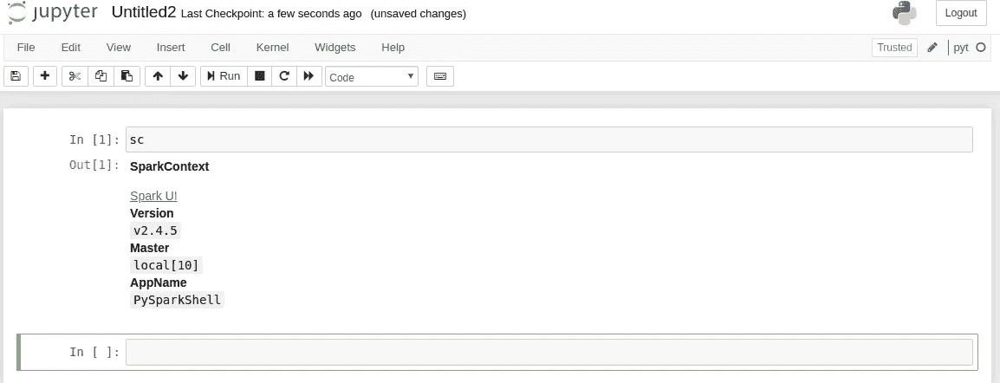
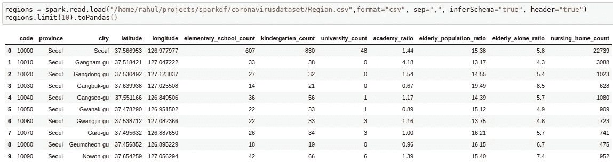
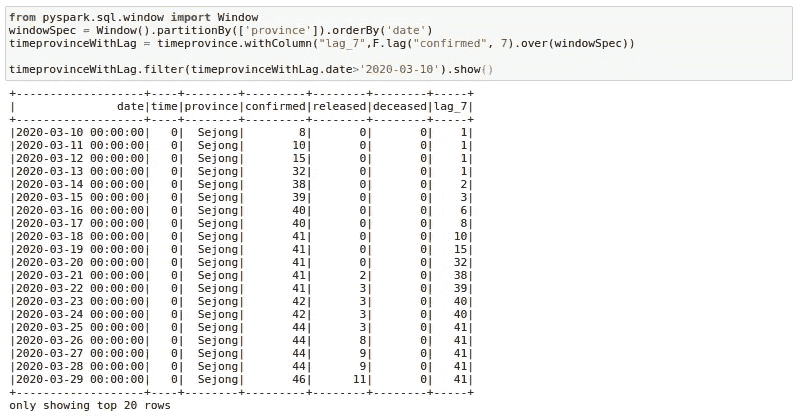
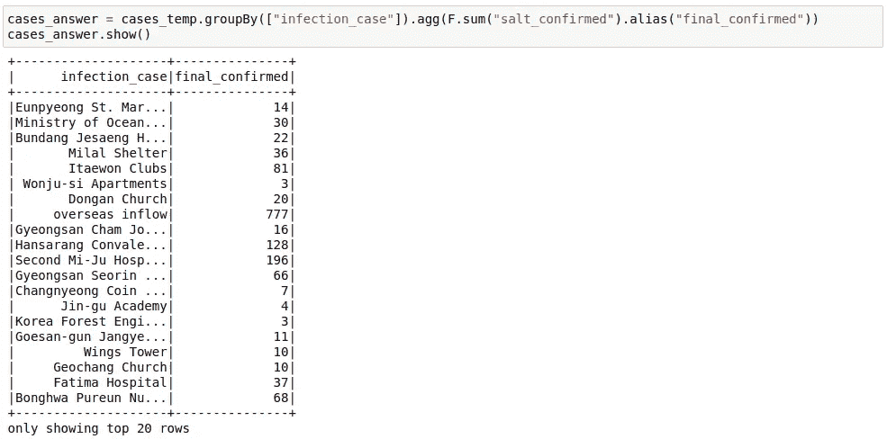

# pySpark 数据帧最完整的指南

> 原文：<https://towardsdatascience.com/the-most-complete-guide-to-pyspark-dataframes-2702c343b2e8?source=collection_archive---------0----------------------->


来源: [Pixabay](https://pixabay.com/photos/pieces-of-the-puzzle-items-form-592828/)

## 包含您可能需要的所有数据框架功能的书签备忘单

大数据已经成为数据工程的代名词。但是数据工程和数据科学家之间的界限日益模糊。此时此刻，我认为大数据必须是所有数据科学家的必备技能。

原因: ***每天生成太多数据***

这让我们想到了 [Spark](https://amzn.to/2JZBgou) ，这是处理大数据时最常用的工具之一。

虽然 Spark 曾经严重依赖 [RDD 操作](/the-hitchhikers-guide-to-handle-big-data-using-spark-90b9be0fe89a)，但 Spark 现在已经为美国数据科学家提供了一个 DataFrame API。这是为喜欢冒险的人准备的文档。但是，尽管文档很好，但它没有从数据科学家的角度进行解释。它也没有恰当地记录数据科学最常见的用例。

***在这篇文章中，我将讨论 Spark 的安装、使用 DataFrames 时需要的标准 Spark 功能，以及一些处理不可避免的错误的技巧。***

这个帖子会很长。事实上，这是我在 medium 上最长的帖子之一，所以去买杯咖啡吧。

如果您想跳到某个特定部分，这里还有一个目录:

[安装](#52bd)
数据 T5[1。基本功能](#990b)
∘ [读取](#2a91)
∘ [查看文件中的几行内容](#5616)
∘ [更改列名](#0b45)
∘ [选择列](#844d)
∘ [排序](#a9a2)
∘ [投](#728b)
∘ [筛选](#d970)
∘ [分组方式](#cb36)
∑播/图方加入
[3。使用 SQL 与 DataFrames](#4d56)
[4。创建新列](#ba7a)
∘ [使用 Spark 原生函数](#4abd)
∘ [使用 spark UDF](#3b81)
∘[使用 RDDs](#5481)
∘ [使用熊猫 UDF](#fe94)
[5。火花窗功能](#5cfd)
∘ [排名](#0ebd)
∘ [滞后变量](#1e71)
∘ [滚动聚合](#1d09)
[6。枢纽数据框](#accc)
[7。Unpivot/Stack 数据帧](#0ac3)
[8。腌制](#a883)
[更多一些技巧和窍门](#97e5)
∘ [缓存](#79c3)
∘ [从中间步骤保存并加载](#d2ed)
∘ [重新分区](#bda6)
∘ [读取本地的拼花文件](#bf3f)
[结论](#35c2)

# 装置

我正在努力在 Ubuntu 18.04 上安装 Spark，但是步骤应该和 MAC 上的一样。我假设您已经安装了 Anaconda 和 Python3。之后，您只需完成以下步骤:

1.  从 Apache Spark [网站](http://spark.apache.org/downloads.html)下载 Spark 二进制文件。并点击下载 Spark 链接下载 Spark。


2.一旦你下载了上面的文件，你可以从解压文件到你的主目录开始。打开终端，输入这些命令。

```
cd ~
cp Downloads/spark-2.4.5-bin-hadoop2.7.tgz ~
tar -zxvf spark-2.4.5-bin-hadoop2.7.tgz
```

3.检查您的 Java 版本。从 2.4 版本开始，Spark 可以与 Java 8 协同工作。您可以使用终端窗口上的命令`java -version`来检查您的 Java 版本。

我的机器上有 Java 11，所以我必须在我的终端上运行以下命令来安装并将默认 Java 更改为 Java 8:

```
sudo apt install openjdk-8-jdk
sudo update-alternatives --config java
```

您需要通过键入选择号来手动选择 Java 版本 8。


重新检查 Java 版本应该会得到类似这样的结果:


4.编辑您的`~/.bashrc`文件，并在文件末尾添加以下几行:

```
function pysparknb () 
{
#Spark path
SPARK_PATH=~/spark-2.4.5-bin-hadoop2.7export PYSPARK_DRIVER_PYTHON="jupyter"
export PYSPARK_DRIVER_PYTHON_OPTS="notebook"# For pyarrow 0.15 users, you have to add the line below or you will get an error while using pandas_udf 
export ARROW_PRE_0_15_IPC_FORMAT=1**# Change the local[10] to local[numCores in your machine]**
$SPARK_PATH/bin/pyspark --master **local[10]**
}
```

5.来源`~/.bashrc`

```
source ~/.bashrc
```

6.运行终端中的`pysparknb`功能，您将能够访问笔记本。你可以打开一个新的笔记本，同时`sparkcontext`也会自动加载。

```
pysparknb
```



# 数据

安装完成后，我们可以转到这篇文章更有趣的部分。我将与南韩[新冠肺炎数据科学](https://www.kaggle.com/kimjihoo/coronavirusdataset)合作，这是 COVID 在互联网上最详细的数据集之一。

请注意，我将使用这个数据集来展示 Spark 的一些最有用的功能，但这不应该以任何方式被视为对这个惊人数据集的数据探索练习。


来源:[卡格尔](https://www.kaggle.com/kimjihoo/coronavirusdataset?select=Case.csv)

在本文中，我将主要使用以下三个表格:

*   案例
*   地区
*   时间省

***你可以在***[***GitHub***](https://github.com/MLWhiz/data_science_blogs/tree/master/sparkdf)***库中找到所有的代码。***

# 1.基本功能

## 阅读

我们可以从使用 spark.read.load 命令加载数据集中的文件开始。这个命令读取 parquet 文件，这是 spark 的默认文件格式，但是您可以添加参数`format`来读取。csv 文件使用它。

```
cases = spark.read.load("/home/rahul/projects/sparkdf/coronavirusdataset/Case.csv",format="csv", sep=",", inferSchema="true", header="true")
```

## 查看文件中的几行

```
cases.show()
```


这份档案包含按感染传播方式分类的病例。这可能有助于韩国对电晕放电病例的严格追踪。

这个文件现在看起来很好，但是有时当我们增加列数时，格式会变得不太好。我注意到下面的技巧有助于在我的笔记本上以熊猫的形式显示。`.toPandas()`函数将 spark 数据帧转换成更易于显示的 pandas 数据帧。

```
cases.limit(10).toPandas()
```


## 更改列名

有时我们想改变 Spark 数据框架中的列名。我们可以简单地使用下面的命令来更改单个列:

```
cases = cases.withColumnRenamed("infection_case","infection_source")
```

或者对于所有列:

```
cases = cases.toDF(*['case_id', 'province', 'city', 'group', 'infection_case', 'confirmed',
       'latitude', 'longitude'])
```

## 选择列

我们可以使用`select`关键字选择列的子集。

```
cases = cases.select('province','city','infection_case','confirmed')
cases.show()
```


## 分类

我们可以按确诊病例数排序。这里要注意的是，`cases`数据帧在执行这个命令后不会改变，因为我们没有把它赋给任何变量。

```
cases.sort("confirmed").show()
```


但这是颠倒的。我们希望在顶部看到最多的案例。我们可以使用`F.desc`功能来实现:

```
# descending Sort
from pyspark.sql import functions as F
cases.sort(F.desc("confirmed")).show()
```


我们可以看到，在韩国的一个逻辑区域中，大多数案件都起源于"信川寺教会"。

## 铸造

虽然我们在这个数据集中没有遇到，但是可能会出现 Pyspark 将 double 作为 integer 或 string 读取的情况，在这种情况下，您可以使用 cast 函数来转换类型。

```
from pyspark.sql.types import DoubleType, IntegerType, StringTypecases = cases.withColumn('confirmed', F.col('confirmed').cast(IntegerType()))cases = cases.withColumn('city', F.col('city').cast(StringType()))
```

## 过滤器

我们可以使用 AND(&)、OR(|)和 NOT(~)条件过滤数据框。例如，我们可能希望找出大邱省所有不同的感染病例，其中有 10 个以上的确诊病例。

```
cases.filter((cases.confirmed>10) & (cases.province=='Daegu')).show()
```


## 分组依据

我们也可以使用火花数据框的`groupBy`功能。与熊猫`groupBy`非常相似，除了你需要导入`pyspark.sql.functions`。[这里的](https://people.eecs.berkeley.edu/~jegonzal/pyspark/pyspark.sql.html#module-pyspark.sql.functions)是该功能模块可以使用的功能列表。

```
from pyspark.sql import functions as Fcases.groupBy(["province","city"]).agg(F.sum("confirmed") ,F.max("confirmed")).show()
```


如果您不喜欢新的列名，您可以在`agg`命令中使用`alias`关键字来重命名列。

```
cases.groupBy(["province","city"]).agg(
    F.sum("confirmed").alias("TotalConfirmed"),\
    F.max("confirmed").alias("MaxFromOneConfirmedCase")\
    ).show()
```


## 连接

从连接开始，我们需要引入一个 CSV 文件。我们将使用包含地区信息的地区文件，如小学数量、老年人人口比例等。

```
regions = spark.read.load("/home/rahul/projects/sparkdf/coronavirusdataset/Region.csv",format="csv", sep=",", inferSchema="true", header="true")
regions.limit(10).toPandas()
```



我们希望通过连接两个数据帧在案例文件中获得这些信息。我们可以通过以下方式实现这一点:

```
cases = cases.join(regions, ['province','city'],how='left')
cases.limit(10).toPandas()
```


# 2.广播/地图端连接

有时，您可能会遇到这样的情况，需要将一个非常大的表(~1B 行)与一个非常小的表(~ 100–200 行)连接起来。该场景还可能包括增加数据库的大小，如下例所示。


Spark 中有很多这样的操作，您可能希望对一个特定的键应用多个操作。但是假设大表中每个键的数据都很大，就会涉及到大量的数据移动。有时甚至会导致应用程序本身崩溃。在连接如此大的表(假设另一个表很小)时，可以做的一个小优化是在执行连接时将小表广播到每个机器/节点。您可以使用 broadcast 关键字轻松做到这一点。当其他一切都失败的时候，这已经是 Spark 的救命稻草很多次了。

```
from pyspark.sql.functions import broadcast
cases = cases.join(**broadcast**(regions), ['province','city'],how='left')
```

# 3.对数据帧使用 SQL

如果您愿意，也可以对数据框使用 SQL。让我们试着在 cases 表上运行一些 SQL。

我们首先将 cases 数据帧注册到一个临时表 cases_table 中，在这个表中我们可以运行 SQL 操作。如您所见，SQL select 语句的结果又是一个 Spark 数据帧。

```
cases.registerTempTable('cases_table')
newDF = sqlContext.sql('select * from cases_table where confirmed>100')
newDF.show()
```


我在上面展示了一个最小的例子，但是您可以在上面的查询中使用非常复杂的 SQL 查询，包括 GROUP BY、HAVING 和 ORDER BY 子句以及别名。

# 4.创建新列

在 PySpark 数据帧中创建列有多种方法。我会尽量展示其中最有用的。

## 使用 Spark 本地函数

在 PySpark 数据帧中创建新列的最简单的方法是使用内置函数。这是创建新列的最有效的编程方式，所以每当我想做一些列操作时，这是我第一个去的地方。

我们可以使用`.withcolumn`和 PySpark SQL 函数来创建一个新列。本质上，您可以找到已经使用 Spark 函数实现的字符串函数、日期函数和数学函数。我们的第一个函数是`F.col`函数，它让我们可以访问列。所以如果我们想给一列加 100，我们可以用`F.col`作为:

```
import pyspark.sql.functions as F
casesWithNewConfirmed = cases.withColumn("NewConfirmed", 100 + F.col("confirmed"))casesWithNewConfirmed.show()
```


我们也可以使用数学函数，如`F.exp`函数:

```
casesWithExpConfirmed = cases.withColumn("ExpConfirmed", F.exp("confirmed"))casesWithExpConfirmed.show()
```


这个模块还提供了很多其他的功能，对于大多数简单的用例来说已经足够了。你可以点击查看功能列表[。](https://spark.apache.org/docs/latest/api/python/pyspark.sql.html#module-pyspark.sql.functions)

## 使用 Spark UDFs

有时我们想对一列或多列做复杂的事情。这可以被认为是将 PySpark 数据帧映射到一列或多列的操作。虽然 Spark SQL 函数确实解决了许多列创建的用例，但每当我需要更成熟的 Python 功能时，我都会使用 Spark UDF。

要使用 Spark UDF，我们需要使用`F.udf`函数将常规 python 函数转换为 Spark UDF。我们还需要指定函数的返回类型。在这个例子中，返回类型是`StringType()`

```
import pyspark.sql.functions as F
from pyspark.sql.types import *
def casesHighLow(confirmed):
    if confirmed < 50: 
        return 'low'
    else:
        return 'high'

#convert to a UDF Function by passing in the function and return type of function
casesHighLowUDF = F.udf(casesHighLow, StringType())CasesWithHighLow = cases.withColumn("HighLow", casesHighLowUDF("confirmed"))
CasesWithHighLow.show()
```


## 使用 rdd

这可能看起来有点奇怪，但有时 spark UDFs 和 SQL 函数对于特定用例来说是不够的。我观察到 rdd 在现实生活中的一些用例中表现得更好。您可能希望利用 spark RDDs 带来的更好的分区。或者您可能想在 Spark RDDs 中使用组函数。

不管是哪种情况，我发现这种使用 RDD 创建新列的方式对于有使用 rdd 经验的人来说非常有用，rdd 是 Spark 生态系统中的基本构建块。不懂也不用太担心。它只是在这里完成。

***下面的过程利用了*** `***Row***` ***和*** `***pythondict***` ***对象之间的转换功能。*** 我们把一个行对象转换成一个字典。像我们习惯的那样使用字典，并将字典转换回 row。这在很多情况下可能会派上用场。

```
import math
from pyspark.sql import Rowdef rowwise_function(row):
    # convert row to python dictionary:
    row_dict = row.asDict()
    # Add a new key in the dictionary with the new column name and value.
    # This might be a big complex function.
    row_dict['expConfirmed'] = float(np.exp(row_dict['confirmed']))
    # convert dict to row back again:
    newrow = Row(**row_dict)
    # return new row
    return newrow# convert cases dataframe to RDD
cases_rdd = cases.rdd# apply our function to RDD
cases_rdd_new = cases_rdd.map(lambda row: rowwise_function(row))# Convert RDD Back to DataFrame
casesNewDf = sqlContext.createDataFrame(cases_rdd_new)casesNewDf.show()
```


## 使用熊猫 UDF

Spark 版本 2.3.1 中引入了这一功能。这就允许你在 Spark 上使用 pandas 的功能。当我必须在 Spark 数据帧上运行 groupBy 操作时，或者当我需要创建滚动特征并希望使用 Pandas 滚动函数/窗口函数而不是 Spark 窗口函数(我们将在本文稍后介绍)时，我通常会使用它。

我们使用它的方式是通过使用`F.pandas_udf`装饰器。 ***我们这里假设函数的输入将是一个熊猫数据帧。*** 我们需要从这个函数中依次返回一个熊猫数据帧。

这里唯一的复杂性是我们必须为输出数据帧提供一个模式。我们可以使用数据帧的原始模式来创建外部模式。

```
cases.printSchema()
```


在这里，我使用 UDF 熊猫来获得按感染病例分组的标准化确诊病例。这里的主要优势是我可以在 Spark 中处理熊猫数据帧。


# 5.火花窗功能

窗口函数本身可以构成一篇完整的博客文章。这里我将谈谈 spark 中一些最重要的窗口功能。

为此，我还将使用另一个数据 CSV，它显示日期，这将有助于更好地理解窗口功能。我将使用包含每个省每日病例信息的时间省数据框架。


## 等级

使用这个函数，您可以在一个组上获得 rank 和 dense_rank。例如，您可能希望在您的病例表中有一列，该列根据某个省中的 infection_case 数量提供 infection_case 的等级。我们可以通过以下方式做到这一点:

```
from pyspark.sql.window import WindowwindowSpec = Window().partitionBy(['province']).orderBy(F.desc('confirmed'))cases.withColumn("rank",F.rank().over(windowSpec)).show()
```


## 滞后变量

有时，我们的数据科学模型可能需要基于滞后的功能。例如，一个模型可能包含像上周的价格或前一天的销售量这样的变量。我们可以使用窗口函数的滞后函数来创建这样的特征。在这里，我试图得到 7 天前确诊的病例。我正在过滤以显示结果，因为头几天的电晕案例为零。您可以在这里看到 lag_7 day 特性移动了 7 天。

```
from pyspark.sql.window import Window
windowSpec = Window().partitionBy(['province']).orderBy('date')
timeprovinceWithLag = timeprovince.withColumn("lag_7",F.lag("confirmed", 7).over(windowSpec))timeprovinceWithLag.filter(timeprovinceWithLag.date>'2020-03-10').show()
```



## 滚动聚合

有时，为我们的模型提供滚动平均值会有所帮助。例如，我们可能希望将连续 7 天的销售额总和/平均值作为销售回归模型的一个特性。让我们计算一下过去 7 天确诊病例的移动平均数。这是很多人已经在用这个数据集做的事情，来看真实的趋势。

```
from pyspark.sql.window import WindowwindowSpec = Window().partitionBy(['province']).orderBy('date')**.rowsBetween(-6,0)**timeprovinceWithRoll = timeprovince.withColumn("roll_7_confirmed",F.mean("confirmed").over(windowSpec))timeprovinceWithRoll.filter(timeprovinceWithLag.date>'2020-03-10').show()
```


这里有几件事需要了解。首先是我们在这里使用的 `**rowsBetween(-6,0)**` 函数。这个函数有一个包含开始和结束的`rowsBetween(start,end)`形式。使用它，我们只查看特定窗口中的过去 7 天，包括当前日期。这里，0 指定当前行，而-6 指定当前行之前的第七行。记住我们从 0 开始计数。

因此，为了获取`roll_7_confirmed`的`2020–03–22`日期，我们查看`2020–03–22 to 2020–03–16`日期的确诊病例，并取其平均值。

如果我们使用了`**rowsBetween(-7,-1)**` ，我们将只查看过去 7 天的数据，而不是当前日期。

我们还可以使用`rowsBetween(Window.unboundedPreceding, Window.currentRow)`,在这里，我们获取窗口中第一行和 current_row 之间的行，以获得运行总数。我在这里计算累计 _ 确认。

```
from pyspark.sql.window import WindowwindowSpec = Window().partitionBy(['province']).orderBy('date').rowsBetween(Window.unboundedPreceding,Window.currentRow)
timeprovinceWithRoll = timeprovince.withColumn("cumulative_confirmed",F.sum("confirmed").over(windowSpec))
timeprovinceWithRoll.filter(timeprovinceWithLag.date>'2020-03-10').show()
```


# 6.透视数据框架

有时我们可能需要平面格式的数据帧。这在电影数据中经常发生，我们可能希望将类型显示为列而不是行。我们可以使用 pivot 来实现这一点。在这里，我试图为每个日期获取一行，并将省份名称作为列。

```
pivotedTimeprovince = timeprovince.groupBy('date').pivot('province').agg(F.sum('confirmed').alias('confirmed') , F.sum('released').alias('released'))pivotedTimeprovince.limit(10).toPandas()
```


这里需要注意的一点是，我们需要始终用 pivot 函数提供一个聚合，即使数据只有一个日期行。

# 7.取消透视/堆叠数据帧

这与支点正好相反。给定一个如上的旋转数据框架，我们能回到最初吗？

是的，我们可以。但是方法并不简单。首先，我们需要在列名中用`_`替换`-`，因为这会干扰我们将要做的事情。我们可以简单地重命名这些列:

```
newColnames = [x.replace("-","_") for x in pivotedTimeprovince.columns]pivotedTimeprovince = pivotedTimeprovince.toDF(*newColnames)
```

现在我们需要创建一个如下所示的表达式:

```
"stack(34, 'Busan_confirmed' , Busan_confirmed,'Busan_released' , Busan_released,'Chungcheongbuk_do_confirmed' ,.
.
.'Seoul_released' , Seoul_released,'Ulsan_confirmed' , Ulsan_confirmed,'Ulsan_released' , Ulsan_released) as (Type,Value)"
```

一般格式如下:

```
"stack(<cnt of columns you want to put in one column>, 'firstcolname', firstcolname , 'secondcolname' ,secondcolname ......) as (Type, Value)"
```

这可能看起来令人生畏，但是我们可以使用我们的编程技能创建这样一个表达式。

```
expression = ""
cnt=0
for column in pivotedTimeprovince.columns:
    if column!='date':
        cnt +=1
        expression += f"'{column}' , {column},"expression = f"stack({cnt}, {expression[:-1]}) as (Type,Value)"
```

我们可以使用以下方法取消透视:

```
unpivotedTimeprovince = pivotedTimeprovince.select('date',F.expr(exprs))
```


瞧啊。我们得到了垂直格式的数据帧。要获得与以前完全相同的格式，需要进行相当多的列创建、过滤和连接操作，但我不会深入讨论这些。

# 8.盐碱滩

有时可能会发生这样的情况，大量数据被分配给一个执行器，因为我们的数据中有很多行被分配了相同的键。Salting 是帮助您管理数据偏斜的另一种方式。

假设我们想要做加法运算，当我们有倾斜的键时。我们可以从创建 Salted 键开始，然后对该键进行双重聚合，因为 sum 的和仍然等于 sum。为了理解这一点，假设我们需要 cases 表中已确认的 infection_cases 的总和，并假设关键 infection_cases 是偏斜的。我们可以分两步完成所需的操作。

**1。创建一个加盐键**

我们首先使用 infection_case 列和 0 到 9 之间的 random_number 的连接创建一个 salting 键。如果你的钥匙更加倾斜，你可以把它分成 10 个以上的部分。

```
cases = cases.withColumn("salt_key", F.concat(F.col("infection_case"), F.lit("_"), F.monotonically_increasing_id() % 10))
```

这是操作后表格的外观:


**2。salt 键上的第一个 group by**

```
cases_temp = cases.groupBy(["infection_case","salt_key"]).agg(F.sum("confirmed")).show()
```


**3。第二组原始密钥**



这里我们看到了 sum 的和是如何被用来得到最终的和的。您还可以利用以下事实:

*   min 的 min 就是 min
*   最大的最大就是最大
*   总数就是总数

您也可以考虑将加盐作为一种思想应用到连接的方法。

# 更多提示和技巧

## 贮藏

Spark 的工作原理是懒惰执行。这意味着，除非在数据帧上使用类似于`.count()`的动作函数，否则什么都不会执行。如果你做一个`.count`函数，通常在这一步缓存是有帮助的。所以每当我做一个`.count()`操作的时候，我都会缓存()我的数据帧。

```
df.cache().count()
```

## 从中间步骤保存和加载

```
df.write.parquet("data/df.parquet")
df.unpersist()
spark.read.load("data/df.parquet")
```

使用 Spark 时，您会经常遇到内存和存储问题。虽然在某些情况下，这些问题可以使用广播、加盐或缓存等技术来解决，但有时只是中断工作流并在关键步骤保存和重新加载整个数据帧对我帮助很大。这有助于 spark 释放大量用于存储中间混洗数据和未使用缓存的内存。

## 分配

如果在处理所有转换和连接时，您觉得数据有偏差，您可能需要对数据进行重新分区。最简单的方法是使用:

```
df = df.repartition(1000)
```

有时，您可能还希望按照已知的方案进行重新分区，因为该方案可能会在以后被某个连接或聚集操作使用。您可以使用多个列通过以下方式进行重新分区:

```
*df = df.repartition('cola', 'colb','colc','cold')*
```

您可以使用以下公式获得数据框中的分区数量:

```
df.rdd.getNumPartitions()
```

您还可以通过使用`glom`函数来检查分区中记录的分布。这有助于理解在处理各种转换时发生的数据偏差。

```
*df.glom().map(len).collect()*
```

## 在本地读取拼花文件

有时，您可能希望在 Spark 不可用的系统中读取拼花文件。在这种情况下，我通常使用下面的代码:

```
from glob import glob
def load_df_from_parquet(parquet_directory):
   df = pd.DataFrame()
   for file in glob(f"{parquet_directory}/*"):
      df = pd.concat([df,pd.read_parquet(file)])
   return df
```

# 结论


来源: [Pixabay](https://pixabay.com/photos/dawn-graduates-throwing-hats-dusk-1840298/)

这是一个很大的帖子，祝贺你到达终点。这些是我在日常工作中最常用的功能。

希望我已经很好地介绍了 Dataframe 的基础知识，足以激起您的兴趣，并帮助您开始使用 Spark。如果你想了解更多关于 Spark 是如何开始的或者 RDD 的基础知识，看看这个[帖子](/the-hitchhikers-guide-to-handle-big-data-using-spark-90b9be0fe89a)

***你可以在这里找到所有的代码***[***GitHub***](https://github.com/MLWhiz/data_science_blogs/tree/master/sparkdf)***我保存了我所有帖子的代码。***

## 继续学习

此外，如果你想了解更多关于 Spark 和 Spark DataFrames 的信息，我想在 Coursera 上调出[大数据专业](https://coursera.pxf.io/P0vknj)。

我以后也会写更多这样的帖子。让我知道你对这个系列的看法。关注我在 [**媒体**](https://medium.com/@rahul_agarwal) 或者订阅我的 [**博客**](http://eepurl.com/dbQnuX) 了解他们。一如既往，我欢迎反馈和建设性的批评，可以通过 Twitter [@mlwhiz](https://twitter.com/MLWhiz) 联系。

此外，一个小小的免责声明——这篇文章中可能会有一些相关资源的附属链接，因为分享知识从来都不是一个坏主意。