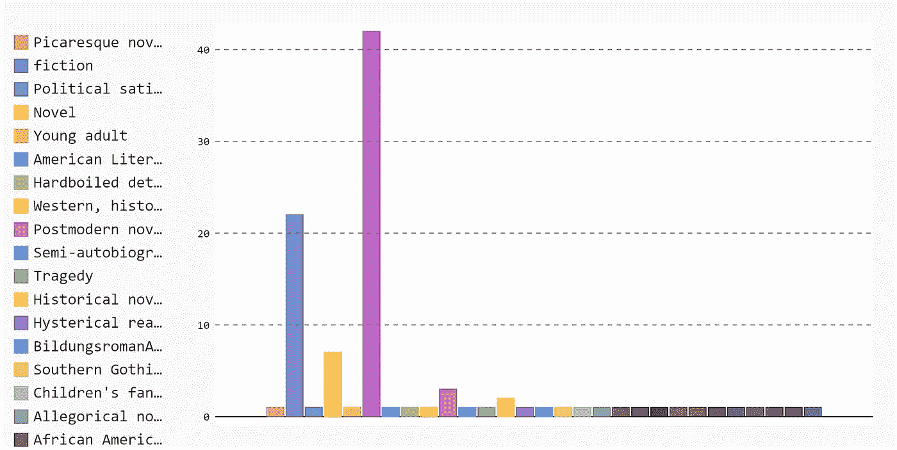
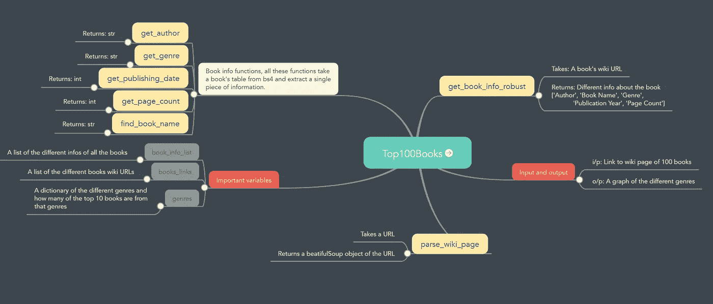

# 阅读他人编写的代码的最有效方式

> 原文：<https://towardsdatascience.com/the-most-efficient-way-to-read-code-written-by-someone-else-cb1a05102b76?source=collection_archive---------4----------------------->

## 如何加快 4 步读懂别人代码的奋斗？

萨法尔·萨法罗夫在 [Unsplash](https://unsplash.com?utm_source=medium&utm_medium=referral) 上拍摄的照片

作为开发人员，不管我们的专业是什么，不管是数据科学、前端还是后端，我们 75%以上的时间都花在阅读他人编写的代码上。这项任务可能是一项非常艰巨的任务。

也就是说，高效阅读他人代码的能力是让一个人的软件工程工作变得更加愉快的技能之一。不幸的是，这也是一项被学校、训练营和公司普遍忽视的技能。这是那些每个人都认为你知道或者擅长的技能之一，仅仅因为你知道如何写代码。

关于写代码，每个人都有自己的编码风格。阅读代码不像阅读小说或故事；不仅仅是阅读屏幕上的说明。相反，当你阅读别人写的代码时，你不仅仅是在阅读他们的代码。你试图了解他们的思维过程，以及他们写代码时在想什么。

不用说，这是一项极具挑战性的任务。但是，这是一项任务，你可以使之大大简化。在这篇文章中，我将带你经历阅读和理解他人代码的 4 个步骤。

为了解释不同的步骤，我将仔细阅读我为 web 抓取教程编写的代码。

# 步骤 1:运行代码，看看它做了什么

每当你得到一个需要阅读和理解的代码时，第一件事——也是最明显的，我认为——就是运行代码，看看它能做什么。它以什么作为输入？输出是什么？

所以，让我们继续运行上面的代码并研究结果。

图片由作者提供(代码的结果截图)

并非所有代码都会生成图表；一些代码的输出将是文本输出。不管输出类型是什么，我们都可以探索它来猜测——如果您还不知道——编写代码的目的是什么。

然而，这可能不会给你很多关于代码的细节，或者如果这个代码是一个更大的项目的一部分，你可能不知道它是如何连接的，但是你将学习如何构建和运行它。此外，您将了解它所使用的库和它所依赖的框架。

然而，运行代码会给你更好地理解它所需要的信息，并且为了确保你得到了每一个依赖项，你需要开始工作并扩展它。

# 第二步:找到主函数或起始点

既然我们知道了代码做什么和输出是什么，我们可以开始更深入地研究它的细节。为此，我们需要精确定位代码的开始。如果你正在使用一种带有 must `main`函数的编程语言，比如 C、C++或 Java，那么就从这里开始，一路走到其他函数。

然而，如果你使用 Python，不是所有的代码都有一个`main`函数，但是你可以使用缩进来知道代码从哪里开始。比如上面的代码，我们有多个函数，然后代码的起点在 ***第 80 行*** 。

因此，我们可以先浏览注释——如果有注释的话——然后浏览代码的整个主要部分，而不去探究子功能的细节。

浏览`main`函数给你代码的一般流程，每个子函数做什么，不是它们如何工作，而是它们做什么。

# 步骤 3:在调试模式下运行代码

一旦您仔细阅读了代码的主要部分，您可能会发现在调试模式下运行代码很有用。原因是，当您在调试器中运行代码时，它允许您观察代码如何与内存交互。

它将向您展示每个变量如何随着代码中的每一步而变化。这样做将使您更深入地理解代码的内部功能及其不同的功能。

一旦您看到代码中的每个变量是如何随着每一行而变化的，您就可以开始在代码中添加自己的注释，向自己解释代码的每一行是做什么的。

# 步骤 4:构建代码不同部分之间的连接思维导图

我发现非常有帮助的一件事是，当我在调试器模式下运行时，构建一个代码连接的思维导图。调试器模式向您展示了不同代码项之间的清晰联系。

从思维导图中间的代码文件名开始，然后分支出不同的功能以及它们是如何连接的。试着鼓励代码中的变量进入思维导图，也许不是所有的变量，但是对整体结果有最大影响的变量。

此外，尽量包含代码的输入和输出以及它们的类型或预期类型。下面是上面代码的思维导图。

图片由作者制作(使用 [Mindmeister](http://mindmeister.com) )上面代码的思维导图

构建思维导图将会在你与代码库交互时节省你很多时间。如果您想添加或删除代码的任何部分，它将帮助您了解连接。

# 外卖食品

阅读其他开发人员编写的代码可能是一项具有挑战性的任务；你需要理解他们的逻辑，他们的风格，以及他们的具体选择。我看过那么多不同水平不同年龄的程序员写的代码。有了这样的经历，我用我自己的 4 步法来简化阅读、探索和理解基本上不是我写的代码。

这 4 个步骤很简单，会节省你很多时间和精力；你需要做的就是:

1.  运行代码并探索结果。
2.  找到主函数或代码的起点。
3.  在调试器下运行代码，并完全理解代码的机制。
4.  构建不同代码元素之间的连接的思维导图，并在与代码交互的任何时候使用它。

我希望这些步骤对您在下一次代码探索中节省大量时间和精力非常有用。

> “的确，花在阅读和写作上的时间比远远超过 10 比 1。作为编写新代码工作的一部分，我们不断地阅读旧代码。…[因此，]让它易于阅读会让它更易于书写。”
> 
> ―罗伯特·c·马丁，