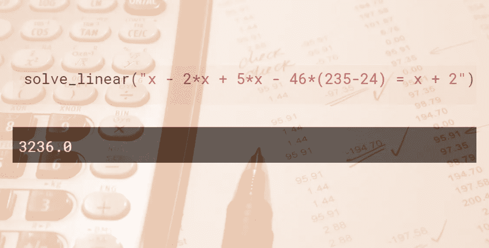
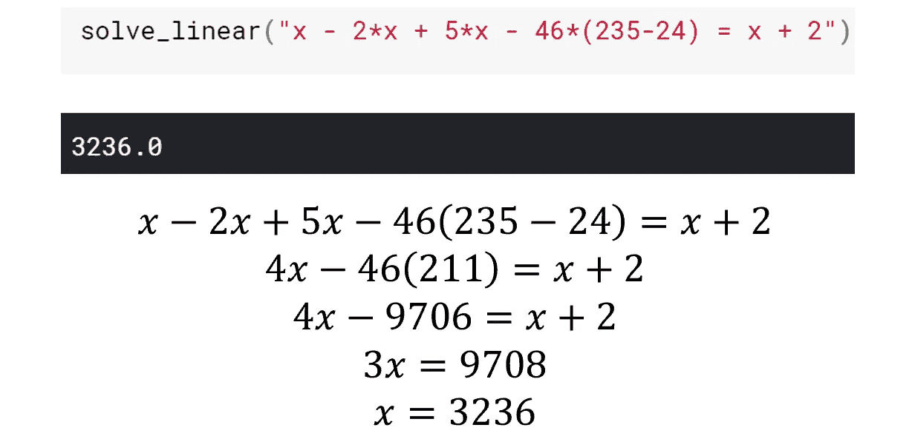
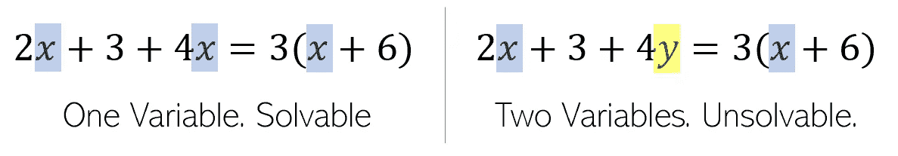
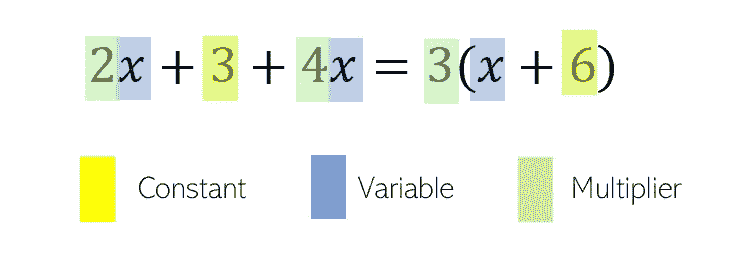
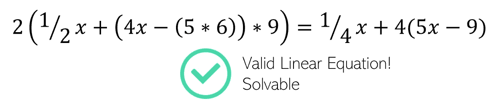
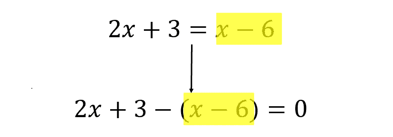
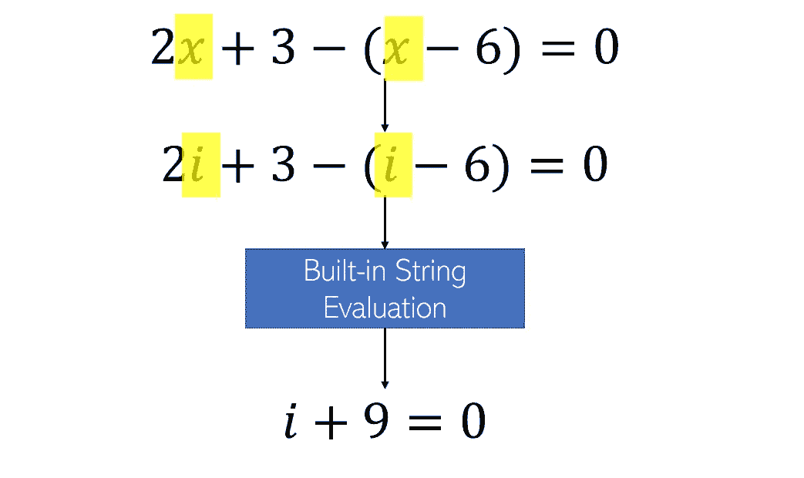
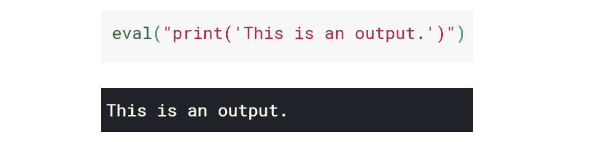
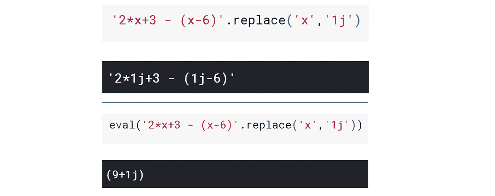
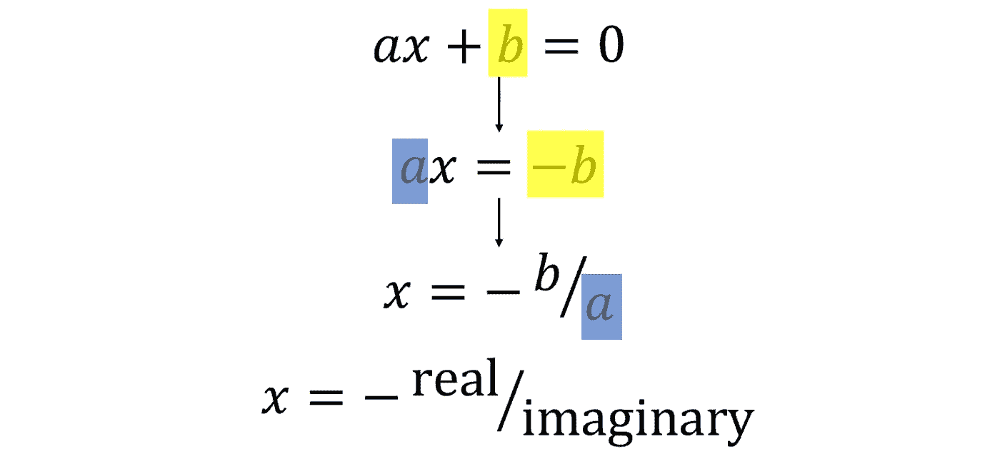

# 用三行代码解决任何线性方程的最有效方法

> 原文：<https://towardsdatascience.com/the-most-efficient-way-to-solve-any-linear-equation-in-three-lines-of-code-bb8f66f1b463?source=collection_archive---------13----------------------->



背景图:Pixabay。免费分享图片

## 使用复数和字符串求值的 Python 技巧

> 除非另有说明，所有图片均由作者创作。

这个函数可以用三行代码求解任何线性方程，甚至可以用两行代码重写。据我所知，这是在 Python 中求解线性方程最有效的方法。

```
def solve_linear(equation,var='x'):
    expression = equation.replace("=","-(")+")"
    grouped = eval(expression.replace(var,'1j'))
    return -grouped.real/grouped.imag
```



例子和标准的代数过程来得到答案。

它是如何工作的？

首先，让我们定义什么是线性方程——它必须是纯可解的。这意味着它只能有一个变量，通常写成 *x* 。双变量方程需要求解多个线性方程(方程组)。



线性方程由三个主要部分组成——常数、变量和乘数。



任何数量或组合的运算(加、减、乘、除)都是有效的，包括任何括号范围。只要它遵守一个线性方程的这些定义，它就是我们的函数可解的。



让我们一步一步地分解这个函数。作为一个例子，我们将使用下面的线性方程作为示范。


第一行通过将等式右侧的整个表达式移动到左侧，将等式转换为要计算的表达式。

```
expression = equation.replace("="," - (")+")"
```



IDE 中的演示:


等式中的所有“信息”都被移到了一边，虽然等号已经被丢弃，但请记住，这个表达式等于 0。

第二行代码对新表达式求值，转换成形式 *ax* + *b = 0* 。这使用了 Python 内置的复数处理，其中 *j* 用于表示数学常数 *i =* √-1。

```
grouped = eval(expression.replace(var,'1j')
```

注意在函数初始化时`var`被指定为等于`‘x’`。

`eval`函数接受一个表达式。通过用自然理解的 *j* ( *i* )替换未知变量 *x* ，Python 将两类表达式元素——变量和常量——视为独立的。当表达式求值时，答案出来是`*a***j* + *b*`，Python 认为它是一个复数。因为 *j* 被用来代替 *x，*结果是一个简化的并且容易解的线性方程。



首先，作为对`eval()`如何工作的演示，它可以评估字符串中给出的任何 Python 命令:



因此，数学表达式就像任何 Python 表达式一样被处理。使用`eval()`的天才之处在于，我们利用 Python 的字符串处理方法，而不是手动完成繁重的工作。



通过欺骗 Python 使其相信`*x*`实际上是`*i*` *，字符串被自动求值。*

请注意，这与…相同


最后，我们实现了一个简化形式`*ax* + *b* = 0`。通过标准和简单的代数操作，我们发现 *x* 等于`-b/a`，或者，相对于我们创建的复数，实部(上例中为 9)的负数除以虚部乘数(上例中为 1)。



```
return -grouped.real/grouped.imag
```

最后一行代码通过返回复数的实部除以虚部的负数，简单地返回这个代数步骤。

通过操作和利用 Python 内置的数学计算能力，这个三行函数可以处理任何线性方程，无论其长度或复杂度如何。

如果你喜欢，请随意投票！