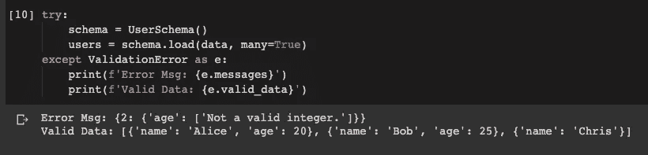

# 最优雅的 Python 面向对象编程

> 原文：<https://towardsdatascience.com/the-most-elegant-python-object-oriented-programming-b38d75f4ae7b?source=collection_archive---------6----------------------->


[数码师](https://pixabay.com/users/TheDigitalArtist-202249/)在[像素点](https://pixabay.com/illustrations/banner-jigsaw-pattern-design-5190182/)拍摄的照片

## 具有全面验证功能的字典和对象之间的无缝转换

众所周知，Python 的优势在于它的灵活性。例如，Python 是面向对象编程中最简单的编程语言之一。然而，它有时也会受到批评，因为它“过于灵活”。

在本文中，我将介绍我认为使用 Python 进行面向对象编程的最优雅的方式。

方法的关键是一个名为`marshmallow`的库。

你可以通过`pip install marshmallow`轻松安装这个库。


由 [Zorro4](https://pixabay.com/users/Zorro4-796252/) 在 [Pixabay](https://pixabay.com/illustrations/hibiscus-marshmallow-blue-flower-2081312/) 上拍摄的照片

# 类别的定义

让我们从声明一个用户类开始，出于演示目的，保持简单。

```
class User(object):
    def __init__(self, name, age):
        self.name = name
        self.age = agedef __repr__(self):
        return f'I am {self.name} and my age is {self.age}'
```

好的。我们的`User`职业只有两个属性:`name`和`age`。请注意，我还实现了`__repr__`方法，这样我们可以很容易地输出实例来验证它。

然后，我们需要从库`marshmallow`中导入一些模块和方法。

```
from marshmallow import Schema, fields, post_load
from pprint import pprint
```

这里我导入了`pprint`，因为我们要打印许多字典和列表。只是想让它更好看。

现在，我们应该如何使用`marshmallow`？简单地为我们的`User`类定义一个“模式”。

```
class UserSchema(Schema):
    name = fields.String()
    age = fields.Integer()@post_load
    def make(self, data, **kwargs):
        return User(**data)
```

这很简单。对于每个属性，我们需要声明它是`fields`，然后后跟类型。

注释`@post_load`是可选的，如果我们希望将模式作为任何类的实例来加载，就需要这个注释。因此，在我们的例子中我们需要它，因为我们想要生成`User`实例。`make`方法将简单地使用所有的参数来实例化实例。

# JSON 到实例

如果我们有一个字典(JSON 对象)并且想要一个实例，下面是代码。

```
data = {
    'name': 'Chris',
    'age': 32
}schema = UserSchema()
user = schema.load(data)
```


多简单啊！只需调用模式的`load()`方法，我们就将 JSON 对象反序列化为类实例。

# 多个实例的 JSON 数组

如果我们有一个包含多个要去序列化的对象的 JSON 数组呢？我们不需要写 for-loop，简单指定`many=True`如下。

```
data = [{
    'name': 'Alice',
    'age': 20
}, {
    'name': 'Bob',
    'age': 25
}, {
    'name': 'Chris',
    'age': 32
}]schema = UserSchema()
users = schema.load(data, many=True)
```


# 将实例序列化为 JSON 对象(字典)

好的。我们知道可以使用`load()`方法将字典转换成实例。反过来怎么样？我们可以使用如下的`dump()`方法。

```
dict = schema.dump(users, many=True)
```


在这个例子中，我简单地使用了`users`，它是从前面的例子中生成的用户实例列表。可以看到，一行代码就把用户实例列表转换成了 JSON 数组！

# 现场验证

你认为`marshmallow`只能序列化/反序列化实例吗？如果是这样，我大概不会把这个作为故事分享在这里。这个库最强大的特性是验证。

这里先说一个简单的例子。首先，我们需要从库中导入一个异常`ValidationError`。

```
from marshmallow import ValidationError
```

还记得我们用字段`age`声明了上面的`UserSchema`为`Integer`吗？如果我们传入一个无效的值呢？

```
data = [{
    'name': 'Alice',
    'age': 20
}, {
    'name': 'Bob',
    'age': 25
}, {
    'name': 'Chris',
    'age': 'thirty two'
}]
```

请注意，在上面的 JSON 数组中，第三个对象“Chris”的年龄格式无效，不能转换为整数。现在让我们使用`load()`方法去序列化数组。

```
try:
    schema = UserSchema()
    users = schema.load(data, many=True)
except ValidationError as e:
    print(f'Error Msg: {e.messages}')
    print(f'Valid Data: {e.valid_data}')
```



异常被捕获，它告诉我们“不是一个有效的整数”。想象一下，我们正在开发一个 web 应用程序，甚至没有必要为编写错误消息而烦恼！

此外，在本例中，只有第三个对象存在验证问题。错误消息实际上告诉我们它发生在索引`2`处。此外，仍然可以输出有效的对象。

# 高级验证

当然，仅仅针对数据类型进行验证是不够的。该库支持更多的验证方法。

让我们给`User`类再添加一个属性`gender`。

```
class User(object):
    def __init__(self, name, age, gender):
        self.name = name
        self.age = age
        self.gender = genderdef __repr__(self):
        return f'I am {self.name}, my age is {self.age} and my gender is {self.gender}'
```

然后，让我们定义带有验证的模式。我们还需要从库中导入`validate`特征。

```
from marshmallow import validateclass UserSchema(Schema):
    name = fields.String(validate=validate.Length(min=1))
    age = fields.Integer(validate=validate.Range(min=18, max=None))
    gender = fields.String(validate=validate.OneOf(['F', 'M', 'Other']))
```

这里，我们向所有这三个字段添加了验证。

*   对于字段`name`，长度必须至少为 1。换句话说，不能是空的。
*   对于字段`age`，它必须大于或等于 18。
*   对于字段`gender`，它必须是三个值之一。

让我们定义一个包含所有无效值的 JSON 对象，如下所示。

```
data = {
    'name': '',
    'age': 16,
    'gender': 'X'
}
```

然后，让我们试着加载它。

```
try:
    UserSchema().load(data)
except ValidationError as e:
    pprint(e.messages)
```


捕捉异常并不奇怪，但是当我第一次尝试时，我真的很惊讶错误消息是现成的。这为我们编写验证错误消息节省了大量时间。

# 定制验证功能

您可能会问，使用上例中的内置验证方法(如范围、长度和“其中之一”)仍然有一定的局限性。如果我们想要定制验证方法呢？当然可以。

```
def validate_age(age):
    if age < 18:
        raise ValidationError('You must be an adult to buy our products!')class UserSchema(Schema):
    name = fields.String(validate=validate.Length(min=1))
    age = fields.Integer(validate=validate_age)
    gender = fields.String(validate=validate.OneOf(['F', 'M', 'Other']))
```

在这里，我们用定制的逻辑和消息定义了我们的验证方法`validate_age`。让我们定义一个 JSON 对象来测试它。在以下对象中，年龄小于 18 岁。

```
data = {
    'name': 'Chris',
    'age': 17,
    'gender': 'M'
}try:
    user = UserSchema().load(data)
except ValidationError as e:
    pprint(e.messages)
```


现在，它使用你定制的逻辑和错误信息。

还有另外一种实现方式，我觉得更优雅。

```
class UserSchema(Schema):
    name = fields.String()
    age = fields.Integer()
    gender = fields.String()@validates('age')
    def validate_age(self, age):
        if age < 18:
            raise ValidationError('You must be an adult to buy our products!')
```

因此，在这个例子中，我们使用注释来定义类内部的验证方法。

# 必填字段

您还可以定义一些必填字段。

```
class UserSchema(Schema):
    name = fields.String(required=True, error_messages={'required': 'Please enter your name.'})
    age = fields.Integer(required=True, error_messages={'required': 'Age is required.'})
    email = fields.Email()
```

在这个例子中，我们定义`name`和`age`为必填字段。现在，让我们使用一个没有电子邮件的对象来测试它。

```
data_no_email = {
    'name': 'Chris',
    'age': 32
}try: 
    user = UserSchema().load(data_no_email)
except ValidationError as e:
    pprint(e.messages)
```


好的。完全没问题。如果我们有一个没有名字和年龄的物体呢？

```
data_no_name_age = {
    'email': '[abc@email.com](mailto:abc@email.com)'
}try: 
    user = UserSchema().load(data_no_name_age)
except ValidationError as e:
    print(f'Error Msg: {e.messages}')
    print(f'Valid Data: {e.valid_data}')
```


它会报错并提供我们为必填字段定义的错误消息。

# 默认值

有时，我们可能希望用默认值定义一些字段。因此，用户可能不需要输入它，默认值将被利用。

```
class UserSchema(Schema):
    name = fields.String(missing='Unknown', default='Unknown')print(UserSchema().load({}))  # Take the "missing" value
print(UserSchema().dump({})) # Take the "default" value
```


在`marshmallow`中，有两种方式定义“默认”值:

*   `missing`关键字定义了使用`load()`反序列化实例时将使用的默认值
*   `default`关键字定义使用`dump()`序列化实例时将使用的默认值

在上面的例子中，我们使用了两个关键字，并用一个空对象试验了`load()`和`dump()`两种方法。可以看出，两者都添加了带有默认值的`name`字段。

# 属性别名

继续，还没完:)

有时候，在键/属性名方面，我们的类和实际的 JSON 数据之间可能会有一些差异。

例如，在我们的类中，我们定义了`name`属性。然而，在 JSON 对象中，我们有`username`,它表示相同的字段，但是命名不同。在这种情况下，我们不必重新实现我们的类，也不必转换 JSON 对象中的键。

```
class User(object):
    def __init__(self, name, age):
        self.name = name
        self.age = agedef __repr__(self):
        return f'I am {self.name} and my age is {self.age}'class UserSchema(Schema):
    username = fields.String(attribute='name')
    age = fields.Integer()@post_load
    def make(self, data, **kwargs):
        return User(**data)
```

请注意，我们在`User`类中有`name`，而在`UserSchema`中我们有`username`，但是对于字段`username`，我们定义它的`attribute`应该叫做`name.`

让我们尝试转储一个用户实例。

```
user = User('Chris', 32)
UserSchema().dump(user)
```


它正确地序列化了字段名为`username`的实例。

反之亦然:

```
data = {
    'username': 'Chris',
    'age': 32
}
UserSchema().load(data)
```


即使我们传递了带有键`username`的 JSON 对象，它仍然可以毫无问题地将其反序列化到`User`实例。

# 嵌套属性

最后但同样重要的是，`marshmallow`支持嵌套属性，没有任何问题。

```
class Address(object):
    def __init__(self, street, suburb, postcode):
        self.street = street
        self.suburb = suburb
        self.postcode = postcodedef __repr__(self):
        return f'{self.street}, {self.suburb} {self.postcode}'class User(object):
    def __init__(self, name, address):
        self.name = name
        self.address = address

    def __repr__(self):
        return f'My name is {self.name} and I live at {self.address}'
```

我们定义了两个类`Address`和`User`。类别`User`有一个属性`address`，其类型为`Address`。让我们通过实例化一个用户对象来测试这些类。

```
address = Address('1, This St', 'That Suburb', '1234')
user = User('Chris', address)
print(user)
```


现在，我们将如下定义模式。

```
class AddressSchema(Schema):
    street = fields.String()
    suburb = fields.String()
    postcode = fields.String()@post_load
    def make(self, data, **kwargs):
        return Address(**data)class UserSchema(Schema):
    name = fields.String()
    address = fields.Nested(AddressSchema())@post_load
    def make(self, data, **kwargs):
        return User(**data)
```

这里的技巧是使用`fields.Nested()`来定义一个使用另一个模式的字段。上面我们已经有了一个用户实例。让我们把它转储到一个 JSON 对象中。

```
pprint(UserSchema().dump(user))
```


如图所示，用户实例已经被序列化为一个嵌套的 JSON 对象！

当然，反过来也可以。

```
data = {
    'name': 'Chris',
    'address': {
        'postcode': '1234',
        'street': '1, This St',
        'suburb': 'That Suburb'
    }
}
pprint(UserSchema().load(data))
```


# 摘要


图片由 [geralt](https://pixabay.com/users/geralt-9301/) 在 [Pixabay](https://pixabay.com/illustrations/business-planning-concepts-hand-5338474/) 拍摄

在本文中，我介绍了如何使用库`marshmallow`在实践中极大地简化 Python 中的面向对象编程。我认为在 Python 中使用 OO < - > JSON 是最优雅的方式。

所有的代码都在我的谷歌实验室里:

[](https://colab.research.google.com/drive/1mZVBiVgk3OTyJqFFTw6NYRThtjyZne9X?usp=sharing) [## 棉花糖 _ 面向对象 _Python.ipynb

### 实验记录手册

colab.research.google.com](https://colab.research.google.com/drive/1mZVBiVgk3OTyJqFFTw6NYRThtjyZne9X?usp=sharing) [](https://medium.com/@qiuyujx/membership) [## 通过我的推荐链接加入 Medium 克里斯托弗·陶

### 作为一个媒体会员，你的会员费的一部分会给你阅读的作家，你可以完全接触到每一个故事…

medium.com](https://medium.com/@qiuyujx/membership) 

如果你觉得我的文章有帮助，请考虑加入 Medium 会员来支持我和数以千计的其他作者！(点击上面的链接)