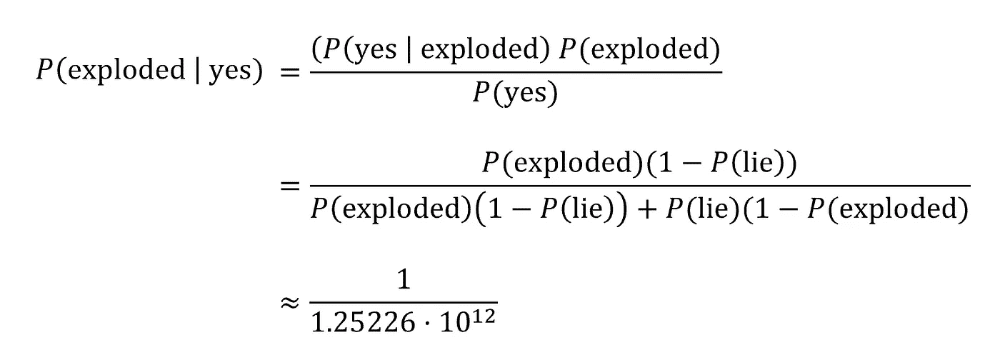
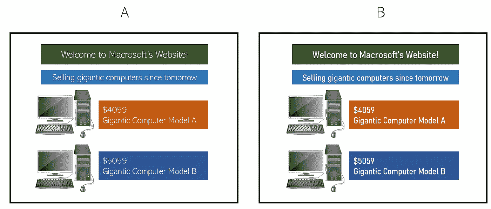

# 统计学和数据科学中最基本也是最有争议的争论

> 原文：<https://towardsdatascience.com/the-most-fundamental-and-controversial-debate-in-statistics-and-data-science-e8dd1bad737a?source=collection_archive---------36----------------------->

## 频繁主义者-贝叶斯之争

[Pixabay](https://pixabay.com/photos/arm-wrestling-indian-wrestling-567950/)

统计是一个不断发展的领域，不断赶上指数增长的应用和数据来源。随着统计学和数据科学——涵盖从机器学习和人工智能到政客们实事求是地证明自己观点的数字的一切——的迅速发展，关于统计学基本性质的 250 年分歧也在迅速扩大。

Bayesians 和 Frequentists 反映了对科学过程的不同观点。因为争论是如此根本，并且在统计学和数据科学的根源上分裂，这两个思想流派之间的争论在许多地方爆发，从 [A/B 测试](https://medium.com/ai-in-plain-english/you-are-a-subject-in-hundreds-of-experiments-a-day-9fe65a2982ff?source=---------52------------------)的世界到社会研究到一般数字(美国的平均身高是多少？你不能衡量所有人)。事实上，以任何一个众所周知的统计问题为例，比如德国坦克问题，可能会有两种方法/解决方案:频率主义方法和贝叶斯方法。

从广义上讲，19 世纪是贝叶斯统计占主导地位，而 20 世纪是频率主义。当 21 世纪进入贝叶斯频率主义的时代，对大量数据进行筛选和处理的需求呈指数级增长，统计学和数据科学的观点将会以前所未有的规模扩大。

贝叶斯统计更适合利用其掌握的所有信息来取得快速进步——在追求科学进步的过程中，贝叶斯主义者往往在建模假设方面更加激进和乐观，为了给模型更多的视角(从其他来源获取数据)，他们牺牲了确认模型潜在前提的严谨性。另一方面，频繁主义的数据科学家更加谨慎和保守，旨在获得普遍接受的结论，经得起严厉的对抗性审查。如果冒着学术和统计完整性的风险，科学的频繁主义模型将牺牲一些可能能够改进模型的收益。

通常，用来区分这两个群体的最明显的区别是他们接受新的和外部数据的开放性，这可能使模型更加清楚，但也可能炫耀或甚至违反模型的基本假设。常客们觉得只使用当前实验的数据和参数最舒服，因为它可以进行比较，即使它没有给模型太多的视角。贝叶斯主义者将试图纳入来自不同外部实验的数据，他们认为这将改善模型，这样，如果数据不能严格对应，也没有关系。贝叶斯思维方法会不断用新的信息和数据更新模型或计算，而常客会满足于常数参数。

这幅有争议的漫画通过在当前实验中引入外部数据来嘲笑常客的保守主义:

一个[有争议的](https://statmodeling.stat.columbia.edu/2012/11/10/16808/)常客——贝叶斯漫画。[来源](https://imgs.xkcd.com/comics/frequentists_vs_bayesians.png)。免费分享。

实验的当前参数表明:

1.  每个骰子有六分之一的几率落地。
2.  有两个骰子，所以总共有 36 种可能的组合。
3.  如果两个骰子落入 36 种可能组合中的一种，那么检测器就在说谎。换句话说，它有 1/36 的机会说谎。

给定实验的参数，频率学家发现*p*-值小于 0.05，该值衡量实验产生错误结果的可能性(假设临床试验中 100 个患者中有 5 个不支持该假设，则*p*-值为 0.05)。这种 *p* < 0.05 的标准在学术界如此根深蒂固，以至于 *p* 的整个领域——黑客行为——扭曲你的结果，以达到 *p* 的价值标准，并在学术期刊上发表研究——都变得非常流行。因为这项研究的发现是侥幸的几率小于 0.05，并且中微子探测器宣布太阳已经爆炸，所以频率主义者宣布太阳确实已经爆炸了！对此，贝叶斯讽刺道，“我赌 50 美元，它没有。”(参考贝叶斯学者布鲁诺·德·福内梯，他在他的思想实验中大量使用了打赌。)

当然，这很傻。频率主义者没有考虑到这样一个事实，即太阳爆炸的概率非常小——远远小于 1/36——这意味着，即使考虑到 1/36 的撒谎概率，太阳爆炸的可能性仍然非常小。事实上，用于计算一个事件发生的概率(假设另一个事件为真)的贝叶斯方程可以用在以下场景中:

在贝叶斯方程和贝叶斯统计中，外部信息以*先验*的形式提供。在这种情况下，先验以太阳已经爆炸的机会(4.38× ⁰中的一个)的形式出现，结合当前实验的参数和条件。

尽管这部有争议的漫画幽默地揭示了贝叶斯主义者和常客之间的差异，但还有很多被忽略了。就连漫画的作者兰道尔·门罗也承认:

> 不过，我似乎踩到了马蜂窝，在面板上添加了“频繁主义者”和“贝叶斯”标题。这对我来说是一个惊喜，部分是因为我实际上是在最后的笑点加上去的。……事实是，我真的没有意识到常客和 Bayesians 实际上是一群人——他们现在都在给我发电子邮件。我认为它们是松散应用的标签——也许只是我最近碰巧阅读的书籍所贴的标签——用于我们在科学课上学到的标准教科书方法与更仔细地融入先验概率思想的方法。

太阳爆炸的“实验”是不可重复的，这是比较两种方法时要考虑的一个重要因素。然而，这种对比的潜在问题是，将先验整合到计算中很简单，也很有意义(我想都是为了笑点)。不幸的是，现实世界中的统计和数据科学问题从来都不是一目了然的。

例如，考虑贝叶斯-频率主义者冲突的主要战场:A/B 测试，它通常被公司用来比较两组(A 和 B ),在这两组中，除了一个变量之外，一切都保持相同。两组之间的差异可以(通常)归因于该变量的变化；例如，将调色板从浅变深可能会显著增加与网站的交互。每次你访问一个相当大的公司的网站，比如谷歌和微软，你可能会进行几十次 A/B 测试。成功的 A/B 测试让他们的运营商赚了几十亿美元(字面意思)。

比方说，我们销售巨型计算机的公司 Macrosoft 想进行一次 A/B 测试，以确定我们能否通过改变字体来增加从网站上购买产品的人数。每当用户登录 Macrosoft 时，他们会被分为 A 类或 B 类，并以相应的字体显示内容。

由作者创建。

1000 人参与了(当然是不知情的)A/B 实验。500 人在 A 组，500 人在 B 组，随机决定是否进入 A 组。A/B 测试产生以下结果:

*   A 组有 20%的用户购买了产品。因此，如果用户在 A 组，他们有 20%的机会购买产品。
*   B 组有 25%的用户购买了产品。因此，如果用户在 B 组，他们有 25%的机会购买产品。

在这一点上，常客会得出结论，将字体更改为 B 组中的字体，Macrosoft 会看到通过该网站购买的产品增加了 5%。为了对这种变化越来越有信心，频率主义者会增加实验中的人数，期望随着受试者人数的增加，结果越来越接近真实值。这种被称为大数定律的思想是频率主义统计学的基础。

贝叶斯理论并不确定这个结论。贝叶斯从一项研究中检索数据，该研究发现不同组的常用字体之间没有明显的情绪或心理差异，并将其纳入他或她的计算中。当这项研究考虑在内时，贝叶斯发现 A 组和 B 组之间没有差异——5%的差异只是一个随机的侥幸。如果公司花了几个小时改变网站字体，什么都不会改变。这反映了贝叶斯数据科学的主要目标:试图在结果的表面价值背后放置更多的上下文。

频繁主义者不愿意接受贝叶斯的结论。“这项研究的前提与我们的不同，”他/她说。“它来自不同的人口规模，有不同的背景和不同的目标。这不是苹果与苹果之间的比较，因此甚至不应该被计算在内。”贝氏反击道，“这有什么关系？这总比信以为真要好，因为这些结果不可避免地会有偏差。”

虽然大学、公司和其他机构的统计或数据科学团队经常选择并坚持一种观点以保持一致，但对于应该相信哪种观点没有明确的答案。是的，贝叶斯理论可能会给模型更多的视角，但从频率主义者的角度来看，增加外部数据会导致更多的问题——引入偏见和潜在假设的新维度——而不是解决问题。随着从泛滥的数据河流中做出明智决策的需求关系到数十亿美元的利益，这一长达数百年的争论将具有更大的重要性。

让我们看看 21 世纪的数据科学在哪里落地。