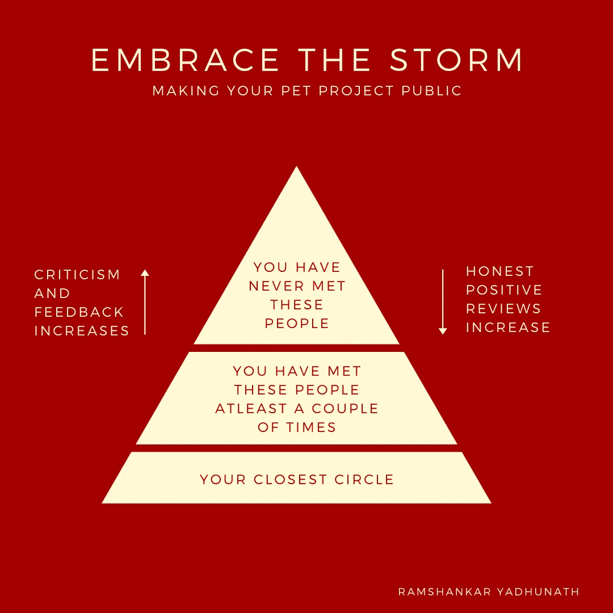

# 数据科学有志者最重要的思维方式

> 原文：<https://towardsdatascience.com/the-most-important-mindhack-for-the-data-science-aspirant-6ab25d9010b1?source=collection_archive---------72----------------------->

## *作为数据世界的学生，为了提高自己，要认识到你周围的每个人都是有能力的导师*

您已经完成了第一个数据科学项目。这很简单，但很有效。你会惊讶于自己在工作中所学到的东西。现在，你希望将你的作品分享给世界上的其他人。所以，你开始写博客。很快，你会意识到你的项目还没有装饰到“值得写博客”的程度。

你可以写一篇“如何做 X”或者“用 Y 构建 X”的文章。但是，你不喜欢增加互联网上某些内容的冗余。你考虑在 LinkedIn 上发布你的项目。毕竟，这是一个可以帮助你增加职业联系的网络。

然后你想起过去几天你在 LinkedIn feed 上看到的项目。每一次都比前一次更可怕。你再次意识到，你的项目还没有准备好进入一个平台，尤其是一个有这么多复杂项目控制着喜欢和分享的平台。

此时，你们中的一些人可能会将代码文件保存到 Github 中，不管有没有文档。如果您喜欢将代码文件保存在本地系统中，我希望您不要在例行的桌面清理过程中误删了它们。我蠢到做了这件事。

几个星期后，你会忘记这个项目。生活在继续。你开始学习新的东西。你建立了更多的项目，但不与任何人讨论你的工作。你简直就是初级数据科学项目的布鲁斯·韦恩。这无疑是一条充满便利的道路。但是便利对于改善来说是一个很差的催化剂。

不太方便的途径是与他人讨论你的工作，与他们交流你的努力，帮助他们理解你的工作，理解他们的反馈，并在你已经知道的基础上进行改进。

如果你只从这篇文章中拿走一句话，我希望是这句话——*“作为一名数据世界的学生，为了提高自己，要意识到你周围的每个人都是一位能干的导师”*。

# 从关心你的项目开始

当你是初学者时，每个项目都让你有能力学习新的东西。因此，这些项目值得你的关心和全力以赴。你越了解自己做了什么，为什么这么做，就越容易向别人解释。

数据科学主要是为利益相关者创造价值。它不是你制造的。它是你提供给人们的价值。

如果你已经花了至少几个小时在你的项目上，不言而喻，你将需要花更多的时间来完善它。[如果这是你为大学作业所做的事情，它不应该仅仅是为了评估。如果你不喜欢从中学习，你可以。](/how-to-learn-from-academic-projects-ca55f73e47c4)

有几种方法可以让你的工作物有所值

*   [确保你写的代码可读且专业](https://www.kaggle.com/rtatman/six-steps-to-more-professional-data-science-code)
*   [提供足够的文档让他人理解你的工作](/why-you-should-document-your-work-as-a-data-scientist-a265af8a373)

[在一个仅靠在线课程无法提供帮助的世界里，项目是初学者工具包中最重要的组成部分](/sorry-online-courses-wont-make-you-a-data-scientist-8639d5f00889)。然而，如果没有很好地利用，即使最好的工具也可能失败。

> 数据科学主要是为利益相关者创造价值。它不是你制造的。它是你提供给人们的价值。

# 共享您的项目

我们大多数人都是伴随着这句格言“分享就是关爱”长大的。我仍然记得我是如何用这句话来吃我同学的午餐盒的！然而，作为一名数据科学初学者，分享您的工作很重要，因为它提供了一个讨论的机会。讨论可以让你从以前从未有过的角度来看待这个项目。

然而，分享的想法躲避初学者。作为初学者，我们都觉得我们太新了，无法分享我们的项目。我们脑海中出现的一些非常常见的问题是

*   我的项目“好”吗？
*   不好的话人们会“把我撕成碎片”吗？
*   有人会“窃取”我的想法吗？

首先，在有人给你反馈之前，你怎么知道你的项目是否好？自力更生，自我评价肯定是很重要的。但是，在数据世界里，你创造东西来帮助人们。所以，为了了解你是否击中了要害，你需要与人交谈。

为什么人们会“把你撕成碎片”？即使他们这样做了，为什么要打扰一个没有什么可失去的初学者呢？我们走的每一步都是一次新的学习机会。如果恐惧开始控制我们进步的速度，那么掌握就很遥远了。

最后，如果你喜欢的项目很敏感，你还不想公开，那也没关系。但是，如果有一点点可能与你信任的人讨论这件事，你必须去做。全新的视角总是有帮助的。

好吧，那我们怎么分享？我们是否把我们的工作和文件夹联系起来？或者发关于项目的推特？还是把链接发给朋友，要求评论？在我看来，没有放之四海而皆准的答案。不过，我可以给你提供一个框架，我发现这个框架在让你的宠物项目“公开”时极其有用。我称之为“拥抱风暴”金字塔。

这个术语源于这样一种理解，即要求对某件事的反馈总是会在我们的头脑中产生恐惧、怀疑和希望的风暴。

演员表:作者

对于你喜欢的项目，基本上有三个要求反馈的层次。随着你越往上爬，你受到的批评越多。往下走，诚实的正面评价会增加。所有级别都同等重要。至于有价值的反馈需要达到什么水平，这完全取决于你的项目。

## 第一级——你最近的圈子

三者中最小的一组。这包括你的朋友或教授，他们每天都和你交谈，或者一周至少交谈几次。这些人了解你，知道你在项目中所做的工作。

优势:他们给你最诚实的正面评价。例如，如果他们喜欢他们所看到的，他们会全心全意地欣赏它。他们为你的工作感到骄傲，并且不会隐瞒该表扬的地方。

**劣势:**他们最少批评。他们中的大多数人不会指出消极的一面，因为他们认为这不适合你。然而，如果你告诉他们批评对你有多重要，他们中的一些人可能会帮助你。

## 第二级——你刚刚认识的人

这包括你在大学或工作场所会遇到几次的人。你和他们并不亲近，但是你们都意识到了你们对工作的重视。这可以包括你不太了解的共同朋友，也可以包括系里没教过你但认识你的教授。

**优势:**他们位于金字塔的中间，因此对你的努力给予相当多的批评性反馈和赞扬。

劣势:你不太了解这些人。所以，相信他们的意见确实变得有点困难。曾经有人告诉我他们“喜欢”我的项目。然而，他甚至还没有运行我的代码。哎呀。

## 第三级——你不认识的人

这些人可能甚至不知道你的存在。它包括世界上所有你不认识的人。如果你对我的要求是具体，我会说你从未见过但在你的领域工作的教授。世界各地的数据科学家。社交媒体上的数据科学社区。这样的例子不胜枚举。

**优势:**他们给你最关键的反馈。其中许多都是高质量的，可以帮助你显著地改进你的工作。他们会毫不犹豫地向你展示需要改进的地方。

缺点:他们真的没有时间来称赞你的努力，因为时间就是金钱。如果他们有时间回应，他们会确保这是值得的。话虽如此，他们中的许多人可能不会回应，因为他们通常都很忙，没有义务回应你。

现在，如果你住在第一层，你就不需要在 LinkedIn 上写博客或帖子了。这可能发生在午餐时间。你的同事不需要理解数据，他们需要理解的只是你的想法及其重要性。他们甚至不需要成为编码员。你得到的讨论和想法会让你大吃一惊。不要相信我的话。尝试一下，自己感受一下。

一封电子邮件或一次例行的聊天/边喝咖啡边见面会对二级反馈有所帮助。如果对你来说太正式，10-15 分钟的谈话也可以提供一些非常重要的反馈。

电子邮件仍然适用于第三级。如果你足够幸运能见到你的偶像，那听起来很棒！然而，第三层的大部分互动将通过社交媒体进行。所以，这就是你可能需要一篇博文或一篇文章的地方。明智而谨慎地使用它。你一定会被你的内容所评判。

这里的底线是*“你不需要认为一篇博文或一篇文章是让你的项目为人所知并获得反馈的唯一途径”*。如果你想提高，即使你日常见到的人也可以成为重要的老师，即使他们对数据知之甚少。[毕竟，数据科学的一个关键部分是沟通。](https://hbr.org/2019/01/data-science-and-the-art-of-persuasion)

> *作为一名数据世界的学生，要意识到你周围的每个人都是有能力的导师。*