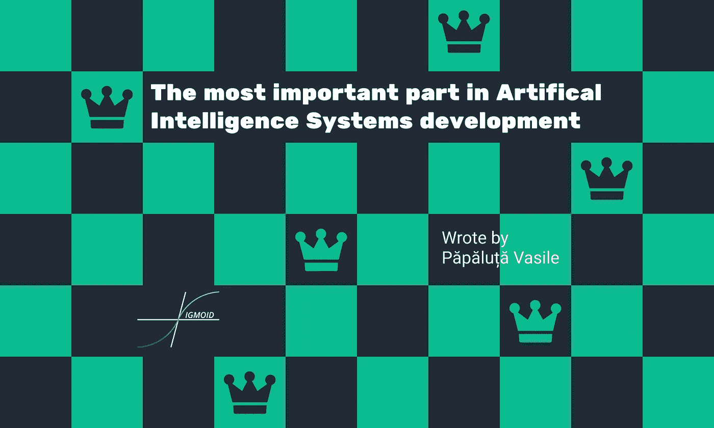
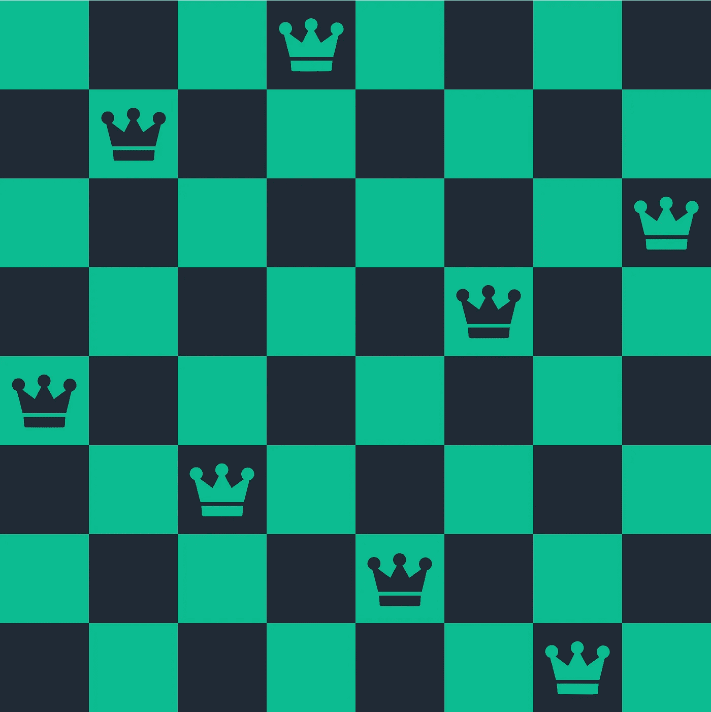
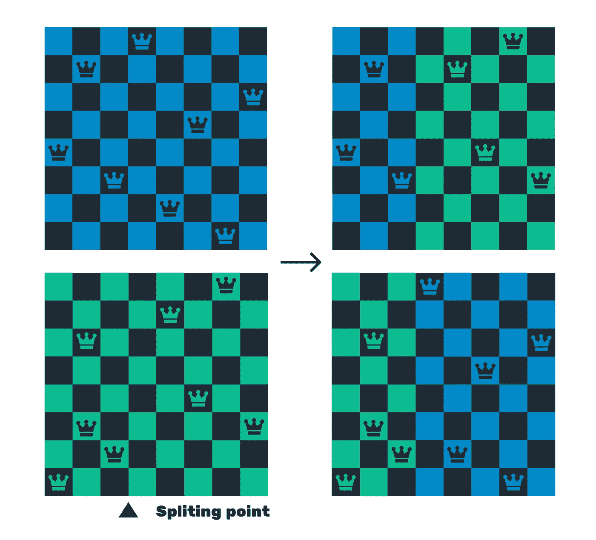
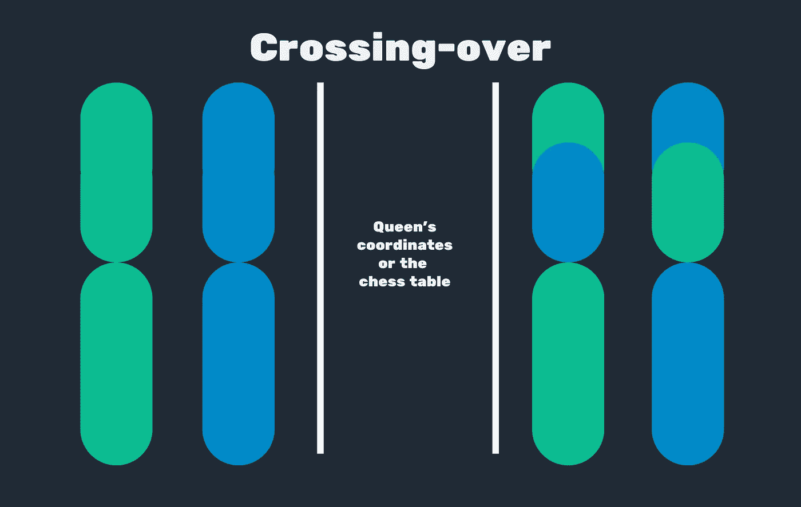

# 人工智能系统开发最重要的部分

> 原文：<https://towardsdatascience.com/the-most-important-part-in-artifical-intesystems-development-243f04f73fcd?source=collection_archive---------59----------------------->

如今，像数据科学和机器学习这样的人工智能相关领域已经成为主流。几乎每个人现在都可以成为数据科学家。这当然是一件好事，但不幸的是，人们忘记了什么是人工智能系统。我更喜欢麻省理工学院的帕特里克·温斯顿的观点:

> 人工智能(或智能代理)是一个基于数学模型的系统，它在具有某些约束的环境中以最佳方式运行。

在这篇文章中，我想多谈谈模型。

那么是什么让一个模特成为好模特呢？

简而言之，一个好的模型(在我看来是每一个好的模型)应该是问题的一个好的代表。换句话说，它必须:

*   使显著的特征清晰。
*   暴露约束。

不幸的是，由于像 Kaggle 这样的平台以漂亮的封面和简单的表格提供数据，大多数人认为人工智能是一项找到一些特征来预测一个类别或连续值的任务，有时是在图像中找到一个对象。但现在我想展示一个人工智能领域的另一个问题的例子，不幸的是它没有被当作人工智能的例子。

**八皇后问题**

8 皇后问题被公式化为:一个代理人应该把 8 个皇后放在一个国际象棋桌上，以这样的方式没有皇后攻击其他皇后。

一个理想和目标状态，没有一个女王攻击另一个女王。

为了解决这个问题，我们首先需要对这个问题进行数学描述。所以让我们把它公式化为一个优化问题:

*   性能函数——相互攻击的女王对的数量。
*   问题的状态——棋盘上皇后的排列——我们将使用它们来找到它的成本值。
*   求解的方法——我选择了遗传算法。

《人工智能——现代方法》一书的插图显示了交叉过程中桌子本身的分裂。但不幸的是，有时它会违反问题的主要规则——女王的数字必须是 8。

书中所示的拆分方法。由此产生的国际象棋桌上有 7 和 9 皇后——违反了主要规则。

那么，在交换过程中，在不改变皇后数量的情况下，有什么更好的模型来描述棋盘的排列呢？什么描述了皇后在餐桌上的位置？
当然坐标！所以，通过把染色体描述成一列皇后坐标。但是变异就像随机改变女王的坐标一样。

**结论**

所以作为我的结束语，我想给你一个建议。如果你想成为一名人工智能研究员或人工智能工程师，我真的建议你不要坚持机器学习和神经网络等技术，尤其是 sklearn 或 Keras 这样的框架。更好地学习建立你自己的，就像我们在 Sigmoid 做的那样。最重要的是学会用公式表达问题和解决问题的模型。

额外收获:[python 实现。](https://github.com/ScienceKot/8-Queen-Problem.git)

更多资源:

[麻省理工学院人工智能课程:第 14 讲](https://www.youtube.com/watch?v=L73hY1pBcQI&list=PLUl4u3cNGP63gFHB6xb-kVBiQHYe_4hSi&index=15)