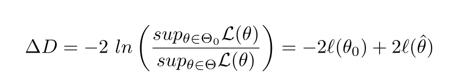
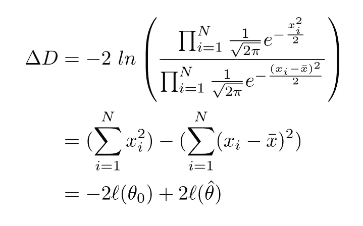
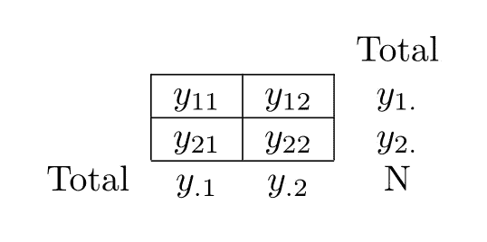
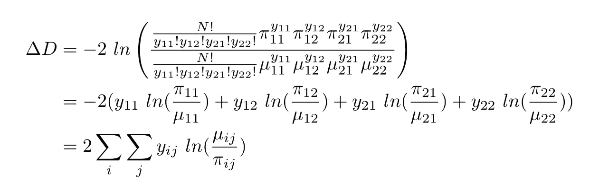

# 最重要的统计测试

> 原文：<https://towardsdatascience.com/the-most-important-statistical-test-dee01f4d50cf?source=collection_archive---------28----------------------->

## 剧透警告:可能性比率测试

似然比检验(LRT)“统一”频数统计检验。诸如 t 检验、f 检验、卡方检验等品牌检验是 LRT 的*特定*案例(甚至是近似值)。

因此，令人惊讶的是许多人从未听说过 LRT。当我帮助人们解决他们的统计问题时，大多数时候他们只需要表演 LRT 就可以了。但是之后他们会问*这是什么*，问*怎么做*。如果你必须记住一个统计测试，那应该是 LRT。

本文将带您了解 LRT 的理论和应用。假设对数理统计有基本的了解。

尽管我学习贝叶斯理论，但任何应用统计学家也必须理解基本的频率主义方法。人们通常没有时间学习理论上的开销，上级要求报告中的 p 值。

# 什么是 LRT？

顾名思义，我们采用两种可能性的比率，并对其进行转换:



我为这个迟钝的符号道歉，但是它和维基百科[中的一致，所以请参考它来澄清。分子是零假设下的似然，分母是零 ***和*** 备选假设并集下的最大似然。我用这个量δD 来表示零模型和松弛模型之间的偏差，-2 对数似然+某个常数(从减法中抵消)。如果现在还不清楚，不要担心；通过下面的一些例子，LRT 应该会变得更加清晰。](https://en.wikipedia.org/wiki/Likelihood-ratio_test)

那些曾经看过 [AIC](https://en.wikipedia.org/wiki/Akaike_information_criterion) 或 [BIC](https://en.wikipedia.org/wiki/Bayesian_information_criterion) 的人可能会对看似任意的-2 感到困惑，但偏差是很重要的，因为**δD 是渐近χ分布的**，其自由度(df)等于两个模型之间 df 的差异(估计参数数量的差异)。这个惊人的事实使得大多数假设检验成为可能。

[尼曼-皮尔逊引理](https://en.wikipedia.org/wiki/Neyman%E2%80%93Pearson_lemma)证明了 LRT 的使用是合理的，该引理指出 LRT 是比较两个简单假设的最强大的测试，例如 H0: θ = 0 和 Ha: θ = 2。

因为备选假设通常不简单，比如θ ≠ 0，我们用极大似然估计(MLE)将其简化为简单的比如θ = 2。通常最大似然估计是通过(广义)线性回归完成的。直觉上，如果我们不能在最大似然估计处拒绝零假设，那么我们不可能在任何其他点拒绝，所以最大似然估计是唯一重要的点。

# 将点连接起来:f 检验

用人类的语言来说，我们在比较两个模型:一个有约束，另一个有约束的放松。你经常把它看作


在零模型中，我们将平均值限制为 0。在另一个模型中，我们允许平均值不为零。然后我们需要指定一个似然函数。这里，为了保持熟悉，我们假设观察值来自方差σ = 1 的正态分布。最大似然是样本平均值。因此:



这看起来很粗糙，但是δD**术语看起来很熟悉:回归平方和(SS)！(应该是缩放的，但是这里的 scale 参数是 1。)它可以重新表示为总 SS 减去剩余 SS，如第二行所示。而 [χ分布](https://en.wikipedia.org/wiki/Chi-squared_distribution)被定义为来自标准正态分布的 SS，所以这一切都有意义。因为在替代模型中我们估计了一个额外的参数，所以δD 遵循具有 1 df 的χ分布。**

**如果方差未知呢？那么零模型估计一个参数，而替代模型估计两个参数，因此 df 的差异仍然是 1。在这种情况下，我们更熟悉地称之为 ANOVA 或 f 检验，在本例中相当于截距的 t 检验。**

**还记得我的观点吗，所有这些名字不同的统计测试实际上都是一样的(LRT)？是啊。这里有一些 R 代码来演示等价性:**

```
set.seed(123)
x <- rnorm(50, 0.5, 1)
model0 <- lm(x~0)
model1 <- lm(x~1)anova(model0, model1)
summary(model1)
t.test(x)
```

**你可以把偏差看作是应用于非正态分布的 SS 的推广。虽然不完全准确，但直觉是存在的。作为练习，将二项式偏差与对数损失函数进行比较，后者有时会在分类模型中进行优化。**

# **连接这些点:G 测试**

**除了测试样本均值之外，我们通常还想测试列联表的独立性。统计学充斥着许多过时的传统，这是其中之一。**

**大多数人会立即跳到皮尔逊卡方检验，但这仅仅是 T2 G 检验的近似值，是 LRT 的一个特例。在计算器出现之前，取对数很困难，所以统计学家使用卡方检验来简化计算。令人惊讶的是，我们现在有了计算器，但仍然没有默认切换到 G 测试。(另一个常见的替代方法， [Fisher 精确检验](https://en.wikipedia.org/wiki/Fisher%27s_exact_test)，提供精确的 p 值，而不是依赖于渐近值，但是阶乘使得它对于大样本量的计算不切实际。)**

****

**相依表**

**可能性有多大？在独立情况下，我们可以认为数据是从多项式分布中生成的，其中落在每个像元中的概率是**

****

**有了依赖，每个单元格中的下降概率为**

****

**我们可以将δD 计算为:**

****

**这相当于 G-test 的 Wikipedia 页面中的测试统计。这个看起来很可疑 [KL 发散](https://en.m.wikipedia.org/wiki/Kullback–Leibler_divergence)，嗯？有趣的是，许多概念是如此的相互关联。**

**我们可以使用泊松回归很容易地执行这个测试:y~x1+x2 对 y~x1+x2+x1*x2。(相当于作为练习留下的多项式模型。哦不。我变成了我讨厌的东西。)**

**当所有πN 都很大时，卡方检验和 G 检验得出相似的 p 值。G 检验应该是更可取的，因为 LRT 是最有效的检验，并且检验统计量的分布更接近χ分布。**

```
library(data.table)N <- 100 # play around with this
factor1 <- sample(
  c('A', 'B'), 
  N, 
  replace = TRUE, 
  prob = c(0.4, 0.6)
)
factor2 <- ifelse(
  factor1 == 'A',
  sample(c('C', 'D'), N, replace = TRUE, prob = c(0.3, 0.7)),
  sample(c('C', 'D'), N, replace = TRUE, prob = c(0.7, 0.3))
)
dat <- data.table(factor1, factor2)
xtab <- table(dat)
dat_count <- dat[,.N, by = .(factor1, factor2)]model_indep <- glm(
  N~factor1+factor2, 
  data = dat_count, 
  family = 'poisson'
)
model_dep <- glm(
  N~factor1*factor2, 
  data = dat_count, 
  family = 'poisson'
)
summary(model_indep)
summary(model_dep) # the fitted match the observed so deviance = 0pchisq(model_indep$deviance, df = 1, lower.tail = FALSE) # G-test
chisq.test(xtab) # Chi-Squared test
```

**以上是 LRT 的一般程序。我们拟合了一个简单的回归模型，并将偏差与一个更复杂的模型进行比较。**

# **如何表演 LRT？**

**从前面两个例子来看，很明显:**

1.  **计算约束零模型下的最大对数似然**
2.  **当约束放松时，计算最大对数似然**
3.  **将δD 与具有适当 df 的χ分布进行比较，以获得 p 值**

**1)中的模型必须在 2)下*嵌套*。毕竟放松约束就是这个意思。否则，δD 没有理论上的保证。**

**例如，y~x1 对 y~x1+x2 的δD 是公平的，因为在第一个模型中，我们约束 b2 = 0，而在第二个模型中，我们放松了这个约束。**

**但是 y~x1 对 y~x2 的δD 是没有意义的。在第一个模型中，我们没有约束 b1 = 0，而在第二个模型中，我们*有约束 b1 = 0。对于 b2 来说，反之亦然。***

**有时我们有一些假设，比如 H0: θ ≤ 0，哈:θ > 0。为了确保模型是简单的和嵌套的，当θ ≤ 0 时，零模型应该是最大似然，而当θ是任意实数时，替代模型应该是最大似然。**

**手工计算最大似然估计很麻烦，而且大多数时候最大似然估计没有封闭解。幸运的是，我们可以利用计算机的力量。**

**对于线性模型，统计软件包有内置函数来计算 GLMs 的 MLE，它涵盖了您想要测试的大多数假设。(小心！在 Python 中，sklearn 的逻辑回归函数不**也不**计算最大似然估计，并且会产生不正确的偏差。请改用 statsmodels。)我认为 GLM 是应用统计学家最重要的技能*，因为如此多的推理任务都可以归结为 GLM 问题。***

**对于更复杂的似然函数(如截尾和截断)，你需要写下函数并进行数值优化。**

# **最后**

**你可以放弃几十种不同的统计测试，用 LRT(主要通过 GLM)取而代之，这应该是最强大的测试。学习如何将问题框定为正确的回归公式，选择最合理的分布，并诊断模型。**

**编写正确的回归公式是最棘手的部分。加入太多变量会导致非常不正确的推论。逐步回归是*而不是*要做的事情的典型代表，而正则化方法是*而不是* MLE，因此我们无法计算δd。参见[以前的文章](/beyond-a-b-testing-primer-on-causal-inference-d8e462d90a0b?source=friends_link&sk=73a0090c71e1c91e91e260b1f9794ff0)以了解如何选择变量。**