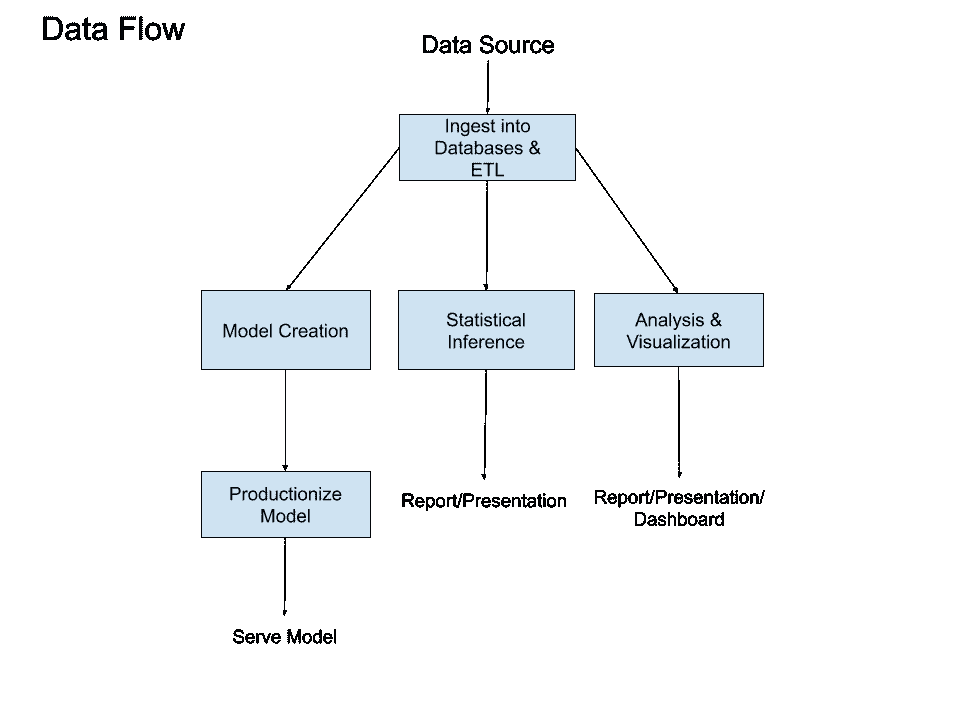
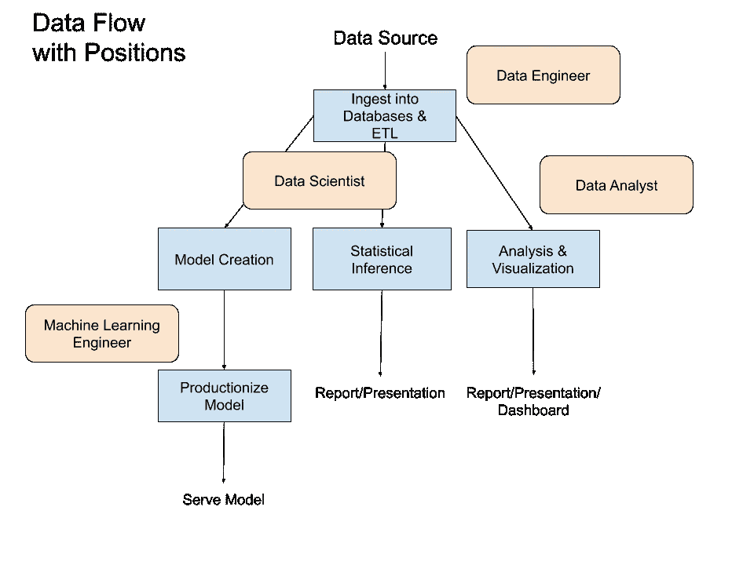
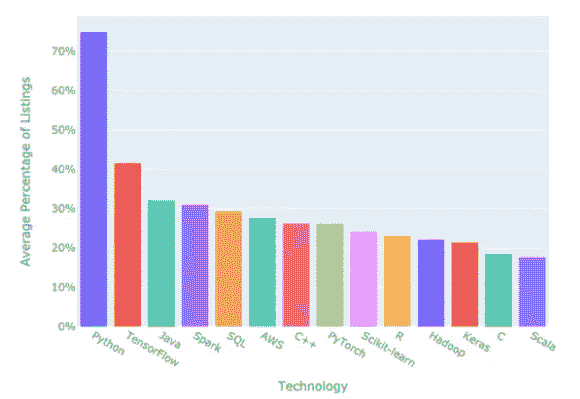
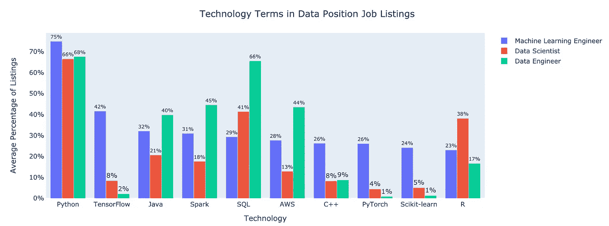
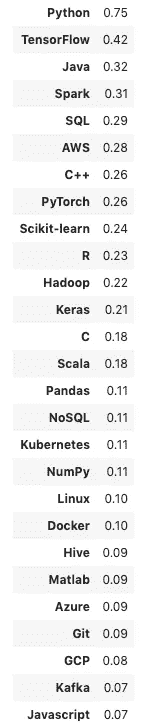

# 机器学习工程师最需要的技术技能

> 原文：<https://towardsdatascience.com/the-most-in-demand-tech-skills-for-machine-learning-engineers-7498754887d4?source=collection_archive---------18----------------------->

## 机器学习工程师和数据科学家、数据工程师有什么不同？

在这篇文章中，你会看到新的研究显示了机器学习工程师工作清单中最受欢迎的技术术语。📊

我们将探索机器学习工程师如何适应组织中的数据流。最后，我将分享一个机器学习工程师技能的建议学习路径。

资料来源:pixabay.com

机器学习工程师是一个听起来很时髦的职位，这个职位的人报酬很高。根据一份[分析](https://www.linkedin.com/pulse/machine-learning-engineer-data-scientist-top-emerging-gregory/)，这是 2012 年至 2017 年领英上最热门的新兴工作。[的确](https://www.indeed.com/career/machine-learning-engineer/salaries)报道称，截至 2020 年 6 月 26 日，美国机器学习工程师的平均工资为 140536 美元。不算太寒酸。😀

让我们看看机器学习工程师如何适应组织内的数据流。

# 组织中的数据流

这是数据如何在组织中流动的示意图。

由杰夫·黑尔创作

数据被生成、接收并存储在数据库中。可以通过 ETL 修改数据，使其更加可用，ETL 代表*提取、转换、*和*加载*。

然后，这些数据可以用来制作机器学习模型，进行推理，并创建分析。

如果数据用于机器学习模型，那么这些模型可能会通过网站或 API 提供给世界。那是左边的小路。📱

或者，如果数据是为了建立因果关系而获得的(通常是通过实验),那么可以进行统计分析并共享。🔬

最后，如果数据用于事后分析以收集见解，它可能会被输入到报告或演示文稿中。🖥

让我们将经常伴随数据流的角色添加到图表中。

# 数据角色

由杰夫·黑尔创作

橙色框代表做数据工作的人。😀

*   **数据工程师**负责制作数据管道。他们创建系统来接收、存储数据，并将其转换为可供数据科学家和数据分析师使用的形式。💻
*   **数据科学家**创建机器学习模型来帮助驱动决策和创建预测工具。他们也可能做实验和统计推断来得出因果结论。这第二个角色更多的是传统的统计学家的角色。🧪
*   **数据分析师**在现有数据中发现见解，并与利益相关方分享这些信息。📊
*   **机器学习工程师**采用数据科学家创建的概念验证机器学习模型，并将它们转化为可扩展、优化、可服务的模型，供 API 和应用程序使用。👩‍💻

角色之间经常有很多重叠。🙂

请注意，数据科学家可能更专注于机器学习或统计推断。这种区分类似于迈克尔·霍克斯特的[对 A 型和 B 型数据科学家的区分。A 型数据科学家做更多的静态、统计推断和分析，B 型数据科学家做更多的机器学习系统构建和软件工程。参见](https://www.quora.com/What-is-data-science/answer/Michael-Hochster) [Robert Chang](https://medium.com/u/c00b242128fe?source=post_page-----7498754887d4--------------------------------) 的优秀[文章](https://medium.com/@rchang/my-two-year-journey-as-a-data-scientist-at-twitter-f0c13298aee6)进行讨论。

在小型组织中，数据科学家可能是多面手，扮演上图中所示的所有角色。如果组织是年轻的，首先需要的是让数据管道成形。然后是核心指标的分析、报告和仪表板，以推动业务决策。因此，数据工程师和数据分析师通常是早期雇员。

随着组织的数据和数据能力的增长，机器学习工程师通常会在稍后添加。如果机器学习是一个组织的核心竞争力，你会很快看到更多的机器学习工程师。👍

我们在这篇文章中的重点是机器学习工程师，所以让我们深入了解他们做什么。

资料来源:pixabay.com

# 机器学习工程师技能

机器学习工程师的工作与数据科学家或数据工程师的工作有什么不同？

⭐️机器学习工程师采用科学家创建的显示预测前景的模型数据，将它们转化为在生产中表现良好的代码。⭐️

机器学习工程师需要编写代码来:

*   预测准确
*   生产准备好了吗，容易理解吗
*   运行速度快，内存效率高
*   对道德因素敏感

第一点需要了解如何评估机器学习模型的性能。机器学习工程师需要调整模型并测试不同的架构来提高性能。正如你马上会看到的，许多雇主正在寻找具有深度学习框架的技能。

机器学习工程师为生产编写代码，因此他们需要实践良好的软件开发实践。他们需要熟悉版本控制，遵循通用的代码风格规则，并且很好地记录代码。他们可能会处理持续集成、测试和容器化。他们甚至可能处理用于部署的容器编排——正如您稍后将看到的，Kubernetes 和 Docker 出现在相当多的工作描述中。

生产代码需要快速高效，所以机器学习工程师应该有计算机科学和大数据原理的基础。有很多方法可以提高代码效率和性能。我已经起草了一个关于这个主题的粗略大纲，所以[跟我来](https://twitter.com/discdiver)以确保你不会错过完成的指南。😀

最后，机器学习工程师需要了解他们的模型可能会如何对人产生负面影响。查看凯茜·奥尼尔的[数学毁灭武器](https://www.goodreads.com/book/show/28186015-weapons-of-math-destruction)的介绍。机器学习工程师的权力很大，俗话说:权力大责任大。🕷

现在让我们看看在机器学习工程师工作清单中找到的具体技术。

# 方法

我从[搜集信息，简单雇佣了](https://www.simplyhired.com/)和[怪物](https://www.monster.com/)，看看在美国的工作列表中哪些关键词出现了“机器学习工程师”。我在分析中使用了[请求](https://requests.readthedocs.io/en/master/)、[美汤](https://www.crummy.com/software/BeautifulSoup/bs4/doc/)、[熊猫](https://pandas.pydata.org/)和 [Plotly](https://plotly.com/) Python 库。

我使用了从我对[数据科学家](/the-most-in-demand-tech-skills-for-data-scientists-d716d10c191d)、[数据工程师](/most-in-demand-tech-skills-for-data-engineers-58f4c1ca25ab)和[数据分析师](/most-in-demand-tech-skills-for-data-analysts-26d4ea4450f8)工作列表的分析中收集的技术关键词。实际上没有包括在内，因为它偶尔不返回常见术语的信息，并且对于没有关键字的基线情况，它有时返回非常不同的计数。LinkedIn 没有被搜索到，因为它之前在抓取了它的网站后将我锁定在我的账户之外。☹️

对于 Monster 和 SimplyHired，我计算了每个关键词出现在总机器学习工程师列表中的百分比。然后我平均每个关键词的百分比。

# 结果

这是 2020 年 7 月 1 日出现在至少 15%的工作列表中的技术术语。

让我们开始吧！😀

大多数雇主都在寻找拥有 [Python](https://www.python.org/) 技能的机器学习工程师。Python 在四分之三的工作列表中都能找到！🐍

[TensorFlow](https://www.tensorflow.org/) 是第二常见的技术，出现在超过 40%的所有机器学习工程师列表中。TensorFlow 是一个开源的深度学习框架。

让我们看看其他频繁出现的深度学习框架。

Keras 在 20%的列表中。Keras 是 TensorFlow 的高级 API，现在与 TensorFlow 2.0 紧密集成。两者都主要是由谷歌开发的。

另一个主要的深度学习框架 PyTorch 出现在超过四分之一的列表中。它比 TensorFlow 年轻，但使用量一直在增长。看我这篇探索 PyTorch 和 TensorFlow 流行度的文章[这里](/is-pytorch-catching-tensorflow-ca88f9128304)。

Java 出现在近三分之一的列表中。Java 是最常用的软件开发语言之一。然而，它不像 Python 或 r 那样被教授给数据科学。

[Apache Spark](http://spark.apache.org/) 常用于大数据应用。它支持许多编程语言，包括 Java、Python、R 和 Scala。

AWS 是机器学习工程师最常见的云提供商，在近 30%的列表中出现。这并不奇怪，因为它是占主导地位的云提供商。

## 与其他术语的比较

下面的图表比较了十个最常见的机器学习工程师术语，以及这些术语在数据科学家和数据工程列表中的常见程度。

2020 年 7 月 1 日

可以看到 Python 对于这三个职位都是相当受欢迎的。让我们来看看几项存在巨大差异的技术。

数据工程师列表中包含 SQL 可能性是机器学习工程师列表的两倍多。数据科学家列表中也更有可能包含 SQL。这是有意义的，因为机器学习工程师更加关注组织数据管道中更下游的数据。

[C++](https://isocpp.org/) 出现在近四分之一的机器学习工程师列表中。这是数据科学家和数据工程师列表中的三倍多！机器学习工程师经常需要为快速训练和推理进行优化，像 C++这样的低级语言可以加快速度。🚀

[Scikit-learn](https://scikit-learn.org/) 在机器学习工程师列表中比在数据科学家或数据工程师列表中被提及的频率高得多。我很惊讶它没有更多地出现在数据科学家列表中。🤔

R 在机器学习工程师列表中比在数据科学家工作列表中更不常见。然而，它比数据工程师列表中更常见。r 通常用于 A 类数据科学/统计领域，尤其是在学术界。在机器学习产品中就少多了。

值得一提的是，在 2020 年栈溢出开发者调查[中，Java、C++和 R 都被更多的人列为*害怕的*，而不是*喜欢的*。](https://insights.stackoverflow.com/survey/2020#technology-most-loved-dreaded-and-wanted-languages-loved)

这里有一个扩展的技术列表，平均至少出现在 5%的列表中。

# 建议

如果你想成为一名机器学习工程师，你将需要强大的软件开发和机器学习技能，以及多项技术的能力。你当然不需要学习使用上面列出的所有技术，但是如果你的最终目标是成为一名机器学习工程师，我建议你学习一些。

首先，现实一点:如果你正在从一个完全不相关的领域过渡，不要指望你会直接跳到一个机器学习工程师的角色。它发生了，但是我的感觉是它是罕见的。

在进入机器学习工程师的工作之前，你通常需要有相邻职位的经验。这些职位通常需要在计算机科学、数学或所谓的硬科学方面有很强的学术背景。相当多的机器学习工程师拥有硕士学位或博士学位。🎓

如果你想成为一名机器学习工程师，确保你了解 Python。这是机器学习的通用语言。如果你是 Python 的新手，我可以推荐我的[难忘的 Python](https://memorablepython.com/) 书吗？😉

然后学习机器学习库 [NumPy](https://numpy.org/) 、[熊猫](https://pandas.pydata.org/)和 [scikit-learn](https://scikit-learn.org/stable/) 。这些术语都出现在相当多的工作列表中，并在很大程度上被认为是机器学习工程师的工作。如果你也想学，我有一本关于熊猫的书给你。🐼

你应该知道 Git。[凯蒂·塞勒-米勒](https://medium.com/u/c984566f6300?source=post_page-----7498754887d4--------------------------------)和[朱莉娅·埃文斯](https://medium.com/u/152f65dab15?source=post_page-----7498754887d4--------------------------------)有一本关于这个话题的有趣的书[在这里](https://gumroad.com/l/oh-shit-git)。

正如你在上面看到的，雇主通常希望有深度学习框架的经验。要入门，推荐阅读 Keras 的原作者[Fran ois Chollet](https://medium.com/u/7462d2319de7?source=post_page-----7498754887d4--------------------------------)的《深度学习与 Keras》。在 2020 年晚些时候发行之前，你可以使用[曼宁的早期访问](https://www.manning.com/books/deep-learning-with-python)程序来查看该书的更新版本。那本书会让你很好地适应 TensorFlow。

如果你想学习 PyTorch，fast.ai MOOC 是一个很好的介绍。它有很棒的视频和支持深度学习的社区。

学 SQL 是个好主意。我有一本关于 PostgreSQL 的 SQL 入门书[,目的是做一个温和的介绍。](https://memorablesql.com)

那么我建议你学习 AWS 基础知识，这样你就熟悉了最流行的云平台。 [Linux Academy](https://linuxacademy.com/) 有很棒的互动在线课程。

我建议你学习你需要的数学，因为你需要它做一个项目。脱离上下文学习数学很难。在某些时候，你可能想学习线性代数。 [3Blue1Brown](https://www.youtube.com/channel/UCYO_jab_esuFRV4b17AJtAw) 在 YouTube 上有关于这个和许多数学和机器学习主题的精彩讲解视频。

一路走来，做好自己的项目，投入生产。定期参与 [GitHub](https://github.com/) 活动，并在活动过程中回馈社区。参加 [Kaggle](https://www.kaggle.com/) 比赛。一边走一边与世界分享你的技能。🚀

这应该够你忙的了。😀

要知道的事情太多了，可能会让人不知所措，但是不要感到不知所措或气馁。一次只处理一件事，坚持，坚持，坚持。👍

记住，每个人都有自己的学习之旅——总有更多的东西要学。这使得机器学习令人兴奋。🎉

# 包装

我希望你发现这个机器学习工程师技术技能的分析和讨论是有帮助的。如果你有，请在你最喜欢的社交媒体上分享，这样其他人也可以找到它。😀

我写关于 [Python](https://memorablepython.com) 、 [SQL](https://memorablesql.com) 和[其他技术主题](https://medium.com/@jeffhale)。如果你对这些感兴趣，请注册我的[邮件列表，那里有很棒的数据科学资源](https://dataawesome.com)，点击这里阅读更多帮助你提高技能的内容。👍

资料来源:pixabay.com

机器学习快乐！🚀