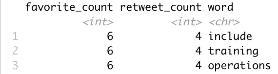

# Twitter 上最受欢迎的数据科学文章主题

> 原文：<https://towardsdatascience.com/the-most-popular-towards-data-science-article-topics-on-twitter-2ecc512dd041?source=collection_archive---------49----------------------->

## 介绍文本分析，可以增加你的文章受欢迎程度

如果您已经撰写了数据科学文章或正试图开始，找到最受欢迎的主题对让您的文章被阅读有很大帮助。下面是使用 R 和分析结果轻松确定这些主题的步骤。本文也可以作为使用 API 的介绍，并在 r 中进行一些基本的文本处理。如果您只对结果感兴趣，可以随意修改这段代码来进行其他的 Twitter 分析并跳到最后。


图片由[皮克斯拜](https://pixabay.com/?utm_source=link-attribution&amp;utm_medium=referral&amp;utm_campaign=image&amp;utm_content=1989152)的 Gerd Altmann 提供

# Twitter API

如果你没有 twitter 账户，你需要创建一个。之后前往[推特开发者](https://developer.twitter.com/en)。使用新帐户登录后，您可以选择“应用程序”菜单，然后创建应用程序。在那里填写应用程序的详细信息，在大多数情况下，除了应用程序的名称和详细信息，这可以留空。

# 安装 R 包

我们需要 3 R 软件包来完成这个项目——rtweet、tidyverse 和 tidytext。安装这些与

```
install.packages("package-name")
```

确保在脚本中使用 library()函数加载了这些包。

# 收集推文

要获取推文，我们首先需要生成一个令牌。我们可以用 rtweet 包中的 create_token()函数来实现。可以通过查看 Twitter 开发者网站上新应用页面上的信息来填充参数。所有这些变量对于安全性都很重要，所以无论何时使用 API，都要确保采取预防措施，将这些令牌和密钥保持为私有。

```
token <- create_token(app = "<app-name>",
  consumer_key = "<consumer-key>",
  consumer_secret = "<consumer-secret>",
  access_token = "<access-token>",
  access_secret = "<access-secret>")
```

现在来抓取推文！使用 get_timeline()函数来访问任何公共用户的 3200 条最近的推文，以便在一次查询中获得比这更多的内容。

```
tweets <- get_timeline("TDataScience", n=3200, token=token)
```

现在有 50 列数据和 3200 行存储在变量“tweets”中。我们主要关心的是 text、favorite_count 和 retweet_count 列，但是您也可以研究一下还需要查看什么。

# 删除不需要的短语

我们还想删除一些在这个域中常见的东西，主要是链接和 twitter 句柄。我们可以使用 gsub()函数将出现的链接和句柄替换为其他内容，在我们的例子中，我们通过用空字符串替换它们来删除它们。下面，我们使用管道操作符将文本列从一个 gsub()函数传递到下一个函数，删除 URL 和句柄，最终将它们保存在一个名为 clean_text 的新列中。

```
tweets$text %>% 
gsub("?(f|ht)(tp)(s?)(://)(.*)[.|/](.*)", "", .) %>% 
gsub("@([A-Za-z0-9_]+)", "", .) -> tweets$clean_text
```

# 删除停用词

现在我们想从 clean_text 列中删除停用词。停用词是对理解文章意思不重要的词。这些通常是一种语言中最常见的单词，但是对于某个特定的领域，您可能想要删除一些额外的单词。在我们的任务中，我们可能认为“数据”这个词无关紧要，因为几乎每篇文章都会提到数据。

标记化是将文本分割成多个部分的过程。这可以是句子、段落、单词或其他。在我们的例子中，我们将使用按单词拆分，这将获取我们的数据表，并使每个 tweet 中的每个单词在一个表中占一行。下面我选择感兴趣的列，然后对单词进行标记。

```
tweets %>% 
select(clean_text, favorite_count, retweet_count) %>%
unnest_tokens(word, clean_text)
```

这留给我们下面的表格，其中单词“include”、“training”和“operations”最初都是 clean_text 列中同一行的一部分。



现在我们继续对 tidytext 包中的 stop_words 数据集进行反连接。这将删除属于 tweets 数据集和 stop_words 数据集的所有单词(本质上，这将从您的数据中删除停用词)。这方面的代码如下。

```
tweets %>% 
select(clean_text, favorite_count, retweet_count) %>%
unnest_tokens(word, clean_text) %>%
anti_join(stop_words)
```

# 获得平均收藏和转发

使用 tidyverse 中的 groub_by()和 summarise()函数，我们可以获得数据集中每个单词的收藏和转发次数的中位数。我在这里选择使用中位数来消除一些异常值可能对我们的数据产生的影响。

```
tweets %>% 
select(clean_text, favorite_count, retweet_count) %>%
unnest_tokens(word, clean_text) %>%
anti_join(stop_words) %>%
group_by(word) %>% 
summarise("Median Favorites" = median(favorite_count), 
  "Median Retweets" = median(retweet_count),
  "Count" =  n())
```

# 过滤结果

我们希望看到有最多人喜欢/转发的单词来通知我们应该写些什么。但是让我们考虑一个单词只使用一次的情况。例如，如果有一篇关于数据科学应用于密歇根地理的非常受欢迎的文章，我们不希望这使我们偏向于写关于密歇根的文章。为了解决这个问题，我用 filter()函数过滤掉至少 4 条 tweets 中没有使用的所有单词，然后用 arrange()函数对结果进行排序。留给我们最后一点代码。

```
tweets %>% 
select(clean_text, favorite_count, retweet_count) %>%
unnest_tokens(word, clean_text) %>%
anti_join(stop_words) %>%
group_by(word) %>% 
summarise("Median Favorites" = median(favorite_count),
  "Median Retweets" = median(retweet_count), 
  "Count" =  n()) %>%
arrange(desc(`Median Favorites`)) %>%
filter(`Count` > 4)
```

# 决赛成绩

因此，如果您想跳到最后看看结果如何，或者不想自己运行这段代码，下面是结果。这些是《走向数据科学》中的常用词，根据包含该词的推文通常获得的喜爱程度进行排名。

1.  网站— 84.5 收藏夹
2.  金融——72 个最爱
3.  动作— 66 个收藏夹
4.  matplotlib — 59.5 收藏夹
5.  绘图— 57 个收藏夹
6.  漂亮— 55.5 个最爱
7.  作品集— 51 个最爱
8.  探索— 47 个最爱
9.  github — 46.5 收藏夹
10.  综合— 46 个收藏夹

注意:我不得不删除“詹姆斯”这个词，因为显然有一个作者非常喜欢这个名字。恭喜你，詹姆斯！

我现在的建议是写一篇题为“用 Matplotlib 创建漂亮的财务图的综合指南”之类的文章。现在，你可以对任何其他拥有公共账户的 twitter 用户重复这个过程。