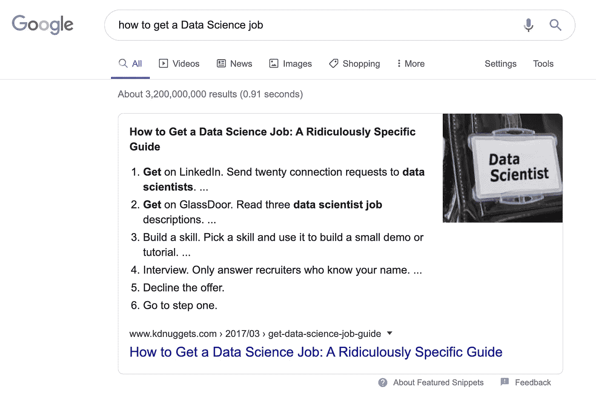
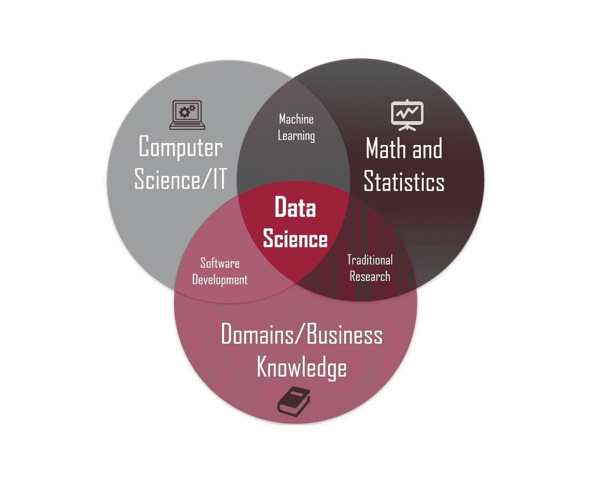
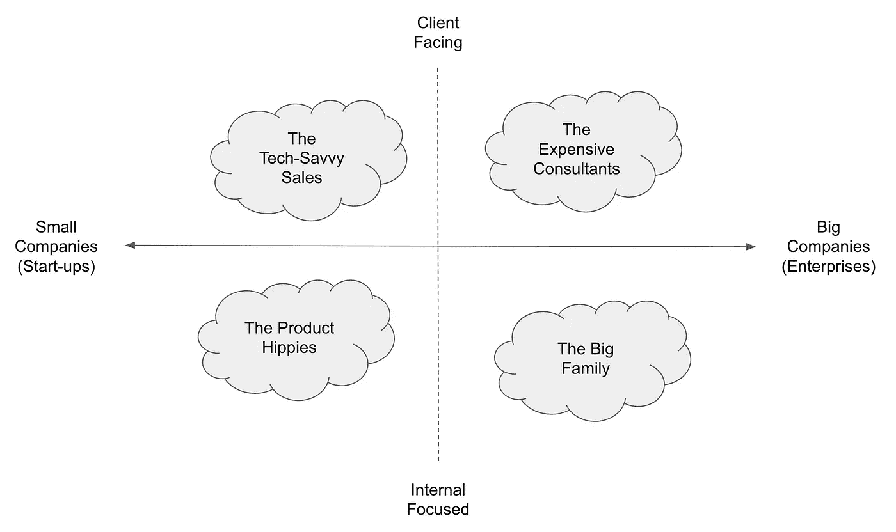
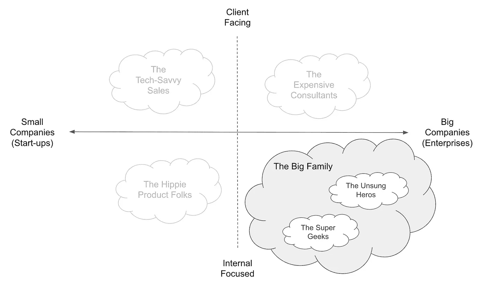

# 我们应该留在数据科学领域吗？

> 原文：<https://towardsdatascience.com/the-most-realistic-data-science-career-guide-d12c4af87cc8?source=collection_archive---------10----------------------->

## [办公时间](https://towardsdatascience.com/tagged/office-hours)

## 数据科学家的 4 个现实职业选择

由[凯勒·琼斯](https://unsplash.com/@gcalebjones?utm_source=unsplash&utm_medium=referral&utm_content=creditCopyText)在 [Unsplash](https://unsplash.com/s/photos/path?utm_source=unsplash&utm_medium=referral&utm_content=creditCopyText) 上拍摄的照片

**TL；“数据科学”成为主流已经快 10 年了。我们很少问如何进入数据科学，而是想知道“我应该留下吗？”以及“下一步是什么？”在这篇文章中，我分享了一些关于一些重要但实用的选项的见解——数据科学家的 4 个原型——以及它们的陷阱(对有抱负的数据科学家也很有用)。最后，你可以在最后找到一个现场调查，看看社区的发展方向。**

***2020 年 5 月 4 日更新:*** *我收录了一篇讨论调查结果的文章的链接。请在调查部分找到链接。*

如果你的职位受到新冠肺炎的影响，并且你在加拿大工作或准备移居加拿大，加入这个开放的 [**人才帮助列表**](https://docs.google.com/spreadsheets/u/0/d/11vWvewH0vug9ux9A1pS1wXZwmrJnb7NHEmzO26hknP0/htmlview) 寻找技术领域的潜在机会。注意安全，我们会很快度过难关的。

*免责声明:本帖未经认可或赞助。我交替使用术语数据科学和 ML。*

***喜欢读什么？*** *跟我上* [*中*](https://medium.com/@ianxiao)*[*LinkedIn*](https://www.linkedin.com/in/ianxiao/)*[*Twitter*](https://twitter.com/ian_xxiao)*。查看我的“* [*”影响与机器学习*](https://www.bizanalyticsbootcamp.com/influence-with-ml-digital) *”指南。它有助于数据科学家更好地交流。***

# **2020 年 2 月 27 日**

**大约在多伦多因为新冠肺炎而被封锁的三周前，我和一个朋友坐在多伦多市中心我们最喜欢的泰国餐馆里。**

****“我应该留在数据科学吗？如果没有，接下来该怎么办？”**朋友问。**

**就像聚会的声音和新鲜餐馆食物的味道一样，如何进入数据科学的问题现在似乎有点遥远。事实上，你可以在谷歌上找到约 30 亿条搜索结果，其中有一条*极其具体的分步指南*(只有约 20 亿条关于“如何赚钱”)。**

****

**截至 2020 年 3 月 25 日的谷歌搜索**

**然而，我朋友的问题挥之不去。在内心深处，这种紧张是由两个因素驱动的:1)数据科学的期望与现实— [它可能比我们预期的更无聊](/data-science-is-boring-1d43473e353e)，以及 2)角色与我们的期望。**

**那么，有什么选择呢？**

1.  **保持同样的角色，将挫败感内化(你可以跳过这篇文章，但**请** **在点击关闭前分享**🙂)**
2.  **离开目前的职位，但继续在其他地方做数据科学相关的工作(这篇文章是为你写的)**
3.  **够了。我完全做完了(你确定吗？在此之前，请考虑选项 2)**

# **但是，去哪里呢？**

**要知道我们想去哪里，你必须知道我们在哪里。为了更好地了解替代方案，我们许多人可能会问“什么是数据科学？”如果你在谷歌上搜索这个短语，我们可能会看到这样的内容:**

****

**什么是数据科学，[图片来源](https://medium.com/@iphs_tech/believing-these-8-myths-about-what-is-data-science-keeps-you-from-growing-528f1bd240dc)**

**这种分类是有道理的，但它并没有真正抓住 ***日常工作*** *和* ***公司性质的现实和细微差别。*** 这两个因素可以说是我们做职业决策时最重要的。**

**有一种更好的方式来思考这个问题。所以，让我向你展示数据科学家的**原型**。**

# **请稍等…**

**在我们开始之前，重要的是考虑我的[背景和旅程](https://www.linkedin.com/in/ianxiao/)，这样你可以根据你自己的现实和限制来翻译我的见解。**

**简而言之**，**我见证了数据科学的演变，为大型企业提供咨询，与许多类型的数据科学家成为朋友，并在一家最终被收购的人工智能初创公司构建 ML 产品。**

**我的观点只是一个数据点(希望这是一个有用且独特的数据点)，所以请留意其他人的观点。希望最后的调查能有所帮助。**

# **选项:数据科学家的原型**

**那么，什么是数据科学？这取决于公司的**规模**(企业或初创企业)和角色的**主要职责**(面向客户或专注内部)。**

**当你面试一个数据科学职位时，尽管有头衔和工作描述，但很有可能*归入以下四个过于简单且带有主观标签的类别之一。***

****

**数据科学家的四种原型。作者的分析**

****你怎么能使用这个？**原型向你展示了可能性。它让你看到你现在在哪里，以及眼前的选择是什么。对于有抱负的数据科学家来说，你可以用这个来计算你的最佳起点。**

**接下来，你可能会问:**我怎么知道新角色是否更适合我？****

**为了帮助你决定，这里有一些每个角色的优点和缺点。此外，我将讨论最适合的人才概况。当然，这些有点主观:对我好的可能对你不好。总有例外。所以你自己做判断吧。**

***注:***

1.  ***您还可以根据公司的其他方面进行分类，例如行业和产品类型(例如，与数据科学相关的服务或工具、非数据科学产品)。我认为公司的规模对日常工作的影响更大。***
2.  ***公司规模不是二元的，有许多中型公司；为了简单起见，我将其二进制化。***
3.  **在初创企业，面向客户和内部员工之间的墙并不真正存在；人们倾向于两者兼顾。只是时间分配的问题。**

## ****1 —昂贵的顾问****

**全球咨询公司的数据科学服务或大型技术公司的专业服务部门(如德勤、麦肯锡、埃森哲、谷歌、IBM 等)。)**

**[吉菲](https://media.giphy.com/media/l3V0B6ICVWbg8Xi5q/giphy.gif)**

***:非常好的解决问题和高效工作的培训。做非常“重要”的事情，因为客户为结果支付高额费用。每个项目都可以不同，以防你感到无聊或沮丧。非常明确的晋升途径和要求(例如，从分析师、经理到合作伙伴)。接触高级管理人员，早期职业生涯中的广泛话题，以及许多雄心勃勃的人。***

****:商业价值压倒一切(例如科学创新和酷算法)。要求所有资历的工作时间。一些公司可能不会考虑传统合作伙伴轨道的数据科学家(你可能会觉得被边缘化，但不要担心，大多数人都非常尊重)。很多阿尔法人格。****

****:受过一些技术培训、渴望在大公司里经营自己的“小生意”的商务型人士。刚刚起步、正在寻找导师、想要学习最好的行话并且不介意非常努力的学生。****

## *****2 —精通技术的销售人员*****

***在专注于人工智能的初创公司或中型公司担任技术销售或项目领导角色(例如， [Dessa](https://www.dessa.com/) 、 [Element AI](https://www.elementai.com/) 、 [H2O](https://www.h2o.ai/) 、 [Cloudera](https://www.cloudera.com/about/services-and-support/professional-services.html) 、 [Palantir](https://www.palantir.com/) )。***

***[GIPHY](https://media.giphy.com/media/3jzoNumaV4o80/giphy.gif)***

****:你可以从事一些前沿的用例，因为客户通常期待你的创新，而不是交付(乏味的)长期、大规模的转型项目。在重要的战略和产品决策上有更大的发言权。保持敏捷和创新。****

****不好的一面:一些客户可能不信任你的大项目(例如获得更多预算)，这是“灵活创新”的另一面可能需要做大量的“免费”工作来赢得客户的信任。与大公司相比，后台支持较少。产品愿景可能会受到投资者(如果你有错误的风投)或沉没成本心态的影响，而不是真正的市场需求。****

****:希望在早期阶段与公司一起成长，实现创业梦想，并且已经拥有坚实的商业网络、领域专长和/或声誉的人。不适合新手，因为你需要立即行动。****

## *****3 —产品嬉皮士*****

***具有软件和/或 ML 背景的人，他们与工程人员一起在人工智能产品公司建立 IP、演示和支持销售电话。***

***[吉菲](https://media.giphy.com/media/6Y39ycr8vG9qM/giphy.gif)***

****:致力于有趣和实际的问题，而不必处理太多的客户政治。短期项目。作为“内部用户”来影响或定义产品应该如何设计为客户或内部人员制作酷的东西。****

****:可能会被拉进一个面向客户或用户的角色，这会在竞争优先权和时间管理上造成紧张。很难在“前沿”和“立即实用”之间找到正确的平衡可能会陷入无休止的客户支持工作中。****

****:以产品为导向、以工程为中心，但有时又很粗鲁的人。经验丰富的专业人士，拥有特定技术堆栈或工作流领域的专业知识。具有开放和好奇心的学生，喜欢技术挑战，并能完成任务。****

## *****4——大家庭*****

***好吧，家庭可能很复杂，所以这个群体需要分成两部分:**无名英雄** **和**超级极客**。*****

******

***家庭结构。作者的分析***

## ***4.1 — **无名英雄*****

***来自企业内传统 BI、分析和建模团队的人员。他们大多与业务线或职能部门合作(例如营销、风险、财务等)。)在数据科学家这个术语被创造出来之前，他们就是数据科学家。***

***[吉菲](https://media.giphy.com/media/3ohuAxV0DfcLTxVh6w/giphy.gif)***

******好的*** :工作非常专注。接近真实的商业运作。可以访问独特的数据集。能够使用可运行的大规模基础设施。很好的工作生活平衡。对投资决策有影响力或权力。***

*****坏消息*** :事情在(大多数)时候会变得缓慢而乏味。通常不被认为拥有 21 世纪最性感的工作。内部政治。缓慢的职业轨迹。被某些角色或项目所束缚。**

***:在生活中找到激情或喜欢在特定领域投入时间的人。不在乎炒作的人。有很多耐心和韧性的人。***

## ***4.2 —超级极客***

***数据科学中“金童”的刻板印象。在 R&D 大公司工作的人，比如谷歌大脑/ DeepMind，脸书博览会，优步，沃尔玛研究等等。***

***[吉菲](https://media.giphy.com/media/KZkleQKfRrwiQJrLYp/giphy.gif)***

****:从事非常理智的话题。能够接触到独特的数据集和问题。能够利用大公司的资源挑战极限。获得很多认可和赞扬。****

****:因不得不展示“商业价值”而产生的强烈紧张感。业务优先级可以限制或影响研究主题。如果研究证明了价值，可能会陷入“无聊”的实现中。****

******最适合*** :学院派。对学术研究和教育背景非常感兴趣的工程师。希望发表文章并接触一些行业的研究生。***

# **下一步是什么**

**现在你已经很好地掌握了什么是可能的，问自己这些问题:**

*   **我现在在哪里？我为什么会沮丧？**
*   **在我的数据科学职业生涯(或总体生活)中，我真正想要的是什么？**
*   **目的地是否提供了可感知的缓解和好处？(希望本文能提供一些见解)**
*   **我有哪些可行的选择？**
*   **我如何以最少的努力和最好的结果到达那里？**

**在下一篇文章中，我将分享一些常见的和非常规的路径及其挑战。敬请关注我的 [*中*](https://medium.com/@ianxiao) *、*[*LinkedIn*](https://www.linkedin.com/in/ianxiao/)*，或*[*Twitter*](https://twitter.com/ian_xxiao)*。***

# **现场调查**

**这里有两个调查，希望了解我们的现状和我们想要达到的目标。所有数据都是匿名收集的。这*不是*用于任何商业目的，而是为了满足社区的好奇心。**

**这里有一篇文章讨论了这次调查的结果。**

** [## 越线

### 数据科学家最受欢迎的过渡路线

towardsdatascience.com](/the-best-data-science-transition-routes-e809254934d0)** 

*****喜欢读什么？*** *跟我上* [*中*](https://medium.com/@ianxiao)*[*LinkedIn*](https://www.linkedin.com/in/ianxiao/)*，或者*[*Twitter*](https://twitter.com/ian_xxiao)*。还有，作为一名数据科学家，要不要学习商业思维和沟通技巧？查看我的“* [*”影响与机器学习*](https://www.bizanalyticsbootcamp.com/influence-with-ml-digital) *”指南。****

# **以下是我的一些文章，你可能会喜欢:**

** [## 最有用的 ML 工具 2020

### 每个懒惰的全栈数据科学家都应该使用的 5 套工具

towardsdatascience.com](/the-most-useful-ml-tools-2020-e41b54061c58)  [## 被遗忘的算法

### 用 Streamlit 探索蒙特卡罗模拟

towardsdatascience.com](/how-to-design-monte-carlo-simulation-138e9214910a)  [## 数据科学很无聊

### 我如何应对部署机器学习的无聊日子

towardsdatascience.com](/data-science-is-boring-1d43473e353e)  [## 12 小时 ML 挑战

### 如何使用 Streamlit 和 DevOps 工具构建和部署 ML 应用程序

towardsdatascience.com](/build-full-stack-ml-12-hours-50c310fedd51)  [## ML 和敏捷注定的联姻

### 如何不对 ML 项目应用敏捷

towardsdatascience.com](/a-doomed-marriage-of-ml-and-agile-b91b95b37e35)  [## 无用的机器学习

### 通过解决信任时刻来设计有用的 ML

towardsdatascience.com](/useless-machine-learning-momemts-of-trust-54c5a6c5f701)**