# 数据科学中最被低估的工具:NumPy

> 原文：<https://towardsdatascience.com/the-most-underrated-tool-in-data-science-numpy-68d8fcbde524?source=collection_archive---------19----------------------->

## NumPy 的强大功能以及如何有效地使用它

数据科学的一切都始于数据，数据有多种格式。数字、图像、文本、x 光、声音和视频记录只是数据源的一些例子。无论数据以何种格式传入，都需要转换成数字数组进行分析。复杂的计算机视觉模型无法像人类一样看到或处理图像。在分析之前，图像被转换成一组数字。因此，在数据科学中有效地存储和修改数字数组是至关重要的。NumPy(数字 Python)是一个科学计算包，它提供了非常实用的方法来创建和操作数字数组。所以我们对 numpy 的了解绝对要多于“把 NumPy 当 np 导入”。

[图来源](https://www.123rf.com/photo_2947926_zeros-and-ones-binary-code-background-.html)

Python 列表处理混合数据类型。例如，我们可以创建一个包含整数、浮点数、字符串和布尔值的列表。但是，NumPy 数组的所有元素必须属于同一类型。这听起来好像列表比 NumPy 数组更受欢迎，NumPy 数组对于小型列表可能是正确的。然而，我们几乎总是在现实生活的数据集中处理非常大的数字数组。就存储和处理而言，NumPy 数组比列表有效得多。

值得注意的是，最常用的数据分析工具**熊猫**是建立在 **NumPy** 之上的。

在这篇文章中，我将通过例子介绍 NumPy 数组的基础知识。

# **创建 NumPy 数组**

我们可以从 python 列表创建一个数组:

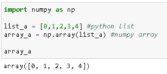

可以使用 **dtype** 明确选择数据类型:

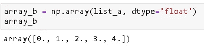

我们还可以使用嵌套列表创建更高维的数组:

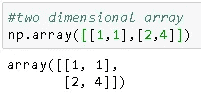

NumPy 有内置函数来从头开始创建数组，这样我们就不需要传入值了。**0**和**1**函数分别创建充满 0 和 1 的数组。 **full** 功能允许选择要填充到数组中的值。我们只需要传入维度:

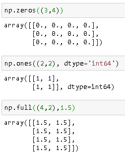

我们也可以使用**arrange**函数在特定范围内创建一个具有特定增量的数组:

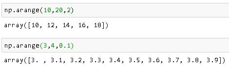

前两个参数指定范围，第三个参数是增量的大小。请注意，上限值不包含在内。

在一个范围内创建数组的另一种方法是 **linspace** 函数。在 linspace 函数中，我们需要在指定的范围内选择我们想要多少个值(不是增量的大小):

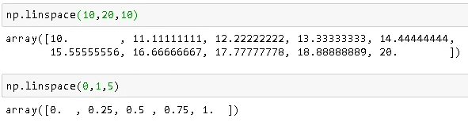

这些值是等距的，下限和上限都包括在内。记住上限不包括**范围**功能。

我们有时需要随机数据集进行实践或实验分析。NumPy 的 **random** 函数用随机数创建数组:

*   random.random 创建 0 到 1 之间均匀分布的随机值。
*   random.normal 的自变量依次为均值、标准差和极差。
*   random.randint 创建指定范围内具有指定维数的整数数组。

我们在上面的例子中创建了数组，所以我们知道它们的属性。我们不会总是事先知道这些特性。NumPy 提供了 **ndim** 、 **size** 和 **shape** 方法来了解数组:

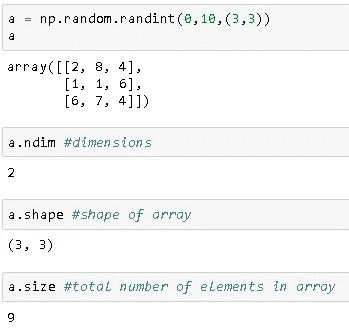

# **访问数组元素**

访问单个元素或数组片段类似于 Python 列表的相同操作:

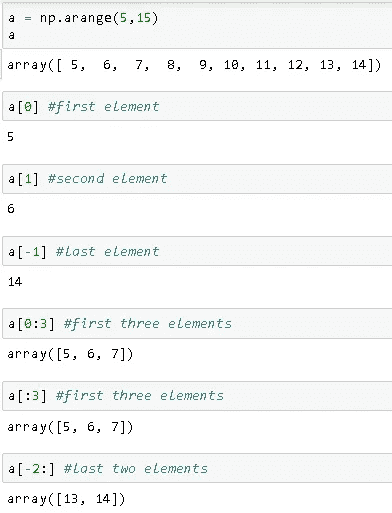

第一个元素的索引是 0。如果从末尾开始，第一个元素的索引是-1，第二个元素是-2，以此类推。要访问数组的一部分，我们需要指定上限和下限，中间用冒号隔开。如果不指定下限(即[:3])，就从头开始。同样，如果没有指定上限，上限就是数组的结尾。请注意，指定的范围上限是唯一的。

选择一个范围内的单个元素或所有元素不是唯一的选项。在某些情况下，我们可能需要访问每第二个或第三个元素。此任务的语法是[开始:结束:步骤]。通过示例，这一点变得更加清楚:

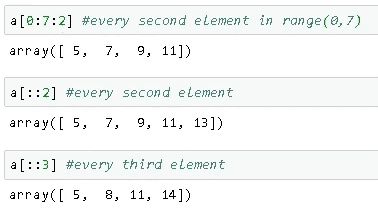

如果未指定下限值和上限值，数组的开始和结束将作为下限值和上限值。

要访问多维数组的元素，可以使用逗号分隔索引或嵌套索引:

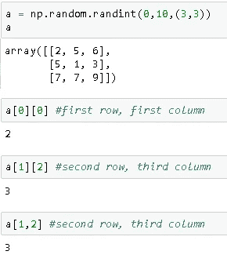

# **对数组的操作**

数组是可变的，所以我们可以改变数组中元素的值:

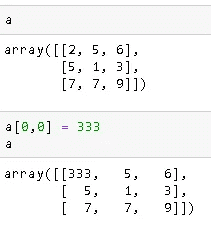

我们可以使用**整形**功能改变数组的尺寸:

算术运算可以作为矢量化运算在数组上进行。

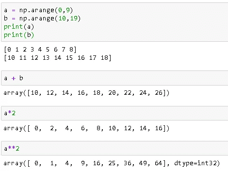

NumPy 还提供了数学函数，用作矢量化运算。这些功能也被称为 **ufuncs** (通用功能)。

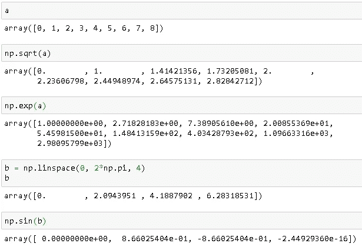

NumPy 中还有许多其他的 ufuncs。你可以随时查看 NumPy 官网上的[文档](https://numpy.org/devdocs/)了解更多详情。

***注:*** *向量化运算的优势在于执行速度。我在这里展示的例子包括小数组。然而，在实际项目中，我们需要对非常大的数字数组(即 100 万个元素)进行操作，这对速度至关重要。*

我已经介绍了一些基础知识，但是 NumPy 提供了更多的东西，我计划在第二篇关于 NumPy 的文章中介绍。您可以随时访问官方[网站](https://numpy.org/)获取更详细的信息。

感谢您的阅读。如果您有任何反馈，请告诉我。

# **我的其他帖子**

**数据分析**

*   [使用熊猫组合数据帧](/combining-dataframes-using-pandas-b9e2e83b9869)
*   [用熊猫处理缺失值](/handling-missing-values-with-pandas-b876bf6f008f)

**机器学习算法**

*   [朴素贝叶斯分类器—解释](/naive-bayes-classifier-explained-50f9723571ed)
*   [逻辑回归—已解释](/logistic-regression-explained-593e9ddb7c6c)
*   [支持向量机——解释](/support-vector-machine-explained-8d75fe8738fd)
*   [决策树和随机森林—解释](/decision-tree-and-random-forest-explained-8d20ddabc9dd)
*   [梯度提升决策树——解释](/gradient-boosted-decision-trees-explained-9259bd8205af)

# **参考文献**

*   [https://numpy.org/](https://numpy.org/)
*   [https://jakevdp.github.io/PythonDataScienceHandbook/](https://jakevdp.github.io/PythonDataScienceHandbook/)