# 数据科学中最常用的概率分布

> 原文：<https://towardsdatascience.com/the-most-used-probability-distributions-in-data-science-5b3c11d34bfe?source=collection_archive---------30----------------------->

## 统计学和概率是数据科学家箭袋中最好的箭。让我们看看一些常用的概率分布

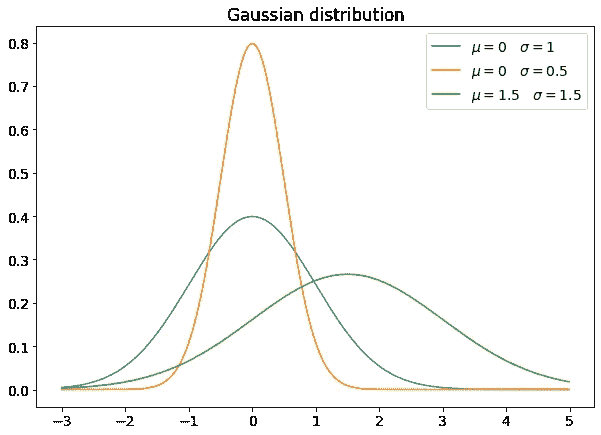

统计学是数据科学家简历中的必备技能，因此如果有人想使用数据和机器学习模型，就必须提前了解一些概念和主题。

概率分布是必备工具。让我们来看看数据科学家应该知道的最重要的几条。

# 均匀分布

最简单的概率分布是均匀分布，它赋予一个集合中的任意点相同的概率。

在其连续形式中， *a* 和 *b* 之间的均匀分布具有这样的密度函数:

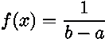

这是它是如何出现的。

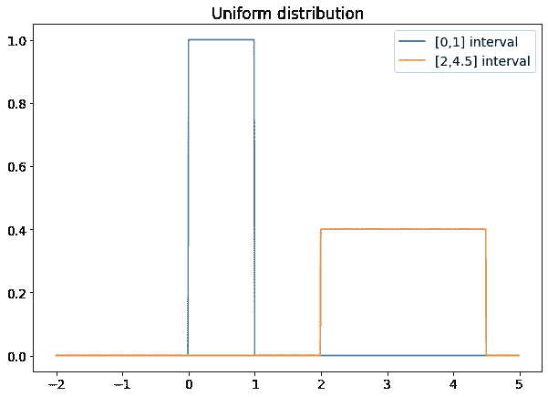

如你所见，范围越大，分布越低。这对于保持面积等于 1 是必要的。

均匀分布无处不在。任何蒙特卡罗模拟都是从生成均匀分布的伪随机数开始的。例如，在计算置信区间的自举技术中使用均匀分布。这是一个非常简单的分布，你会经常发现它。

# 正态分布

所有发行版中的女王，也可能是最著名的。如果你有一些有限方差的随机和独立变量，它们和的概率分布收敛于高斯分布。

这是概率密度函数:

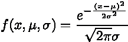

μ和σ是分布的平均值和标准差。平均值是峰值位置，而标准差与宽度有关。标准差越高，分布越大(峰越低，以保持面积等于 1)。

高斯分布的一个特殊情况是正态分布，其均值等于 0，标准差等于 1。

每个使用最小二乘法的回归模型都假设残差是正态分布的，因此了解我们的数据是否是正态分布的非常重要。用于比较两个数据集中模型残差方差的 *F* 测试假设残差呈正态分布。如果你从事数据科学工作，你和高斯分布将很快成为最好的朋友。

# 学生 t 分布

一个非常特殊的分布是学生的 t 分布，其概率密度函数为:

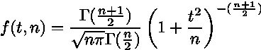

自由参数 *n* 称为“自由度”(通常缩写为 d.o.f .)。很容易看出，对于较高的 *n* 值，t 分布更接近正态分布。

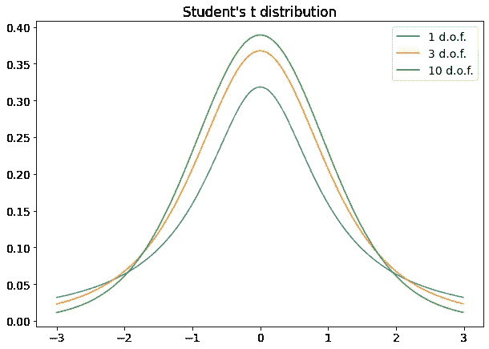

如果您必须比较不同样本的平均值或样本的平均值与总体的平均值，并且如果样本取自高斯分布，您通常会使用学生 t 检验，这是一种使用学生 t 分布进行的假设检验。也可以使用学生的 t 检验来检查两个变量之间的线性相关性。因此，在未来的数据科学家职业生涯中，您很可能会需要这种分布。

# 卡方分布

如果你取一些正态分布且独立的随机变量，取它们的平方值并求和，你得到一个卡方变量，它的概率密度函数是:

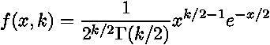

*k* 是自由度的个数。它通常等于您求和的正态变量的平方数，但有时如果这些变量之间存在某种关系，它会减少(例如，曲线拟合问题中的模型参数数)。

以下是这种分布的一些例子。

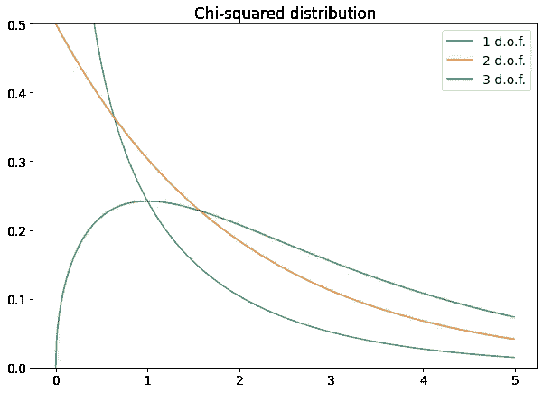

您将在皮尔逊卡方检验中使用卡方分布，该检验在某些假设下将实验直方图与理论分布进行比较。卡方分布与方差相等的 *F* 测试相关，因为 *F* 分布是作为两个卡方变量之间比率的概率分布计算的。

# 对数正态分布

如果取一个高斯变量并对其取指数，则得到对数正态分布，其概率密度函数为:

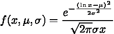

μ和σ与原始高斯分布相同。

以下是一些例子:

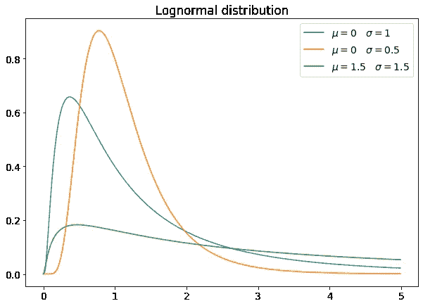

对数正态分布在自然界中被广泛测量。血压遵循对数正态分布、城市规模等等。一个非常有趣的应用是在几何布朗运动中，这是一个随机行走的模型，通常用于描述金融市场，特别是在期权定价的布莱克-斯科尔斯方程中。

正如高斯分布在自然界中广泛存在于实域中的可观测量一样，对数正态分布对于具有正值的可观测量几乎同样常见。你可以注意到强烈的不对称性和长尾效应，这两种现象在处理正变量的许多情况下都很常见。

# 二项分布

二项分布通常被描述为抛硬币概率分布。它测量两个事件的概率，其中一个以概率 *p* 发生，另一个以概率 *1-p.* 发生

如果我们的事件是 0 和 1 的数字，并且 1 事件以 *p* 的概率发生，我们可以很容易地用狄拉克δ分布写出密度:

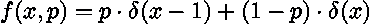

一种可能的表示如下:

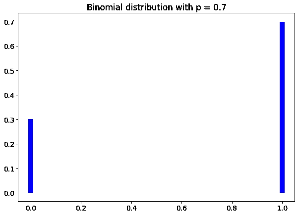

二项分布是任何概率课程的基本工具，在数据科学家的职业生涯中，可能会出现多次。想想二元分类模型，它处理 0-1 变量及其统计数据。

# 泊松分布

泊松分布通常被描述为罕见事件的分布。一般来说，如果一个事件以固定的速率在时间内发生(即每分钟 3 个事件，每小时 5 个事件)，那么在时间单位内观察到若干 *n* 个事件的概率可以用泊松分布来描述，泊松分布的公式如下:

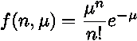

μ是单位时间内的事件率。

以下是一些例子:

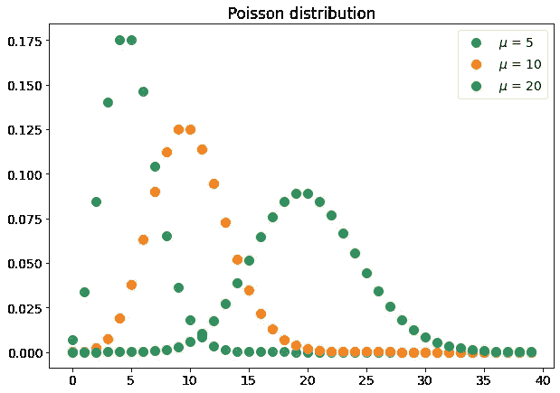

如您所见，其形状类似于高斯分布，峰值等于μ。

泊松分布在粒子物理学中非常常用，在数据科学中，它可以用于描述具有固定速率的事件(例如，早上进入超市的顾客)。

# 指数分布

如果泊松事件以固定的时间速率发生，则该事件两次连续发生之间的时间间隔呈指数分布。

指数分布有这样的密度函数:

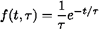

τ是两个连续事件之间的平均时间间隔。

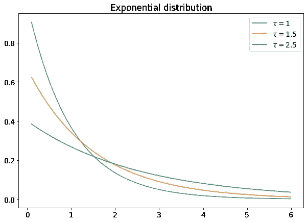

指数分布用于粒子物理学，一般来说，如果您想从泊松过程(在此过程中，您研究事件的数量)转移到与时间更相关的东西(例如，两个连续的顾客进入商店之间的时间间隔)。

# 结论

数据科学和统计学是两个非常相关的主题，如果不了解后者，就不可能很好地处理前者。在本文中，我向您展示了在您的数据科学家职业生涯中会发现的一些最重要的概率分布。可以找到其他分布(例如伽马分布)，但在数据科学家的日常工作中，他可能会使用这里描述的分布之一。