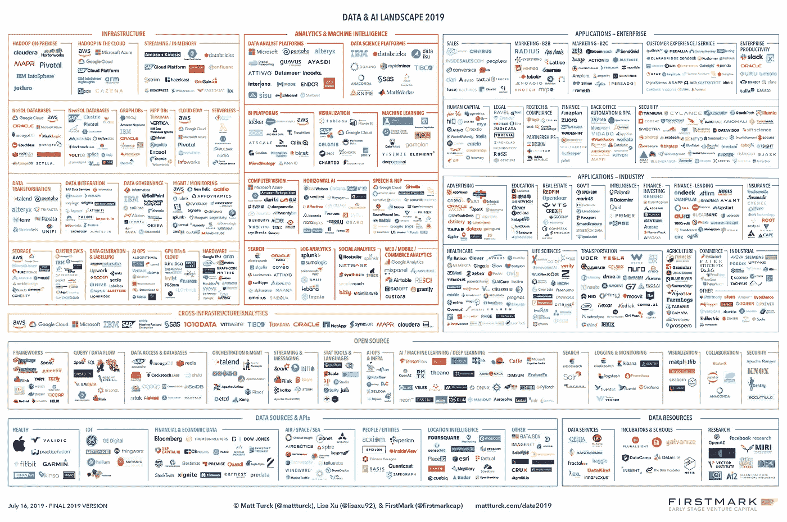
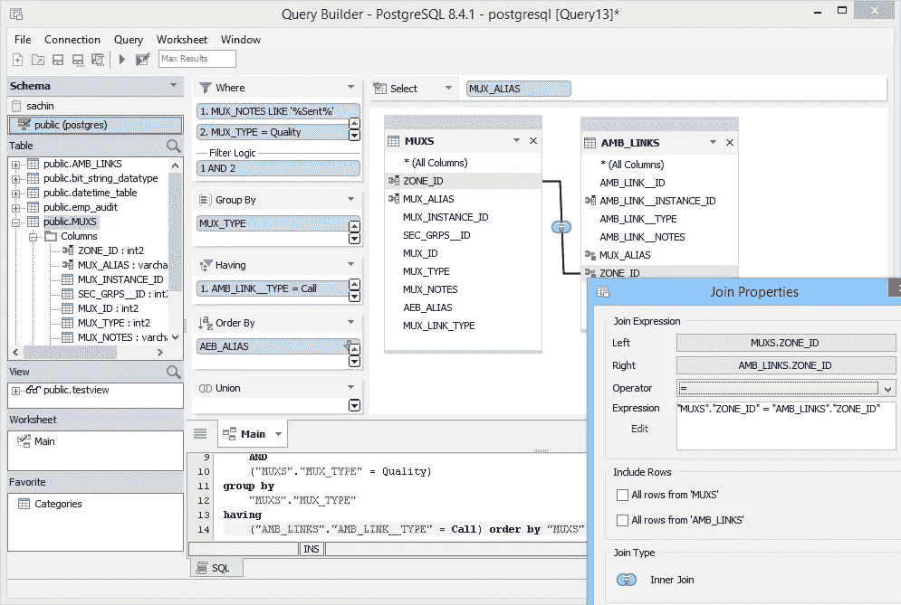
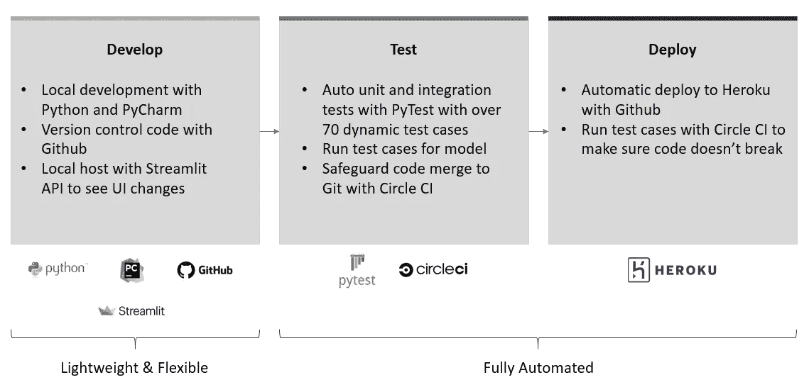
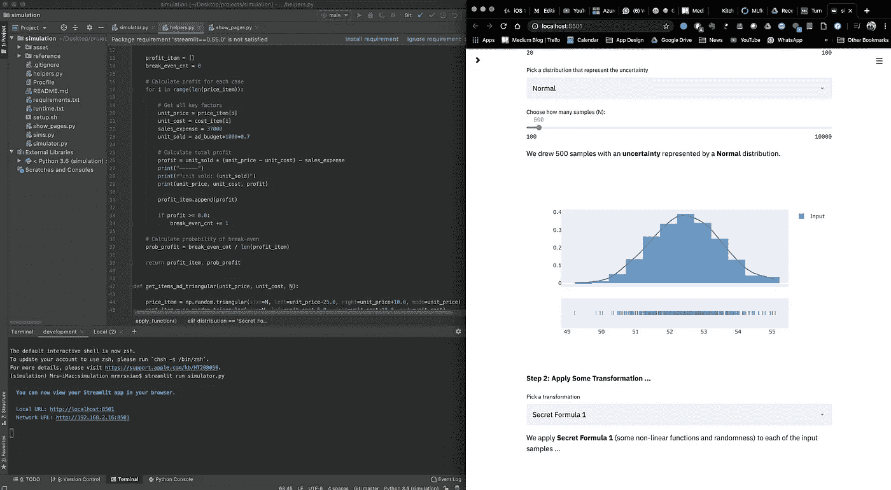
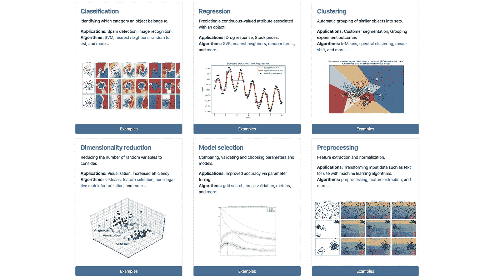
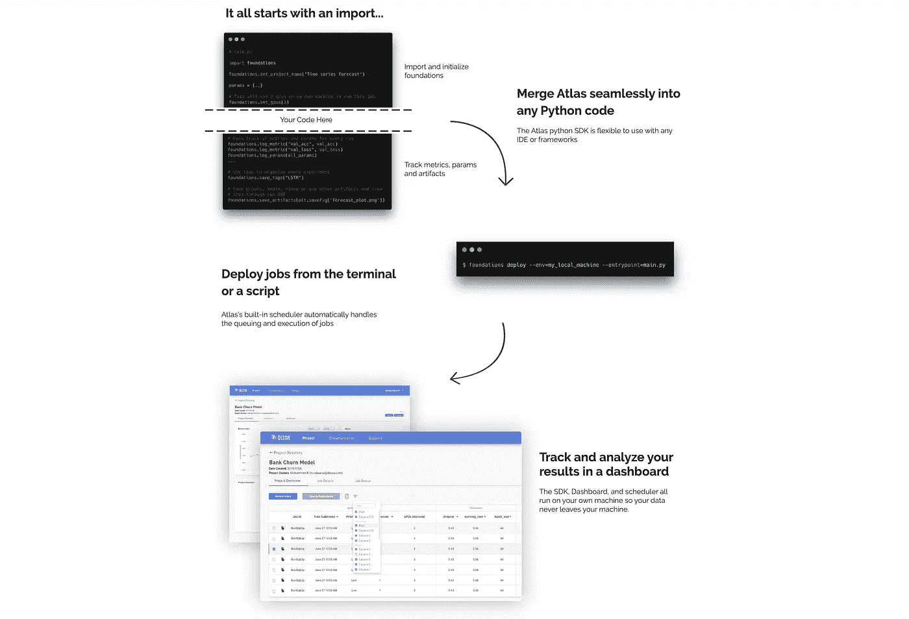
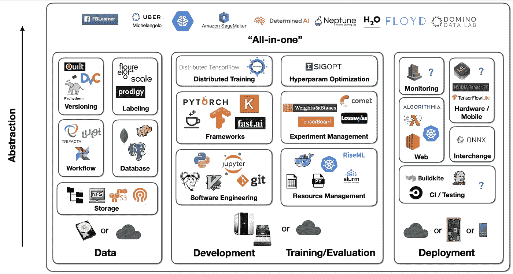

# 最有用的 ML 工具 2020

> 原文：<https://towardsdatascience.com/the-most-useful-ml-tools-2020-e41b54061c58?source=collection_archive---------2----------------------->

## 每个懒惰的全栈数据科学家都应该使用的 5 套工具

在 [Unsplash](https://unsplash.com/collections/8641367/image-for-blogs/56c1d67cd0eb64f06855199bd065aa08?utm_source=unsplash&utm_medium=referral&utm_content=creditCopyText) 上[创作八](https://unsplash.com/@creatveight?utm_source=unsplash&utm_medium=referral&utm_content=creditCopyText)的照片

**TL；构建好的机器学习应用程序就像做米其林风味的菜肴。拥有一个井井有条、管理有序的厨房至关重要，但有太多选项可供选择。在本文中，我强调了我发现的在交付专业项目中有用的工具，分享了一些想法和替代方案，并做了一个快速的实时调查(您可以在参与后看到社区的想法)。**

像任何工具讨论一样，这个列表并不详尽。我试图专注于最有用和最简单的工具。欢迎评论区的任何反馈，或者告诉我是否有更好的选择。

***免责声明*** *:本帖没有背书或赞助。我交替使用术语数据科学和 ML。*

***喜欢读什么？*** *跟我上* [*中*](https://medium.com/@ianxiao)*[*LinkedIn*](https://www.linkedin.com/in/ianxiao/)*，以及*[*Twitter*](https://twitter.com/ian_xxiao)*。查看我的《* [*用机器学习影响*](https://www.bizanalyticsbootcamp.com/influence-with-ml-digital) *》指南。它帮助数据科学家更好地解决问题、设计和交流。**

*“我如何构建好的机器学习应用？”*

*在与学校中有抱负的数据科学家、希望转行的专业人士和团队经理的聊天中，这个问题以各种形式出现了多次。*

*交付专业数据科学项目有许多方面。像许多其他人一样，我喜欢用在厨房做饭来做类比:有配料(数据)，食谱(设计)，烹饪过程(嗯，你独特的方法)，最后是实际的厨房(工具)。*

*所以，这篇文章走过我的**厨房**。它强调了设计、开发和部署**全栈机器学习**应用的**最有用的工具**——与系统集成或在生产环境中为人类用户服务的解决方案。*

*如果你想了解更多关于交付 ML 的其他方面，请点击这里查看我的文章。*

# *压倒一切的可能性*

*我们生活在一个黄金时代。如果你在谷歌上搜索“ML 工具”或者咨询顾问，你很可能会得到这样的结果:*

**

*数据& AI 景观 2019，[图片来源](https://www.google.com/url?sa=i&url=https%3A%2F%2Fmattturck.com%2Fdata2019%2F&psig=AOvVaw0oXq7zJf_Hz_RjdI-F70rq&ust=1583513401048000&source=images&cd=vfe&ved=0CAIQjRxqFwoTCPCR2KPlg-gCFQAAAAAdAAAAABAJ)*

*[吉菲](https://media.giphy.com/media/aVytG2ds8e0tG/giphy.gif)*

*外面有**(太多)工具**；可能的组合是无限的。这可能会令人困惑和不知所措。所以，我来帮你缩小范围。也就是说，没有完美的设置。这完全取决于你的需求和约束。因此，挑选，选择，并相应地修改。*

*我的列表优先考虑以下几点(不按顺序):*

*   *自由的💸*
*   *易于学习和设置🧸*
*   *未来证明(采用和工具成熟度)♻️*
*   *工程超过研究🤖*
*   *为初创企业或大型企业的大项目或小项目工作🚀*
*   *完成任务就行了💪*

**警告:我使用 Python* 🐍 *99%的时候。因此，这些工具可以很好地与原生 Python 一起工作，或者用原生 Python 构建。我没有用其他编程语言测试过它们，比如 R 或 Java。**

# *1.冰箱:数据库*

## *[**PostgreSQL**](https://www.postgresql.org/)*

*一个免费的开源关系数据库管理系统(RDBMS ),强调可扩展性和技术标准遵从性。它旨在处理一系列工作负载，从单台机器到数据仓库或有许多并发用户的 Web 服务。*

**

*[图像来源](https://www.google.com/url?sa=i&url=https%3A%2F%2Fwww.aquafold.com%2Fdbspecific%2Fpostgresql_client&psig=AOvVaw2Q_9WB3s7LFAJq4NStNNm_&ust=1583516333356000&source=images&cd=vfe&ved=0CAIQjRxqFwoTCMjw2Znwg-gCFQAAAAAdAAAAABAD)*

**替代品:* [*MySQL*](https://www.mysql.com/) *，* [*SAS*](https://www.sas.com/en_ca/home.html) *，*[*IBM DB2*](https://www.ibm.com/analytics/db2)*，*[*Oracle*](https://www.oracle.com/database/)*，*[*MongoDB*](https://www.mongodb.com/)*，*[*cloud era*](https://www.cloudera.com/)*

# **2.台面:部署管道工具**

**管道工具对于开发的速度和质量至关重要。我们应该能够用最少的手工处理快速迭代。这里有一个很好的设置，更多细节请看我的 [12 小时 ML 挑战](/build-full-stack-ml-12-hours-50c310fedd51)文章。每个懒惰的数据科学家都应该在项目的早期尝试这种方法。**

****

**作者作品， [12 小时 ML 挑战](/build-full-stack-ml-12-hours-50c310fedd51)**

## **[**Github**](https://github.com/)**

**它提供了 Git 的分布式版本控制和源代码管理(SCM)功能，以及它自己的特性。它为每个项目提供了访问控制和几个协作特性，比如 bug 跟踪、特性请求、任务管理和 wikis。**

***备选:*[*DVC*](https://dvc.org/)*，*[*bit bucket*](https://bitbucket.org/product)*，* [*GitLab*](https://about.gitlab.com/)**

## **[**皮查姆**](https://www.jetbrains.com/pycharm/) **社区版****

**一种用于计算机编程的集成开发环境(IDE ),专门用于 Python 语言。它是由捷克公司 JetBrains 开发的。它提供了代码分析、图形调试器、集成单元测试器、与版本控制系统(VCSes)的集成，并支持使用 Django 进行 web 开发以及使用 Anaconda 进行数据科学。**

***替代品:* [*原子*](https://atom.io/) *，* [*崇高*](https://www.sublimetext.com/)**

## **[Pytest](https://docs.pytest.org/en/latest/index.html)**

**一个框架使得编写小测试变得容易，并且可以扩展以支持应用程序和库的复杂功能测试。它节省了手动测试的大量时间。如果每次修改代码时都需要测试一些东西，那么可以用 Pytest 自动测试。**

***备选:*[*Unittest*](https://docs.python.org/3/library/unittest.html)**

## **[CircleCi](https://circleci.com/)**

**CircleCI 是一个持续集成和部署工具。当您提交 Github 时，它使用远程 dockers 创建了一个自动化的测试工作流。Circle CI 拒绝任何没有通过 PyTest 设置的测试用例的提交。这确保了代码质量，尤其是当您与一个较大的团队一起工作时。**

***备选:* [*詹金斯*](https://jenkins.io/) *，* [*特拉维斯 CI*](https://travis-ci.com/) *，*[*Github Action*](https://github.com/features/actions)**

## **[Heroku](https://www.heroku.com/) (仅当你需要虚拟主机时)**

**平台即服务(PaaS)使开发人员能够完全在云中构建、运行和操作应用程序。可以与 CircleCI 和 Github 集成，实现自动部署。**

***备选:* [*Google App 引擎，*](https://cloud.google.com/appengine) [*AWS 弹性计算云*](https://aws.amazon.com/ec2/) *，* [*其他*](https://medium.com/@brenda.clark/heroku-alternatives-top-5-picks-9095cef91d91)**

## **[Streamlit](https://www.streamlit.io/) (仅当您需要交互式 UI 时)**

**Streamlit 是一个面向机器学习和数据科学团队的开源应用框架。近年来，它已经成为我最喜欢的工具之一。看看我如何使用它和本节中的其他工具来创建一个 [**电影**](/build-full-stack-ml-12-hours-50c310fedd51) **和** [**模拟**](/how-to-design-monte-carlo-simulation-138e9214910a) **应用**。**

***备选:* [*烧瓶*](https://palletsprojects.com/p/flask/) *，* [*姜戈*](https://www.djangoproject.com/) *，* [*画面*](https://www.tableau.com/en-ca)**

# **3.iPad:探索工具**

## **[流线型](https://www.streamlit.io/)(再次)**

**忘掉朱庇特笔记本吧。是的，没错。**

**Jupyter *是*我探索数据、进行分析、试验不同数据和建模过程的首选工具。但是我不记得有多少次:**

1.  **我花了很多时间调试(并拔头发)，但最终意识到我忘了从头开始运行代码；Streamlit 解决了这个问题。**
2.  **我不得不等待一段时间，让我的数据管道重新运行，即使是一个小的代码更改；Streamlit 缓存解决了这个问题。**
3.  **我不得不重写代码或将代码从 Jupyter 转换成可执行文件——以及花费在重新测试上的时间；Streamlit 提供了一条捷径。**

**令人沮丧🤯😭。于是，我用 Streamlit 做**前期探索**，服务最终前端——一举两得。以下是我典型的屏幕设置。左边是 PyCharm IDE，右边是结果可视化。试试看。**

****

**IDE(左)Streamlit 的实时更新(右)，作者的作品来自[被遗忘的算法](/how-to-design-monte-carlo-simulation-138e9214910a)**

**备选: [*Jupyter 笔记本*](https://jupyter.org/) *，*[*Spyder from Anaconda*](https://www.spyder-ide.org/)*，*[*Microsoft Excel*](https://products.office.com/en-ca/excel)*【严重】***

# **4.刀子:ML 框架**

**就像使用真正的刀一样，你应该根据食物和你想怎么切来选择合适的刀。有通用刀和专用刀。**

****谨慎。使用寿司专用刀切骨头需要很长时间，尽管寿司刀更亮。选择正确的工具来完成工作。****

## **Scikit-Learn(常见的 ML 用例)**

**用 Python 进行一般机器学习的首选框架。说够了。**

****

**Scikit-Learn 的使用案例，[来源](https://scikit-learn.org/stable/)**

**备选方案:无，句号。**

## **[PyTorch](https://pytorch.org/) (深度学习用例)**

**基于 Torch 库的开源机器学习库。鉴于深度学习的重点，它主要用于计算机视觉和自然语言处理等应用。它主要由脸书人工智能研究实验室(FAIR)开发。最近很多知名的 AI 研究机构，比如 [Open AI](https://openai.com/blog/openai-pytorch/) ，都在用 PyTorch 作为他们的标准工具。**

***替代品:*[*tensor flow*](https://www.tensorflow.org/)*，*[*Keras*](https://keras.io/)*，* [*Fast.ai*](https://docs.fast.ai/)**

## **[开放 AI 健身房](https://gym.openai.com/)(强化学习用例)**

**开发和比较强化学习算法的工具包。它提供了 API 和可视化环境。这是一个社区正在开发工具的活跃领域。目前还没有很多打包好的工具可用。**

***替代品:很多小项目，但没有多少像健身房一样维护的那么好。***

# **5.火炉:实验管理**

## **[图集](https://www.atlas.dessa.com/)**

**这是一个免费的工具，允许数据科学家用一些片段设置实验，并将结果显示在基于网络的仪表板上。**

****

**[图册流程，来源](https://www.atlas.dessa.com/)**

****免责声明**:我在 Dessa 工作，这家公司创造了亚多拉斯。**

***替代品:* [*ML 流量*](https://mlflow.org/) *，*[*SageMaker*](https://aws.amazon.com/sagemaker/)*，* [*彗星*](https://www.comet.ml/site/) *，* [*权重&偏见*](https://www.wandb.com/) *，* [*数据机器人*](https://www.datarobot.com/) *，***

# **一项调查**

**出于好奇，**在寻找合适的工具时，什么最困扰你？**我很想听听你下面的想法。这是一个现场调查，所以你在参与后会看到社区的想法。**

# **另一种观点**

**正如我提到的，没有完美的设置。这完全取决于你的需求和约束。这是可用工具以及它们如何协同工作的另一个视图。**

****

**2019 年 [Sergey Karayev](https://www.linkedin.com/in/ACoAABqncBAB7JVSkewnHs3jvPfOOm-U23LAlTo/) 在[全栈深度学习](https://full-stack-deep-learning.aerobaticapp.com/b172_eb327323-811b-4de9-8894-76ec4cfd6458/assets/slides/fsdl_4_infra_tooling.pdf)的演讲**

# **一个小小的挑战**

**如果你想更多地了解如何使用这些工具，最好的方法是找一个项目来做。你可以将这些工具整合到当前的项目中，或者做一个 **12 小时的 ML 挑战**。不确定怎么做？查看[我如何创建一个用户授权的推荐应用](/build-full-stack-ml-12-hours-50c310fedd51)并讨论工具和流程。**

**我期待看到你能创造出什么。请分享给社区，并在推特上给我加标签🙌。**

*****喜欢读什么？*** *跟我上* [*中*](https://medium.com/@ianxiao) *，*[*LinkedIn*](https://www.linkedin.com/in/ianxiao/)*，或者*[*Twitter*](https://twitter.com/ian_xxiao)*。还有，作为一名数据科学家，要不要学习商业思维和沟通技巧？查看我的《* [*用机器学习影响*](https://www.bizanalyticsbootcamp.com/influence-with-ml-digital) *》指南。***

# **以下是我的一些文章，你可能会喜欢:**

** [## 对生活的追求

### 一个发现为什么许多 ML 项目失败的工具

towardsdatascience.com](/the-pursuit-of-lift-why-ml-projects-fail-f032dc31a303)  [## 被遗忘的算法

### 用 Streamlit 探索蒙特卡罗模拟

towardsdatascience.com](/how-to-design-monte-carlo-simulation-138e9214910a)  [## 数据科学很无聊

### 我如何应对部署机器学习的无聊日子

towardsdatascience.com](/data-science-is-boring-1d43473e353e)  [## 12 小时 ML 挑战

### 如何使用 Streamlit 和 DevOps 工具构建和部署 ML 应用程序

towardsdatascience.com](/build-full-stack-ml-12-hours-50c310fedd51)  [## ML 和敏捷注定的联姻

### 如何不对 ML 项目应用敏捷

towardsdatascience.com](/a-doomed-marriage-of-ml-and-agile-b91b95b37e35)  [## 人工智能的最后一英里问题

### 如何培养人类和人工智能之间的信任

towardsdatascience.com](/fixing-the-last-mile-problems-of-deploying-ai-systems-in-the-real-world-4f1aab0ea10)  [## 又一个 AI 冬天？

### 如何部署更多的 ML 解决方案——五种策略

towardsdatascience.com](/the-last-defense-against-another-ai-winter-c589b48c561)**