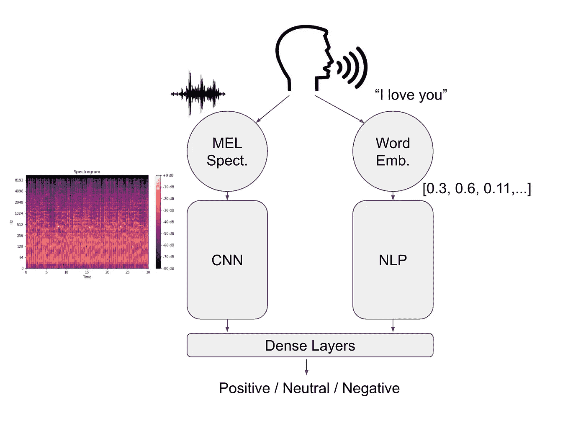

# 多通道神经网络

> 原文：<https://towardsdatascience.com/the-multi-channel-neural-network-26551bdfab6c?source=collection_archive---------14----------------------->


## 神经网络可以，而且**应该**，在多种类型的特征上被训练。本教程将介绍如何使用 Keras Functional API 来扩展您的网络。

神经网络广泛应用于多个领域，如计算机视觉、音频分类、自然语言处理等。在大多数情况下，它们在这些领域中被单独考虑。然而，在现实生活中，这很少是最佳配置。更常见的是有多个通道，意味着几种不同类型的输入。类似于人类如何使用广泛的感官输入(听觉、视觉等)来提取洞察力。)，神经网络可以(也应该)在多个输入上进行训练。

让我们以**情感识别**的任务为例。

人类不使用单一输入来有效地分类对话者的情绪。例如，他们不仅仅使用对话者的面部表情(视觉)、声音(听觉)或词语的含义(文本)，而是混合使用。类似地，神经网络可以对多个输入进行训练，例如图像、音频和文本，并进行相应的处理(通过 CNN、NLP 等。)，以得出对目标情绪的有效预测。通过这样做，神经网络可以更好地捕捉难以从每个通道单独获得的微妙之处(例如讽刺)，类似于人类。

# 系统结构

考虑到情绪识别的任务，为简单起见，我们将其限制为三类(积极、消极和中性)，我们可以将该系统想象为如下:



该系统通过麦克风拾取音频，将声音的 MEL 声谱图计算为图像，并将其转录为一串文本。这两个信号然后被用作模型的输入，每个信号被馈送到它的一个分支。事实上，神经网络由两部分组成:

*   左分支，通过卷积神经网络进行图像分类
*   右分支，使用嵌入对文本执行 NLP。

最后，每一侧的输出被馈送到一组公共的密集层，其中最后一层具有三个神经元，以分别对三个类别进行分类(阳性、中性和阴性)。

# 设置

在本例中，我们将使用 MELD 数据集，该数据集由带有相关情绪标签的简短对话组成，表明陈述的情绪是积极的、中立的还是消极的。数据集可以在这里找到[。](https://github.com/declare-lab/MELD)

你也可以在这里找到这篇文章[的完整代码。](https://github.com/ezuccarelli/Medium/tree/master/The%20Multi-Channel%20Neural%20Network)

# 图像分类处

声音采集完成后，系统会立即计算音频信号的声谱图。音频分类的最新特征是 MEL 频谱图和 MEL 频率倒谱系数。对于这个例子，我们将使用 MEL 谱图。

首先，我们显然会从包含音频的文件夹中加载数据，在培训、验证和测试中进行拆分:

```
import gensim.models as gm
import glob as gb
import keras.applications as ka
import keras.layers as kl
import keras.models as km
import keras.optimizers as ko
import keras_preprocessing.image as ki
import keras_preprocessing.sequence as ks
import keras_preprocessing.text as kt
import numpy as np
import pandas as pd
import pickle as pk
import tensorflow as tf
import utils as ut

# Data
Data_dir = np.array(gb.glob('../Data/MELD.Raw/train_splits/*'))
Validation_dir = np.array(gb.glob('../Data/MELD.Raw/dev_splits_complete/*'))
Test_dir = np.array(gb.glob('../Data/MELD.Raw/output_repeated_splits_test/*'))

# Parameters
BATCH = 16
EMBEDDING_LENGTH = 32
```

然后，我们可以遍历这三个文件夹中的每个音频文件，计算 MEL 频谱图，并将其作为图像保存到新文件夹中:

```
# Convert Audio to Spectrograms
for file in Data_dir:
    filename, name = file, file.split('/')[-1].split('.')[0]
    ut.create_spectrogram(filename, name)

for file in Validation_dir:
    filename, name = file, file.split('/')[-1].split('.')[0]
    ut.create_spectrogram_validation(filename, name)

for file in Test_dir:
    filename, name = file, file.split('/')[-1].split('.')[0]
    ut.create_spectrogram_test(filename, name)
```

为此，我们在实用程序脚本中创建了一个用于训练、验证和测试的函数。该函数使用 *librosa* 包加载音频文件，对其进行处理，然后将其保存为图像:

```
import librosa
import librosa.display
import matplotlib.pyplot as plt
import numpy as np
import path as ph
import pydub as pb
import speech_recognition as sr
import warningsdef create_spectrogram(filename, name):
    plt.interactive(False)
    clip, sample_rate = librosa.load(filename, sr=None) fig = plt.figure(figsize=[0.72, 0.72])
    ax = fig.add_subplot(111)
    ax.axes.get_xaxis().set_visible(False)
    ax.axes.get_yaxis().set_visible(False)
    ax.set_frame_on(False) S = librosa.feature.melspectrogram(y=clip, sr=sample_rate)
    librosa.display.specshow(librosa.power_to_db(S, ref=np.max))
    filename = 'img/Train/' + name + '.jpg' plt.savefig(filename, dpi=400, bbox_inches='tight', pad_inches=0)
    plt.close()
    fig.clf()
    plt.close(fig)
    plt.close('all')
    del filename, name, clip, sample_rate, fig, ax, S
```

一旦我们将每个音频信号转换为表示相应频谱图的图像，我们就可以加载包含每个音频标签信息的数据集。为了正确地将每个音频文件链接到它的情感，我们创建一个 ID 列，包含该样本的图像文件的名称:

```
# Data Loading
train = pd.read_csv('../Data/MELD.Raw/train_sent_emo.csv', dtype=str)validation = pd.read_csv('../Data/MELD.Raw/dev_sent_emo.csv', dtype=str)test = pd.read_csv('../Data/MELD.Raw/test_sent_emo.csv', dtype=str) # Create mapping to identify audio files
train["ID"] = 'dia'+train["Dialogue_ID"]+'_utt'+train["Utterance_ID"]+'.jpg'validation["ID"] = 'dia'+validation["Dialogue_ID"]+'_utt'+validation["Utterance_ID"]+'.jpg'test["ID"] = 'dia'+test["Dialogue_ID"]+'_utt'+test["Utterance_ID"]+'.jpg'
```

# 自然语言处理处

同时，我们还需要获取与音频信号相关的文本，并使用 NLP 技术对其进行处理，将其转换为数字向量，以便神经网络可以对其进行处理。既然我们已经有了 MELD 数据集本身的文本信息，我们就可以继续了。否则，如果信息不可用，我们可以使用文本转换库，比如谷歌云的*语音识别*:

```
# Text Features
tokenizer = kt.Tokenizer(num_words=5000)
tokenizer.fit_on_texts(train['Utterance'])

vocab_size = len(tokenizer.word_index) + 1

train_tokens = tokenizer.texts_to_sequences(train['Utterance'])
text_features = pd.DataFrame(ks.pad_sequences(train_tokens, maxlen=200))

validation_tokens = tokenizer.texts_to_sequences(validation['Utterance'])
validation_features = pd.DataFrame(ks.pad_sequences(validation_tokens, maxlen=200))
```

我们首先标记每个音频中的句子，然后将它们转换成长度为 200 的数字向量。

# 数据管道

整合多媒体输入最棘手的一个方面是创建一个定制的数据生成器。这个结构基本上是一个函数，每次被调用时，它能够迭代地返回到模型的下一批输入。使用 Keras 的预制生成器相对容易，但没有实现允许您将多个输入合并在一起，并确保两个输入并排无误地输入到模型中。

下面的代码足够通用，可以在不同的设置中使用，而不仅仅是与这个例子相关。具体来说，它需要一个文件夹位置(图像所在的位置)和一个“普通”数据集(行中有样本，列中有要素)。然后，在这种情况下，它迭代地提供图像和文本特征的下一个样本，这两个样本都是相同大小的批次:

```
# Data Pipeline
def train_generator(features, batch):
    # Image Generator
    train_generator = ki.ImageDataGenerator(
        rescale=1\. / 255.) train_generator = train_generator.flow_from_dataframe(
        dataframe=train,
        directory="img/Train/",
        x_col="ID",
        y_col="Sentiment",
        batch_size=batch,
        seed=0,
        shuffle=False,
        class_mode="categorical",
        target_size=(64, 64)) train_iterator = features.iterrows()
    j = 0
    i = 0 while True:
        genX2 = pd.DataFrame(columns=features.columns) while i < batch:
            k,r = train_iterator.__next__()
            r = pd.DataFrame([r], columns=genX2.columns)
            genX2 = genX2.append(r)
            j += 1
            i += 1 if j == train.shape[0]:
                X1i = train_generator.next() train_generator = ki.ImageDataGenerator(
                    rescale=1\. / 255.) train_generator = train_generator.flow_from_dataframe(
                    dataframe=train,
                    directory="img/Train/",
                    x_col="ID",
                    y_col="Sentiment",
                    batch_size=batch,
                    seed=0,
                    shuffle=False,
                    class_mode="categorical",
                    target_size=(64, 64)) # Text Generator
                train_iterator = features.iterrows()
                i = 0
                j=0
                X2i = genX2
                genX2 = pd.DataFrame(columns=features.columns)
                yield [X1i[0], tf.convert_to_tensor(X2i.values, dtype=tf.float32)], X1i[1] X1i = train_generator.next()
        X2i = genX2
        i = 0
        yield [X1i[0], tf.convert_to_tensor(X2i.values, dtype=tf.float32)], X1i[1]
```

# 神经网络体系结构

最后，我们可以创建输入图像(声谱图)和文本(转录)的模型，并对它们进行处理。

## 输入

输入包括由 64x64 像素和 3 个通道(RGB)组成的图像，以及长度为 200 的“正常”数字特征，表示文本的编码:

```
# Model
# Inputs
images = km.Input(shape=(64, 64, 3))
features = km.Input(shape=(200, ))
```

## 图像分类(CNN)分部

影像分类分支由初始 VGG19 网络和一组自定义图层组成。通过使用 VGG19，我们可以利用迁移学习的优势。特别是，由于该模型已经在 ImageNet 数据集上进行了预训练，它已经从初始化为对图像分类任务有意义的值的系数开始。然后，输出被输入到一系列层中，这些层可以学习这类图像的具体特征，然后输出到下一个公共层:

```
# Transfer Learning Bases
vgg19 = ka.VGG19(weights='imagenet', include_top=False)
vgg19.trainable = False

# Image Classification Branch
x = vgg19(images)
x = kl.GlobalAveragePooling2D()(x)
x = kl.Dense(32, activation='relu')(x)
x = kl.Dropout(rate=0.25)(x)
x = km.Model(inputs=images, outputs=x)
```

## 文本分类分支

NLP 分支使用长短期记忆(LSTM)层和嵌入层来处理数据。为了避免模型过度捕捞，还添加了脱落层，类似于 CNN 分支机构所做的工作:

```
# Text Classification Branch
y = kl.Embedding(vocab_size, EMBEDDING_LENGTH, input_length=200)(features)
y = kl.SpatialDropout1D(0.25)(y)
y = kl.LSTM(25, dropout=0.25, recurrent_dropout=0.25)(y)
y = kl.Dropout(0.25)(y)
y = km.Model(inputs=features, outputs=y)
```

## 公共层

然后，我们可以将这两种输出结合起来，输入到一系列密集层中。一组密集层能够捕捉仅当音频和文本信号组合时才可用的信息，并且不能从每个单独的输入中识别。

我们还使用学习率为 0.0001 的 Adam 优化器，这通常是一个很好的组合:

```
combined = kl.concatenate([x.output, y.output])

z = kl.Dense(32, activation="relu")(combined)
z = kl.Dropout(rate=0.25)(z)
z = kl.Dense(32, activation="relu")(z)
z = kl.Dropout(rate=0.25)(z)
z = kl.Dense(3, activation="softmax")(z)

model = km.Model(inputs=[x.input, y.input], outputs=z)

model.compile(optimizer=ko.Adam(lr=0.0001), loss='categorical_crossentropy', metrics='accuracy')

model.summary()
```

# 模特培训

然后，可以使用我们之前通过执行以下操作创建的训练和验证生成器来训练该模型:

```
# Hyperparameters
EPOCHS = 13
TRAIN_STEPS = np.floor(train.shape[0]/BATCH)
VALIDATION_STEPS = np.floor(validation.shape[0]/BATCH)

# Model Training
model.fit_generator(generator=train_generator(text_features, BATCH),
                    steps_per_epoch=TRAIN_STEPS,
                    validation_data=validation_generator(validation_features, BATCH),
                    validation_steps=VALIDATION_STEPS,
                    epochs=EPOCHS)
```

# 模型评估

最后，在一组数据上评估模型，例如单独的验证集，然后保存为文件，以便在“实时”场景中使用时加载:

```
# Performance Evaluation
# Validation
model.evaluate_generator(generator=validation_generator(validation_features, BATCH))

# Save the Model and Labels
model.save('Model.h5')
```

# 摘要

总的来说，我们构建了一个能够接受多种类型输入(图像、文本等)的系统。)，对它们进行预处理，然后将它们馈送到由每个输入的一个分支组成的神经网络。每个分支单独处理其输入，然后汇聚成一组公共层，预测最终输出。

具体步骤是:

*   数据加载
*   分别预处理输入(频谱图、符号化)
*   创建自定义数据生成器
*   构建模型架构
*   模特培训
*   性能赋值

*要阅读更多类似的文章，请关注我的* [*Twitter*](https://twitter.com/jayzuccarelli) *，*[*LinkedIn*](https://www.linkedin.com/in/ezuccarelli)*或我的* [*网站*](https://eugeniozuccarelli.com/) *。*