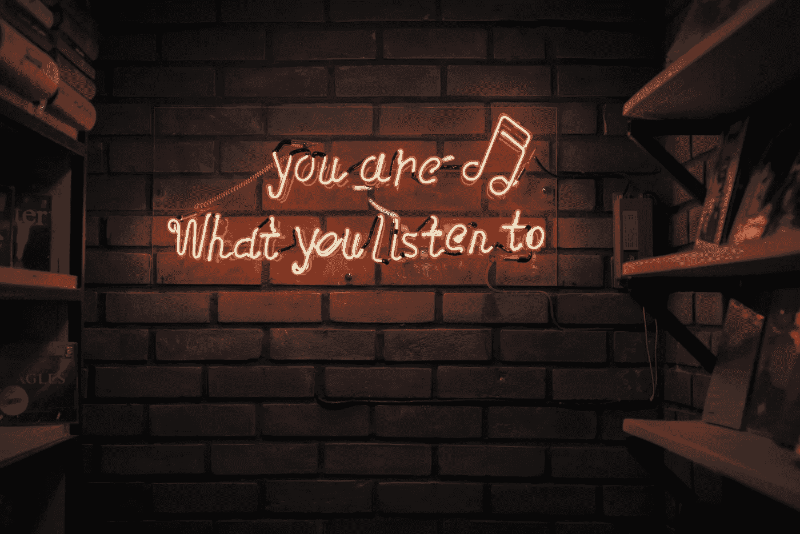
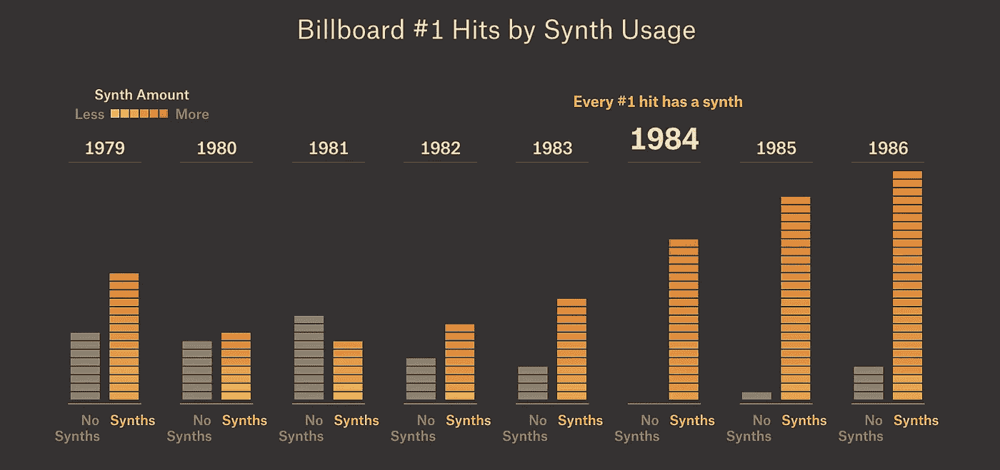
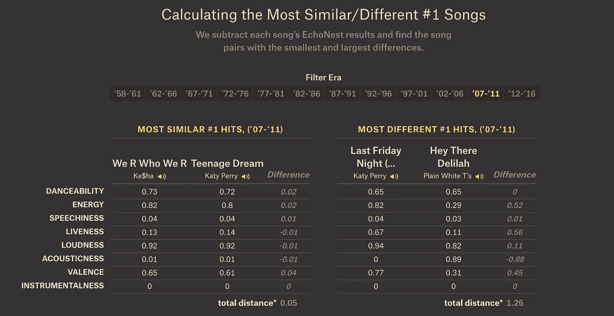
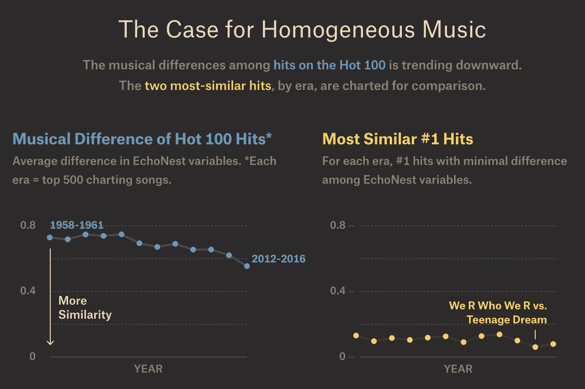
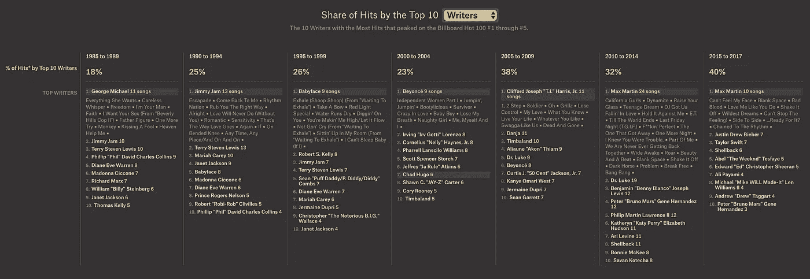

# 流行歌曲的音乐相似性-一篇评论文章

> 原文：<https://towardsdatascience.com/the-musical-similarity-of-popular-songs-a-review-article-c47d5af52e62?source=collection_archive---------46----------------------->

## 使用数据可视化来解释概念

[https://unsplash.com/photos/1oKxSKSOowE](https://unsplash.com/photos/1oKxSKSOowE)

> **“音乐是我所知道的唯一没有任何规则的东西。”-** 乔希·霍姆

2014 年，史努比·道格[问 50 Cent](https://youtu.be/P4rq2d5FXQ4?t=6m52s) 他最怀念过去的什么，当时嘻哈“就是它”50 美分回答“真实性”，导致 Snoop 臭名昭著的模仿当今说唱歌手:[https://pudding . cool/2018/05/similarity/assets/videos/video _ Snoop . MP4](https://pudding.cool/2018/05/similarity/assets/videos/video_snoop.mp4)

我坚信，当谈到创造力时，无论是音乐、绘画还是写作，都没有规则可言。然而，尽管艺术作品具有不确定性，但人们必须从作品中挖掘出某些元素，以便对比和分析世界各地艺术家的努力。一个如此美丽的艺术量化，特别是流行音乐，在布丁的文章中显而易见，“ [***热门歌曲的音乐多样性越来越少了吗？***](https://pudding.cool/2018/05/similarity/)

这篇文章以这样一个论点开始，即当我们从 20 世纪 80 年代进入当今时代时，大多数热门歌曲的“声音”往往是相似的。但是如何比较无形数据呢？显示了一个条形图，解释了一个粗略但合理的特征，如 1980-1986 年期间歌曲中合成器的比例，这表明合成器的使用明显增加。

*快照来自* [*布丁文章*](https://pudding.cool/2018/05/similarity/)

或者，人们可以研究复杂的数据集，如 [***音乐基因组计划***](https://www.pandora.com/about/mgp) ，它使用数百种属性如速度、流派、音调等为歌曲评分。

作者的故事基于*的 8 个数据点，如“声学”、“舞蹈性”、“能量”、“乐器性”、“活性”、“响度”、“语音性”和“化合价”。这 8 个点中的每一个都有 0-1 之间的值，每个因素都有两个独特的例子来详细解释。因此，歌曲被简化为 8 维实体，可以使用像[欧几里德距离这样的度量标准进行比较。](https://en.wikipedia.org/wiki/Euclidean_distance)*

**

*快照来自[布丁文章](https://pudding.cool/2018/05/similarity/)*

*有趣的是，歌曲的简单矢量表示为音乐产业的详细分析打开了一扇窗。我们观察到，从 1960 年到 2010 年，歌曲的相似度稳步上升。*

*另一个有说服力的评估歌曲的方法是记录每首热门歌曲的平均词曲作者数量。虽然有人会说这与音乐同质性的上升没有直接关系，但作者提供了令人信服的证据来证明一首歌中作家数量的增加会抵消他们的个人品质，导致歌曲不那么独特。以下是这篇文章的摘要:*

**

# *我的观点:*

*虽然故事呈现得很优雅，但增加一个互动层，读者可以输入他们选择的任何两首歌曲来获得相似性得分，这将是蛋糕上的樱桃。(对于我的 UI 忍者朋友来说，这可能是一个有趣的项目想法)*

*选择比较你最喜欢的音乐不仅能吸引听众，还能让他们对流行趋势形成个性化的看法。此外，我想探索 2D 可视化(使用像 PCA 这样的降维技术生成)显示相似歌曲集群的形成。*

> *总的来说，作品中充满了相关歌曲的片段，让读者参与进来，产生了令人信服的影响。它让我们得出两个合乎逻辑的结论——要么这一趋势将持续加速(从纯粹的统计角度来看)，要么它将成为原创音乐从音乐排行榜上脱颖而出的前所未有的机会，因为对于音乐盒变平的听众来说，这将是一种“开箱即用”的体验。*