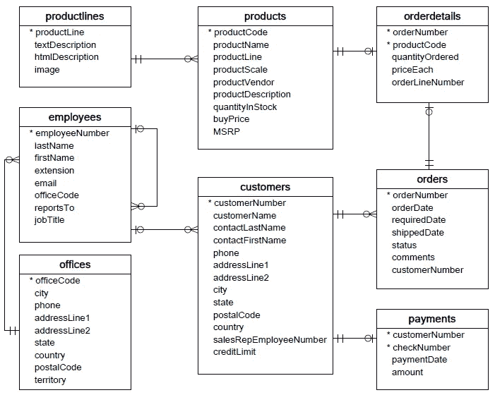

# (几乎)每个 ETL 管道中使用的 MySQL 函数

> 原文：<https://towardsdatascience.com/the-mysql-functions-used-in-almost-every-etl-pipeline-d2007d6f5086?source=collection_archive---------27----------------------->

## 记住这些功能。


[田宽](https://unsplash.com/@realaxer?utm_source=medium&utm_medium=referral)在 [Unsplash](https://unsplash.com?utm_source=medium&utm_medium=referral) 上拍照

# ETL 管道介绍

“ETL”代表什么？为了回答这个问题，让我们考虑一下每个数据科学家都知道的 80/20 法则:一个数据科学家 80%的时间被分配给 **E** 提取、 **T** 转换和 **L** 加载数据，20%的时间被分配给同时观看办公室重新运行和亚马逊 Prime 的杰克·瑞恩，以此来对比约翰·卡拉辛斯基令人难以置信的范围。

在这篇博客中，我们将研究一些最常用的 MySQL 函数，准确地说是五个函数，没有特定的顺序，每个 SQL 初学者都应该记住它们。

# 管道

因为这篇博客的目的是关注经常使用的 SQL 命令，所以我们将只关注管道的数据提取过程。

首先，让我们导入 Pandas 和 Sqlite3，并定义一个“游标”光标对象允许我们调用。execute()方法来执行 SQL 命令。


光标对象允许我们调用。execute()方法来执行 SQL 命令

现在我们已经连接到数据库，这是一个名为“data.sqlite”的本地文件，我们可以开始提取数据了。但是首先，让我们检查一下数据库模式:



我们的数据库模式

正如我们所看到的，我们有多个表，其中一些有一对一的关系，一些有一对多的关系(更多关于那个[这里](https://www.youtube.com/watch?v=lDnL1gwCE0o)和[这里](https://www.youtube.com/watch?v=KjA2LhT4TRU))。

# 功能 1:选择

**选择**功能允许我们获取所需的数据。假设我们需要 orderdetails 表中的每一列。我们可以编写如下查询:

```
query = """SELECT od.orderNumber,
                  productCode,
                  quantityOrdered,
                  priceEach,
                  orderLineNumber
            FROM orderdetails;"""
```

然而，我们可以简单地使用星号来抓取每一列，而不是写出每一列。

```
query = """SELECT * FROM ordertails;"""
```

现在，如果您的数据包含重复条目，您可以调用 **DISTINCT** 在将数据放入 dataframe 之前只获取唯一的数据点。


SELECT DISTINCT 查询示例

## 聚合器函数:COUNT()、SUM()、MIN()、MAX()、AVG()

请注意，上述数据帧的前四行具有相同的 orderNumber。我们可以看到每个 orderNumber 包含多个 productCodes，每个都有自己的数量和价格。比方说，对于每份订单，我们都想知道客户花费的总金额——请注意，我们没有每种产品的总计列。这就是聚合函数派上用场的地方。请注意，在使用聚合函数时，始终包含 GROUP BY 函数(稍后将详细介绍)是非常重要的，这样就可以知道聚合数据的内容，在本例中是 orderNumber。


聚合器函数 SUM()和别名函数作为查询示例

使用 **SUM()** 函数允许我们创建一个名为“orderTotal”的新列(使用别名函数**作为**),我们可以看到前五个订单分别为$10，222.83、$10，549.01、$5，494.78、$50，218.95 和$40，206.20。挺有用的。

# 功能二:加入

**JOIN** 命令用于使用一个公共列(也称为外键)从不同的表中选择多行。我们将关注四个最常见的连接子句:outer、inner、left 和 right。注意，必须使用上的**或使用**上的**来定义公共列。**上**的语法将是…ON table 1 . common _ column _ name = table 2 . common _ column _ name，而 USING 的语法只是… USING (common_column_name)。**

## 外部连接

**外部连接**返回左表或右表中匹配的数据。


图片来自:[https://www.w3schools.com/sql/sql_join.asp](https://www.w3schools.com/sql/sql_join.asp)

## 内部连接

一个**内部连接**返回在左表和右表中都匹配的数据。


图片来自:[https://www.w3schools.com/sql/sql_join.asp](https://www.w3schools.com/sql/sql_join.asp)

## **左连接**

一个**左连接**返回左表中的所有记录以及右表中的匹配行。


图片来自:[https://www.w3schools.com/sql/sql_join.asp](https://www.w3schools.com/sql/sql_join.asp)

## 右连接

一个**右连接**返回右表中的所有记录以及左表中的匹配行。


图片来自:[https://www.w3schools.com/sql/sql_join.asp](https://www.w3schools.com/sql/sql_join.asp)

现在让我们看一个例子。使用我们以前的模式，假设我们需要每个雇员的雇员号、名、姓和邮政编码。我们可以使用 officeCode 作为外键来执行 employees 表和 offices 表的一个简单的**内部连接**(这只是许多方法中的一种)。


内部联接示例查询

注意，使用联接时，必须指定从哪个表中提取列。这可以通过在 **SELECT** 子句中使用语法 table_name.column_name 来完成。这可能很繁琐，所以更常见的方法是为每个表分配一个昵称。上面的代码将 employees 表标记为“e ”,将 offices 表标记为“o ”,以避免为所需的每一列键入完整的表名。

# 功能 3:在哪里

当我们想要对我们想要的数据设置某个条件时，使用 **WHERE** 函数。此外，您可以在之间使用 **WHERE** 连同 **AND，OR，NOT，LIKE** ，and **来设置数据的具体要求。让我们看几个简单的例子(这些查询没有使用原始的模式，纯粹是说明性的)。**

## 与，或，与非

```
#all males that weigh more than 200lbs
query = """ SELECT patient_id, height, weight, age, sex, region
            FROM patients
            WHERE sex = 'M' AND weight > 200;"""#all patients that weigh more than 200 or are older than 50
query = """ SELECT patient_id, height, weight, age, sex, region
            FROM patients
            WHERE weight > 200 OR age > 50;"""#all patients not from the Northeast
query = """ SELECT patient_id, height, weight, age, sex, region
            FROM patients
            WHERE region NOT 'NE';"""
```

## 喜欢

```
#all patients whose patient_id starts with A100
query = """ SELECT patient_id, height, weight, age, sex, region
            FROM patients
            WHERE patient_id LIKE 'A100%';"""
```

## 在...之间

```
#all patients who weigh between 195 and 255 lbs
query = """ SELECT patient_id, height, weight, age, sex, region
            FROM patients
            WHERE weight BETWEEN 195 and 255;"""
```

# 功能 4:排序依据

**ORDER BY** 命令按照指定的列以升序(默认)或降序组织我们的数据。让我们重温一下我们的原始模式，看一个简单的例子。

## **升序(ASC)**

让我们从 customers 表中获取 customerName、creditLimit、addressLine1、city、state、postalCode 和 country。我们将按照州和城市的字母顺序对结果进行排序。最后，我们将只考虑信用限额超过 25，000 美元的美国客户。


按升序排序的查询示例

## 下降(DESC)

让我们查询完全相同的数据，只是这次我们将按 creditLimit 对行进行排序，并且只查看前 5 个 credit LIMIT(使用 **LIMIT** 子句)


按降序排序的查询示例

# 功能 5:分组依据

如前所述， **GROUP BY** 函数通常与聚合函数一起使用，以便按一列或多列对“结果”数据进行分组。下面是一个简单的例子，说明我们如何按一列分组，以便查看应用于不同列的聚合函数。具体来说，假设我们想了解我们在美国哪五个州开展的业务最多。这可能涉及到按州对数据进行分组，并对我们之前计算的 orderTotal 列求和。


分组依据和限制查询示例

请注意，在上面的代码中，您可以传递 1、2 等。而不是 column_name。这指定了对结果进行分组的列的位置(相对于**选择**原因)。所以在上面的例子中，我们可以说“GROUP BY 1”而不是“GROUP BY state ”,因为 state 位于 **SELECT** 子句的 1 位置


GROUP BY 1 查询示例

通过功能与**组共同使用的另一个重要功能是 **HAVING。**具有**功能的**类似于 **WHERE** 功能，它创建了一个需要满足的条件，以便将一行包含在结果中，但不同之处在于具有**子句的**通过**命令将条件直接分配给**组。这可能有点令人困惑，所以让我们试着用一些代码来阐明这一点。**

下面的代码为我们提取了任何累计订购了 10 个或更多产品的客户的 customerName、customerNumber、productName、productCode 和 totalOrdered。请注意， **HAVING** 子句的作用类似于此处的 **WHERE** 子句，但仅适用于 GROUP BY 1(客户名称)、4(产品代码)。


GROUP BY 和 HAVING 查询示例

# 最后一个技巧:子查询！

子查询基本上是查询中的查询。它们可以用在许多方面来解决许多不同的问题。但是最终，当您的条件变得复杂并且需要多个 **JOIN** 命令和/或多个 **WHERE** 命令时，您需要使用子查询。

例如，如果我们想获得少于 5 名雇员的办公室中每个雇员的名字、姓氏和城市，该怎么办？处理这种情况的一种方法是，首先查询一个少于 5 名雇员的办公室的结果集，然后只考虑其办公室代码在结果集中的雇员的名字、姓氏和城市。让我们看看代码是什么样子的:


子查询示例

# 小抄

在这篇博客中，我们介绍了典型 ETL 管道中最常用的 5 个 MySQL 函数，以及它们对应的所有子句/命令。让我们快速回顾一下。

函数 1: SELECT、SELECT DISTINCT、SELECT +聚合函数和 AS(在输出中应该调用的列的别名)

功能 2: JOIN(外/内/左/右)+ ON 或 USING

功能 3: WHERE +和/或/NOT，比如，BETWEEN

功能 4:按+ ASC(默认)或 DESC 排序

功能 5:分组依据+拥有

子查询:查询中的查询

我强烈鼓励每个阅读这篇博客的人做进一步的阅读。你怎么想呢?有什么荣誉奖吗？