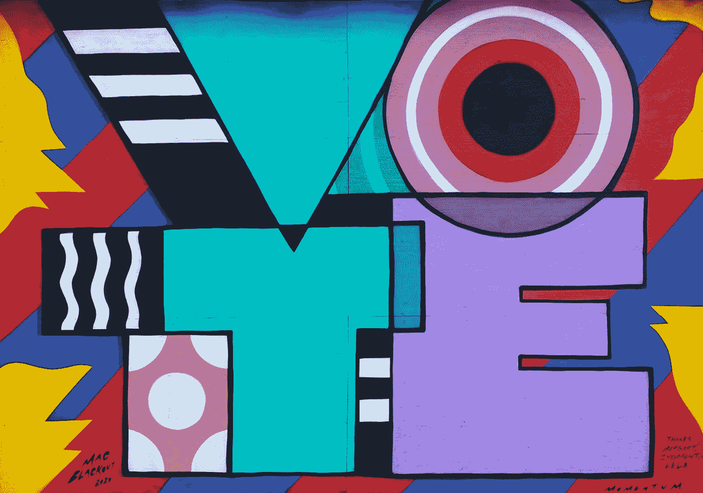
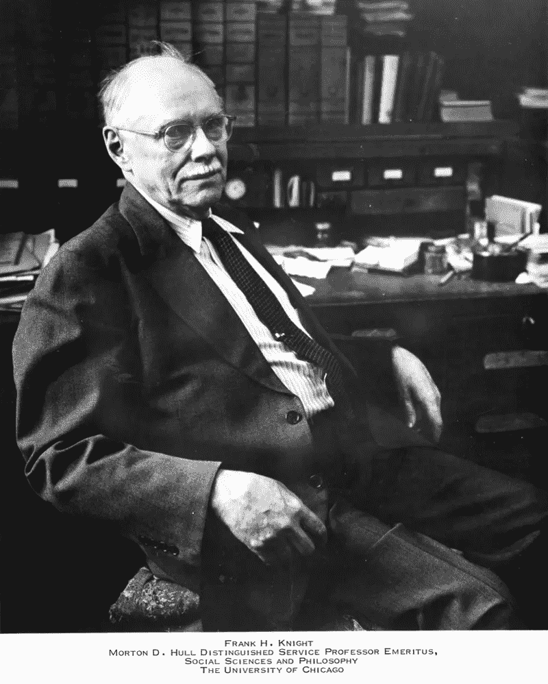
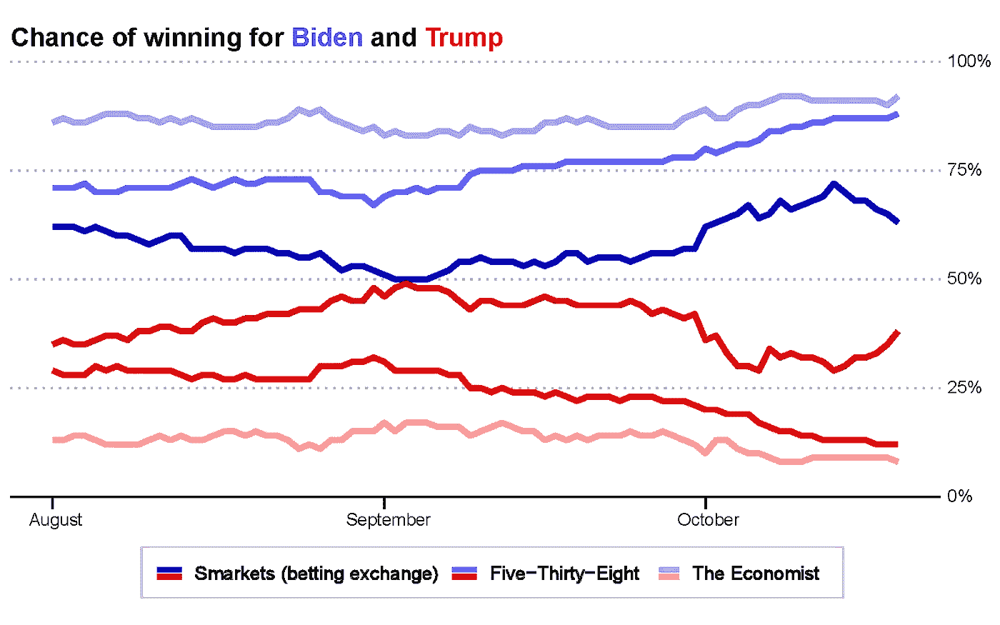
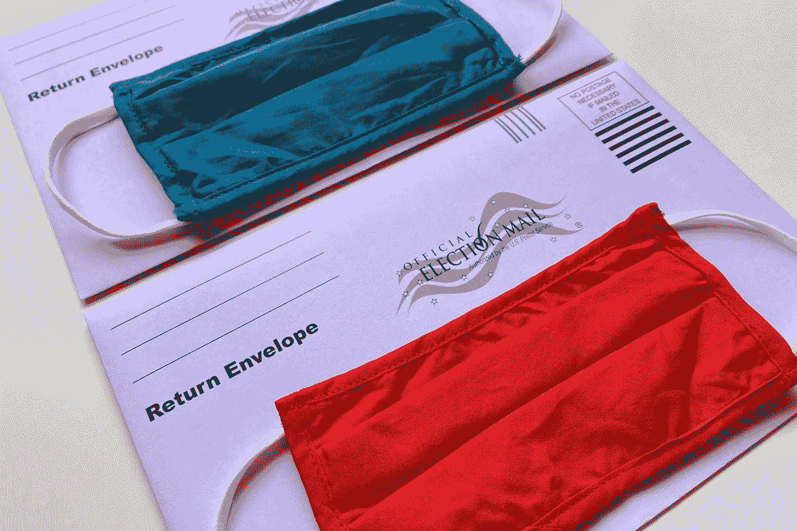

# 美国总统大选不确定性的本质

> 原文：<https://towardsdatascience.com/the-nature-of-uncertainty-in-the-us-presidential-election-d112061bd88c?source=collection_archive---------30----------------------->

詹妮弗·格里芬在 [Unsplash](https://unsplash.com?utm_source=medium&utm_medium=referral) 上的照片

我们生活中普遍存在的不确定性很少像现在这样明显。从全球范围内导致 100 多万人死亡的疫情，到乔治·弗洛伊德(George Floyd)被谋杀后爆发的大规模抗议活动，今年出乎我们的意料。随着美国大选的临近，许多人转向预测，例如由[538](https://projects.fivethirtyeight.com/2020-election-forecast/)和[经济学家](https://projects.economist.com/us-2020-forecast/president)做出的预测，以量化不同情景发生的可能性。

大多数预测目前预测拜登获胜的概率为 90%左右。思考这个问题的一种方法是，想象从一顶帽子里抽出一个名字，帽子里有九张写着“拜登”的纸和一张写着“特朗普”的纸。虽然这是对许多人解读概率的方式的改进，但它并没有完全抓住我们在现实世界中面临的不确定性。

# 风险和不确定性

经济学家弗兰克·奈特(Frank Knight)在西班牙流感席卷全球之际写了一篇关于不确定性的文章，他提出了可计算风险和不确定性之间的区别。扔硬币是一个涉及风险的例子——掷骰子、旋转轮盘或者从帽子里抽出一个名字也是一样。它被认为是一种风险，因为潜在的过程不会改变，结果是明确规定的，并且在什么算作一次投掷中几乎没有模糊性。这使得通过多次投掷硬币或了解其物理特性来确定“正面”或“反面”的概率成为可能。

芝加哥大学摄影档案馆，AP f1–03513，芝加哥大学图书馆特别收藏研究中心。

大多数风险都有类似抛硬币的特征，但类似于《安娜·卡列尼娜》第一行的不幸家庭，不确定性有不同的味道。每当情况难以分类，机制没有被很好地理解，可能的结果没有定义，或者小的不准确导致大的错误时，它就会出现。不确定性使得我们很难知道为退休存多少钱，意味着你不应该依赖长期天气预报，这也是为什么我们不能预测像发现疫苗这样的科学发现。在每一种情况下，不确定性的特点是难以确定准确的概率——通常我们只能说“[我们根本不知道](https://wwnorton.com/books/9781324004776)”。

# 概率是你模型的一部分

在涉及不确定性的情况下，对于每种可能结果的相关概率，通常会有不同意见。这是 9 月初的情况，当时《经济学人》制作的预测预测特朗普有 15%的胜算，538%的预测是 29%。与此同时，投注者在博彩交易所暗示的概率几乎是一半一半。

如果你相信《经济学人》的模型，以这样的赔率在特朗普身上下注，就像接受一场赌博，你掷出一个骰子，只有当它显示“6”时才能赢得 1 美元，否则就会输掉 1 美元。这不会是一个有利可图的赌注。

根据[538](https://projects.fivethirtyeight.com/2020-election-forecast/)和[经济学家](https://projects.economist.com/us-2020-forecast/president)制作的模型预测的拜登和川普获胜的几率，以及 [Smarkets](https://smarkets.com/event/886736/politics/us/us-presidential-election-2020/2020-election-winner) 博彩交易所的赌客暗示的概率(图片由作者提供)。

虽然预测市场存在[问题](https://theconversation.com/momentum-vs-underdog-status-this-time-the-advantage-is-with-joe-biden-148631)，但这些差异表明，当一种情况以不确定性为特征时，分配给结果的概率是基于你对世界的理解。它们不能用扔硬币的方式来解释，因为就像启示录的传教士一样，你可以绝对肯定，也可以完全错误。

# 选举预测可能吗？

即将到来的美国大选的结果不应该被认为是一个可计算的风险，有多个方面的不确定性会影响预测的准确性。理解不确定性的本质可以帮助我们决定我们应该在多大程度上听取选举预测。

**不完全信息:**预测未来的唯一方法是基于你现在所拥有的信息；你的数据集中没有前所未有的事件并不排除它在未来的可能性(这种证据上的偶然性被哲学家称为归纳的[问题](https://plato.stanford.edu/entries/induction-problem/)，被计算机科学家称为[没有免费的午餐定理](https://www.journals.uchicago.edu/doi/full/10.1086/693929))。

选举经常受到罕见事件的影响。2016 年大选的结果受到了联邦调查局局长詹姆斯·科米的影响，他宣布正在调查针对希拉里的案件中[新发现的电子邮件](https://fivethirtyeight.com/features/the-comey-letter-probably-cost-clinton-the-election/)；今年我们迎来了百年一遇的疫情。这些罕见事件的影响已经导致一些选举预测者[为不太可能的结果](https://fivethirtyeight.com/features/how-fivethirtyeights-2020-presidential-forecast-works-and-whats-different-because-of-covid-19/)分配额外的概率，但是这种方法仍然存在争议，并且人们普遍认为罕见事件[本质上是无法以任何精度量化的](https://statmodeling.stat.columbia.edu/2020/10/01/how-to-think-about-extremely-unlikely-events-such-as-biden-winning-alabama-trump-winning-california-or-biden-winning-ohio-but-losing-the-election/)。

**独特事件:**今年大选这么多事情感觉不一样。我们怎么可能对如此前所未有的事情做出预测呢？经济学人模型背后的统计学家 Andrew Gelman，通过列举自 1948 年以来每一次选举的[特质方面来回答类似的问题。其中包括最近的选举，首次出现了非白人(2008 年)、摩门教(2012 年)和女性(2016 年)候选人。这次选举比以往更不寻常吗？格尔曼给出了唯一合理的答案:“我不知道”。](https://statmodeling.stat.columbia.edu/2020/06/15/how-unpredictable-is-the-2020-election/)

尽管之前发生了前所未有的事件，选举预测还是让[做出了准确的预测](https://projects.fivethirtyeight.com/checking-our-work/)，在这种程度上，他们使用了捕捉广泛信息的代理。候选人的属性影响着平均投票率，疫情的一些影响也反映在经济指数中。因此，重要的问题是:这次选举中的独特事件会影响这些代理人之间的关系和结果吗？这次选举的一些方面，如邮寄选票和试图质疑选举过程合法性的企图可能属于这一类，这增加了不确定性。

**社会互动:**不断增加的连通性让事情变得更加不确定。这在新冠肺炎病毒传播期间很明显，一个人感染几个人，每个人又感染几个人，很快事情就失去了控制。由于误差的影响会随着时间的推移而累积，因此病例数量中的微小测量误差可能会导致未来结果的巨大差异。类似地，使用社交媒体的互动使得预测选举结果变得更加困难。最初只有一小部分人相信的信息会迅速传播开来，尤其是当有像福克斯新闻频道广播这样的超级传播事件时。

虽然社会互动增加了不确定性，但政治极化减轻了它的影响，并使预测变得更容易——不管是好是坏。与戴口罩减少新冠肺炎病毒感染人数的不确定性类似，越来越严重的两极分化使得人们不太可能将自己的观点传递给别人(进而让那些人将自己的观点传递给更多的人)。两极分化创造了一个信息爆发不太可能发生的环境，类似于政治群体免疫。

照片由[蒂芙尼·特里普斯](https://unsplash.com/@tiffanytertipes?utm_source=medium&utm_medium=referral)在 [Unsplash](https://unsplash.com?utm_source=medium&utm_medium=referral) 拍摄

**改变世界:**可计算风险(如抛硬币)的一个定义属性是，分配概率不会影响被测系统的行为。相反，对社会现象的预测经常会改变概率所描述的人们的行为。当对新冠肺炎感染人数的预测首次发布时，人们开始洗手，保持社交距离，并戴上口罩。就这些行为变化的发生程度而言，最终结果与最初预期的不同。

选举预测同样会影响他们试图预测的事物的行为。轮询信息不是女神雅典娜神奇地交给内特·西尔弗的；它是由其他有自己的欲望和信仰的人产生的。这些民意测验专家认识到，公布一项与公认的智慧(即值得尊敬的选举预测)截然不同的民意测验可能会损害他们的声誉。

民意测验专家通常会做出方法上的选择，让他们的结果更接近共识。选举预测利用民意测验来进行预测，因此，在一定程度上，民意测验受预测的影响，这就成了盲人摸象的情况。这被称为“羊群效应”,尽管有[方法来识别偏离程度小于预期的投票](https://fivethirtyeight.com/features/heres-proof-some-pollsters-are-putting-a-thumb-on-the-scale/),但不可能完全消除。

预测也能影响选民的行为。当新闻报道声称某个候选人是最受欢迎的候选人时，人们通常认为他们的投票不会影响结果。选举预测对投票率水平做出假设，如果足够多的人得出结论，他们的投票不会影响结果，那么总体而言，他们可能会影响结果。

时间:与天气预报越接近关注日期就越准确类似，随着选举日的临近，政治预测的不确定性也会降低。今天做出的预测和上个月做出的预测同样会受到从现在到选举期间发生的意外事件的影响。然而，除此之外，一个月前做出的预测还受到从上个月到现在发生的事件的影响。

离选举只有一周时间了，现在时间是有利于选举预测的主要因素之一。改变游戏规则的事件发生的概率每天都在减少。今年到目前为止，将近 7000 万人提前投票。对他们来说，选举日已经过去了。

对不确定性本质的更多理解改变了我们看待选举预测的方式。这次选举的一些方面，如邮寄选票的未知影响，使得预测更加困难；其他的，比如两极分化，让事情变得更容易。尽管如此，在涉及不确定性的情况下，假设特定的模型是正确的是不明智的。相反，我们应该制定计划，以适应我们对世界理解的不准确性。

FiveThirtyEight 的创始人内特·西尔弗(Nate Silver)对不确定性的影响做出了回应，他写道，他将“[认为，特朗普获胜的可能性为 10%或 15%，实际上与 35%的可能性没有什么不同。](https://twitter.com/NateSilver538/status/1319396566319452161?s=20)“换句话说，如果你真的认为今年的选举结果对我们世界的未来很重要，并且你能够投票，那么即使预测显示你喜欢的候选人可能会获胜，你也应该投票。

由[元素 5 数码](https://unsplash.com/@element5digital?utm_source=medium&utm_medium=referral)在 [Unsplash](https://unsplash.com?utm_source=medium&utm_medium=referral) 上拍摄

# 结语:不确定性的 50 个词

在这本书的序言中，弗兰克·奈特对风险和不确定性进行了区分，他认为“这本书基本上没有什么新的东西。”不确定性是人类经验的核心，我们已经积累了大量的词汇来描述它:无知、模糊、歧义、定义不清的问题、模型不确定性、认知不确定性、小世界、邪恶的问题、神秘、黑天鹅、未知的未知、彻底的不确定、模糊、不确定、样本外、缺乏信息、非平稳性、非遍历性、非线性、混沌。

虽然不确定性的影响在即将到来的选举中尤为突出，但理解不确定性的本质对我们生活的许多方面都有影响。在人们使用数据的方式中，对概率的天真解释非常普遍。如果你发现自己在寻找小数第六位的答案[，你应该记住你的置信区间是基于你的模型的；我们生活的世界从根本上不同于](https://en.wikiquote.org/wiki/Albert_A._Michelson)[设计概率来描述](https://en.wikipedia.org/wiki/Problem_of_points)的概率游戏。

根据这一区别，我们应该如何在一个充满不确定性的世界中行动？一方面，有时有可能认识到使预测特别困难的不确定性方面。你试图预测社会互动吗？你的预测有可能改变你正在研究的系统的行为吗？

另一方面，当我们考虑到[金融危机](https://www.newstatesman.com/culture/books/2020/04/how-handle-uncertain-future)和流行病时，不确定性可以长期伪装成风险。因此，不确定性给我们上的一课本质上是知识谦虚。挑战你最可靠的假设，[考虑多种情况的影响](https://en.wikipedia.org/wiki/Scenario_planning)，并在知道你可能是错的情况下找到弹性。